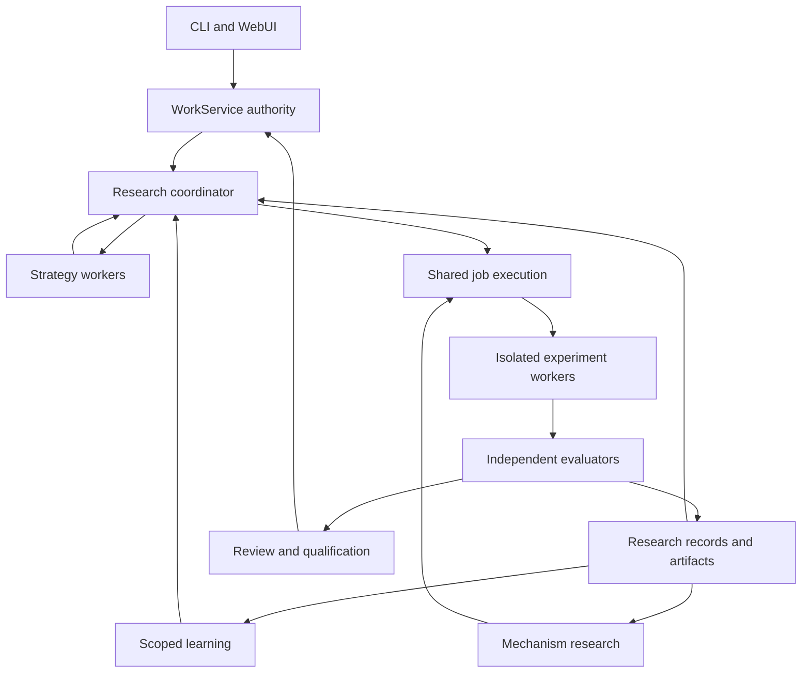

# OMP master tracker

Immutable provider-budget quote authority accepted as bounded development candidate (2026-09-17): exact Gemini 3.8 Flash high economy-worker implemented commit `faaa98f7d8`. WorkService now owns a combined append-only `quote_budget` decision that selects one unambiguous workspace/provider account, binds its qualified compatible effective rate card and current account evidence, preserves stage/work/candidate identities, and computes an exact fixed-point worst-case amount from a complete declared usage ceiling. Unknown, missing, unpriced, ambiguous, incompatible, ineffective, or currency-mismatched inputs fail before insertion; quote creation does not reserve, dispatch, charge, settle, activate, or qualify anything. Optional reservation binding validates account, route, launch, amount, account evidence, and card effectiveness, permits only one reservation per quote under concurrency, and preserves existing quote-less reservation behavior. Contract digest is `6d9c04d72b73ed635703905a90834e7720e9252df1896c52aa5fae346e26a43a`. Worker gates: disposable PostgreSQL/contract **108 pass, 2 owner-approval tests deselected**, WorkClient **34 pass**, schema/API checks, validation, package check, root `bun check`, and diff gate exit 0. Fresh Kimi K3 256K independently reproduced all 16 hashes plus **111** broader PostgreSQL tests, **62** focused quote/binding tests, **25** native/migration tests, generated-contract checks and WorkClient tests, then returned **PASS** with no blocker or material evidence gap. Frozen SHA-256 `aaa6a85a8c1bd0bf5279b9b0b2badf7d674f3262f4ffc7ca52f9435ad3d886f9`. [Disposition and evidence](/home/thetu/.codex/workflows/economy/artifacts/omp233-shared-job-inventory-20260916/provider-budget-quote-20260917/REVIEW-DISPOSITION.md). Source-development scope only. Host ceiling derivation and dispatch wiring, provider price population, resource binding, reserve/handoff/settle recovery, aggregation, recurring allowances, R00 installed baseline, ECC WP1-WP8, autoresearch R00-R19, installation/native acceptance, and Q36 remain open. Production approval unchanged; no installation, deployment, live authority, or Q36 action occurred. Full programme stays active.

Immutable rate-card authority accepted as bounded development candidate (2026-09-17): exact Gemini 3.8 Flash high economy-worker implemented commit `ec1bf011fa`. WorkService now owns immutable, versioned, workspace-scoped rate cards with evidence-bound operator qualification for budget-estimation eligibility. Provider-account writes may reference only a same-workspace, same-provider, qualified card compatible with billing mode; null remains explicitly unknown/unpriced. Historical unresolved free-text rows remain readable, while future mutation rejects unresolved references without changing persisted bytes. Registration has exact replay/conflict behavior, advisory locking, RLS, and direct update/delete/truncate denial; Python/API/generated schemas and TypeScript client align at contract digest `6f469a881dcc86cbef2552d5a0f16daa01881634c4079b73a94a5614975cb88e`. Deterministic gates: disposable PostgreSQL/HTTP **112 pass, 1 owner-approval test deselected**, WorkClient **33 pass / 177 assertions**, schema/API checks, contract validation, work-client check, root `bun check`, and diff gate exit 0. One evidence-driven repair added real pre-migration free-text read/rejection/byte-stability coverage and restored meaningful non-null fixture coverage. Frozen repaired SHA-256 `02cc20fa5096811bda515a8f55465c94188ae429f9ac9126a39eb5a3ea8af7d6`; fresh Kimi K3 256K independently reproduced all 19 hashes and returned **PASS** with no blocking or missing evidence. [Disposition and evidence](/home/thetu/.codex/workflows/economy/artifacts/omp233-shared-job-inventory-20260916/rate-card-authority-20260917/REVIEW-DISPOSITION.md). Source-development scope only. No provider prices were populated; worst-case estimation, account selection, reserve/handoff/settle recovery, aggregation, recurring allowances, R00 installed baseline, ECC WP1-WP8, autoresearch R00-R19, installation/native acceptance, and Q36 remain open. Production approval unchanged; no installation, deployment, or Q36 action occurred. Full programme stays active.

Native provider-observation capability accepted as bounded development candidate (2026-09-17): exact Gemini 3.8 Flash high economy-worker implemented commit 581064ef6a. Fable source inspection found no configured native route with both durable host-visible pre-effect correlation and authoritative post-effect lookup. New pure typed classifier records truthful capability for Antigravity, OpenAI Codex, and Anthropic; unknown pairs fail closed. Replayed dispatched preflights retain existing uncertainty prefix and now identify route-specific missing capability plus original transport-attempt ID before any provider probe, admit, cancel, record, reconciliation, stage reservation, handoff, or settlement. Deterministic gates: auditor runner **110 pass / 691 assertions**, native-stage dispatch **19 pass / 116 assertions**, combined **129 pass / 807 assertions**, root bun check and diff gate exit 0. Frozen SHA-256 034335477572be69d8d6023c0f32403c91ae902b0aa19cadb2fcef9ff94d694a; fresh Kimi K3 256K independently reproduced hashes and gates, verified provider source, and returned **PASS**. [Disposition and evidence](/home/thetu/.codex/workflows/economy/artifacts/omp233-shared-job-inventory-20260916/provider-correlation-adapter-20260917/REVIEW-DISPOSITION.md). Source-development scope only. No configured provider is now claimed connected or qualified; real adapter requires durable provider correlation, authoritative lookup, operator invocation, and provider-account mapping. Rate-card qualification, complete reserve/handoff/settle recovery, aggregate accounting, R00 installed baseline, ECC WP1-WP8, autoresearch R00-R19, installation/native acceptance, and Q36 remain open. Production approval unchanged; no installation, deployment, or Q36 action occurred. Full programme stays active.

Provider preflight reconciliation accepted as bounded development candidate (2026-09-17): exact Gemini 3.8 Flash high economy-worker implemented commit `7f38a8b701`. WorkService now owns append-only reconciliation for uncertain `dispatched` native-stage preflight intents. Evidence binds original transport attempt and logical request hashes, provider account/workspace/provider identity, observed time, and evidence hash. Indeterminate observations preserve uncertainty; completed, failed, and confirmed-absent observations settle through serialized authoritative transitions with exact replay and conflict handling. Migration `0032` adds ownership-aware RLS and append-only enforcement; Python API, generated contracts, and TypeScript client remain aligned at contract digest `a4da1fef0a7b538e0f31d64246af2997ea44210bc7ffd173fc1b46ee141947d0`. Deterministic gates: PostgreSQL reconciliation **10 pass**, intent **14 pass**, accounting **8 pass**, migration ordinal **1 pass**, work client **29 pass / 155 assertions**, schema/API checks, development validation, work-client type check, root `bun check`, and diff gate exit 0. Initial Kimi PASS found one low timezone boundary defect; one same-worker repair required Pydantic `AwareDatetime` and added a real HTTP/PostgreSQL negative proving HTTP 400, zero reconciliation rows, and preserved dispatched state. Frozen repaired SHA-256 `bf480302ef03ddacb7f996e3e61f9cccfb8fa9ebf469f5ecdac356e996a33a58`; fresh Kimi K3 256K re-review independently reproduced hashes and returned **PASS**. One bounded Astra-high diagnostic resolved the earlier agy execution issue without implementing or accepting work; coordinator remained `gpt-5.6-sol:medium`. [Disposition and evidence](/home/thetu/.codex/workflows/economy/artifacts/omp233-shared-job-inventory-20260916/provider-preflight-reconciliation-20260917/REVIEW-DISPOSITION.md). Source-development scope only. Provider-specific lookup adapters and correlation/header qualification, rate-card qualification, complete reserve/handoff/settle recovery, aggregate accounting, R00 installed baseline, ECC WP1-WP8, autoresearch R00-R19, installation/native acceptance, and Q36 remain open. Production approval unchanged; no installation, deployment, or Q36 action occurred. Full programme stays active.

Direct audit-runner bypass removal accepted as bounded development candidate (2026-09-17): exact Gemini 3.8 Flash high economy-worker implemented commit `c550489c9a`. The unused exported `prepareNativeAuditRunner` compatibility wrapper and all session-system references are removed, leaving `prepareNativeStageRunner` as the single low-level constructor and `native-stage-dispatch.ts` as its sole production owner. Audit role construction still requires immutable route and policy binding with drift checks before credentials, after credentials, and before execution; all host audit launches remain routed through `dispatchNativeStage`. One tautological wrapper-existence test was deleted while credential, transport-error, cancellation, settings/model/effort, OAuth, schema, and policy-drift boundaries remain covered. Independent gates: auditor runner **106 pass, 653 assertions**; native-stage dispatch **18 pass, 109 assertions**; root `bun check` and diff gate exit 0. Frozen diff SHA-256 `7de5f7398742ed580bb6740484e165615e56b5e8d123f8e1e45c5acb2e60461c`; fresh Kimi K3 256K review reproduced all gates and returned **PASS**. Fable 5.1 returned a conditional plan after sandbox read denial; coordinator source inspection resolved its condition without model substitution. [Disposition and evidence](/home/thetu/.codex/workflows/economy/artifacts/omp233-shared-job-inventory-20260916/audit-runner-api-closure-20260917/REVIEW-DISPOSITION.md). Source-development scope only. Provider reconciliation, rate-card qualification, complete reserve/handoff/settle recovery, R00 installed baseline, ECC WP1-WP8, autoresearch R00-R19, installation/native acceptance, and Q36 remain open. Q36 remains unapproved; full programme stays active.

Native audit preflight unification accepted as bounded development candidate (2026-09-17): exact Gemini 3.8 Flash high economy-worker implemented commit `3a6d323839`. Owner `run_audit` and execution-review audit launch now use the existing durable native-stage dispatcher before any auditor reservation, with deterministic attempt-bound identity and the existing WorkService authority. Replayed `dispatched` uncertainty and `handed_off` launch state fail closed before provider repetition or auditor reservation; policy/Judge binding and single-counted auditor reservation, record, settlement and verdict behavior remain intact. Coordinator evidence: auditor runner **107 pass, 654 assertions**; native-stage dispatch **18 pass, 109 assertions**; root `bun check` and diff gate exit 0. One evidence-driven repair replaced prose error matching with authoritative launch state, added the owner handed-off regression, and fixed the explicit route-policy type. Frozen repaired diff SHA-256 `d82e4f5c9e35492f0cc4cad1650fc9aae50178fb03206fd6bcb17fbf36de4de0`; fresh Kimi K3 256K review returned **PASS** with no candidate defects. Exact Fable planning produced no verdict before timeout; no planner substitution occurred. Initial agy execution failed on command permission despite available allowance; the authorized one-run permission bypass completed with the same configured worker and no persistent setting change. [Disposition and evidence](/home/thetu/.codex/workflows/economy/artifacts/omp233-shared-job-inventory-20260916/native-audit-preflight-unification-20260917/REVIEW-DISPOSITION.md). Source-development scope only. Its then-open direct-runner bypass was closed by successor commit `c550489c9a`; provider reconciliation, rate-card qualification, installation/native acceptance, Q36, ECC WP1-WP8, and autoresearch R00-R19 remain open. Q36 remains unapproved; full programme stays active.

Native preflight dispatch admission accepted as bounded development candidate (2026-09-17): exact Gemini 3.8 Flash high economy-worker implemented commit `b19ecb3603`. Provider-probe order is now `begin → WorkService dispatch admission → provider → terminal record`: only a pre-dispatch `begun` intent may be cancelled and reissued, while `dispatched` remains effect-uncertain and blocks group progress absent trusted provider reconciliation. Admit binds server-observed host correlation and operation identity; terminal record requires the dispatch owner; cancel/admit races serialize with one winner. Migration `0031` conservatively converts every legacy begun row to dispatched/uncertain, preserves settled evidence bytes, exact non-state CHECK constraints, RLS and column-limited grants. Coordinator evidence: PostgreSQL/contract **65 pass, 1 owner-approval assertion deselected**; host **118 pass, 698 assertions**; client **27 pass, 138 assertions**; real disposable PostgreSQL/WorkService smoke, schema/API checks, root `bun check`, and diff gate exit 0. Initial expiry-based Fable plan was rejected because time cannot prove effect absence. Coordinator found seven full-suite regressions; first repair fixed them and tightened state invariants. Correct-candidate Kimi review found weakened parity coverage; after explicit reassessment, a second/final test-only repair restored it. Frozen repaired SHA-256 `672a82da687de7a90cf1e00f564f852a58f5c191ebe838a6f3f84795de1f5aaf`; fresh strict Kimi K3 256K re-review returned **PASS**. [Disposition and raw evidence](/home/thetu/.codex/workflows/economy/artifacts/omp233-shared-job-inventory-20260916/preflight-intent-recovery-20260917/REVIEW-DISPOSITION.md). Source-development scope only. Dispatched-effect/provider reconciliation, pre-existing manual legacy-audit paths without WorkService intents, provider accounts/rate cards, stage-launch recovery, owner contract approval, installation and native acceptance remain incomplete. Q36 remains unapproved; full programme stays active.

Durable native transport-preflight intent accepted as bounded development candidate (2026-09-17): exact Gemini 3.8 Flash high economy-worker implemented commit `39716e83be`. WorkService now durably begins a server-owned `begun` intent before any credentialed provider probe, mints the transport-attempt identity from the command operation, binds host ownership to the server-observed envelope correlation, and atomically settles matching terminal evidence. Distinct-operation replay of an uncertain `begun` intent fails closed before probe/reservation/handoff; settled failed evidence advances to the next route, settled selected evidence reuses the route without another probe, and group ordinal/terminal-selection rules serialize fallbacks. Migration `0030` backfills existing preflight evidence without changing its bytes, preserves RLS and column-limited application grants, and adds the parent-intent foreign key. Exact coordinator evidence: PostgreSQL/contract **59 pass, 1 owner-approval assertion deselected**; host **113 pass, 675 assertions**; work client **25 pass, 125 assertions**; schema checks, root `bun check`, real disposable PostgreSQL/WorkService wire smoke, and diff gate exit 0. Initial frozen candidate SHA-256 `b15053c2e4d67cee08c01dacbdafd2bd7abf0dbf0fdbc8fef7595d39fa26b319` received three Kimi findings: a forbidden begin `session_id` causing HTTP 400, fabricated fallback authority, and extension type errors. One same-worker repair removed them, added real wire/fail-closed regressions, and produced frozen SHA-256 `02f4434ed1ebd2ff181a2eed30147685a481fb1772f6b42c2c01f85f2ec5ad35`; fresh Kimi K3 256K re-review returned **PASS**. [Disposition and raw evidence](/home/thetu/.codex/workflows/economy/artifacts/omp233-shared-job-inventory-20260916/durable-preflight-intent-20260917/REVIEW-DISPOSITION.md). Source-development scope only. Recovery/cancellation/expiry of stranded begun intents, provider-account/rate-card selection, full reserve/handoff/settle reconciliation, owner contract approval, installation and native acceptance remain incomplete. Q36 remains unapproved; full programme stays active.

Host native transport-preflight recording accepted as bounded development candidate (2026-09-17): exact Gemini 3.8 Flash high economy-worker implemented commit `f5f81783f5`. Every credentialed native-stage `completeSimple` probe now emits an awaited append-only WorkService preflight record before route selection completes or any stage launch is reserved; missing credentials create no provider attempt. Records bind current work/revision/candidate/attempt/grant/session/role/tool/task and route identity, preserve returned cost-free usage including measured zero and provider response identity, and retain request count as null because hidden retries make it unknown. Recording failure prevents reservation and execution; existing handoff and launch gates remain unchanged. Exact original 51-byte probe prompt moved to static Markdown with wire/hash regression SHA-256 `968ec1efc411d085cb287574524382c932fb0a435154bb15fa175aaf1e471617`. Coordinator repaired evidence: runner/dispatch **107 pass, 638 assertions**, root `bun check` and diff checks exit 0; unchanged regression callers previously passed **15 tests, 76 assertions**. Frozen repaired diff SHA-256 `240c0c97bc13376c0d47f2d7484c500b3d0ce6b461e35473629c38e00852d13d`; initial exact Kimi K3 256K review returned findings, one prompt-byte repair plus explicit crash/abort boundary correction followed, and fresh repaired-candidate review returned **PASS**. [Disposition and raw evidence](/home/thetu/.codex/workflows/economy/artifacts/omp233-shared-job-inventory-20260916/host-preflight-recording-20260917/REVIEW-DISPOSITION.md). Source-development scope only. A provider probe followed by host crash or lost record response can be repeated by a reconstructed dispatch and remains a required durable pre-probe intent/reconciliation milestone. Provider rate cards, budget scope/account selection, reserve/handoff/settle recovery, aggregate accounting, first experiment reproduction, owner contract approval, installation and native acceptance remain incomplete. Q36 remains unapproved; full programme stays active.

Native stage-preflight accounting authority accepted as bounded development candidate (2026-09-17): exact Gemini 3.8 Flash high economy-worker implemented commit `0c10d247cb`. WorkService now records append-only, workspace-scoped transport preflights under existing `work.execute` authority, with optional native identity binding, strict cost-free measured-usage fields, null/zero preservation, outcome invariants, exact idempotent replay and typed conflict. Direct update/delete/truncate remain denied; workflow reads are bounded; TypeScript work-client contract matches generated Python/API shapes. Initial coordinator gates passed: focused PostgreSQL **51 pass**, workflow service **115 pass**, migration **1 pass, 11 deselected**, contract **31 pass, 1 owner-approval assertion deselected**, work client **24 pass, 117 assertions**, root `bun check`, schema determinism and diff checks exit 0. One evidence repair removed a phantom TypeScript response field and restored inactive-grant launch-refusal precedence; repaired coordinator suites passed **123 PostgreSQL tests**, **24 client tests / 117 assertions**, and root `bun check`. Contract digest is `f430dccb13efee55f80555c58b08a49c9e29ed08f0ef3c9ac55050d6f055db36`; frozen repaired diff SHA-256 `a1f2a5fa1adffc9714a0ed46f4cc3828e4ae8dec327bcd90a3fddd92d622afaa`; fresh repaired-candidate Kimi K3 256K review returned **PASS**. [Disposition and raw evidence](/home/thetu/.codex/workflows/economy/artifacts/omp233-shared-job-inventory-20260916/preflight-usage-accounting-20260917/REVIEW-DISPOSITION.md). Source-development scope only. Host transport-preflight recording, provider request identity, authoritative reserve/handoff/settle wiring, qualified rate cards, aggregation, first experiment reproduction, owner contract approval, installation and native acceptance remain incomplete. Q36 remains unapproved; full programme stays active.

Native stage measured-usage capture accepted as bounded development candidate (2026-09-17): exact Gemini 3.8 Flash high economy-worker implemented commit `f309193ba9`. Existing subprocess provider measurements now flow through native stage results into durable stage-launch outcomes and settled replay. Provider-estimated `cost` is excluded pending qualified provider-account rate cards; missing measurement persists as explicit null rather than zero. Persisted replay admits only finite nonnegative integer counters, retains known valid optional and nested buckets, drops unknown keys and cost, and omits complete usage when required or known optional measurement is corrupt. Coordinator focused tests **100 pass, 0 fail, 575 assertions**; root `bun check`, `git diff --check`, and allowed-path gate exit 0. Frozen repaired diff SHA-256 `9973fd1b019dd2ff0d44a2713ecf60a840c7194531b6ff6c60b7a1c964b74d74`; initial exact Kimi K3 256K review returned PASS with two LOW replay-boundary findings, one same-context evidence repair addressed both, and fresh repaired-candidate review returned **PASS**. [Disposition and raw evidence](/home/thetu/.codex/workflows/economy/artifacts/omp233-shared-job-inventory-20260916/host-budget-preflight-20260917/REVIEW-DISPOSITION.md). Source-development scope only. Preflight-probe accounting, provider request identity, qualified rate cards, host reserve/settle integration, aggregation, Q29 allowance proposal, first experiment reproduction, installation and native acceptance remain incomplete. Q36 remains unapproved; full programme stays active.

Budget-scope projection accepted as bounded development candidate (2026-09-17): exact Gemini 3.8 Flash high economy-worker implemented commit `f7461a9ac3`. WorkService now exposes authenticated workspace list/single budget-scope reads with conjunctive work/session/kind filters, strict workspace-bound keyset pagination, and exact persisted decimal-string limits, held, spent and unresolved accounting. Existing `work.read`, workspace membership, transaction/RLS and candidate-reader denial remain authoritative; no selection, default, allowance or dedupe policy was added. Matching TypeScript client methods and types use current contract headers and error mapping. Coordinator PostgreSQL suites: new projection **4 pass**, budget authority **22 pass**, provider account **12 pass**, stage binding **9 pass**, native reads **13 pass**; contract **31 pass, 1 deselect**; work client **23 pass, 103 assertions**. Schema/API schema checks, contract validation, root `bun check`, and `git diff --check` exit 0. Contract digest is `7b6b9e8840f7e3475cd896d2ae0812f7f70af1a5aad510caf00a2a3b2ddfe4ce`; production approval remains unchanged. Frozen diff SHA-256 `36c1d16d04f4395d95421c8ba2a849872f66bab3f818bd0cecb5d97ed54ac1a3`; fresh exact Kimi K3 256K review returned **PASS** with no blocking findings. [Disposition and raw evidence](/home/thetu/.codex/workflows/economy/artifacts/omp233-shared-job-inventory-20260916/host-budget-admission-20260917/REVIEW-DISPOSITION.md). Source-development scope only. Scope/account selection, measured allowance policy, rate-card qualification, worst-case estimation, host reserve/handoff/settle/recovery wiring, automatic expiry reconciliation, first experiment reproduction, installation and native acceptance remain incomplete. Q36 remains unapproved; full programme stays active.

TypeScript work-client budget parity accepted as bounded development candidate (2026-09-17): exact Gemini 3.8 Flash high economy-worker implemented commit `d71573832b`. `@oh-my-pi/pi-work-client` now exposes typed payloads/results for existing budget and provider-account commands plus authenticated workspace list/single provider-account reads on current service routes. Observable tests cover contract headers, exact paths, reserved-character encoding, service-error mapping and typed command results. Coordinator `bun test` **20 pass, 0 fail, 88 assertions**; `bun run check`, `git diff --check`, Python contract **31 pass, 1 deselect**, and unchanged contract hash `80d70456b341f1665434f05ba8f2895be992093ffa79a1c4516a2ca5686c57bf` all exit 0. Frozen diff SHA-256 `c2f279df6aead3e2f5594fcb9753549855beef316efed54359b88d24783f9263`; fresh exact Kimi K3 256K review returned **PASS** after two retained thinking-only transport failures produced no verdict. [Evidence and review](/home/thetu/.codex/workflows/economy/artifacts/omp233-shared-job-inventory-20260916/work-client-budget-parity-20260917). Source-development scope only. Host price/usage estimation, reserve/handoff/settle integration, expiry sweep/recovery, first experiment reproduction, installation and native acceptance remain incomplete. Q36 remains unapproved; full programme stays active.

Provider-account authority accepted as bounded development candidate (2026-09-17): exact Gemini 3.8 Flash high economy-worker implemented commit `b4ee40cdbc`. WorkService now provisions stable workspace/provider account identities only under `work.operate`, through the existing idempotent command path and an additive migration 0028 `SECURITY DEFINER` boundary. Direct application-role table writes remain denied. Evidence timestamps are monotonic; equal identical evidence is unchanged, stale or conflicting evidence is rejected, reads remain workspace/RLS scoped, and provisioning activates existing fail-closed stage-budget binding for that provider. Coordinator PostgreSQL suite **43 pass**, migration inventory **1 pass**, ordinary suite excluding only the unchanged owner-approval digest gate **45 pass, 248 skip, 1 deselect**; schema, API schema, contract validation/hash, focused service/readiness/native-stage checks and diff check exit 0. Frozen repaired complete diff SHA-256 `5dd077b92a1d0534a33777ca1b6403826450cda3941c101254c8366a4b5513b0`; fresh exact Kimi K3 256K review returned **PASS** after one code repair and a freeze-only artifact correction. [Disposition and raw evidence](/home/thetu/.codex/workflows/economy/artifacts/omp233-shared-job-inventory-20260916/provider-account-authority-20260917/REVIEW-DISPOSITION.md). Source-development scope only. Host provider discovery/configuration, price and usage mapping, worst-case preflight estimates, TypeScript reserve/handoff/settle wiring, automatic expiry sweep, host recovery, first experiment reproduction, owner contract approval, installation and native acceptance remain incomplete. Q36 remains unapproved; full programme stays active.

Atomic stage-budget binding accepted as bounded development candidate (2026-09-17): exact Gemini 3.8 Flash high economy-worker implemented commit `addec64b77`. Additive migration 0027 binds existing budget reservations to existing native stage launches by workspace-safe foreign key and one-active-binding invariant. WorkService now claims a bound reservation in the same serializable transaction as handoff, releases an unsent binding in the same transaction as pre-handoff cancellation, preserves potentially-sent worst-case accounting through interruption, rejects direct claim/cancel side doors, and requires a binding when a provider account activates budgeting for that workspace/provider. Coordinator evidence: binding plus budget authority **31 pass**, native-stage regression **2 pass**, migration inventory **1 pass**, ordinary suite excluding only unchanged owner-approval digest assertion **45 pass, 237 skip, 1 deselect**; all exits 0. Schema, API-schema drift, contract hash and diff checks exit 0. Frozen diff SHA-256 `867173341770a713706505a0f8f17bbf388bac72c0cea64aa6da52e7813d2f68`; fresh exact Kimi K3 256K review returned **PASS**. [Disposition and raw evidence](/home/thetu/.codex/workflows/economy/artifacts/omp233-shared-job-inventory-20260916/stage-budget-binding-20260917/REVIEW-DISPOSITION.md). Source-development scope only. TypeScript host budget commands, provider-account provisioning, price/usage mapping, preflight accounting, automatic expiry sweep, host-process recovery, first experiment reproduction, installation and native acceptance remain incomplete. Q36 remains unapproved; full programme stays active.

Budget reservation expiry accepted as bounded development candidate (2026-09-17): exact Gemini 3.8 Flash high economy-worker implemented commit `441e33ea51`. WorkService now rejects already-expired reserve and post-expiry claim, and exposes identity-, fence-, workspace- and state-bound `expire_budget` under `work.execute`. Expired unsent reservations release held drawdown across the complete scope ancestry; potentially sent reservations move worst-case drawdown to unresolved accounting for later provider settlement. PostgreSQL supplies the expiry clock and serializable row locks preserve one-winner claim/expiry behavior and idempotent replay. Coordinator PostgreSQL suite **22 pass, exit 0**; ordinary Python suite excluding only the unchanged owner-approval digest assertion **45 pass, 228 skip, 1 deselect, exit 0**; schema, API schema, contract hash and diff checks exit 0. Frozen repaired diff SHA-256 `ad374384331acdad5637e2f8af092dbfe90f1ca0d21c275b93f3718d65a00332`; fresh exact Kimi K3 256K review found one import-time environment mutation, the same worker removed it in the single evidence repair, and same reviewer returned **PASS**. [Disposition and raw evidence](/home/thetu/.codex/workflows/economy/artifacts/omp233-shared-job-inventory-20260916/reservation-expiry-20260917/REVIEW-DISPOSITION.md). This is source-development evidence only. Owner contract approval, automatic expiry discovery/sweep, shared dispatch/lease binding, first experiment reproduction slice, installation and native acceptance remain incomplete. Q36 remains unapproved; full programme stays active.

Hierarchical budget authority accepted as bounded development candidate (2026-09-17): exact Gemini 3.8 Flash high economy-worker implemented commit `853931c241`, adding complete leaf-to-root allowance enforcement and accounting to WorkService. Reserve now validates and charges every ancestor, sibling reservations serialize on shared ancestors, settle/reconcile/cancel update the same chain exactly once, corrupt or negative aggregates abort, and command replay remains idempotent. Coordinator disposable PostgreSQL suite **13 pass, exit 0**; complete Python suite excluding only the unchanged owner-approval digest assertion **45 pass, 219 skip, 1 deselect, exit 0**; raw logs and exits are retained in the [milestone artifacts](/home/thetu/.codex/workflows/economy/artifacts/omp233-shared-job-inventory-20260916/budget-hierarchy-20260917). Frozen diff SHA-256 `e3a50ea99221428cb48a8dc50c464dff879440ef99e7aa82ae85695c32f2431d`; fresh exact Kimi K3 256K review returned **PASS**. [Disposition](/home/thetu/.codex/workflows/economy/artifacts/omp233-shared-job-inventory-20260916/budget-hierarchy-20260917/REVIEW-DISPOSITION.md) closes review evidence gaps and records PostgreSQL's documented top-level ordering behavior. This is source-development evidence only. Expiry, shared dispatch/lease binding, first experiment reproduction slice, installation and native acceptance remain incomplete. Q36 remains unapproved; full programme stays active.

Shared reservation reconciliation accepted as bounded development candidate (2026-09-17): exact Gemini 3.8 Flash high economy-worker implemented commit `83fce36fdb` in isolated checkout. Existing `settle_budget` now supports identity- and fence-bound `unresolved → settled` reconciliation, transfers prior unresolved drawdown to final spent usage exactly once, preserves unresolved charging until settlement, and rejects conflicting terminal replay. Coordinator focused disposable PostgreSQL suite **5 pass, exit 0**; `git diff --check` exit 0. Frozen diff SHA-256 `eadbd3862e94a6234f6462cc89109826a491d3b627ff3f264f1bef4ddb2361c4`; fresh exact Kimi K3 256K [independent review](/home/thetu/.codex/workflows/economy/artifacts/omp233-shared-job-inventory-20260916/reservation-recovery-planning-20260917/INDEPENDENT-REVIEW.md) returned **PASS**. Full Python suite remains red on pre-existing unchanged contract-digest mismatch after **31 pass, 5 skip, 1 fail**; no full-suite-green claim. Low review findings retain conflict-event observability, explicit held assertion, and aggregate-drift detection as hardening. Parent/child budget roll-up, expiry, shared dispatch/lease binding, first experiment reproduction slice, installation and native acceptance remain incomplete. Q36 remains unapproved.

Frozen native-model dispatch hardening accepted and workflow route changed (2026-09-17): exact Gemini 3.8 Flash high economy-worker implemented commit `621c6aef7f` in the isolated development checkout. Native audit now forwards the already resolved route model and exact effort into `runSubprocess`; selector, auth-fallback and retry-fallback re-resolution are bypassed for this bound path, while native implement and ordinary subagent resolution remain unchanged. Coordinator verification: focused tests **101 pass, 0 fail**, `bun check` exit 0, `git diff --check` exit 0. Frozen diff SHA-256 `cd717ce8d43bd56aec625f88e228b095349bc111b80e5a0c9593f29a87ab2099`; fresh exact Kimi K3 256K [independent review](/home/thetu/.codex/workflows/economy/artifacts/omp233-shared-job-inventory-20260916/first-experiment-slice-20260917/INDEPENDENT-REVIEW.md) returned **PASS** for this bounded development candidate. Reviewer records one evidence-process gap: raw coordinator check transcripts were not saved, although commands, exits and counts are retained in [deterministic evidence](/home/thetu/.codex/workflows/economy/artifacts/omp233-shared-job-inventory-20260916/first-experiment-slice-20260917/DETERMINISTIC-EVIDENCE.md). No installation, deployment, native acceptance or Q36 action occurred.

Owner changed economy routing: coordinator always remains `gpt-5.6-sol` at medium effort throughout the entire workflow, including blocker handling. A verified economy-worker blocker has one standing, milestone-scoped `gpt-6-astra` high diagnostic reserve: one named question, exact failure/attempt evidence, one invocation, at most 8,000 output tokens, expiring with milestone; diagnostician is a separate consultant and cannot implement, review, accept, broaden scope, reset attempts or replace coordinator. `/home/thetu/.codex/workflows/economy/POLICY.md`, `MODELS.md`, and this goal prompt carry the new contract. This records configured obligation; each session must still verify effective runtime identity before claiming compliance. Historical Astra-low/no-reserve prose below is superseded. Next bounded work returns to shared-job reservation recovery/accounting and first experiment-to-reproduction slice. Full ECC WP1–WP8, autoresearch R00–R19 and all retained programme obligations remain incomplete and active.

Frozen native-model dispatch external-capacity block (2026-09-17): same exact Gemini 3.8 Flash high economy-worker conversation returned HTTP 503 `No capacity available` again on clean base `6acd45ea2d`; this identical blocker now spans three consecutive goal turns. Exact Fable GO plan, coordinator corrections, allowed paths, regression contract, checks, and cumulative attempts remain preserved in the [bounded packet](/home/thetu/.codex/workflows/economy/artifacts/omp233-shared-job-inventory-20260916/first-experiment-slice-20260917/WORKER-PACKET.md) and [plan disposition](/home/thetu/.codex/workflows/economy/artifacts/omp233-shared-job-inventory-20260916/first-experiment-slice-20260917/NARROW-PLAN-DISPOSITION.md). No permitted provider/model substitute exists, and mechanical implementation cannot proceed under the required economy role until capacity changes. Checkout remains unmodified; temporary grants were removed. This is an external transport-capacity block, not a scope pause, Q36 decision, installation gate, or programme completion. Resume the same bounded worker conversation and cumulative accounting when exact capacity returns; full programme remains incomplete.

Frozen native-model dispatch plan refined (2026-09-17): scope-reduced, tools-disabled Fable 5.1 planning returned **GO, exit 0**. [Disposition](/home/thetu/.codex/workflows/economy/artifacts/omp233-shared-job-inventory-20260916/first-experiment-slice-20260917/NARROW-PLAN-DISPOSITION.md) accepts pre-resolved model binding and corrects two planner errors: repository tests must use `vi.spyOn`, never `mock.module`, and catalog `Effort` must not be passed through coarse task `"lo" | "med" | "hi"`. [Revised worker packet](/home/thetu/.codex/workflows/economy/artifacts/omp233-shared-job-inventory-20260916/first-experiment-slice-20260917/WORKER-PACKET.md) now binds base `a56af82d8b`, existing `executor-pass-through.test.ts` boundary seam, exact model-reference assertion after registry/settings drift, runner wiring, focused tests, and `bun check`. Same exact Gemini 3.8 Flash high conversation again returned HTTP 503 no-capacity; no substitution or source edits occurred. Temporary scoped grants were removed. Next execute this packet with the same configured worker when capacity returns, then freeze deterministic evidence for fresh Kimi review. No installation/live authority/Q36 action; full programme remains active.

Frozen native-model dispatch hardening checkpoint (2026-09-17): broad first-experiment Fable planning timed out twice without output; exact-model transport probe passed, so [diagnosis](/home/thetu/.codex/workflows/economy/artifacts/omp233-shared-job-inventory-20260916/first-experiment-slice-20260917/PLANNING-DIAGNOSIS.md) narrows work to the accepted review's concrete selector re-resolution gap. [Worker packet](/home/thetu/.codex/workflows/economy/artifacts/omp233-shared-job-inventory-20260916/first-experiment-slice-20260917/WORKER-PACKET.md) binds base `a78ae885da`, exact files, regression contract, checks, and resource envelope. Agy headless permission denials were diagnosed to its current shared-config path and corrected with temporary exact-path grants; the same Gemini 3.8 Flash high conversation then returned HTTP 503 no-capacity twice. No model substitution, source edit, test claim, installation, live authority, or Q36 action occurred; temporary grants were removed and generated timestamp drift reverted. Next resume this same bounded implementation when exact configured worker capacity exists, retaining cumulative attempts; full programme remains active.

Versioned audit-policy milestone independently accepted (2026-09-17): fresh exact Kimi K3 256K review returned **ACCEPT**, no blockers, after two retained timeouts and a same-session final-verdict continuation. Frozen candidate `7e20056daaf5c0e48cf77e7e8ae1707d9f5709ff`, 17-file manifest, and review diff remained unchanged. Reviewer classifies selector re-resolution between final host preflight and child provider dispatch as a nonblocking hardening gap because trusted-config mutation is required and post-call identity mismatch cannot be accepted; concrete-model dispatch and service-side served-route refusal remain future defense-in-depth work. Evidence: [review freeze](/home/thetu/.codex/workflows/economy/artifacts/omp233-shared-job-inventory-20260916/role-composition/versioned-policy/review-freeze.json), [final review](/home/thetu/.codex/workflows/economy/artifacts/omp233-shared-job-inventory-20260916/role-composition/versioned-policy/INDEPENDENT-REVIEW.md), focused TypeScript **98 pass**, Python WorkService **115 pass**, `bun check` and both schema checks exit 0. Acceptance covers source development only; no installation, deployment, native WorkService acceptance, or Q36 action. Next compose reservation recovery/accounting and the first experiment-to-reproduction slice through existing shared-job authority. Full programme remains active.

WorkService V2/legacy boundary verification (2026-09-17): corrected test manifest helper to strict V2 and added real ASGI/PostgreSQL cases for V1 admission refusal with zero grant effects, persisted V1 lookup without automatic upgrade, and V2 audit-policy/native-stage hash preservation through service refresh. Targeted **5 pass, exit 0**; full `test_workflow_service.py` **115 pass, exit 0**. Schema and API schema checks exit 0; contract hash remains `9f77e973421ce8d6503cfeb356e7d3afd2f818978ca82b64ef2ff1ee10a3b8de`. Fresh frozen independent review remains before bounded acceptance. No installation, deployment, native acceptance, or Q36 action; full programme incomplete.

Versioned audit-policy integration checkpoint (2026-09-17): effective `@audit` policy is bound into judge manifest V2 and carried through native dispatch; legacy V1 remains readable but cannot authorize new review. TCB closure now includes policy, executor, yield, SDK, and native-stage sources. Contract schemas regenerated; client digest is `9f77e973421ce8d6503cfeb356e7d3afd2f818978ca82b64ef2ff1ee10a3b8de`; production approval remains unchanged. Focused suite **98 pass, 0 fail, exit 0**; `bun check` **exit 0** with three pre-existing optional-chain warnings. Latest root-cause repair preserves stopped/canceled grant reason at `begin_execution_review` and corrects service-refresh ordering evidence. Python service V2/legacy tests, full candidate suite, frozen evidence, and fresh Kimi review remain before bounded acceptance. No installation, deployment, native acceptance, or Q36 action; full programme incomplete.

Versioned policy targeted fixes/schema synchronization (2026-09-17): async rejection restored; credentials-race negative now passes. Existing schema generators/hash exit0; client digest synchronized to9f77e973421ce8d6503cfeb356e7d3afd2f818978ca82b64ef2ff1ee10a3b8de, production approval unchanged. Focused suite **85pass13fail exit1**. [Disposition](/home/thetu/.codex/workflows/economy/artifacts/omp233-shared-job-inventory-20260916/role-composition/versioned-policy/SCHEMA-DISPOSITION.md) identifies staged WorkService fixture/repository identity gaps now visible beyond approval gate; [15file hashes](/home/thetu/.codex/workflows/economy/artifacts/omp233-shared-job-inventory-20260916/role-composition/versioned-policy/schema-checkpoint.json). Next complete native consumer fixtures and service V2/legacy tests, then check/review. No installation/native acceptance/Q36 action; full programme incomplete.

Versioned-policy fixture migration after required diagnosis (2026-09-17): same-worker exit0, two test files changed; focused suite **82pass16fail exit1**, improved from53pass44fail without weakening production policy. [Disposition](/home/thetu/.codex/workflows/economy/artifacts/omp233-shared-job-inventory-20260916/role-composition/versioned-policy/FIXTURE-DISPOSITION.md) separates async rejection regression, missing fixture interfaces, expected contract approval refusal and unsupported settings path in drift test. [Hashes](/home/thetu/.codex/workflows/economy/artifacts/omp233-shared-job-inventory-20260916/role-composition/versioned-policy/fixture-checkpoint.json) bind candidate. No new check/review acceptance; schema synchronization and qualified service boundaries remain. No live approval/Q36/deployment; full programme incomplete.

Versioned audit-policy candidate applied in isolated checkout (2026-09-17):12files, exact-span and baseline-hash preflight passed. Same-worker second repair exit0; **bun check exit0**, focused3file suite **53pass44fail exit1**. [Candidate checkpoint](/home/thetu/.codex/workflows/economy/artifacts/omp233-shared-job-inventory-20260916/role-composition/versioned-policy/candidate-checkpoint.json) binds hashes; [failure classes](/home/thetu/.codex/workflows/economy/artifacts/omp233-shared-job-inventory-20260916/role-composition/versioned-policy/failure-classes.json) retain diagnosis including missing model-selection fixture context. Two repair rounds used: diagnose and reassess before further edits, no replacement/budget reset. Schema/service tests and independent review remain; no installation/native acceptance/Q36 approval. Full programme incomplete.

Versioned audit-policy worker checkpoint (2026-09-17): exact Gemini worker produced patch-only candidate and one repair after headless command denial; both response invocations exit0. [Reassessment](/home/thetu/.codex/workflows/economy/artifacts/omp233-shared-job-inventory-20260916/role-composition/versioned-policy/REASSESSMENT.md) records remaining mutable model binding, missing host import and test/metadata defects. All replacement spans match, but no patch applied or tests/review claimed. Same conversation and cumulative attempts retained; all processes terminal. Next correct exact consumer/type contract before further repair. No installation/native acceptance/Q36 approval; full programme incomplete.

Versioned audit policy plan source-check completed (2026-09-17): [disposition](/home/thetu/.codex/workflows/economy/artifacts/omp233-shared-job-inventory-20260916/role-composition/VERSIONED-POLICY-DISPOSITION.md) verifies ordinary begin_execution_review already checks judge drift before audit, distinct from recovery preflight. Next bind and carry the same effective policy through dispatch, preventing re-resolution drift; avoid duplicate gates and duplicate digest repair. Source reads exit0; no product changes/tests or new review. Q36 unapproved; installation/native acceptance and full programme remain incomplete.

Judge digest admission repair independently reviewed: [Kimi ACCEPT](/home/thetu/.codex/workflows/economy/artifacts/omp233-shared-job-inventory-20260916/role-composition/judge-digest-probe/INDEPENDENT-REVIEW.md) exit0 after retained2timeouts;2hashes unchanged,113workflow tests pass. [Disposition](/home/thetu/.codex/workflows/economy/artifacts/omp233-shared-job-inventory-20260916/role-composition/judge-digest-probe/REVIEW-DISPOSITION.md) limits proof to manifest consistency and no partial grant on fresh-operation retry; original-operation replay/cross-language/process qualification not established here. Next versioned effective audit policy/TCB binding, reservation recovery and accounting. No installation/native acceptance/Q36 approval; complete programme remains active.

Judge manifest/digest admission defect reproduced and repaired in isolated service: prior source accepts forged digest HTTP200; new regression fails prior source1fail1pass, candidate **113workflow tests pass exit0**. [Frozen2files](/home/thetu/.codex/workflows/economy/artifacts/omp233-shared-job-inventory-20260916/role-composition/judge-digest-probe/freeze.json) and [checkpoint](/home/thetu/.codex/workflows/economy/artifacts/omp233-shared-job-inventory-20260916/role-composition/judge-digest-probe/checkpoint.json) retain disposable PostgreSQL+ASGI evidence. Fresh Kimi timed out180s exit124, no verdict;2hashes unchanged. Next same-reviewer continuation; policy-content authorization, versioned identity/TCB binding and process qualification remain. No installation/native acceptance/Q36 approval; full programme incomplete.

Judge authority reuse established: [source findings](/home/thetu/.codex/workflows/economy/artifacts/omp233-shared-job-inventory-20260916/role-composition/JUDGE-AUTHORITY-FINDINGS.md) show strict10field manifest lacks effective audit policy, but existing grant JSON and service-refresh immutability protect added non-service keys. Corrected Python source paths. Next cohesive versioned identity/TCB binding through existing WorkService contracts, with old-grant compatibility and real negative boundary tests; no parallel authority store. No source edits/tests/installation/Q36 approval; full programme incomplete.

Native identity plan reassessed after exact Fable continuationexit0: [disposition](/home/thetu/.codex/workflows/economy/artifacts/omp233-shared-job-inventory-20260916/role-composition/IDENTITY-PLAN-DISPOSITION.md) rejects concrete-agent-model requirement because auditor uses @audit, and proves warning absence cannot detect core effort clamp. Host stranded recovery also lacks native-stage correlation. Next trace sealed effective audit policy in judge contracts before cohesive identity-binding change; no further profile-only patch loop. No product edits/tests/live changes; Q36 unapproved, programme incomplete.

Selection metadata API independently reviewed: [Kimi verdict](/home/thetu/.codex/workflows/economy/artifacts/omp233-shared-job-inventory-20260916/role-composition/selection-api/INDEPENDENT-REVIEW.md) no blocking findings, same-session continuationexit0;3frozen hashes unchanged,9tests/check0. [Disposition](/home/thetu/.codex/workflows/economy/artifacts/omp233-shared-job-inventory-20260916/role-composition/selection-api/REVIEW-DISPOSITION.md) preserves warning/AUTO/clamp evidence gaps and qualifies external compatibility/model mutability claims. Next native audit identity binding and reservation composition; accounting/TCB/release qualification remain mandatory. No installed/native acceptance/Q36 approval; full programme incomplete.

Model-selection metadata API implemented in isolated checkout:3files, **9tests and bun check exit0** after same-worker enum repair. [Frozen candidate](/home/thetu/.codex/workflows/economy/artifacts/omp233-shared-job-inventory-20260916/role-composition/selection-api/freeze.json) and [checkpoint](/home/thetu/.codex/workflows/economy/artifacts/omp233-shared-job-inventory-20260916/role-composition/selection-api/CHECKPOINT.md) retain evidence. Fresh Kimi review timed out180s exit124, **no verdict**;3hashes unchanged. Next same-reviewer continuation, then native role/ordering/accounting/TCB composition. No installation/native acceptance/Q36 approval; full programme incomplete.

Effective audit effort gap verified: extension resolve projects base model while core already exposes explicit effort/fallback metadata ([source evidence](/home/thetu/.codex/workflows/economy/artifacts/omp233-shared-job-inventory-20260916/role-composition/effective-role-source.json)). Fable correction exit0 but [reassessment](/home/thetu/.codex/workflows/economy/artifacts/omp233-shared-job-inventory-20260916/role-composition/REASSESSMENT.md) rejects unsafe shortcuts. Bounded metadata API worker timed out180s exit124 with no patch; [checkpoint](/home/thetu/.codex/workflows/economy/artifacts/omp233-shared-job-inventory-20260916/role-composition/selection-api/checkpoint.json) verifies3baseline files unchanged and records same conversation for diagnosis/continuation. No product changes/tests/review/deployment; Q36 unapproved, complete programme still active.

Role-composition Fable plan returned exit0; [disposition](/home/thetu/.codex/workflows/economy/artifacts/omp233-shared-job-inventory-20260916/role-composition/PLAN-DISPOSITION.md) rejects unsupported ledger/effort/accounting assumptions before implementation. [Additional source finding](/home/thetu/.codex/workflows/economy/artifacts/omp233-shared-job-inventory-20260916/role-composition/ADDITIONAL-FINDING.md) proves staged host awaits native audit before legacy auditor reservation and identifies direct judge-source coverage gaps. Next resolve effective model/effort API and correct same planner with host/TCB context; no profile-only qualification. No worker/product changes/tests/live mutation; Q36 unapproved, full programme incomplete.

Dispatch route inventory found staged release-composition conflict: native audit profile selects **kimi-code/k3:high**, unlike preserved native auditor **openai-codex/gpt-5.6-sol:medium** and external reviewer **kimi-code/k3-256k**. [Inventory](/home/thetu/.codex/workflows/economy/artifacts/omp233-shared-job-inventory-20260916/ROUTE-INVENTORY.md) and [nine source hashes](/home/thetu/.codex/workflows/economy/artifacts/omp233-shared-job-inventory-20260916/route-source-evidence.json) distinguish direct side/advisor transport from unproven native reachability; normal native auto-learn startup excluded by depth/tool restrictions. Native transport probe precedes launch reservation. Next exact economy planning must preserve native auditor/judge obligations and address preflight authority/accounting before release composition or wider admission. Read-only source evidence only; no product changes/tests/review, installation or Q36 approval. Full programme incomplete.

Native main-chat admission amendment independently accepted for bounded source development: [Kimi verdict](/home/thetu/.codex/workflows/economy/artifacts/omp233-shared-job-inventory-20260916/INDEPENDENT-ADMISSION-REVIEW.md), continuationexit0 after retained180s timeout.4hashes unchanged;11tests/check pass. [Disposition](/home/thetu/.codex/workflows/economy/artifacts/omp233-shared-job-inventory-20260916/ADMISSION-REVIEW-DISPOSITION.md) corrects side/advisor coverage overstatement: those streams receive settings wrapper directly, not proven gated; preflight and executor cancellation qualification remain. Next route/authority inventory before further admission changes. No installation/native acceptance/Q36 approval; full programme incomplete.

Native admission fresh review initial invocation hit180s timeout exit124, no verdict. Reviewer verified reverse-applied baseline hashes;4candidate hashes unchanged. [Same-session continuation](/home/thetu/.codex/workflows/economy/artifacts/omp233-shared-job-inventory-20260916/active-review-handle.json) running, prior usage/logs retained. Eleven tests/check0 remain evidence, not independent acceptance. No installation/Q36/native acceptance; full programme incomplete.

Native admission strong regression verified: prior executor makes1provider call where0required; amended11tests and bun check pass, exits0. [Frozen4file candidate](/home/thetu/.codex/workflows/economy/artifacts/omp233-shared-job-inventory-20260916/admission-review-freeze.json) under fresh exact Kimi independent review, no verdict yet; [live handle](/home/thetu/.codex/workflows/economy/artifacts/omp233-shared-job-inventory-20260916/active-review-handle.json) for same-process continuation. Existing stage baseline/preflight/effect settlement are not accepted by this amendment. No installation/native acceptance/Q36 approval; full programme incomplete.

Native executor→real SDK integration added:11combined tests and bun check pass, exits0. [Checkpoint](/home/thetu/.codex/workflows/economy/artifacts/omp233-shared-job-inventory-20260916/executor-checkpoint.json) binds4files; prior-executor negative fails by timeout, so fixture needs terminal sentinel before strong regression claim. Existing native dispatcher mock still requires coverage disposition. Fresh review/installation/native acceptance remain; Q36 unapproved, full programme incomplete.

Native admission SDK boundary verified:9tests pass, bun check exit0; preserved prior SDK fails both denial regressions, candidate restored. [Checkpoint](/home/thetu/.codex/workflows/economy/artifacts/omp233-shared-job-inventory-20260916/sdk-verified-checkpoint.json) binds3files; full command logs retained. Fixture concurrency/import failures and cumulative worker usage preserved. Next native executor/dispatcher integration then fresh independent review; no installation/native acceptance/Q36 approval, full programme incomplete.

Native admission SDK regression file added: initial8pass1fail; same-worker fixture repair still times out concurrent failure case ([checkpoint](/home/thetu/.codex/workflows/economy/artifacts/omp233-shared-job-inventory-20260916/SDK-TEST-CHECKPOINT.md)). Missing generated asset built through repository script. Next promise-settlement fixture repair, prior-source negative test and native integration before independent review. No passing final suite/qualification/Q36; full programme incomplete.

Native admission amendment applied in isolated staged snapshot: SDK sticky enforcing gate, abortable wait and executor wiring;2files. [Checkpoint](/home/thetu/.codex/workflows/economy/artifacts/omp233-shared-job-inventory-20260916/implementation-checkpoint.json) records bun check exit0, pending regression/integration tests and independent review. Worker same-session correction fixed reversed helper arguments before application; all usage retained. Post-edit check transcript truncated, final evidence needs full logs. No installation/Q36/native acceptance; full programme incomplete.

Native admission isolated snapshot created: [receipt](/home/thetu/.codex/workflows/economy/artifacts/omp233-shared-job-inventory-20260916/snapshot-receipt.json) verifies159overlay files. Root worktree attempt exit128 preserved; owning staged Git checkout succeeds. **Correction:** pinned exploration document exists in owning repository and exactly matches recovered bytes ([proof](/home/thetu/.codex/workflows/economy/artifacts/omp233-shared-job-inventory-20260916/pinned-document-resolution.json)); earlier absence inference withdrawn. [Worker packet](/home/thetu/.codex/workflows/economy/artifacts/omp233-shared-job-inventory-20260916/ADMISSION-WORKER-PACKET.md) prepared with existing untilAborted/public stream seam. No worker edits/tests yet; Q36 unapproved, full programme incomplete.

Native admission fix bounded after Fable reassessment exit0: separate sticky enforcing dispatch admission from optional telemetry, in independently frozen staged source. [Disposition](/home/thetu/.codex/workflows/economy/artifacts/omp233-shared-job-inventory-20260916/ADMISSION-PLAN-DISPOSITION.md) requires synchronous-throw/reentrancy safety, prompt cancellation and real SDK integration evidence. [159-file staged inventory](/home/thetu/.codex/workflows/economy/artifacts/omp233-shared-job-inventory-20260916/staged-dirty-baseline.json) preserves unrelated integration; snapshot/worker not started. No product changes/tests/live effects; Q36 unapproved, full programme incomplete.

Native handoff trace found concrete staged boundary defect: SDK notification catches handoff errors then continues provider dispatch; existing test expects that behavior ([source evidence](/home/thetu/.codex/workflows/economy/artifacts/omp233-shared-job-inventory-20260916/DISPATCH-FINDING.md)). Same Fable correction exit0 withdraws ledger demand but identity/classifier proposal remains unready ([disposition](/home/thetu/.codex/workflows/economy/artifacts/omp233-shared-job-inventory-20260916/PLAN-DISPOSITION.md)). Next enforcing transport-admission seam and negative real-boundary tests, preserving original-operation reconciliation. No product changes/tests/live action; Q36 unapproved, full programme incomplete.

Shared-job planning: staged budget/native-launch source recovered with [hashes](/home/thetu/.codex/workflows/economy/artifacts/omp233-shared-job-inventory-20260916/staged-budget-identities.json). Exact Fable exit0, but denied source reads and proposed nonexistent identity/lease joins; [disposition](/home/thetu/.codex/workflows/economy/artifacts/omp233-shared-job-inventory-20260916/PLAN-DISPOSITION.md) rejects unsupported schema assumptions and new-ledger demand. Existing WorkflowView.stage_launches is reuse candidate; backend/effect identity gap remains. Next inspect actual handoff/settlement integration then correct same planner. No worker/product changes/tests/live migration; Q36 unapproved, full programme incomplete.

Shared-job archive verification: all five original core/03B/dependency hashes match retained addendum ([manifest](/home/thetu/.codex/workflows/economy/artifacts/omp233-shared-job-inventory-20260916/archive-verification.json)). [Reuse findings](/home/thetu/.codex/workflows/economy/artifacts/omp233-shared-job-inventory-20260916/REUSE-FINDINGS.md) identify existing TS budget/fencing contract but absent matching budget paths in inspected root Python source; historical staged PR3 evidence requires source reconciliation. Next recover staged budget authority before shared-job design; no replacement scheduler, product edits or live migration. Q36 unapproved; full programme incomplete.

Exploration addendum recovered byte-identically from three retained development checkouts: [provenance](/home/thetu/.codex/workflows/economy/artifacts/omp233-shared-job-inventory-20260916/recovery-provenance.json), [complete recovered bytes](/home/thetu/.codex/workflows/economy/artifacts/omp233-shared-job-inventory-20260916/recovered-exploration-addendum.md). E1–E4 revision bindings match current native readback; original cited Git attribution remains unverified. [Interface findings](/home/thetu/.codex/workflows/economy/artifacts/omp233-shared-job-inventory-20260916/INTERFACE-FINDINGS.md) distinguish grant/workflow identity from missing observed backend/effect coverage in inspected views. Next locate immutable 03B/core archives and inventory Fleet primitives before bounded design. No product changes/tests/qualification; Q36 unapproved, full programme incomplete.

OMP-267–270 native owner readback succeeded: all BACKLOG at r2; full descriptions and criteria retained in [evidence](/home/thetu/.codex/workflows/economy/artifacts/omp233-shared-job-inventory-20260916/OWNER-READBACK.md). E1 owns shared bounded-model-job reuse inventory; runtime qualification/dependencies remain. Pinned exploration document also absent from local Git object/history; recover complete historical contract separately. Four supported GETs only, exit0; no grant writes, tests or acceptance. Q36 unapproved; full programme incomplete.

OMP-233 shared-job source inventory: [packet and findings](/home/thetu/.codex/workflows/economy/artifacts/omp233-shared-job-inventory-20260916/FINDINGS.md) identify process-local job/agent coverage limits and missing local pinned exploration ownership document. [Source identities](/home/thetu/.codex/workflows/economy/artifacts/omp233-shared-job-inventory-20260916/source-evidence.json) recorded; OMP-267–270 ownership/current native state require reconciliation before shared-job changes. No product edits, tests, live mutations or new acceptance; Q36 unapproved, full programme incomplete.

OMP-233 observation/display independently reviewed: [Kimi](/home/thetu/.codex/workflows/economy/artifacts/omp233-ps-observation-20260916/INDEPENDENT-REVIEW.md) ACCEPT bounded development, continuationexit0 after retained180s timeout;29hashes unchanged,61launch tests/check pass. [Disposition](/home/thetu/.codex/workflows/economy/artifacts/omp233-ps-observation-20260916/REVIEW-DISPOSITION.md) closes prior row-control/supervision findings and corrects reviewer suite/failure-count claims. Next native execution/effect/shared-job interface inventory;28claim reconciliation/current auditor/qualification/Q36 remain unresolved. No installed/native acceptance; full programme incomplete.

OMP-233 observation/display connected TUI regression added:real socket verifies describe/stop exact raw names while table/info/completed status sanitized, no spawn.61launch tests and bun check pass, exits0. [Freeze](/home/thetu/.codex/workflows/economy/artifacts/omp233-ps-observation-20260916/review-freeze.json) binds current candidate; protocol fixture is not installed broker qualification. Fresh independent review next; native reconciliation/qualification/Q36/full programme remain unresolved.

OMP-233 observation/display CLI regressions added:10consumer tests and bun check pass, exits0. [Checkpoint](/home/thetu/.codex/workflows/economy/artifacts/omp233-ps-observation-20260916/cli-checkpoint.json) proves rawJSON name/command/cwd preserved in v1/v2 while plain output removes injected ESC/BEL/CR and reports unknown supervision. Connected TUI raw-name routing/info/status regressions and fresh review remain; no native/installation acceptance/Q36 approval. Full programme incomplete.

OMP-233 observation/display candidate applied:3source files reuse central sanitizer/path helpers and explicit observed-broker/unknown supervision;2test files migrate internal contract, serialized boolean preserved. [Checkpoint](/home/thetu/.codex/workflows/economy/artifacts/omp233-ps-observation-20260916/development-checkpoint.json):58launch tests+bun check pass, exits0, initial4contract failures retained. New control-injection/raw-identity/consumer regressions and independent review pending; no installation/native acceptance/Q36 approval. Full programme incomplete.

OMP-233 observation/display implementation packet now binds verified log boundaries and existing shortenPath/sanitizeText utilities. [Checkpoint](/home/thetu/.codex/workflows/economy/artifacts/omp233-ps-observation-20260916/CHECKPOINT.md): exact worker command denied, patch-only continuation returned; atomic preflight rejected mismatched log spans before edits. Next exact-source repair in same session, then contract tests/review. Prior candidate unchanged; Q36/native qualification/full programme unresolved.

OMP-233 observation/display follow-on planned: central sanitizeText reuse and explicit observed-broker/unknown supervision. Exact Fable exit0; [disposition](/home/thetu/.codex/workflows/economy/artifacts/omp233-ps-observation-20260916/PLAN-DISPOSITION.md) corrects raw-name test false positive, internal-vs-JSON compatibility, path/log handling and resource scope. No source edits/worker yet; next inspect log and transport seams before bounded implementation. Prior reviewed candidate unchanged; Q36/native qualification/full programme incomplete.

OMP-233 provenance amendment independently reviewed: [Kimi](/home/thetu/.codex/workflows/economy/artifacts/omp233-ps-provenance-20260916/INDEPENDENT-REVIEW.md) ACCEPT bounded external development, continuationexit0 after180s timeout;28frozen hashes unchanged.58launch tests plus final8CLI/check pass. [Disposition](/home/thetu/.codex/workflows/economy/artifacts/omp233-ps-provenance-20260916/REVIEW-DISPOSITION.md) retains row-control sanitization and fallback-supervision ambiguity, clarifies CLI actions remain spawn-capable and review scope. Next central-sanitization/observation-status follow-on; local+remote effects/native qualification/Q36/full programme unresolved. No installed/native acceptance.

OMP-233 provenance fixture exitCode repaired:8CLI tests and bun check pass, exits0; prior58launch suite retained. [Frozen candidate](/home/thetu/.codex/workflows/economy/artifacts/omp233-ps-provenance-20260916/review-freeze.json) and [review packet](/home/thetu/.codex/workflows/economy/artifacts/omp233-ps-provenance-20260916/REVIEW-PACKET.md). Fresh exact Kimi review timed out180s exit124, no verdict; same-session metadata/logs retained, frozen hashes unchanged. Next reconcile reviewer session and continue without replacement/budget reset. No installation/native acceptance or Q36 approval; full programme incomplete.

OMP-233 provenance consumer coverage added:58launch tests pass, including actual TUI stop-key refusal/no-spawn and strict isolated CLI roots. [Checkpoint](/home/thetu/.codex/workflows/economy/artifacts/omp233-ps-provenance-20260916/consumer-checkpoint.json): bun check exits1 on fixture process.exitCode union assignment; repair needed before review. Coordinator wrong import-path correction reverted to verified path; failure retained. Fresh independent review/native qualification remain; Q36 unapproved, full programme incomplete.

OMP-233 provenance CLI consumer tests added:8pass0fail and bun check pass, exits0. [Checkpoint](/home/thetu/.codex/workflows/economy/artifacts/omp233-ps-provenance-20260916/cli-checkpoint.json) covers real parser, v1/v2 JSON, empty all, malformed-only retention and escaped plain output in isolated subprocesses. Fixture exact-root/no-spawn assertions need strengthening; TUI coverage/fresh independent review pending. No live installed invocation, deployment/native acceptance or Q36 approval; full programme incomplete.

OMP-233 provenance collector contract tests added: previous-source regression0pass6fail; restored candidate48launch tests pass and bun check passes, exits0. [Checkpoint](/home/thetu/.codex/workflows/economy/artifacts/omp233-ps-provenance-20260916/collector-checkpoint.json) binds sixamendment files including real broker/socket evidence. No live discovery; unsafe proposal removed. CLI/parser/plain/JSON and TUI/key dispatch coverage plus fresh independent review remain. No installation/native acceptance or Q36 approval; full programme incomplete.

OMP-233 provenance candidate applied in isolated checkout: fivefiles add broker/persisted source, skipped metadata diagnostics, inferred original state, opt-in JSONv2 coverage envelope and TUI indications. [Checkpoint](/home/thetu/.codex/workflows/economy/artifacts/omp233-ps-provenance-20260916/development-checkpoint.json).42launch tests passed before required stop timeoutMs test correction; corrected6client tests and bun check pass, exits0. Initial formatting/type failures retained. Dedicated collector/CLI/TUI coverage and fresh independent review pending; not installed or natively accepted. Q36 unapproved; full programme incomplete.

OMP-233 provenance partial output reconciled:16original replacements match current checkout, but same-worker correction targets mismatched source; atomic apply refused before writes. [Disposition](/home/thetu/.codex/workflows/economy/artifacts/omp233-ps-provenance-20260916/RECOVERY-DISPOSITION.md) records unsafe live-discovery test and cleanup gaps, plus correction of coordinator fixture claim. Worker recovery exit0; no tests/product changes. Next exact-span repair after scope reassessment; preserve cumulative attempts. Q36 unapproved; full programme incomplete.

OMP-233 provenance worker packet now grounded in actual internal CLI parser and VirtualTerminal input seam. [Checkpoint](/home/thetu/.codex/workflows/economy/artifacts/omp233-ps-provenance-20260916/WORKER-CHECKPOINT.md): first exact worker denied command access; same-session patch-only continuation timeout124 with incomplete streamed patch retained. No product changes/tests/acceptance. Next reconcile partial output and continue same session without budget reset. Q36 unapproved; full programme incomplete.

OMP-233 provenance planning advanced: exact Fable correction exit0; [disposition](/home/thetu/.codex/workflows/economy/artifacts/omp233-ps-provenance-20260916/PLAN-DISPOSITION.md) rejects vacuous coverage.complete, speculative runtime roots and overstated client/CLI test claims. Additive provenance plus opt-in JSON envelope proposed; worker packet still requires parser/terminal/discovery inspection. Existing candidate unchanged; no new tests or installation/native acceptance. Q36 unapproved; full programme incomplete.

OMP-233 existing-only broker amendment independently reviewed: [Kimi](/home/thetu/.codex/workflows/economy/artifacts/omp233-execution-inspection-20260916/INDEPENDENT-REVIEW.md) **PASS with findings**, finalizationexit0 after two180s timeouts;41launch tests+bun check pass,21hashes unchanged. [Disposition](/home/thetu/.codex/workflows/economy/artifacts/omp233-execution-inspection-20260916/REVIEW-DISPOSITION.md) corrects consumer scope: TUI actions also refuse unavailable brokers; action-path coverage and raw-error/reconnect/test-race caveats retained. Next collector provenance/coverage with consumer-aware tests. No installation/native acceptance or Q36 approval; remote/inprocess effects/full programme incomplete.

OMP-233 existing-only client checkpoint: **41launch tests and bun check pass**, source regression4negativefail. [Checkpoint](/home/thetu/.codex/workflows/economy/artifacts/omp233-execution-inspection-20260916/CHECKPOINT.md). Fresh Kimi review timeout180s exit124, no verdict; [session](/home/thetu/.codex/workflows/economy/artifacts/omp233-execution-inspection-20260916/review-session.json) retained for continuation.21frozen hashes unchanged; invocations terminal. No installation/native acceptance/Q36 approval. Provenance and execution/effect coverage remain; full programme incomplete.

OMP-233 existing-only broker client implemented in isolated checkout:3files. Actual prior-source regression4negativefail; final launch suite**41passed exit0**, **bun check exit0**. [Frozen21files](/home/thetu/.codex/workflows/economy/artifacts/omp233-execution-inspection-20260916/freeze.json), [review packet](/home/thetu/.codex/workflows/economy/artifacts/omp233-execution-inspection-20260916/REVIEW-PACKET.md). Fresh Kimi review running, no verdict. Initial fixture failures and two worker repairs retained; corrected mistaken TempDir.path context. No live ps/deployment/native changes. Provenance/in-process/remote effects and Q36 remain unresolved; full programme incomplete.

OMP-233 execution inspection planning found concrete safety prerequisite: existing ps collector client creates tokens and can auto-start brokers after connection failure, contrary to no-spawn comment. Exact Fable plan+correction exit0; [implementation packet](/home/thetu/.codex/workflows/economy/artifacts/omp233-execution-inspection-20260916/IMPLEMENTATION-PACKET.md) selects shared-client existing-only policy before provenance work, corrects mock/test assumptions. No code changes/live ps invocation; prior candidate unchanged. Next bounded economy-worker implementation with actual no-spawn/default-behavior tests. In-process/remote effects and shared-job ownership remain unresolved; Q36 unapproved, full programme incomplete.

OMP-233 supported installed-client originalUUID lookup completed: **400invalid_request, zero diagnostics**, correct configured workspace/native contract, claim unchanged. [Disposition](/home/thetu/.codex/workflows/economy/artifacts/omp233-installed-inventory-20260916/OPERATION-LOOKUP-DISPOSITION.md) confirms installed source conflates missing row and missing result hash; actual live cause remains unknown.32claim hashes unchanged;28pending retained,24entries carry local work_id, none excluded. Reviewed diagnostic code remains uninstalled. Next execution/effect inspection engineering and qualified release route; no repeat ambiguous lookups, no live mutation/Q36 approval. Full programme incomplete.

OMP-233 installed identity inventory read-only: [report](/home/thetu/.codex/workflows/economy/artifacts/omp233-installed-inventory-20260916/REPORT.md). Installed CLI/service remain main-checkout source-linked; user service active PID859505; disk contract matches old approval, isolated reviewed candidate not installed. Health live/ready200 withready=true; **32journal entries=28pending_unknown+4local-result observations**, all retained. No operation lookup or live mutation. Loaded contract/auditor/effects/quiescence/installation qualification remain unproven. Next supported originalUUID read with installed native client and redacted diagnostics; Q36 unapproved, full programme incomplete.

OMP-233 read-only claim-correlation amendment independently verified for development: [fresh Kimi review](/home/thetu/.codex/workflows/economy/artifacts/omp233-external-recovery-20260916/INDEPENDENT-CLAIM-CORRELATION-REVIEW.md) **PASS bounded scope**, exit0 after retained two180s timeouts;17focused tests+1native process test pass, all18frozen hashes unchanged. [Disposition](/home/thetu/.codex/workflows/economy/artifacts/omp233-external-recovery-20260916/CLAIM-CORRELATION-REVIEW-DISPOSITION.md) corrects diagnostic-string claim and retains size/rendering/installation limits. Next read-only installed identity/boundary inventory before operational correlation;28live claims/local+remote quiescence/native reconciliation/qualification remain unresolved. Q36 unapproved; full programme incomplete. All invocations terminal.

OMP-233 claim-correlation candidate **17focused tests +1native process test pass, exits0**. Fresh Kimi review and same-session continuation each timed out180s (exit124); **no verdict**. [Checkpoint](/home/thetu/.codex/workflows/economy/artifacts/omp233-external-recovery-20260916/CLAIM-CORRELATION-REPAIRED-CHECKPOINT.md), [diagnosis](/home/thetu/.codex/workflows/economy/artifacts/omp233-external-recovery-20260916/claim-correlation-review-diagnosis.json). All18frozen hashes unchanged; invocations terminal. Next same-session transport diagnosis before further bounded review; no replacement/budget reset. Native acceptance, installation, live recovery/Q36 and full programme remain unresolved.

OMP-233 claim-correlation repair2 and native vertical slice pass: [17HTTP/FS/CLI tests](/home/thetu/.codex/workflows/economy/artifacts/omp233-external-recovery-20260916/claim-correlation-repair2-tests.json) exit0; [native test](/home/thetu/.codex/workflows/economy/artifacts/omp233-external-recovery-20260916/claim-correlation-native-tests.json)1passed95deselected exit0 with disposable PostgreSQL and spawned Uvicorn. [Frozen18file candidate](/home/thetu/.codex/workflows/economy/artifacts/omp233-external-recovery-20260916/claim-correlation-review-freeze.json) under fresh independent Kimi review, no verdict yet. No live queries/mutations or installation/native acceptance; Q36 unapproved. Full programme remains incomplete.

OMP-233 read-only claim-correlation candidate implemented in isolated checkout via exact economy-worker and one repair. [Checkpoint](/home/thetu/.codex/workflows/economy/artifacts/omp233-external-recovery-20260916/CLAIM-CORRELATION-CHECKPOINT.md): **11 tests passed,1 failed, exit1**; header-case test defect plus malformed-response/privacy defects remain. [Freeze](/home/thetu/.codex/workflows/economy/artifacts/omp233-external-recovery-20260916/claim-correlation-freeze.json) binds18files; previous whole-candidate review invalidated. Reassessment required before further repair; native process integration and fresh independent review pending. All workers terminal. No live query/mutation, installation, native acceptance or Q36 approval; full programme incomplete.

OMP-233 next correlation slice planned against existing Python validated client/models/canonical command hash and ops CLI. Fable plan plus one correction exit0; [worker-ready packet](/home/thetu/.codex/workflows/economy/artifacts/omp233-external-recovery-20260916/CLAIM-CORRELATION-IMPLEMENTATION-PACKET.md) fixes400 semantics, replay request-ID independence, unsafe-file races and invalid access-log test proposal. **No correlation implementation or live diagnosis yet.** Prior candidate unchanged; next bounded economy-worker implementation and real HTTP/FS qualification. Q36/full programme unchanged.

OMP-233 claim-reader amendment independently verified for development: [fresh Kimi review](/home/thetu/.codex/workflows/economy/artifacts/omp233-external-recovery-20260916/INDEPENDENT-CLAIM-INSPECTION-REVIEW.md) PASS with caveats, exit0 after retained180s timeout; **7tests and bun check pass**, all15 frozen hashes unchanged. [Disposition](/home/thetu/.codex/workflows/economy/artifacts/omp233-external-recovery-20260916/CLAIM-INSPECTION-REVIEW-DISPOSITION.md) retains preexisting JSON-shape weakness and unverified native-addon test provenance; no quiescence inferred. Next supported read-only claim/operation correlation with explicit unknowns. Native acceptance, live recovery/Q36, installation and full programme remain incomplete.

OMP-233 claim inspection seam implemented after correcting source inventory: auditor runs in-process with attemptId join; no quiescence inferred. Central pending-ops reader now non-mutating, returns filename entries/missingDir, propagates non-ENOENT errors; existing recovery result fields retained. [Tests](/home/thetu/.codex/workflows/economy/artifacts/omp233-external-recovery-20260916/claim-inspection-tests.json) **7passed exit0** after4pass3fail red; **bun check exit0**. [Checkpoint](/home/thetu/.codex/workflows/economy/artifacts/omp233-external-recovery-20260916/CLAIM-INSPECTION-CHECKPOINT.md), [inventory disposition](/home/thetu/.codex/workflows/economy/artifacts/omp233-external-recovery-20260916/EXECUTION-INSPECTION-DISPOSITION.md), [freeze](/home/thetu/.codex/workflows/economy/artifacts/omp233-external-recovery-20260916/claim-inspection-freeze.json). Fresh independent review pending; addon test dependency provenance unqualified. Native reconciliation/live quiescence/Q36/full programme remain unresolved.

OMP-233 operation diagnostics independently verified for development: [fresh Kimi review](/home/thetu/.codex/workflows/economy/artifacts/omp233-external-recovery-20260916/INDEPENDENT-OPERATION-DIAGNOSTICS-REVIEW.md) APPROVE bounded scope, exit0 following retained180s timeout; **95 workflow tests pass**, all13 frozen hashes unchanged. [Disposition](/home/thetu/.codex/workflows/economy/artifacts/omp233-external-recovery-20260916/OPERATION-DIAGNOSTICS-REVIEW-DISPOSITION.md) preserves limits and next local/remote inspection-gap inventory. Not installed, not native accepted; live28claims/quiescence/auditor identity, qualification and Q36 remain unresolved. Full programme active/incomplete.

OMP-233 operation-read diagnostic gap implemented in isolated store: HTTP400 invalid_request now distinguishes operation_not_found from operation_outcome_unavailable without changing envelope or authorizing resend. Three real-service/disposable-PostgreSQL negatives failed before fix; [workflow](/home/thetu/.codex/workflows/economy/artifacts/omp233-external-recovery-20260916/operation-diagnostics-workflow-tests.json) **95 passed, exit0** after fix. [Checkpoint](/home/thetu/.codex/workflows/economy/artifacts/omp233-external-recovery-20260916/OPERATION-DIAGNOSTICS-CHECKPOINT.md), [freeze](/home/thetu/.codex/workflows/economy/artifacts/omp233-external-recovery-20260916/operation-diagnostics-freeze.json). Fresh independent review pending; no live28claim diagnosis, authority mutation, deployment or Q36 approval. Full programme remains active/incomplete.

OMP-233 replay-binding repair independently reviewed: [fresh Kimi report](/home/thetu/.codex/workflows/economy/artifacts/omp233-external-recovery-20260916/INDEPENDENT-REPLAY-BINDING-REVIEW.md) exit0 after same-session continuation; no blocking defect for bounded repair. **92 workflow tests pass**, frozen hashes unchanged. [Disposition](/home/thetu/.codex/workflows/economy/artifacts/omp233-external-recovery-20260916/REPLAY-BINDING-REVIEW-DISPOSITION.md) corrects reachability/accounting wording; foreign-grant branch remains untested. Development evidence only; next recovery inspection-capability gap assessment. Native reconciliation, installed auditor/judge, release qualification, Q36 and full programme remain incomplete/unapproved as applicable.

OMP-233 stored authorization replay repair: independent review identified missing originating-context binding; exact planner/worker repair joins existing attempt identity and checks authorization kind/grant before replay. Supported kind-switch regression failed before fix; [current workflow](/home/thetu/.codex/workflows/economy/artifacts/omp233-external-recovery-20260916/replay-binding-workflow-tests.json) **92 passed, exit0**. [Checkpoint](/home/thetu/.codex/workflows/economy/artifacts/omp233-external-recovery-20260916/REPLAY-BINDING-CHECKPOINT.md), [freeze](/home/thetu/.codex/workflows/economy/artifacts/omp233-external-recovery-20260916/replay-binding-freeze.json). Fresh independent repair review and distinct foreign-grant coverage/reachability remain required. No native acceptance, installation or Q36 approval; programme incomplete.

OMP-233 authorization-reuse regression amendment: six cases pass; complete workflow **91 passed, exit0**. [Evidence](/home/thetu/.codex/workflows/economy/artifacts/omp233-external-recovery-20260916/auth-reuse-workflow-tests.json), [freeze](/home/thetu/.codex/workflows/economy/artifacts/omp233-external-recovery-20260916/auth-reuse-freeze.json), [checkpoint](/home/thetu/.codex/workflows/economy/artifacts/omp233-external-recovery-20260916/AUTH-REUSE-CHECKPOINT.md). Fresh Kimi review hit240-second limit (exit124), **no verdict**; frozen hashes unchanged. Next resume exact reviewer session for cross-grant authorization/lock-order disposition. No native acceptance, deployment or Q36 change; full programme remains incomplete.

OMP-233 confirmed stale-predecessor resume fixed in isolated store.py by relocating existing execution authority checks before early returns, keeping spending checks on new creation and binding live resume to grant identity. [Workflow suite](/home/thetu/.codex/workflows/economy/artifacts/omp233-external-recovery-20260916/stale-fix-workflow-tests.json):85 passed exit0 (prior regression1pass1fail). [Checkpoint](/home/thetu/.codex/workflows/economy/artifacts/omp233-external-recovery-20260916/STALE-FIX-CHECKPOINT.md) and [freeze](/home/thetu/.codex/workflows/economy/artifacts/omp233-external-recovery-20260916/stale-fix-freeze.json). Further authorization-use/judge/binding qualification and fresh independent review required; generalized authority correctness not yet accepted. No history rewrite, deployment, live authority or Q36 change.

OMP-233 stale-predecessor characterization confirms defect: [tests](/home/thetu/.codex/workflows/economy/artifacts/omp233-external-recovery-20260916/stale-predecessor-tests.json)1 passed1 failed, exit1. Fresh old-grant attempt refuses; existing matching attempt resumes (applied) under stopped predecessor after successor admission. [Diagnosis](/home/thetu/.codex/workflows/economy/artifacts/omp233-external-recovery-20260916/STALE-PREDECESSOR-DIAGNOSIS.md) identifies authority-check ordering before resumption as next root-cause fix; preserve cumulative history and valid original-operation replay. Failing regression retained, no production fix yet. Prior reviewed claims stay bounded; full recovery unaccepted. Live authority/Q36 unchanged.

OMP-233 recovery amendment independently reviewed: [Kimi report](/home/thetu/.codex/workflows/economy/artifacts/omp233-external-recovery-20260916/INDEPENDENT-RECOVERY-REVIEW.md) exit0, no blocking defects; [current suite](/home/thetu/.codex/workflows/economy/artifacts/omp233-external-recovery-20260916/socket-workflow-suite.json)83 passed exit0, freeze unchanged. [Disposition](/home/thetu/.codex/workflows/economy/artifacts/omp233-external-recovery-20260916/RECOVERY-REVIEW-DISPOSITION.md) corrects real-loopback-network/receipt-state/coverage wording and retains startup diagnostic nit. Stop/admission failure, operation reconciliation and real socket-loss/graceful-restart evidence now reviewed within scope. Next stale OLD GRANT execution after successor admission; full recovery, installed release, Q36 and programme remain incomplete.

OMP-233 real socket lost-response/restart test implemented via economy-worker with one repair: test-only service_host.py and workflow test. [Result](/home/thetu/.codex/workflows/economy/artifacts/omp233-external-recovery-20260916/socket-recovery-tests.json):1 passed exit0, real spawned Uvicorn processes and disposable PostgreSQL; proxy captures committed200 but sends no downstream response, caller RemoteProtocolError, fresh PID reconstructs original operation, identical replay preserves item/version, database counts remain1 grant/1 item. [Freeze](/home/thetu/.codex/workflows/economy/artifacts/omp233-external-recovery-20260916/socket-recovery-freeze.json). Graceful restart and service API boundary only; no abrupt-crash/installed CLI qualification. New recovery tests/helper await independent review; startup-error cleanup scrutiny remains part of review. Next stale-execution evidence and current workflow suite, then fresh review. Live authority/approval/Q36 unchanged; full programme incomplete.

OMP-233 actual lost-response test design inspected existing server/CLI/native PostgreSQL boundaries. Exact Fable [plan](/home/thetu/.codex/workflows/economy/artifacts/omp233-external-recovery-20260916/socket-planner.stdout) completed exit0. [Disposition](/home/thetu/.codex/workflows/economy/artifacts/omp233-external-recovery-20260916/SOCKET-PLAN-DISPOSITION.md) selects one-shot drop proxy + fresh service process, rejects unnecessary contract override/native child/broad cleanup suggestions. Next economy-worker implementation in test-only host helper and existing workflow module; no production bypass or installation claim. No new code applied this checkpoint; planner usage/cash unknown. Q36 remains unapproved.

OMP-233 recovery boundary tests added via exact economy worker, one response-schema repair. [Tests](/home/thetu/.codex/workflows/economy/artifacts/omp233-external-recovery-20260916/recovery-boundary-tests.json):2 passed exit0, disposable PostgreSQL. Stop-success/admission-failure preserves terminal predecessor and absent successor; original-operation outcome lookup reconstructs admission and replay preserves identity/version; wrong contract lookup409. Caller-discard is **not actual network response-loss evidence**. [Freeze](/home/thetu/.codex/workflows/economy/artifacts/omp233-external-recovery-20260916/recovery-boundary-freeze.json) supersedes prior full-candidate review binding; new tests await independent review. Next real process/socket lost-response and stale-execution qualification. No live mutation or Q36 approval; full programme incomplete.

OMP-233 successor-limit/identity development candidate externally verified, awaiting native reconciliation and installation qualification. [Independent review4](/home/thetu/.codex/workflows/economy/artifacts/omp233-external-recovery-20260916/INDEPENDENT-REVIEW4.md) found no blocking product defect, conditional on fresh workflow run; [condition satisfied](/home/thetu/.codex/workflows/economy/artifacts/omp233-external-recovery-20260916/review4-workflow-tests.json):80 passed, exit0, frozen hashes unchanged, integration environment recorded. [Bounded checkpoint](/home/thetu/.codex/workflows/economy/artifacts/omp233-external-recovery-20260916/DEVELOPMENT-CHECKPOINT-REVIEW4.md) preserves remaining recovery/programme obligations. Release-approval gate remains red; Q36 unapproved. Next disposable stop/admission-failure and lost-response reconciliation tests, then remaining recovery prerequisites. Completed-step usage recorded; unknown usage/cash not zero.

OMP-233 fresh review4 reached300-second invocation limit, exit124; no final verdict in terminal output. [Packet](/home/thetu/.codex/workflows/economy/artifacts/omp233-external-recovery-20260916/REVIEW4-PACKET.md), [disposition/session](/home/thetu/.codex/workflows/economy/artifacts/omp233-external-recovery-20260916/review4-disposition.json). Reviewer inspected full diff and evidence, confirmed expected four test-file deltas since review3 freeze. Current frozen files rechecked unchanged. Next resume exact session for disposition, preserving cumulative review usage; no candidate acceptance or live changes.

OMP-233 concurrent successor request test added via exact economy-worker after one field-contract repair. [Test](/home/thetu/.codex/workflows/economy/artifacts/omp233-external-recovery-20260916/concurrency-tests.json):1 passed, exit0; real disposable PostgreSQL, two independent clients, exactly one admission, inherited close1/local0, exact predecessor, losing grant absent. Thread/barrier coverage does not establish forced-interleaving or distributed-process qualification. [Freeze](/home/thetu/.codex/workflows/economy/artifacts/omp233-external-recovery-20260916/concurrency-candidate-freeze.json) binds current candidate; prior full-diff review invalidated. Initial worker90s timeout and same-context continuation/repair logs retained; cash unknown. Next fresh independent review of fixture/concurrency amendment and current candidate. Installation approval and Q36 unchanged.

OMP-233 fixture repair applied: new opt-in tests/conftest.py copies contract into tmp_path, patches only contract path per test, retains real approval validation; cutover/import modules opt in. [Affected suite](/home/thetu/.codex/workflows/economy/artifacts/omp233-external-recovery-20260916/fixture-tests.json):71 passed,1 failed, exit1 (237.61s); sole failure is untouched release-approval digest gate. Shipped approval bytes verified equal HEAD. [New candidate freeze](/home/thetu/.codex/workflows/economy/artifacts/omp233-external-recovery-20260916/fixture-candidate-freeze.json) invalidates prior whole-candidate review binding. Worker logs retain cumulative attempts and usage; cash unknown. Next real concurrent admission qualification and fresh independent review of changed candidate. No installation/native acceptance; Q36 unchanged.

OMP-233 fixture isolation attempted under [packet](/home/thetu/.codex/workflows/economy/artifacts/omp233-external-recovery-20260916/FIXTURE-ISOLATION-PACKET.md). Worker first returned no patch after denied command; same-session corrected output rejected for speculative fallbacks and swallowed validation. **No candidate changes applied.** [Diagnosis](/home/thetu/.codex/workflows/economy/artifacts/omp233-external-recovery-20260916/FIXTURE-ATTEMPT-DIAGNOSIS.md) fixes exact interface/context boundary before further allocation; logs/results retain usage, cash unknown. Real release approval gate and Q36 unchanged. Next bounded repair must use only documented fixture seam, then affected tests and independent review.

OMP-233 review3 report recovered from retained session despite terminal timeout: NOT QUALIFIED. [Disposition](/home/thetu/.codex/workflows/economy/artifacts/omp233-external-recovery-20260916/REVIEW3-DISPOSITION.md) corrects unsupported no-lock/PASS-divergence claims and Q36/contract-approval conflation. Current unchanged frozen candidate [full suite](/home/thetu/.codex/workflows/economy/artifacts/omp233-external-recovery-20260916/review3-full-suite.json):129 passed,12 failed,27 errors, exit1; approval-dependent bootstrap rejects stale approval. No approval/gate changes. [Recorded reviewer usage](/home/thetu/.codex/workflows/economy/artifacts/omp233-external-recovery-20260916/review3-recorded-usage.json) preserves completed steps; incomplete requests/cash remain unknown. Next isolated fixture qualification and real concurrency coverage, then same-reviewer reassessment. Full programme incomplete.

OMP-233 review3 same-session continuation also reached180-second limit, exit124 (360seconds cumulative invocation limits). No verdict; continuation emitted only startup metadata, stderr empty. [Diagnosis](/home/thetu/.codex/workflows/economy/artifacts/omp233-external-recovery-20260916/review3-timeout-diagnosis.json). Next inspect same-session diagnostics before further allocation; no reviewer/model replacement or budget reset. Candidate remains unaccepted; no live authority changes.

OMP-233 fresh Kimi review3 inspected frozen complete candidate including new migration, then hit 180-second invocation limit (exit124): **no verdict**. [Freeze](/home/thetu/.codex/workflows/economy/artifacts/omp233-external-recovery-20260916/review3-freeze.json), [packet](/home/thetu/.codex/workflows/economy/artifacts/omp233-external-recovery-20260916/REVIEW3-PACKET.md), [disposition](/home/thetu/.codex/workflows/economy/artifacts/omp233-external-recovery-20260916/review3-disposition.json). All frozen file hashes rechecked unchanged after timeout. No acceptance claimed. Next resume same reviewer session/context, preserving cumulative usage; usage/cash currently unknown. Live authority and approval untouched.

OMP-233 compatibility boundary verification: [contract suite](/home/thetu/.codex/workflows/economy/artifacts/omp233-external-recovery-20260916/identity-contract-suite.json) exits 1: 31 passed, sole failure is candidate digest versus unchanged owner approval. Preserve this qualification gate; no approval synthesis or test bypass. [Disposable schema probe](/home/thetu/.codex/workflows/economy/artifacts/omp233-external-recovery-20260916/schema-identity-probe.json) exits 0: modifying API schema rotates contract identity, and validation rejects generated schema drift with or without approval requirement. Initial probe exited 1 because its expectation missed that existing drift check; corrected evidence retains failure. This is runtime probe evidence, not new committed regression coverage. Next: freeze complete candidate including untracked migration and obtain fresh independent review with this known approval failure disclosed. Full programme and recovery prerequisites remain incomplete.

OMP-233 compatibility follow-up: exact economy-worker prior-release digest regression applied in isolated checkout. [Tests](/home/thetu/.codex/workflows/economy/artifacts/omp233-external-recovery-20260916/old-digest-tests.json): 2 passed, exit 0; stale synthetic/prior-release identities refuse before parsing and matching-digest execution applies. [Checkpoint](/home/thetu/.codex/workflows/economy/artifacts/omp233-external-recovery-20260916/old-digest-checkpoint.json) binds test and current tracked diff; new migration remains separately tracked in earlier candidate freeze. Worker terminal exit 0, reported 32,543 tokens; parent/cash unpriced, not zero. Current candidate fresh independent review remains pending; prior 167-test/review evidence does not qualify this changed candidate. Approval and live authority unchanged; Q36 unapproved. Next: schema identity regression and candidate approval-boundary verification before fresh review.

OMP-233 compatibility candidate now binds api-schema.json in manifest and synchronizes generated client digest08e00efbdec86622a2c5e48baa7ffab44e26d13d29a85ff6032130f353d3e5ab via exact worker. [Validation](/home/thetu/.codex/workflows/economy/artifacts/omp233-external-recovery-20260916/identity-validation.json): unapproved bundle valid; approval-required validation fails expected approval hash mismatch. Existing stale-host handshake1passed exit0 ([evidence](/home/thetu/.codex/workflows/economy/artifacts/omp233-external-recovery-20260916/identity-handshake-tests.json)). Approval.json untouched. Prior review2 freeze/167tests describe pre-identity candidate, not current full acceptance. Next exact old-digest/new-response negative coverage, appropriate client checks and fresh review. Worker timeout/continuation usage retained. No live changes/Q36 approval.

OMP-233 exact Fable planner completed0 with compatibility proposal ([raw](/home/thetu/.codex/workflows/economy/artifacts/omp233-external-recovery-20260916/compatibility-planner.stdout)). [Disposition](/home/thetu/.codex/workflows/economy/artifacts/omp233-external-recovery-20260916/COMPATIBILITY-PLAN-DISPOSITION.md) corrects unperformed ledger-filing claim, duplicate decision numbering, digest/approval-test assumptions and unsupported down-migration requirement. Next development packet binds API schema to existing identity with isolated contract fixtures; no native child created, approval/live records unchanged. Q36/cutover remain separately unapproved. Planner usage unreported, not zero; candidate frozen unchanged.

OMP-233 compatibility investigation identified reusable existing X-OMP-Contract-SHA256 fail-first409 gate; targeted stale-host test1passed exit0 ([evidence](/home/thetu/.codex/workflows/economy/artifacts/omp233-external-recovery-20260916/handshake-reuse-tests.json)). Adding generated api-schema.json to binding manifest prospectively yields08e00efbdec86622a2c5e48baa7ffab44e26d13d29a85ff6032130f353d3e5ab ([proposal identity](/home/thetu/.codex/workflows/economy/artifacts/omp233-external-recovery-20260916/prospective-contract-identity.json)); this is artifact-only, candidate manifest/approval untouched. Next exact planner should assess manifest binding/client identity/owner approval and quiescent version rollout as concrete compatibility proposal. No parallel negotiation protocol required by current evidence. Frozen candidate unchanged; deployment/Q36 unapproved.

OMP-233 real pinned-reader probe disproves prior backward-compatibility claim: old Pydantic ExecutionGrantItemView accepts original payload but rejects new serialized fields predecessor_item_id/inherited_close_attempts as extra_forbidden; current reader accepts original. [Evidence](/home/thetu/.codex/workflows/economy/artifacts/omp233-external-recovery-20260916/old-reader-compatibility.json), [disposition](/home/thetu/.codex/workflows/economy/artifacts/omp233-external-recovery-20260916/COMPATIBILITY-DISPOSITION.md). Candidate source unchanged/frozen,167suite passes remain; development review not installation proof. Next inspect existing identity/version rollout facilities, prepare bounded compatibility change without minting owner approval. No live changes/Q36 approval.

OMP-233 reviewed frozen development candidate now passes whole Python service suite:167passed exit0 in253.59s ([evidence](/home/thetu/.codex/workflows/economy/artifacts/omp233-external-recovery-20260916/python-final.json), [output](/home/thetu/.codex/workflows/economy/artifacts/omp233-external-recovery-20260916/python-final.stdout)). Post-test hashes match review2 freeze. [Development checkpoint](/home/thetu/.codex/workflows/economy/artifacts/omp233-external-recovery-20260916/DEVELOPMENT-CHECKPOINT.md) preserves remaining concurrency/cross-owner/compatibility/recovery/native-installation obligations and accounting gaps. Independent development PASS remains bounded; full programme/Q36 not accepted. No live changes; processes terminal.

OMP-233 fresh independent Kimi completed exit0 [PASS for bounded development candidate](/home/thetu/.codex/workflows/economy/artifacts/omp233-external-recovery-20260916/INDEPENDENT-REVIEW2.md), frozen hashes unchanged; both prior timeouts retained. [Disposition](/home/thetu/.codex/workflows/economy/artifacts/omp233-external-recovery-20260916/REVIEW2-DISPOSITION.md) limits unsupported concurrency/old-reader/mixed-version migration claims and corrects documented inventory failure diagnosis. Development review passed, not native/installation acceptance. Next final whole-suite evidence, work-scoped cross-owner coverage and installation compatibility route; Q36/live deployment remain unapproved. All review logs retained; usage not yet reconciled, unknown not zero. Reviewer terminal.

OMP-233 BLOCKED replay added; workflow-service78passed exit0 ([evidence](/home/thetu/.codex/workflows/economy/artifacts/omp233-external-recovery-20260916/blocked-replay-tests.json)). Fresh exact Kimi review of [frozen candidate](/home/thetu/.codex/workflows/economy/artifacts/omp233-external-recovery-20260916/review2-freeze.json) timeout124/no verdict; postcheck confirms hashes unchanged. [Review packet](/home/thetu/.codex/workflows/economy/artifacts/omp233-external-recovery-20260916/REVIEW2-PACKET.md) and review2 logs retained. Next continue same Kimi session with no candidate edits/budget reset. No installation/native acceptance/Q36 approval; reviewer terminal.

OMP-233 replay transition tests now cover both-delta reset, tree-only no reset, findings-only no reset and PASS reset through actual next-successor admission, preserving3consumed attempts. Workflow-service77passed exit0 ([evidence](/home/thetu/.codex/workflows/economy/artifacts/omp233-external-recovery-20260916/replay-tests.json)). Exact worker patch/usage retained in replay-patch.json/replay-result.json. BLOCKED-specific replay coverage and fresh independent review remain; full programme not accepted. No live changes/Q36 approval; worker terminal.

OMP-233 inherited counter/predecessor immutability now exercised with database triggers enabled: both mutations raise exact immutability error, transactions rollback and native GET preserves admission values. Workflow-service74passed exit0 ([evidence](/home/thetu/.codex/workflows/economy/artifacts/omp233-external-recovery-20260916/immutability-tests.json)). Same-worker returned nonexistent read helper corrected before application; exact outputs/usage retained in immutability-final-result.json and immutability-readback-result.json. Prior timeout/denial costs retained. Replay transition coverage and fresh independent review remain; no live changes/Q36 approval; processes terminal.

OMP-233 immutable admission claims test packet prepared from actual migration trigger. Initial worker returned empty after denied read; same-conversation continuation timeout124. No patch applied, candidate remains74workflow passes. [Packet](/home/thetu/.codex/workflows/economy/artifacts/omp233-external-recovery-20260916/IMMUTABILITY-PACKET.md), immutability-result.json and immutability-resume logs retained. Conversation51a1b281-888d-4e85-b5c2-8ee3b1fd2fea; prior costs retained, no permission bypass. Next reconcile output before new work; trigger-enabled rollback checks and replay transitions/review still required. No live changes/Q36 approval; worker terminal.

OMP-233 legitimate receiptless transport recovery test passes: supported failed launch leaves zero audit receipts, successor admits with inherited_close_attempts1/no-progress0 and correct predecessor. Workflow-service74passed exit0 ([evidence](/home/thetu/.codex/workflows/economy/artifacts/omp233-external-recovery-20260916/receiptless-tests.json)). Worker-generated guessed table/event fallbacks rejected before application; same-conversation exact correction retained in receiptless-corrected-result.json, all usage retained. Replay transition and inherited-field immutability coverage plus fresh independent review remain. No live changes/Q36 approval; processes terminal.

OMP-233 duplicate accepted receipt case applied from resumed exact Gemini output: distinct receipt IDs sharing launch identity produce ambiguous-evidence refusal with no successor/focus mutation. Workflow-service73passed exit0 ([evidence](/home/thetu/.codex/workflows/economy/artifacts/omp233-external-recovery-20260916/duplicate-tests.json)); worker output/usage in duplicate-result.json, prior timeout retained. Remaining legitimate receiptless-event recovery, replay transition/immutability coverage and fresh independent review. Candidate not installed/accepted; no live changes/Q36 approval; processes terminal.

OMP-233 duplicate receipt negative case packet prepared from actual receipt schema and existing authentic-history fixture. Exact worker timeout124, no output/patch applied; candidate unchanged at72workflow passes. [Continuation](/home/thetu/.codex/workflows/economy/artifacts/omp233-external-recovery-20260916/duplicate-continuation.json) and [packet](/home/thetu/.codex/workflows/economy/artifacts/omp233-external-recovery-20260916/DUPLICATE-RECEIPT-PACKET.md) retained. Same conversation/budget to resume; usage unknown, not zero. Remaining receiptless/replay/immutability coverage and fresh review unchanged; no live changes/Q36 approval.

OMP-233 four receipt-trust negative cases added via exact Gemini output: wrong issuer, non-independent audit, digest mismatch, commit mismatch. Each rejects successor without grant creation/focus change. Workflow-service72passed exit0 ([evidence](/home/thetu/.codex/workflows/economy/artifacts/omp233-external-recovery-20260916/trust-negative-tests.json)). Packet/result/usage retained in TRUST-NEGATIVE-PACKET.md and trust-negative-result.json; prior costs retained. Duplicate receipt/legitimate receiptless-event coverage, replay transition/immutability tests and fresh independent review remain. No live changes/Q36 approval; worker terminal.

OMP-233 receipt trust patch applied verbatim from resumed exact Gemini conversation: replay validates issuer work-service/auditor-settle, independent=true, candidate digest and commit in addition to existing ID/revision/verdict checks. Workflow-service68passed exit0 ([evidence](/home/thetu/.codex/workflows/economy/artifacts/omp233-external-recovery-20260916/receipt-trust-tests.json), [patch](/home/thetu/.codex/workflows/economy/artifacts/omp233-external-recovery-20260916/receipt-trust-patch.json)). Prior timeout retained, same-conversation result/usage in receipt-trust-result.json; no budget reset. Dedicated trust-negative/duplicate/receiptless tests, replay transition/immutability coverage and fresh review remain. Candidate unaccepted; no live changes/Q36 approval; worker terminal.

OMP-233 receipt-trust source audit found replay omits issuer, independence, candidate digest/commit checks required by native acceptance (semantics.py440–457); settlement writes these trusted fields. [Repair packet](/home/thetu/.codex/workflows/economy/artifacts/omp233-external-recovery-20260916/RECEIPT-TRUST-PACKET.md) supplied exact history block. Worker reached120s timeout124; no patch applied, candidate remains68-test verified only. CLI stream/exit retained, usage unknown not zero. Next reconcile same conversation then trust-negative tests; all prior budget retained. No live changes/Q36 approval.

OMP-233 null legacy tree and receipt candidate mismatch negative cases added through exact economy-worker, preserving authentic accepted-history setup and disposable-only corruption. Both reject successor admission with no grant/focus change; workflow-service68passed exit0 ([evidence](/home/thetu/.codex/workflows/economy/artifacts/omp233-external-recovery-20260916/null-identity-tests.json)). Worker packet/result/usage retained in NULL-IDENTITY-PACKET.md and null-identity-result.json. F2 behavior now explicitly tested as integrity refusal, not replay reset. Remaining duplicate receipts, legitimate receiptless events, trusted binding audit, PASS/BLOCKED/single-delta/reset and inherited-field immutability coverage plus fresh independent review. No live changes/Q36 approval; processes terminal.

OMP-233 migration inventory updated via exact economy-worker to include migration24 while preserving forward-only enumeration. Targeted test1passed exit0 with OMP_WORK_POSTGRES_INTEGRATION=1 ([evidence](/home/thetu/.codex/workflows/economy/artifacts/omp233-external-recovery-20260916/inventory-test.json)); initial skipped invocation retained separately and is not passing evidence. Prior full suite154passed plus this corrected failing test; full suite not rerun after test-only expectation change. Worker result/usage and packet retained, no budget reset. Remaining F1 duplicate/binding/receiptless cases, F2 null history, F5 reset/immutability coverage and fresh independent review still required. No live changes/Q36 approval.

OMP-233 schema follow-up:32contract tests pass; full Python suite154passed1failed exit1 in250.75s ([evidence](/home/thetu/.codex/workflows/economy/artifacts/omp233-external-recovery-20260916/python-post-schema.json)). Sole failure: migration inventory expects23, candidate adds24. Correction to prior diagnosis: pinned manifest excludes api-schema.json, so approved digest remains ee709ca67b3066c4c9e2fec32655ba2704a59ae07108f70fbffb3c9985128546; no approval/client-constant or fixture-approval changes needed for regeneration. [Updated diagnosis](/home/thetu/.codex/workflows/economy/artifacts/omp233-external-recovery-20260916/SCHEMA-INTEGRATION.md). Next inventory update plus remaining boundary coverage/review. No live changes/Q36 approval; all processes terminal.

OMP-233 broader Python suite exposed contract integration gap:114passed14failed27errors exit1 ([evidence](/home/thetu/.codex/workflows/economy/artifacts/omp233-external-recovery-20260916/python-full.json)). Generated API schema now regenerated using supported CLI; schema check exit0, two view fields propagated across response definitions ([diff](/home/thetu/.codex/workflows/economy/artifacts/omp233-external-recovery-20260916/generated-api-schema.diff)). [Integration diagnosis](/home/thetu/.codex/workflows/economy/artifacts/omp233-external-recovery-20260916/SCHEMA-INTEGRATION.md) tracks migration inventory, candidate bundle test isolation, client digest and release approval. Approval.json untouched; no native receipt fabricated. Candidate remains unaccepted; remaining coverage/review and full programme retained.

OMP-233 F4 boundary coverage applied: actual inverted grant timestamps preserve latest predecessor identity; deleted admission event rejects successor with unchanged focus/no created grant. Full workflow-service66passed exit0 ([evidence](/home/thetu/.codex/workflows/economy/artifacts/omp233-external-recovery-20260916/f4-boundary-tests.json), [output](/home/thetu/.codex/workflows/economy/artifacts/omp233-external-recovery-20260916/f4-boundary-tests.stdout)). Exact Gemini replacement/correction chain retained in f4-test-materialized.json and CLI result artifacts. Initial read_file denial yielded empty output; permissions unchanged. Guessed SQL schemas rejected before applying; corrected from actual source in same conversation. Consumption retained, provider totals may be cumulative; cash/parent cost unknown. Remaining F1 duplicate/binding/receiptless cases, F2 null-history test, F5 reset/immutability coverage, compatibility and fresh independent review. Processes terminal; no live changes/Q36 approval.

OMP-233 F4 predecessor chronology now uses existing durable begin_execution domain-event sequence instead of app timestamps. Missing/duplicate/mismatched admission history refuses without dropping prior accounting. Initial returned patch rejected before application for command-payload shadowing and unsupported shape fallbacks; same-worker correction applied verbatim ([patch](/home/thetu/.codex/workflows/economy/artifacts/omp233-external-recovery-20260916/f4-patch.json)). Full workflow-service65passed exit0 ([evidence](/home/thetu/.codex/workflows/economy/artifacts/omp233-external-recovery-20260916/f4-tests.json), [output](/home/thetu/.codex/workflows/economy/artifacts/omp233-external-recovery-20260916/f4-tests.stdout)). CLI results/usage retained in f4-result.json and f4-corrected-result.json; reported usage may be cumulative, must reconcile rather than double-count; cash/parent pricing unknown. Clock-inversion/missing-event tests, remaining F1/F2/F5 coverage, compatibility and fresh independent review remain. Workers terminal; no live changes; Q36 unapproved.

OMP-233 [F2/F4 diagnosis](/home/thetu/.codex/workflows/economy/artifacts/omp233-external-recovery-20260916/F2-F4-DIAGNOSIS.md) identifies existing durable admission-event sequence for predecessor chronology and null-history reset risk. Exact F4 worker timeout124/no result; no code applied,65-test candidate unchanged. [Packet](/home/thetu/.codex/workflows/economy/artifacts/omp233-external-recovery-20260916/F4-PACKET.md) retained; next reconcile same CLI conversation, no budget reset. Process terminal, usage unknown; Q36 unapproved.

OMP-233 accepted-audit corruption tests added through exact Gemini worker: missing receipt and mismatched verdict both reject successor admission without creating grant or changing focus. Selected18passed; complete workflow-service module65passed exit0 ([full evidence](/home/thetu/.codex/workflows/economy/artifacts/omp233-external-recovery-20260916/f1-workflow-full.json), [output](/home/thetu/.codex/workflows/economy/artifacts/omp233-external-recovery-20260916/f1-workflow-full.stdout)). Worker exit0,50267reported tokens retained in [result](/home/thetu/.codex/workflows/economy/artifacts/omp233-external-recovery-20260916/f1-negative-result.json); cash/parent pricing unknown, not zero. All processes terminal. Duplicate/identity/receiptless-event tests, F2 nullable history, F4 authoritative lineage, migration immutability and fresh review remain. Focus version is owner-scoped and cannot alone replace timestamps for cross-owner lineage. Candidate remains unaccepted; no live changes or Q36 approval.

OMP-233 F1 exact Gemini replacement applied in isolated checkout: accepted settlements retain missing receipt rows; duplicate receipt and verdict checks added. [Materialization](/home/thetu/.codex/workflows/economy/artifacts/omp233-external-recovery-20260916/f1-materialized.json). Regression exit0:16 passed/47 deselected in4.70s ([output](/home/thetu/.codex/workflows/economy/artifacts/omp233-external-recovery-20260916/f1-regression.json)). Old review freeze invalidated. Targeted missing/duplicate/mismatched-evidence tests, trusted launch/manifest binding review, F2/F4 and fresh independent review remain; candidate unaccepted. Current receipt payload has manifest/launch IDs, no attempt_id. All prior consumption retained; worker result records67706tokens. No live changes; Q36 unapproved.

OMP-233 F1 repair [packet](/home/thetu/.codex/workflows/economy/artifacts/omp233-external-recovery-20260916/F1-PACKET.md) dispatched with accepted-verdict/receipt distinction and exact source. Worker reached120s timeout124; no replacement applied or acceptance inferred. [Exit](/home/thetu/.codex/workflows/economy/artifacts/omp233-external-recovery-20260916/f1-worker-exit.json) and stream retained; next inspect/reuse same conversation output, no budget reset. Frozen rejected candidate unchanged; F2/F4 and targeted tests remain.

OMP-233 fresh independent Kimi review completed0: [REJECT](/home/thetu/.codex/workflows/economy/artifacts/omp233-external-recovery-20260916/INDEPENDENT-REVIEW.md), freeze unchanged. [Disposition](/home/thetu/.codex/workflows/economy/artifacts/omp233-external-recovery-20260916/REVIEW-DISPOSITION.md) accepts missing accepted-audit evidence gap and coverage requirements; distinguishes legitimate receiptless failed launches, grant-budget scope, and lineage-clock concerns.16tests remain passing but candidate unaccepted. Next bounded evidence-driven repair, prior budgets retained; no production change or Q36 approval.

OMP-233 combined deterministic tests16passed exit0; [frozen candidate](/home/thetu/.codex/workflows/economy/artifacts/omp233-external-recovery-20260916/review-freeze.json) includes all5file hashes and explicit untracked migration identity. Fresh exact Kimi review reached180s timeout124: no verdict. Post-review hashes unchanged. [Review packet](/home/thetu/.codex/workflows/economy/artifacts/omp233-external-recovery-20260916/REVIEW-PACKET.md) and logs retained; next continue/reconcile review evidence without code changes or budget reset. Source not installed/accepted; Q36 unapproved. Reviewer terminal.

OMP-233 fixture identity reuse and typed diagnostics corrected. Combined disposable run [evidence](/home/thetu/.codex/workflows/economy/artifacts/omp233-external-recovery-20260916/combined-tests.json):15passed/1failed exit1. Only reported failure is rollback missing-grant lookup expecting404 but pinned API returns400. Close exhaustion and three successor tests now reached; no broad acceptance inferred. Next validate missing-grant error body and correct fixture, then remaining checks/fresh review. No production edits this turn, all worker costs retained.

OMP-233 seal/stamp/stop typed-result assertions corrected through Gemini; workers0. Latest [tests](/home/thetu/.codex/workflows/economy/artifacts/omp233-external-recovery-20260916/stop-tests.json)1pass/3fail exit1 now reach close-budget exhausted admission (fixture wrongly reads error.message instead of diagnostics) and immutable repeated-candidate collision (same digest with incompatible generated identity/commit). Preserve gates; next fixture correction must reuse compatible candidate data and actual returned identity. No production change or acceptance; prior costs retained.

OMP-233 admission assertion correction applied, worker0; tests1pass/3fail exit1 now at criteria-seal status KeyError. [Result contract audit](/home/thetu/.codex/workflows/economy/artifacts/omp233-external-recovery-20260916/RESULT-CONTRACT-AUDIT.md) identifies seal/stamp typed results lacking status; close-attempt family retains status. Next fix remaining typed-result assertions together. No production changes or independent acceptance.

OMP-233 fixture redesign applied; [worker output](/home/thetu/.codex/workflows/economy/artifacts/omp233-external-recovery-20260916/FIXTURE-REDESIGN.md) retains explicit remaining coverage. Actual tests1pass/3fail exit1: generated admission assertions incorrectly require result.status on begin_execution typed grant result. No cumulative verdict follows. [Run](/home/thetu/.codex/workflows/economy/artifacts/omp233-external-recovery-20260916/redesign-tests.json). Next correction must use command-specific result contracts (admission type/grant vs close-attempt applied status), preserve all scenarios and attempt accounting. No production edit or review acceptance.

OMP-233 [transition diagnosis](/home/thetu/.codex/workflows/economy/artifacts/omp233-external-recovery-20260916/SUCCESSOR-TRANSITION-DIAGNOSIS.md) now shows real successor inherits close2/no-progress2; unchanged failure exhausts no-progress before close-cap fixture expects it. Other cases refused mismatched candidate tree/digest binding (pinned contract requires equality). Tests require invariant-specific fixture redesign, not weakened gates. Trace run1pass/3fail; no acceptance, no product edits this turn.

OMP-233 compact-context fixture correction applied: valid40-character commit generation and asserted finalization response. Worker exit0; [result/usage](/home/thetu/.codex/workflows/economy/artifacts/omp233-external-recovery-20260916/compact-fix-result.json) retains fresh context under same accumulated milestone budget. Tests1pass/3fail exit1 now advance beyond finalization: one stop hits stopped_at/state invariant, two inherited-state assertions remain0. [Test evidence](/home/thetu/.codex/workflows/economy/artifacts/omp233-external-recovery-20260916/compact-fix-tests.json). Candidate unaccepted; next inspect actual attempts/terminal transitions, no live changes.

OMP-233 finalization fixture correction attempt timed out120s (wrapper1), no returned correction. Stream proves repeated self-transcript reads (up to742751bytes) instead of requested bounded edit. [Evidence](/home/thetu/.codex/workflows/economy/artifacts/omp233-external-recovery-20260916/finalize-correction-usage.json). Next: fresh compact worker context with SAME accumulated budget/repair history; no replacement budget reset. Verified finalization root cause unchanged, no product edits or acceptance. Process terminal.

OMP-233 [finalization root cause](/home/thetu/.codex/workflows/economy/artifacts/omp233-external-recovery-20260916/FINALIZATION-ROOT-CAUSE.md) proven by disposable response traces: invalid32-character commit causes finalize400; unchecked response leads to two candidate_not_final refusals underHTTP200. Zero inherited counts do not yet prove production defect. Next: reuse valid commit fixture and require actual attempt/settlement success. No product edits this diagnostic turn; all processes terminal.

OMP-233 focus-readback correction applied after diagnosis, same worker/budget. Tests1pass/3fail now reach cumulative assertions (inherited/streak0 instead of2). [Checkpoint](/home/thetu/.codex/workflows/economy/artifacts/omp233-external-recovery-20260916/FOCUS-READBACK-CHECKPOINT.md) rules out wrong-store import via pytest loaded-path probe. Next: disposable attempt outcomes/history diagnosis, no further blind repair. Candidate unaccepted; no live changes.

OMP-233 repair2 checkpoint: successor tests1passed/3failed exit1, now all failures stale expected focus version after supported stop. SQL fallback removed. [Diagnosis](/home/thetu/.codex/workflows/economy/artifacts/omp233-external-recovery-20260916/REPAIR2-CHECKPOINT.md) identifies terminalization focus-version increment and need for authoritative readback. Two repair rounds exhausted; no further repair launched, candidate unaccepted, independent review pending. Workers terminal; production unchanged.

OMP-233 disposable regression tests:12passed exit0. Same Gemini conversation supplied successor tests; actual run4failed exit1, with candidate identity fixture conflict and incorrect expected400 versus actual409 among failures. [Checkpoint](/home/thetu/.codex/workflows/economy/artifacts/omp233-external-recovery-20260916/test-checkpoint.json) retains commands/logs/diff; no successor contract established. Reassess generated fixtures before another repair; independent review deferred until deterministic checks pass. No workers running, no live changes.

OMP-233 repair1 materialized in isolated checkout: migration0024, store cumulative-history enforcement, Python/TypeScript views. Worker exit0. Raw diff header check failed128; metadata-only normalization produced apply-check0, apply0 and Python parse0. [Repair output](/home/thetu/.codex/workflows/economy/artifacts/omp233-external-recovery-20260916/WORKER-REPAIR-RESULT.md) and [applied input](/home/thetu/.codex/workflows/economy/artifacts/omp233-external-recovery-20260916/worker-repair-normalized.diff) retained. No behavioral tests or independent review yet; audit-history completeness/order and migration invariants require verification. Candidate unaccepted, installation untouched, Q36 unapproved.

OMP-233 same-conversation Gemini returned [first proposed diff](/home/thetu/.codex/workflows/economy/artifacts/omp233-external-recovery-20260916/worker-proposed.diff), exit0. [Assessment](/home/thetu/.codex/workflows/economy/artifacts/omp233-external-recovery-20260916/WORKER-CANDIDATE-ASSESSMENT.md): apply check exited1 on typed-view contexts; no application. Legacy no-progress fold can reset history and needs evidence-driven repair with exact context. No tests or independent acceptance yet; all usage retained. Worker terminal.

OMP-233 first external worker attempt: [packet](/home/thetu/.codex/workflows/economy/artifacts/omp233-external-recovery-20260916/WORKER-PACKET.md). CLI preflight exited2, corrected invocation exited0 but policy-file read denied and response empty; checkout clean. Gemini conversation56a169d7-fa27-471c-8bb6-b717beb156f2 retained; [usage](/home/thetu/.codex/workflows/economy/artifacts/omp233-external-recovery-20260916/worker-usage.json) records22738 reported tokens, cash/parent unknown. No implementation/test/review success. Next: same-conversation supplied-context execution without permission bypass. No worker running.

OMP-233 concrete recovery design recovered from denied planner Write request; root unchanged. [Disposition](/home/thetu/.codex/workflows/economy/artifacts/omp233-external-recovery-20260916/PLANNER-DISPOSITION.md) retains separate inherited/local counter design lead, rejects unproven predecessor ordering and reset semantics. Continuation exited124; no final verdict. Next: deterministic lineage design and multi-generation disposable tests before implementation acceptance. All planner attempts/usage retained, no workers running.

OMP-233 planner diagnostic: exact Fable model responded and read source;60-second diagnostic ended124 before final plan. [Evidence](/home/thetu/.codex/workflows/economy/artifacts/omp233-external-recovery-20260916/PLANNER-DIAGNOSIS.json) retains session identity and per-message usage. Empty original print output is not proof of a stalled model. Next action: bounded continuation of session cb18a5a0-0bd5-4e90-868b-163afe545705 with accumulated attempt accounting, not replacement planning. No implementation or native changes.

External OMP-233 recovery milestone started under authorized development lane. [Packet](/home/thetu/.codex/workflows/economy/artifacts/omp233-external-recovery-20260916/PACKET.md) preserves r2/six criteria and pending additions. Separate checkout created at d30f80909b9a240404d2a79ed3511cebc4d1f6ba, git exit0. Exact Fable planner reached180-second timeout (124), no plan accepted; [terminal evidence](/home/thetu/.codex/workflows/economy/artifacts/omp233-external-recovery-20260916/planner-exit.json). No source changes, deployment or native mutations. Planner terminal; next action diagnose planning output/context before implementation. Full programme remains active and incomplete.

## Authorized external development lane — September 16, 2026

The owner explicitly authorizes Codex development outside OMP for the full programme. Native execution admission, a live OMP grant, and an owner OMP host session are not prerequisites for development in this lane. This authorization supersedes earlier instructions or checkpoint conclusions requiring those prerequisites for development; it does not change native production authority or remove programme scope.

- MASTER.md remains the sole authoritative programme status record. Track each bounded milestone there with objective, existing owner/work ID and last observed revision, preserved criteria, dependencies, candidate identity, evidence links and status. Search existing work first; no competing backlog or authority database. If no native identity exists, explicitly record pending native reconciliation rather than inventing one.
- Use a separate development checkout. Preserve the installed checkout and live native records. Reference existing native ownership and criteria; record proposed additions separately as pending native reconciliation. For OMP-233, preserve all six existing criteria while engineering the proposed recovery prerequisites.
- Retain exact economy roles, repository instructions, Task Observer startup, bounded packets, resource accounting, deterministic checks, frozen candidate/evidence and fresh independent review. External development is not permission to change model obligations or let candidate workers issue acceptance receipts.
- Exercise authority changes only against disposable test state during development. No live grant changes, direct authority-store edits, deployment, authority migration, broadened data access or fabricated receipts are authorized by this lane. Q36 remains separately unapproved.
- Label reviewed development accurately: externally verified, awaiting native reconciliation and installation qualification. External review is not native acceptance or proof of installed behavior.
- Before deployment or native completion, reconcile scope and evidence through supported native interfaces, read back the applicable records, bind immutable candidate/diff/test/review evidence, and satisfy existing authorization and qualification gates. Preserve cumulative attempts, no-progress history, historical work and acceptance criteria; never reset enforcement during reconciliation.

Implementation remains resumed. Continue dependency-ready external development without repeating the native-host access request. First development milestone is OMP-233 recovery prerequisites, preserving its existing criteria and tracking proposed additions separately. Complete ECC WP1–WP8, autoresearch R00–R19, Fleet/two-repository work, deferred UI, stabilization and all complete-system qualification obligations remain required; “first” changes delivery order only.


## Implementation resumed — September 16, 2026

Current execution dependency: [native admission access checkpoint](/home/thetu/.codex/workflows/economy/artifacts/resume-baseline-20260916/ADMISSION-ACCESS-CHECKPOINT.md). Fresh native reads at 2026-09-16T14:00:04.233Z exited0; active grant v3 and OMP-233 r2 unchanged. Goal blocked on unavailable native-host access/admission after repeated verification; implementation authorization remains active, full programme incomplete, Q36 unapproved. No workers running.

[OMP discovery contract tests](/home/thetu/.codex/workflows/economy/artifacts/resume-baseline-20260916/OMP-DISCOVERY-TEST-EVIDENCE.md): root-source16passed exit0. Isolated attempt exited1 before tests due missing workspace dependency; preserved separately. Confirms existing sub-discovery contracts only, not ECC release/installation qualification. No dependency workaround, code edit or activation.

[ECC byte inventory](/home/thetu/.codex/workflows/economy/artifacts/resume-baseline-20260916/ECC-SOURCE-BYTE-EVIDENCE.md): all3716entries/53720253bytes have source SHA-256, Git object/mode and exact path; cat-file exit0, module-map path sets equal. Source provenance only; no transformed artifacts, semantic catalog acceptance or activation claimed.

[ECC path/graph coverage](/home/thetu/.codex/workflows/economy/artifacts/resume-baseline-20260916/ECC-PATH-CLOSURE-FINDINGS.md):3716tracked files, all declared literal paths resolve, no declared dependency cycles or symlink/gitlink entries.1110files unmapped by upstream modules and2overlaps require explicit complete-catalog classification. Static checks exit0; no semantic dependency closure, activation or qualification claimed.

[OMP/ECC discovery boundary](/home/thetu/.codex/workflows/economy/artifacts/resume-baseline-20260916/OMP-ECC-DISCOVERY-BOUNDARY.md): entrypoint loader accepts pi metadata, but sibling skills/commands discovery does not use its allowlists in inspected paths. Metadata-only filtering insufficient; selected immutable tree must enforce pack contents absent separately qualified discovery changes. Source-only evidence, no activation or runtime compatibility claim.

[ECC Pi boundary inspection](/home/thetu/.codex/workflows/economy/artifacts/resume-baseline-20260916/ECC-PI-BOUNDARY.md): Pi package mounts all skills/commands and invokes hooks/rule injection; it is separate from15target installer registry. Selected immutable output/filtering and native instruction/lifecycle ownership must be qualified before activation. Existing planning/ownership/lifecycle interfaces remain reuse candidates; no parallel installer justified. All source reads exit0; no runtime invocation.

[ECC pinned reuse inspection](/home/thetu/.codex/workflows/economy/artifacts/resume-baseline-20260916/ECC-REUSE-FINDINGS.md):7profiles/37modules/84components; static references resolve, corrected inventory command exit0. Existing planning/doctor/repair/removal helpers identified for reuse. No explicit omp module target; compatibility, full dependency/path closure and ownership behavior remain to verify. Reference-only, no activation or qualification.

ECC reference acquisition: upstream HEAD advertises approved pin8321021c54d670126ce3b2969d5deb880b4b0c2a; bare reference mirror cloned outside discovery paths, exit0. [Reference checks](/home/thetu/.codex/workflows/economy/artifacts/resume-baseline-20260916/ecc-reference-checks.json) retain commit/tree/fsck/full tree inventory results. This is reference acquisition only, not classified catalog, adapter, installation, activation or qualification. No runtime configuration changed.

[Native amendment route/access gap](/home/thetu/.codex/workflows/economy/artifacts/resume-baseline-20260916/NATIVE-AMENDMENT-ROUTE.md): host revise_work requires transcript-bound preview/confirmation; current exposed tools lack that host action. Exact preview request prepared, unsubmitted. Direct HTTP would bypass host gate and is not used. Native host access needed for publication; Q36 and active-grant recovery remain separate. Follow-up RPC source inspection does not establish an existing owner-session bridge; native host access requested. No RPC session or mutation launched.

[Scope revision effects](/home/thetu/.codex/workflows/economy/artifacts/resume-baseline-20260916/SCOPE-REVISION-EFFECTS.md) inspected: revise_work clears current candidate pointer while preserving history. Exact recovery amendment draft retains233 description/six criteria and records planned-candidate impact. Draft unsubmitted; existing-issue amendment route still to resolve. No native/focus/grant mutation.

[Lifecycle ownership correction](/home/thetu/.codex/workflows/economy/artifacts/resume-baseline-20260916/LIFECYCLE-OWNERSHIP-CORRECTION.md): fresh OMP-233/workflow reads exit0, r2 remains BACKLOG. OMP-246 explicitly delegates lifecycle/admission ownership to233. Historical233 handoff leaves AC6 unresolved and disclaims acceptance; preserve all six criteria. Successor cumulative-limit work needs supported scope reconciliation under this owner lead, not assumed246 coverage or duplicate backlog. No native mutations.

[Independent recovery-probe review](/home/thetu/.codex/workflows/economy/artifacts/resume-baseline-20260916/PROBE-INDEPENDENT-REVIEW.md) PASS within disposable-test scope, completion exit0 in same Kimi session. Reviewer verified frozen isolated candidate/diff hashes; earlier root-path mismatch corrected without code changes. Initial timeout remains historical no-verdict. Two tests passed exit0. This accepts only the reviewed characterization evidence, not native programme completion or Q36. Next unresolved recovery prerequisite: supported cumulative close/no-progress preservation across successor grants; journal/effect reconciliation and real process boundaries remain. No workers running.

[Corrected recovery probe checkpoint](/home/thetu/.codex/workflows/economy/artifacts/resume-baseline-20260916/PROBE-CHECKPOINT.md):2disposable tests passed exit0 after exact diagnosed field correction. Admission replay, successor validation failure, and stopped-grant activation rejection exercised. Fresh Kimi review timed out exit124: no verdict. Frozen tests remain unaccepted; runtime/network/cumulative-limit/quiescence gaps remain. All processes terminal; no live grant changes.

[Probe root cause resolved](/home/thetu/.codex/workflows/economy/artifacts/resume-baseline-20260916/PROBE-SCHEMA-ROOT-CAUSE.md): pinned schema requires expected_revision_id, generated test used revision_id. Direct schema diagnostic exited0, reproducing rejection and validating exact-key correction. No production defect or runtime pass inferred; failed test candidate remains unreviewed. Two-round history retained; reassessment identifies a single field correction, not a redesign.

[Recovery probe repair diagnosis](/home/thetu/.codex/workflows/economy/artifacts/resume-baseline-20260916/PROBE-REPAIR-DIAGNOSIS.md): two repair rounds exhausted, final tests1pass/1fail exit1. Admission rollback assertions reached; stale activation blocked by invalid generated payload, not proven runtime rejection. Candidate checkpointed for schema diagnosis; all workers terminal. No acceptance, live mutation or Q36 approval.

[Disposable probe assessment](/home/thetu/.codex/workflows/economy/artifacts/resume-baseline-20260916/PROBE-ASSESSMENT.md): same worker conversation produced isolated tests; command exited1 with1pass/1fail. Admission replay passed. Failure is guessed404 against actual400 missing-grant contract; stale activation assertions not reached. One evidence-driven test repair remains, then review. No production changes or qualification.

Disposable recovery probe attempt under [bounded worker packet](/home/thetu/.codex/workflows/economy/artifacts/resume-baseline-20260916/RECOVERY-PROBE-WORKER-PACKET.md). Isolated checkout at1b78b801; only workflow test file allowed. Exact Gemini economy-worker process handle39523 launched for admission replay and stop-success/admission-failure characterization. Worker terminated exit0 with empty response and denied read_file/ViewFile action; no tests or implementation completed. Checkout status clean. Same conversation c10b32bd-2dbe-4beb-a6bb-24fc523392ec retained for bounded continuation with inline context, without permission bypass or replacement budget reset.

[Cumulative-limit source gap](/home/thetu/.codex/workflows/economy/artifacts/resume-baseline-20260916/CUMULATIVE-LIMIT-GAP.md) confirmed in inspected paths. Fable planning exited0 but [disposition](/home/thetu/.codex/workflows/economy/artifacts/resume-baseline-20260916/RECOVERY-PLANNER-DISPOSITION.md) rejects unsupported new replay/fencing/status-code semantics and improper Q36 prerequisite ordering. Existing command idempotency must be reused and tested. No planner advice confers authority or acceptance; no implementation applied.

[Disposable recovery baseline](/home/thetu/.codex/workflows/economy/artifacts/resume-baseline-20260916/RECOVERY-TEST-COVERAGE.md): 5 existing PostgreSQL-backed test cases passed, exit 0. Covers within-grant lifecycle/no-progress/pause-resume judge handling; does not cover successor cumulative enforcement or Q36 recovery scenarios. Original dirty candidate preserved; clean reconstructed source reused. No live authority mutation or qualification claimed.

R00/WP1 [interface findings](/home/thetu/.codex/workflows/economy/artifacts/resume-baseline-20260916/INTERFACE-GAPS.md): fresh auditor discovery exited 0, resolving user-scope @audit with required output. Source shows workspace-wide active-grant exclusion for new admissions and combined service fingerprints reused as code/migration identity fields. These findings constrain next action; no loaded-session attestation or live mutation claimed. Q36 prerequisites remain engineering work before any decision.

R00/WP1 [configuration/ownership supplement](/home/thetu/.codex/workflows/economy/artifacts/resume-baseline-20260916/CONFIG-OWNERSHIP-SUPPLEMENT.md): current disk configuration preserves Hindsight and audit openai-codex/gpt-5.6-sol:medium; external economy routes are a separate workflow. Full-tree semantic owner leads retained. Collection exited 0; effective invocation and independent acceptance remain unproven.

Partial R00/WP1 checkpoint: 30 native reads and existing application-role schema collector exited 0. Current schema reports no pending migrations/drift; latest recorded restore failed, so readiness does not establish recovery qualification. [Evidence](/home/thetu/.codex/workflows/economy/artifacts/resume-baseline-20260916/EVIDENCE.md) and [frozen hashes](/home/thetu/.codex/workflows/economy/artifacts/resume-baseline-20260916/freeze.json) retained. Fresh Kimi review timed out (exit 124): no verdict, no acceptance. Reviewer stopped; no worker remains. Remaining milestone work: effective installed identity and shared-interface ownership, then supported native admission. Implementation remains resumed; Q36 remains unapproved.

Owner explicitly states “implementation should not be paused”. Implementation is resumed under the existing full programme and exact economy roles. This supersedes prior pause/documentation-only coordination status; historical records below remain preserved. Next bounded work is remaining R00 plus WP1 installed-baseline/ownership under [packet](/home/thetu/.codex/workflows/economy/artifacts/resume-baseline-20260916/PACKET.md). Q1–35 remain settled; Q36 remains unapproved. No deployment, grant repair, new native acceptance or qualification is implied. Stored goal remains active and unchanged. Current root HEAD is d30f80909b9a240404d2a79ed3511cebc4d1f6ba with existing unrelated edits preserved.


Documentation handoff delivered:12 documents, including both full plan exports, revised goal, glossary, ADRs, traceability and summary. [Deterministic checks](/home/thetu/.codex/workflows/economy/artifacts/consolidated-handoff-20260916/checks.json) exited0: original MASTER history preserved, both plan bodies byte-identical,35 accepted rows exact, all WP1–WP8/R00–R19 present, prior glossary/ADR retained,23 new local links valid. [Independent Kimi review](/home/thetu/.codex/workflows/economy/artifacts/consolidated-handoff-20260916/INDEPENDENT-REVIEW.md) returned PASS on12 frozen document hashes; initial240s timeout remains no verdict, same-session completion exited0 with no findings. [Packet](/home/thetu/.codex/workflows/economy/artifacts/consolidated-handoff-20260916/PACKET.md), [scope](/home/thetu/oh-my-pi/docs/programme/SCOPE-PRESERVATION.md), [usage](/home/thetu/.codex/workflows/economy/artifacts/consolidated-handoff-20260916/usage-record.json), and [complete handoff archive](/home/thetu/.codex/workflows/economy/artifacts/consolidated-handoff-20260916/OMP-CONSOLIDATED-HANDOFF-20260916.zip) retain evidence. This final result annotation is post-review bookkeeping outside the semantic freeze; all other published document bytes match it. No product tests, implementation, live authority changes or production acceptance claimed. Q36 stays unapproved; finished handoff awaits owner shared-understanding review. No workers remain running.


## Consolidated programme handoff — September 16, 2026

Current task: finish the grill-with-docs handoff, not live recovery. The owner settled product Q1–Q35; “first” means delivery order, never capability removal. All earlier qualification decisions remain, including72-hour/30 ordinary tasks/100 experiment execution attempts and the separate20 consecutive accepted ordinary-work trials. All prior MASTER content and both full September15 specifications remain below unchanged. Full programme is incomplete.

Deliverables: [revised goal prompt](docs/programme/GOAL-PROMPT.md), [full ECC specification](docs/programme/ECC-IMPLEMENTATION-SPEC.md), [full autoresearch plan](docs/programme/AUTORESEARCH-IMPLEMENTATION-PLAN.md), [glossary](CONTEXT.md), [qualification ADR](docs/adr/0001-autonomous-execution-and-qualification.md), [shared-authority/scoped-research ADR](docs/adr/0002-shared-authority-and-scoped-research.md), [scope-preservation check](docs/programme/SCOPE-PRESERVATION.md), and [concise review summary](docs/programme/REVIEW-SUMMARY.md). Both complete plans are jointly required; exported files are snapshots of canonical requirements, not competing status records. MASTER remains canonical programme specification and sole programme status; WorkService remains authoritative for native scope, identity, grants, cancellation, evidence and completion.

Current interpretation supersedes conflicting historical prose below: exact economy POLICY/MODELS governs external roles without premium reserve or silent fallback; native audit/model obligations remain mandatory. Earlier qualification Q1–Q7 and product Q1–Q35 are separate interviews. Later settled experiment counting overrides historical generic-job/proposed-count wording. Monthly candidate updates follow qualification and release activation. Fleet remains full-scope but does not block first permitted ML workflow; applicable core prerequisites still govern deferred WebUI/Paseo. No new product-preference decision is identified by the scope review.

Q36 remains a separate unapproved execution decision. The28 same-workspace claims have unresolved relevance, not established irrelevance. Operation/effect reconciliation, authoritative local/remote quiescence, supported cumulative close/no-progress enforcement, effective openai-codex/gpt-5.6-sol:medium auditor and required judge preservation, and disposable recovery qualification remain implementation prerequisites. Only after evidence is sufficient should an exact version/candidate/operation-bound proposal identify irreversible stop and failure/reconciliation behavior for owner decision. No live state was revalidated by this documentation milestone; earlier Kimi timeouts remain no verdict.

First implementation milestone: remaining R00 plus installed-baseline/ownership WP1, not all M0. Reuse valid evidence, preserve existing owners/criteria and read back native records before binding. Independent dependency-ready work may continue under valid existing authority; the broken grant cannot authorize dependent work. Preparing this handoff is documentation only and does not itself resume paused implementation, deploy, migrate authority or approve Q36. Preserve existing session authorization without repetitive blanket questions.

Verification evidence and independent review are linked at the final checkpoint; documentation review never establishes installed or native programme acceptance. The following checkpoints retain historical observations and recommendations, not a second current status.


## Q36 diagnostic checkpoint — September 16, 2026, 12:03 UTC

Owner authorizes recovery-prerequisite engineering, not Q36 live stop/admission. Q1–35 and complete programme scope remain settled. [Diagnostic packet/report](/home/thetu/.codex/workflows/economy/artifacts/q36-operation-diagnosis-20260916/REPORT.md): one original-UUID GET with workspace/contract headers reproduced HTTP400 invalid_request with empty diagnostics; health200. Pinned operation branch conflates no visible row with missing result hash. Cause remains ambiguous, not established request-validation failure. Installed source-linked client/store differ from pinned full files; server and operation branch match. No full loaded identity attestation or qualification inferred. All 28 unresolved claims preserved and UUID-mapped; none excluded as unrelated. Post-review hashes preserve all32 journal files. No bulk retries, native writes, product edits, or product qualification tests.

Fresh Kimi review exit0 found no material overclaim and identified evidence gaps; [disposition and supplements](/home/thetu/.codex/workflows/economy/artifacts/q36-operation-diagnosis-20260916/REVIEW-DISPOSITION.md) retain limits. Earlier timeout remains no verdict. Outstanding: authoritative outcome inspection and effect correlation, local/remote quiescence, cumulative-limit enforcement and native judge preservation, disposable recovery qualification, then exact version/candidate-bound Q36 decision. Existing real PostgreSQL/HTTP test facilities identified for reuse. Full programme remains incomplete; no workers left running.

Documentation review checkpoint: deterministic preservation/evidence checks passed. Fresh economy-reviewer Kimi call reached its 180-second limit (exit 124) without a final verdict; independent review remains incomplete. No native acceptance or Q36 readiness is claimed. Review logs and usage are retained in the linked artifact directory.

## Current Q36 readiness — September 16, 2026

The owner accepted programme-wide Q1–35 below and explicitly withheld Q36. The earlier recommendation to authorize stop-then-readmit is withdrawn: current evidence does not establish complete quiescence or enforceable preservation of cumulative attempts across a fresh grant. No new authority mutation is requested or performed. Full programme remains incomplete; all previous specifications and historical evidence are preserved below.

[Readiness report](/home/thetu/.codex/workflows/economy/artifacts/product-decisions-q36-20260916/Q36-READINESS.md) provides actual proposal, five requested evidence areas, and failure behavior. Native GETs at 11:42:48 UTC show active grant 5144bded-4bbc-46d6-a24a-226da12ba09d version 3, OMP-249 remediating, focus version 305. Bound directory still fails Git checks (128); clean candidate reconstruction checks pass (0) with unchanged diff digest. No in-flight auditor is projected, but process/effect quiescence is not proven. Local journal has 28 unresolved same-workspace claims; none directly matches current grant/work references, and all operation-outcome GETs return HTTP 400. Read refusal is not proof original operation failed. Journal untouched.

Source inspection shows new grants/items initialize fresh counters; preserving old receipts alone does not enforce cumulative limits. Current item has one close attempt and one consecutive no-progress result. Native audit configuration remains unchanged across queried roots; newly admitted judge preservation is not established. If stop commits but admission fails, old grant stays terminal, its execution item is abandoned, focus is conditionally cleared, and work revision/candidate/receipts remain. Lost responses require original-operation reconciliation. No grant revival, direct counter edits, live deployment, or new acceptance inferred.

Supporting [packet](/home/thetu/.codex/workflows/economy/artifacts/product-decisions-q36-20260916/PACKET.md) and evidence retain exact source identities, command exits, constraints, and unknowns. Current task is documentation and read-only readiness assessment; further Q36 action requires closing evidence gaps and separate owner decision, not another blanket product interview.

## Accepted programme-wide product directions — September 16, 2026

Owner accepted Q1–35 with the interpretations below. “First” defines delivery order; it does not remove capabilities from the complete ECC/autoresearch system. These decisions supplement all retained programme obligations, both complete September 15 plans, and earlier qualification contracts. They do not authorize Q36, live cutover, or changes outside existing authority.

| Question | Accepted decision |
| --- | --- |
| Q1 — Users | Single owner initially. Design identities and permissions for collaborators from the beginning. |
| Q2 — Experience | Conversation for direction, durable queue for execution, dashboard for oversight—all reflecting the same state. |
| Q3 — First engineering campaign | A bounded media-discovery problem with permitted fixtures, followed by OMP harness research. |
| Q4 — Literature | Start with technical decisions that repository experiments can test. Broader research remains in scope. |
| Q5 — ML/GPU | Embedding/reranking quality and inference efficiency. Use available datasets and infrastructure; Fleet Knowledge’s delivery should not block this first workflow. |
| Q6 — Domain depth | One dependable, reproducible workflow per domain first, then broader configuration. |
| Q7 — ECC installation | Task-oriented packs with exact previews and ownership protection. Existing installation authorization should cover routine execution without repeated per-asset confirmations. |
| Q8 — ECC visibility | Integrate methods into native commands. Make provenance and effective instructions inspectable; name specialized workflows explicitly. |
| Q9 — Advisor | Database/data systems first, with the read-only scope and accounting already specified in WP6. |
| Q10 — Updates | Monthly candidate preparation after qualification, plus relevant fixes. Activation follows the release process. |
| Q11 — Customizations | Preserve owned local behavior; present conflicts and the smallest compatible adaptation. |
| Q12 — Knowledge transfer | General engineering lessons by default, subject to permissions. Domain knowledge and procedures need demonstrated applicability. |
| Q13 — Preferences | Personal preferences follow the owner through a distinct scope. They do not silently become repository rules. |
| Q14 — Corrections | Correct retrieval and identify affected decisions. Perform consequential rechecks within existing authority; otherwise propose them. |
| Q15 — Memory visibility | A compact explanation when memory materially influences a decision, with expandable evidence and contradictions. |
| Q16 — Degradation | Continue without optional services. Preserve mandatory Observer/instruction requirements and never silently switch durable memory backends. |
| Q17 — Triggers | Schedules and regressions first. Material new evidence should also trigger work where standing policy covers it. Backlog opportunities initially generate proposals. |
| Q18 — Renewal | Calendar and resource limits. Renew automatically when standing policy permits; renewal must not reset cumulative consumption or attempt limits. |
| Q19 — Pause | Stop new admissions and new starts from already queued work. Checkpoint supported jobs; allow declared grace periods. Keep immediate cancellation separate. |
| Q20 — Discoveries | Preserve out-of-scope discoveries and propose successor campaigns. Changing methods within the existing objective should remain autonomous. |
| Q21 — Search ambition | Efficient conclusions with deliberate allowance for alternatives, counterexamples, and replication. Deep campaigns allocate more exploration. |
| Q22 — Inconclusive results | Conclude honestly with the unresolved question and costed next experiment. Continue automatically only under applicable standing policy. |
| Q23 — Research data | Authorized repository code and permitted public/synthetic data first. Explicitly classify additional private data; access alone does not establish permission for every research use. |
| Q24 — Model exposure | Decide by data class and existing provider permissions. Enforce local-only processing where required. |
| Q25 — Literature access | Open sources plus approved licensed collections. Clearly distinguish full-text review from abstract-only access. |
| Q26 — Instruments | Prioritize an actual use case and available backend. Otherwise deliver the interface without claiming connected hardware. |
| Q27 — Retention | Preserve acceptance evidence, required reproduction material, and useful failure records. Reclaim temporary material through policy; hashes alone cannot replace required evidence bytes. |
| Q28 — Competition | Protect ordinary-work responsiveness while providing research a minimum share when capacity permits. Record contention in comparisons. |
| Q29 — Allowance | Recurring allowance for approved program scope, with campaign reservations. Propose concrete resource limits after baseline measurement. |
| Q30 — Recursive research | A separate capped allocation, with downstream benefit measured. No silent borrowing from ordinary campaigns’ reservations. |
| Q31 — Unattended work | Run within authorized windows and qualified recovery boundaries. Queue nonurgent questions; pause affected work when a genuinely blocking decision arises. |
| Q32 — WebUI/Paseo | Monitoring and reliable inspect/pause/stop first, then authoring. Every client uses the same native semantics; verify compatibility before assuming it. |
| Q33 — Notifications | Interrupt for actionable blockers, integrity failures, unexpected exhaustion, and requested completions. Routine experimental failures and expected recovery go into the record/digest. |
| Q34 — Reports | Concise decision report linked to the complete technical dossier and reproduction bundle. Publication is another rendering. |
| Q35 — Rollback | Prepare standing authority for predefined rollback to a qualified, compatible release. If persisted state makes rollback unsafe, stop and diagnose rather than force it. |

### Q36 — Explicitly withheld authority decision

Q36 needs separate review. It changes live execution authority and is not included in blanket acceptance of product preferences. Before recommending authorization, provide the actual proposal and current-state evidence showing:

- The exact grant and why its checkout binding is incorrect.
- Any running work or unresolved effects affected by stopping it.
- The verified checkout and scope for fresh admission.
- Preservation of completed work, criteria, cumulative attempts, and model obligations.
- The resulting state if stopping succeeds but fresh admission fails.

The proposed direction may be appropriate; a filename and summary do not establish that the operation is ready. No stop, fresh grant, authority mutation, or deployment is authorized by these answers.

## Current checkpoint — September 16, 2026, admission recovery

Implementation explicitly resumed in current owner instruction; full programme remains incomplete. Current-thread goal lookup returns null; historical goal identities and full plans below remain preserved. This checkpoint advances R00/WP1 only partially and does not replace their remaining scope.

[Milestone packet](/home/thetu/.codex/workflows/economy/artifacts/r00-admission-20260916/PACKET.md), [finding](/home/thetu/.codex/workflows/economy/artifacts/r00-admission-20260916/ADMISSION-FINDING.md), and [review disposition](/home/thetu/.codex/workflows/economy/artifacts/r00-admission-20260916/REVIEW-DISPOSITION.md): current supported native reads exited 0. OMP-244 cancellation event explicitly records absorption into OMP-243; current DONE/CANCELED/DONE blocker states clear the source unfinished-blocker predicate, while all active relation IDs must remain in admission snapshots. This is not proof every wording requirement is installed.

Active OMP-249 grant `5144bded-4bbc-46d6-a24a-226da12ba09d` version 3 still names a non-Git artifact directory (git exit 128); native audit receipt `11121f27-d528-461a-8921-06e5f2bb3e5d` remains BLOCKED. Prepared separate clean [candidate checkout](/home/thetu/.codex/workflows/economy/artifacts/r00-admission-20260916/omp249-candidate) at `1b78b801edebc0ce8c4fbd90c8a192e6d5b6bec1`; HEAD/status/full binary diff checks exit 0, diff SHA256 `74881aa10e5a2fbfc99b274094e530bbadaf187eaaaf400b60b95ef2622c9e2d`. Existing dirty integration work preserved. No product edits or product tests in this checkpoint; service still source-linked (fresh systemd read exit 0).

[Independent review](/home/thetu/.codex/workflows/economy/artifacts/r00-admission-20260916/INDEPENDENT-REVIEW.md) returned FINDINGS and conditionally supports the [authority recovery proposal](/home/thetu/.codex/workflows/economy/artifacts/r00-admission-20260916/RECOVERY-PROPOSAL.md); not PASS or native acceptance. Initial review timed out after 14 hash matches; final inline review limits and parent disposition remain explicit. One worker repair, failed launch/checkout preflights, both review attempts, and unknown aggregate usage/cash are retained in [usage evidence](/home/thetu/.codex/workflows/economy/artifacts/r00-admission-20260916/usage-record.json).

Next decision: authorize supported terminal stop of incorrectly rooted grant and fresh bounded OMP-249 admission using clean checkout, preserving all eight criteria, prior attempts, usage, and native judge obligations. Repository identity is immutable; no silent rewrite or terminal revival. Fresh native grant/focus/candidate readback required before mutation. Owner-scheduled cutover remains separate. No authority mutation, deployment, new acceptance receipt, or qualification streak occurred; no background workers remain. Unrelated admitted work is not newly paused, but dependent authority transition awaits decision.

## Programme interview amendment — September 16, 2026

**Current coordination checkpoint: owner confirmed shared understanding with `continue`; bounded R00/WP1 reconciliation resumed September 16, 2026.** This documentation amendment does not accept R00/WP1, install or qualify any component, alter native authority, or start a qualification run. The full programme remains incomplete. Runtime and ledger observations below retain their original dates and evidence limits; this interview did not revalidate them. Existing resume authorization is retained, with implementation sequencing governed by the owner's subsequent instruction to finish this interview first.

The current-thread supported goal lookup returned no goal. Historical stored-goal identities and histories below remain preserved; no replacement goal or authority-store rewrite was created. The economy roles and all native audit/model obligations remain unchanged; no premium reserve or unlimited operating-resource allowance is inferred.

Documents were prepared in [isolated development checkout](/home/thetu/.codex/workflows/economy/artifacts/grill-programme-20260915T225516Z/docs-candidate) using the exact economy-worker route. [Glossary](/home/thetu/.codex/workflows/economy/artifacts/grill-programme-20260915T225516Z/docs-candidate/CONTEXT.md) and [ADR](/home/thetu/.codex/workflows/economy/artifacts/grill-programme-20260915T225516Z/docs-candidate/docs/adr/0001-autonomous-execution-and-qualification.md) record terms and rationale. [Milestone packet](/home/thetu/.codex/workflows/economy/artifacts/grill-programme-20260915T225516Z/FINAL-DOCS-PACKET.md), [frozen checks](/home/thetu/.codex/workflows/economy/artifacts/grill-programme-20260915T225516Z/final-checks.json), [independent document review](/home/thetu/.codex/workflows/economy/artifacts/grill-programme-20260915T225516Z/FINAL-INDEPENDENT-REVIEW.md), and [usage evidence](/home/thetu/.codex/workflows/economy/artifacts/grill-programme-20260915T225516Z/usage-record.json) retain supporting evidence. Prior drafts, failed planner output, rejected findings, and repairs remain preserved. Documentation review is not native programme acceptance.

Owner confirmation received. Current [R00/WP1 reconciliation packet](/home/thetu/.codex/workflows/economy/artifacts/r00-wp1-reconcile-20260916/PACKET.md) governs the next bounded work: complete installed-identity and ownership gaps, resolve exact economy CLI behavior/permissions without substitution, and bind one dependency-ready native milestone in separate development source. Numeric performance targets and per-stratum workload minima must be preregistered before qualification through existing authority; no extra blanket approval ritual is introduced. Confirmation wait ended; routine authorized reconciliation proceeds under the packet.

### Current R00/WP1 reconciliation evidence — September 16, 2026

[Ownership report](/home/thetu/.codex/workflows/economy/artifacts/r00-wp1-reconcile-20260916/OWNERSHIP-REPORT-REPAIRED.md) passed [fresh Kimi review](/home/thetu/.codex/workflows/economy/artifacts/r00-wp1-reconcile-20260916/INDEPENDENT-REVIEW.md): 18 frozen hashes verified. Native GET probes and ten full work/workflow reads exited 0; 428 records have unchanged revisions from prior inventory. OMP-249 remains remediating with OMP-243/244/251 blockers. Its artifact-container repository path is distinct from the nested integration checkout; no grant rebinding inferred. Eleven historical r28 integration files still match. Live service remains source-linked; no installed qualification or native acceptance established.

One worker draft was rejected and repaired for ECC/exploration conflation and unsupported claims. Exact Gemini route succeeded with bounded inline inputs, without permission changes. [Current evidence and remaining gaps](/home/thetu/.codex/workflows/economy/artifacts/r00-wp1-reconcile-20260916/CURRENT-EVIDENCE.md), [packet](/home/thetu/.codex/workflows/economy/artifacts/r00-wp1-reconcile-20260916/PACKET.md), and [usage evidence](/home/thetu/.codex/workflows/economy/artifacts/r00-wp1-reconcile-20260916/usage-record.json) retain scope and limits. Full R00/WP1 and entire programme remain incomplete. Next work stays within remaining baseline/ownership and exact planner-route diagnosis before native implementation admission.

Post-review [supplement](/home/thetu/.codex/workflows/economy/artifacts/r00-wp1-reconcile-20260916/POST-REVIEW-SUPPLEMENT.md): OMP-243/244/251 currently read DONE/CANCELED/DONE, despite retained grant blocker snapshot. Resolve cancellation/prerequisite coverage natively; do not treat snapshot as three unfinished tasks. Eight installed disk hashes and eleven discovery links remain unchanged. One process-local Fable-only planner repair returned real advice and reported only configured model; no persistent model settings changed. Advice demanding another resume was rejected because owner already resumed. Supplement is outside earlier review freeze. Remaining baseline/admission work stays open; no background workers remain at checkpoint.

### Full settled interview contract — September 16, 2026

These owner decisions supplement MASTER.md without replacing its complete programme, historical evidence, owners, acceptance criteria, or either full September 15 plan. WorkService remains native authority. “No limits” describes ambition and capability scope, not unlimited operating-resource authorization. Finish interview and obtain confirmation of shared understanding before programme implementation. Existing resume authorization remains recorded; confirmation concerns interview completion, not new authority.

#### Q3 — Default to autonomous execution within the admitted objective and grants.
OMP should plan, execute, investigate failures, recover, and report without routine confirmation when existing authority covers the work.
It may identify and propose follow-up campaigns automatically. Starting them requires either an applicable standing policy or admission through the existing workflow. Standing policy should specify scope, resources, allowed effects, and renewal conditions.

#### Q4 — Make efficient, dependable execution the ordinary-work default.
Apply this order:
1. Preserve quality, correctness, and required acceptance.
2. Minimize unplanned human intervention and workflow repair.
3. Meet the task’s responsiveness or completion-time requirement.
4. Minimize total resource consumption among qualifying options.
Choose A (half model usage, twice elapsed time) by default when its additional elapsed time remains acceptable. Choose B (half elapsed time, twice usage) through the Fast recipe when latency or a deadline justifies the extra usage. Measure all supporting activity, retries, and compute—not model tokens alone.

#### Q5 — Add the 72-hour sustained-use qualification, with explicit coverage.
- Duration: 72 hours on one frozen release and configuration.
- Workload: at least 30 ordinary interactive tasks and 100 research job attempts, with a preregistered representative mix.
- Concurrent operation: interactive work overlaps research execution and resource contention.
- Recovery: exercise coordinator restart, worker loss, and a committed operation whose response is lost.
- Cancellation: exercise queued, running, and late-returning work.
- Integrity: zero lost accepted records, duplicate effects, unauthorized admissions, or false acceptance.
- Operator burden: zero unplanned workflow repair; ordinary experiment debugging remains allowed.
- Responsiveness: meet predefined interactive latency and cancellation targets, measured against a matched baseline.
- Hardware coverage: exercise CPU and GPU backends being qualified; unavailable GPU coverage remains explicitly unqualified.
Workload counts are proposed starting parameters, not statistically established thresholds. Representative workload and user-facing performance objectives matter alongside duration. Owner referenced Google SRE guidance; no specific source or validation of numeric thresholds supplied.
Planned fault injection and correctly handled failed experiments do not fail the run. Repairing grants, patching the runtime, or manually reconstructing state to continue does. A corrective release starts a new qualification run.
Keep the existing 20 consecutive ordinary-work trials as a separate mandatory gate.

#### Q6 — Baseline first; propose concrete targets before qualification

Measure the qualified installation, then define absolute user-facing limits and maximum slowdown under research load for each:

- Command acknowledgement: UI responds promptly and confirms receipt.
- Useful progress: observable work advances; repeated heartbeats alone do not count.
- Cancellation admission: cancellation is recorded and prevents further job admissions.
- Confirmed termination: affected processes and device work have actually stopped, with backend-specific evidence.

Record p50, p95, maximum latency, and sample counts under ordinary and mixed research workloads. Measure model/provider waiting separately so it cannot conceal an unresponsive interface.

Freeze the limits, workload, measurement methods, and permitted recovery windows before the 72-hour run. Both absolute limits and slowdown limits must pass. A poor baseline should trigger improvement, not justify poor responsiveness.


#### Q7 — Counting, coverage, and shared evidence

Use the recommended counting and coverage rules.

**30 ordinary tasks:** distinct, preregistered task instances across oh-my-pi and media-discovery, covering multiple task families. Count each task once; retries, review fixes, and resumptions remain part of that task. Report accepted, failed, blocked, and canceled outcomes separately.

**100 research attempts:** distinct experiment execution attempts. Genuine retries count; polling, duplicate delivery, and reconciliation of the same execution do not. Queued-but-never-started jobs remain recorded separately.

**Coverage:** freeze minimum coverage by repository, task family, independent campaign, and required recovery/cancellation scenario before qualification. Reaching 100 attempts cannot compensate for missing coverage.

**Evidence retention:** preserve all failures and retries, including their resource consumption. No replacing unsuccessful cases with easier tasks after the run starts.

**20-trial gate:** permit shared raw evidence only when release, configuration, evaluator, workload conditions, and acceptance criteria match its protocol. Preserve the consecutive-success requirement; do not assemble it by selecting successes around failures.

Shared evidence can satisfy compatible requirements in both gates, but does not become two independent observations.


### Preserved September 15 programme and history

The complete preceding specification and historical evidence follow unchanged. This September 16 amendment adds the settled interview contract; it does not replace either original full plan, remove any retained obligation, or reinterpret historical evidence as current qualification.


Updated 2026-09-15 UTC. Root architect owns this file. It is the temporary coordination index; WorkService owns native authority and work state. The native ledger is not yet fully synchronized with external delivery.

## Current scope and next-session handoff — September 15, 2026

**Authoritative coordination status: R00/WP1 baseline checkpoint independently reviewed; reconciliation remains active.** The owner explicitly resumed bounded work through `/home/thetu/.codex/attachments/50d68a10-768e-4f7a-97ce-8d4f310bbf06/pasted-text-1.txt`. [Inventory](/home/thetu/.codex/workflows/economy/artifacts/r00-wp1-baseline-20260915/BASELINE.md) and [fresh Kimi review](/home/thetu/.codex/workflows/economy/artifacts/r00-wp1-baseline-20260915/INDEPENDENT-REVIEW.md) establish this checkpoint only, not full R00/WP1 or native acceptance. All 52 frozen files matched. Current PATH CLI 18.0.6, global extension/auditor links and service interpreter point into mutable development source; WorkService reports ready and client/disk/approval contract digests match. Current reads retain OMP-246/249/E1–E4/Fleet backlog and OMP-277 DONE. Effective memory is Hindsight; native model roles differ from external economy routes. One agy attempt failed its read permission despite exit 0; no fallback/bypass/retry. Next bounded work: finish full-content ownership and runtime-identity gaps, diagnose the narrowly scoped worker permission remedy, then select an isolated development candidate. No product code, activation, native work or approval mutation occurred. Full programme remains incomplete.

### Combined programme goal

Complete the existing OMP core ledger, execution, stabilization, recovery, qualified installation, and full Cognee/Enola/5090 Fleet Knowledge programme; adopt ECC as the default upstream for reusable engineering methods and compatible utilities; then deliver the full persistent autoresearch system described below, including trusted experiments, literature/ML/simulation domains, adaptive search, scoped learning, executable mechanism research, continuous distributed campaigns, reports, research CLI/WebUI, and independently qualified recursive improvement. Preserve the existing deferred WebUI/Paseo scope and its core prerequisites. Use one native authority and shared execution foundation. Existing milestones, acceptance criteria, evidence, candidate identities, and owners remain applicable at their demonstrated scope. Do not replace or silently narrow them with the new work packages.

ECC WP1–WP8 and research R00–R19 are planning labels until reconciled with current WorkService items. New research does not create a parallel backlog, permission database, scheduler, memory authority, or observer. Full capability delivery and measured benefit are separate gates: 10× remains a research target, not an achieved result or a reason to weaken acceptance.

### Stored-goal binding

At handoff, the most recently updated matching stored goal was `6cbdac20-7819-45ad-ac3a-7117d788c49c` in thread `01a0a548-36ba-7d41-9f8a-0b5ddbe0c62a`, observed paused. Its objective explicitly names this file. The earlier paused goal `98205609-999a-458c-b5a7-6367a8fce747` also names this file; preserve both identities and histories. This section is the owner-requested scope amendment to that existing MASTER-based programme. The user subsequently attached the full resume objective to current thread `01a0a71b-c2c6-7ee0-9dea-86106283b939`; get_goal reports it active. No assistant-created replacement or database rewrite occurred; historical usage remains separate and retained.

At next-session resume, use the intended existing goal/thread and this expanded scope. If the supported goal interface permits an objective amendment, synchronize its prose with the combined programme goal while retaining identity and accounting. If it does not, retain this explicit scope amendment through the existing MASTER reference; do not edit internal goal storage or manufacture a replacement goal. Implementation requires explicit resume in that session. Do not start an unbounded autonomous loop.

### Economy profile for the next session

The current [economy policy](/home/thetu/.codex/workflows/economy/POLICY.md) and [exact model routes](/home/thetu/.codex/workflows/economy/MODELS.md) govern external delivery. They supersede conflicting historical role, fallback, effort, and continuation statements below. Required native audit/model contracts remain obligations; an unavailable required role is a named dependency, not permission to substitute a model.

| Responsibility | Current route |
| --- | --- |
| Routine coordination and blocker handling | Codex `gpt-5.6-sol`, effort `medium`, throughout entire workflow |
| Bounded planning | Claude CLI: `claude --model claude-fable-5-1` |
| Implementation and repairs | economy-worker through agy CLI: `agy --model gemini-3.8-flash-high` |
| Independent frozen-diff review | Fresh economy-reviewer through Kimi CLI: `kimi --model kimi-code/k3-256k` |
| Verified blocker diagnosis | One fresh Codex `gpt-6-astra`, effort `high`, bounded consultation per blocker; never coordinator replacement |

One bounded milestone and this coordination status record; WorkService remains native authority. At most two implementation writers, explicit path ownership, no status-relay delegation or nested tournaments, and no silent model/provider fallback. Preserve actual deterministic check exits before fresh independent semantic review. Changed bytes invalidate old evidence. Allow one evidence-driven repair before reassessing; after two unsuccessful repairs, checkpoint and diagnose without resetting budgets through another worker. Count parent, helpers, rejected candidates, selection, probes, review, retries, repairs, and outer-loop calls. Native usage, estimated cost, observed cash, subscription allowance, and unknown usage remain distinct.

### First bounded milestone after resume

**R00 plus the installed-baseline/ownership portion of WP1.** Read current repository instructions, Antidote, mandatory Observer context, and actual native backlog. Resolve installed versus development identities, current source and configuration, model/tool/memory availability, ECC state, and existing ECC/stabilization/exploration/accounting/Fleet/UI owners. Read back descriptions and criteria before mapping or creating children. Distinguish observed capability, delivered-but-unqualified code, accepted plans, missing interfaces, and new scope. Missing access remains unknown.

The checkout was observed at `d30f80909b9a240404d2a79ed3511cebc4d1f6ba` with pre-existing edits; this differs from the handoffs' OMP reference `1b78b801edebc0ce8c4fbd90c8a192e6d5b6bec1`. ECC reference is `8321021c54d670126ce3b2969d5deb880b4b0c2a`. These handoff identities are source references, not proof of installed or qualified runtime identity. Preserve all existing edits and frozen evidence; re-read current state at resume.

Return an ownership/capability matrix, exact observed identities, unresolved interfaces, actual native receipt if available, complete/unknown usage, and the next bounded native item. Keep the native plan's applicable 32 KiB body-plus-criteria limit without truncating acceptance criteria. Do not submit this entire programme as one executable plan.

### Delivery sequence and retained acceptance

| Stage | Scope and outcome |
| --- | --- |
| Reconciliation | R00 / WP1 baseline; retain core/Fleet/stabilization work and reuse exploration OMP-267–270/shared-job owners after live readback |
| ECC foundation | WP1 → WP2 → WP3 / R01: complete pinned mirror, small adapter, engineering/research packs, dependency/ownership qualification, bounded 5–10 task content trial |
| Native research foundation | R02–R04 / M0: canonical contracts, shared jobs, artifacts and sources; use ECC WP4 typed audit and WP5 accounting as distinct qualified prerequisites where required |
| First real vertical slice | R05–R07 plus initial R17 / M1: actual experiment, failed candidate, trusted evaluation, restart, cancellation, and reproduction bundle |
| Research workflow | R08–R12 and R17 / M2: literature, ML/simulation, adaptive search, comparative analysis and learning; WP6 advisor and WP7A/WP7B qualified separately |
| Mechanism and harness research | R13–R14 / M3: generated executable strategies and broader runtime candidates evaluated against frozen independent judges and fresh confirmation cases |
| Continuous service and clients | R15–R16 / M4: distributed renewable windows and coherent CLI/WebUI; retain existing UI prerequisites and owners |
| Recursive improvement | R19 / M5: improve the research mechanism against fresh downstream outcomes with explicit ancestry, resources, and independent evaluation |
| Qualification throughout | R18 and WP8: complete accounting, negative controls, source updates, compatible rollback, native acceptance, and the existing 20-consecutive-trial stabilization route |

Run only admitted experiments under bounded resources; example campaigns A–F are definitions, not present execution permission. Production deployment, model obligations, authority, evaluator rights, and data-access changes follow their existing change route. ECC compatibility transformations do not authorize new hooks, command collisions, blanket coverage requirements, commits, pushes, observer daemons, or automatic promotion. An isolated optional asset failure should not stop unrelated qualified work.

### Full supplied plans

Both original plans are preserved verbatim at the end of this file, including all work packages, acceptance criteria, examples, dependency order, references, and limitations:

- [ECC-centered OMP implementation plan](#ecc-centered-omp-implementation-plan): WP1–WP8.
- [OMP Full Autoresearch Implementation Plan](#omp-full-autoresearch-implementation-plan): R00–R19 and M0–M5.

Their imperative execution instructions apply after explicit resume and native scope reconciliation. They are not evidence that components were installed. Historical tracker content follows; the current pause, scope amendment, and economy routes above take precedence where it conflicts.

## Latest verified status

- **Composed source admitted in recorded environment:** fresh reviewer `01a0a604-7121-7bd3-a613-52734172b65f` accepts repaired `runtime-composition-20260915/candidate-62HyYP`; no remaining product regression found. Actual Cognee models23pass0skip, compiler18pass, composed/migration/staging16pass, compileall0. Actual ingest batch test observed500/500/1. Parent corrected receipt's Enola-test digest against frozen index/current raw bytes; correction retains old prose value. External packages/node_modules/Python dependencies remain version/resolution-described rather than fully content-locked, so acceptance is environment-scoped, not release reproducibility. Receipt: POST-REPAIR-INDEPENDENT-REVIEW.md. Next eligible work: actual serving/storage composition and dependency identity qualification; full two-repository/native S2/learning/recovery/deployment programme remains open. No original-source overwrite, source commit or shared-service change; all failed attempts retained and aggregate usage/cost/cash/allowance unknown.

- **Runtime repair frozen; independent review pending:** same worker reports restored projection deduplication/unique-name resolution/observation union/500-edge batching, preserved context relationship/neighbor behavior and canonical counter support. Final checks:23 Enola tests under actual Cognee1.5.4/Python3.13 models (no skips),18 compiler tests,16 composed/migration/staging tests, compileall exit0. Source/tests/runtime-link freeze now193 entries, digest `ceefa68d597221dbc2f230cc832706c88c9a91d5c2641f997f3f10c4830c58ad`; applicability under fresh reviewer `01a0a604-7121-7bd3-a613-52734172b65f`. Receipt: `runtime-composition-20260915/POST-REPAIR-FREEZE-RECEIPT.md`. Earlier rejection/failures remain preserved/countable. Actual-model tests and fake backend sink do not establish shared Cognee serving or full programme completion; candidate not yet admitted.

- **Runtime repair reassessed from skipped coverage:** parent full adapter diff confirms accepted projection algorithm/name-resolution/deduplication/batching losses. Two existing producer tests that defend duplicate projection were skipped under Python3.14 because Cognee models unavailable. Qualified Python3.13 Cognee/pytest environment exists at `cognee-c-runtime/venv/bin/python` (read-only import discovery exit0). `runtime-composition-20260915/REPAIR-REASSESSMENT.md` authorizes one same-worker post-checkpoint repair/validation pass preserving rejected candidate, restoring accepted adapter behavior while retaining context neighbors, correcting canonical test support, running actual-model projection checks without skips and fully binding tests/config/dependencies. Further failures require freeze; no new worker/budget reset, live environment mutation or acceptance claim.

- **Runtime composition rejected; root-cause reassessment required:** independent reviewer `01a0a5f7-2704-7e50-a364-8be2a538a4fc` finds product regressions: composed Cognee adapter dropped accepted edge deduplication and bounded batching. Compiler gate still17pass1fail from support-path packaging. Listed source hashes match, but freeze omits tests/config/symlink targets. `runtime-composition-20260915/INDEPENDENT-REVIEW.md` retains verdict and precise next gates. Candidate remains unadmitted; valid composed NullEngine/PG journey is narrow wiring evidence only. Exhausted repair envelope requires base-aware adapter/test-layout diagnosis before same-candidate repair; no new worker/allowance reset. Full programme remains active and incomplete; original sources/live state untouched. All attempts and review remain counted; aggregate usage/cost/cash/allowance unknown.

- **Runtime composition checkpoint, not accepted:** isolated `candidate-62HyYP` now exercises ingest→publish→compile→readback (1 pass) and actual token CLI (latest log 1 pass). Broader compiler log reports 17 passes/1 failure for missing relocated fake_token_counter.py; earlier projection/migration and fixture setup failures retained. Multiple repair/final logs exceeded planned envelope; parent interrupted implementation worker and required freeze, exact chronology/digests/exits and independent diagnosis before further execution. No new repair worker or acceptance; original sources and live state remain untouched. Current logs are leads pending frozen applicability review, not blanket green evidence.

- **Runtime composition milestone active:** fresh economy-worker `01a0a5ea-a1a8-7413-b6c9-cc24416d0e57` owns new isolated candidate under `runtime-composition-20260915`, governed by persisted PACKET.md. Scope: compose context S1/S2 and accepted Enola behaviors into one Python import graph, preserve both test contracts, deterministic checks then fresh independent review. Current source-A Knowledge src matches preserved copy excluding bytecode (diff exit 0); shared contract input hashes match. Parent PARENT-PREFLIGHT.md records actual token CLI dependency and disposable projection-preflight coverage requirements. Original sources/frozen evidence/native authority/TS/live configuration remain read-only. New context is for distinct composition objective, not failed-repair budget reset; aggregate usage/cost/cash/allowance remain unknown. No candidate acceptance yet.

- **Three provenance qualification gaps closed:** independent economy reviewer `01a0a5e6-3e1e-7ba1-b2ba-d3f2f781376e` accepts final evidence for existing-0006→0007 upgrade/replay preserving complete rows/metadata, retained-file byte/hash readback, and real pinned Enola extraction on two-file disposable Git fixture. Final harness exit 0; all eight uppercase FINAL index entries verified. Receipt: `attempt-nO5UzN/integration/qualification-review-receipt.md`; both failed harness launches remain preserved/countable. This closes only named evidence gaps, not full two-repository/Cognee/native/S2/learning/serving/recovery/deployment programme. Next eligible bounded work: base-aware runtime source composition, preserving context branch scope/token/readback and Enola projection/concurrent staging contracts documented in `integration/source-composition-preflight.md`. No production code changed this qualification milestone; no source commit, original-source merge or live mutation. Aggregate native usage, estimated cost, observed cash and subscription allowance remain unknown.

- **Qualification final run succeeded; binding review pending:** `integration/qualification/qualify-real.final.exit` is 0; evidence records existing 0001–0006 migration metadata preserved through nullable 0007 and replay. Harness compares complete historical snapshot/context rows. Pinned actual Enola ran on disposable Git fixture, emitted unknown tree, and both retained files (`README.md`, `src/main.py`) matched original bytes/hash. Fresh economy reviewer `01a0a5e6-3e1e-7ba1-b2ba-d3f2f781376e` verifies coverage and final evidence binding. Earlier qualification-command/freeze files describe failed run, so final handoff needs separate exact-command/hash records without rewriting history. No full repository-scale/Cognee/S2/serving qualification or programme completion claimed; no production source changes in this pass.

- **Qualification harness checkpoint:** two launches failed in test setup/representation: missing pg_native import, then tuple indexing against dict-row migration metadata. Second run reached migration replay but stopped before historical/context assertions and real Enola. Parent diagnosed full harness including pending datetime JSON serialization; no product defect established. `integration/qualification-checkpoint.md` records exact scope and one final same-worker harness-only correction/execution after reassessment, preserving failed logs and harness. No new worker, allowance reset, production edit or acceptance claim.

- **Post-review qualification active:** same economy worker `01a0a5bb-cdff-7312-9d61-a5db1ff05304` owns evidence-only `attempt-nO5UzN/integration/qualification/`, under persisted `integration/qualification-packet.md`. Frozen source/tests remain read-only; one bounded pass covers existing-0006 upgrade/replay, every retained source-file byte/hash, and pinned real Enola extraction. Parent verified binary SHA256 `f8a032381788d289e6ef26223564d8918e39759efa03805389500add1d4a75f5`. Existing real API fixture couples extraction to shared Neo4j/Cognee; extraction-only qualification must not invoke it. Parent source-composition preflight identifies non-overlapping context/Enola protections that whole-package replacement would lose; details in `integration/source-composition-preflight.md`. No new production repair, source merge, budget reset or live mutation authorized by this evidence pass.

- **Narrow provenance acceptance, full integration open:** fresh economy reviewer `01a0a5d7-dd03-7290-8c4b-98182ae05c9f` supports frozen producer/nullable-tree/schema-composition change; no blocking production defect found. Parent and reviewer verified `logs/final-freeze.sha256`, all entries match. Review receipt: `provenance-repair-20260915/attempt-nO5UzN/integration/independent-review-receipt.md`. Remaining qualification is precise: existing-0006 upgrade plus replay preserving metadata/rows, independent enumeration/readback of retained source-file blobs, and real Enola repository run. Native S2/full source composition, deployment and overall programme remain incomplete. Preserve candidate unchanged; next eligible work targets those evidence gaps, not another speculative production repair or new-attempt budget reset. No source commit, original-source integration or live mutation occurred.

- **Integration pass evidence under review:** user continuation resumes bounded provenance milestone. Current `attempt-nO5UzN/logs/integration-final-run.log` reports compileall exit 0 and 46 passed/2 skipped, pytest exit 0; migration 0001–0006 comparisons each exit 0. Nullable migration now 0007. Parent inspection confirms upgrade test seeds 0001–0003, then applies through 0007; it does not prove replay or preservation of already-applied 0004–0006 metadata. Retained source-file blob readback coverage also requires scrutiny. Same implementation worker instructed to freeze without another repair. Fresh economy reviewer `01a0a5d7-dd03-7290-8c4b-98182ae05c9f` inspects candidate hashes and narrow acceptance independently. No source integration or full programme acceptance claimed. Previous attempts remain counted; aggregate parent/worker/reviewer/helpers/rejected/repair native usage, estimated cost, observed cash and subscription allowance remain unknown. Delivery-cycle project config is absent; explicit R4 disposition and this tracker govern fallback verification.

- **Failed-round checkpoint and integration diagnosis:** final reviewer `01a0a5cb-320a-70c3-b73d-9f4243b0f8a0` rejects integration, while finding honest unknown-tree policy correct. Parent confirms source-A migrations 0001–0006 versus candidate 0001–0003 plus conflicting nullable 0004. Migration runner assigns sorted ordinal and overwrites metadata on ordinal conflict. Root cause: producer repair was verified on source-B's older schema composition. Required integration correction is byte-preserved source-A migration history plus nullable migration 0007 in isolated work, with upgrade/replay assertions preserving migration metadata and context columns. Retained consumer failure independently classified as preexisting: unchanged fake cursor always returns None after insert. Repair attempts remain counted; rejected revisions stay immutable. Next bounded step reuses same worker and attempt for schema composition/test-fixture correction, not a new attempt or allowance reset; full programme acceptance remains open.

- **Final provenance revision frozen:** same worker completed permitted revision in `attempt-nO5UzN`, preserving rejected candidate under `revision-2-review-reject`. Producer now emits unknown tree, speculative Git probe deleted, historical equality guard removed. Focused regressions report 29 passed/2 skipped; real PostgreSQL producer-storage roundtrip 1 passed; compileall exit 0. Consumer suite still 15 passed/1 failed (retained fake-DB winner-row failure); preexisting classification requires independent evidence. Final contract SHA256 `28b64770cd1af44661c3afdc73205fcb9b85d5a8f3fee38ddcb0a0405c5001e2`, producer `af28077d4481a86b1b83200c3e94890d5df3f5be0cff8978e06f49edf19e8b03`. Fresh economy review requested against replacement diff and failed-gate applicability. No further repair round or source integration authorized by this checkpoint alone; reassess verdict first. Full programme and verified-tree selector gates remain open.

- **Provenance reassessment decision:** R4 permits honest absence where indexed Git-tree proof is unavailable. Existing Enola producer has retained file-manifest identity but no immutable tree attestation; remove speculative HEAD/status/tree probe and emit unknown tree for this extraction path. Remove the recently added equality guard to preserve historical SnapshotRef decoding; no historical bytes are rewritten. Same economy worker receives one final bounded revision within `attempt-nO5UzN`, preserving rejected diff/logs first, with actual producer clean/dirty/content-change regressions and PostgreSQL producer-storage roundtrip independent of Cognee. This resolves current producer truthfulness only; verified tree selectors and full programme acceptance remain open. A second unsuccessful revision must checkpoint and diagnose; no new-worker budget reset.

- **Provenance repair rejected / reassessment:** fresh reviewer `01a0a5c3-bd29-7c50-9d92-56514c5f0104` rejects current repair: separate HEAD/status/tree calls race, clean Git status does not bind ignored/indexed files to retained tree, and equality guard threatens historical SnapshotRef readability. Parent additive SQL upgrade diagnostic now passes with dict-row connection: existing synthetic historical SQL row preserved verbatim, new NULL row roundtrips (exit 0; `logs/parent-upgrade-probe.md`); first tuple-row harness failure retained. SQL success does not resolve model readability or producer provenance. Checkpoint current attempt before more implementation: next repair must bind tree claims to immutable retained content or explicitly preserve absence, and test historical decoding separately. No candidate accepted or integrated; no new worker/budget reset.

- **Nullable-tree database diagnostic:** parent disposable PostgreSQL probe applied isolated repair migrations and roundtripped known tree/NULL rows, exit 0. Full stdout and scope retained in `provenance-repair-20260915/attempt-nO5UzN/logs/parent-db-probe.md`; initial missing omp_work import exited 1 before database startup and was corrected through PYTHONPATH. This proves fresh-schema nullable storage only; historical upgrade, producer-to-storage binding and Cognee rebuild remain unqualified. Five prior tests skipped specifically because Cognee unavailable.

- **Provenance repair checkpoint:** worker finished isolated attempt `attempt-nO5UzN`; nullable-tree model, producer Git probe and additive Knowledge migration exist, but acceptance remains incomplete. Correcting `OMP_KNOWLEDGE_OMP_WORK_ROOT` resolves the PostgreSQL fixture import setup error; parent run of `tests/test_snapshot_rebuild.py` then exited 0 with **all 5 tests skipped** (2.87s), so no persistence qualification is claimed. Consumer retained-rebuild failure remains. Fresh economy review requested against frozen diff/logs, including indexed-content binding, Git probe races and legacy readability. One repair round consumed; reassess findings before further implementation.

- **Provenance repair interim evidence:** attempt `provenance-repair-20260915/attempt-nO5UzN/logs/repair-focused-final.log` reports 24 passed/2 skipped, exit 0. `repair-consumer.log` reports 1 failed/10 passed/23 skipped, exit 1; `migration-db-check.log` reports 5 setup errors, exit 1. These are interim logs, not evidence for a frozen accepted candidate. Same worker is required to classify failed gates and bind final diff to evidence before independent review; persistence qualification remains unresolved.

- **Producer-inclusive baseline reproduced:** isolated attempt `/home/thetu/.local/state/omp-fleet-knowledge/provenance-repair-20260915/attempt-nO5UzN` retains packet and `logs/baseline-repro.log`. Baseline reports **7 failed, 17 passed, 2 skipped; exit 1**. Failures exercise actual Enola runner construction, request/replay and concurrent-root paths against the changed shared contract. This confirms the integration regression hidden by the earlier context-only suite. Existing worker continues the same repair attempt; no repaired candidate or acceptance yet.

- **Provenance persistence gate:** current Knowledge migration `0001_knowledge.sql:31` declares `snapshots.tree_sha NOT NULL`. Any repair using honest unknown tree identity must include an additive Knowledge migration plus producer-to-persistence roundtrip evidence; changing only Python validation is insufficient. This requirement was sent to existing repair worker `01a0a5bb-cdff-7312-9d61-a5db1ff05304`; no new attempt or budget reset. Released migrations and native candidate tables remain outside write scope. Worker completion has not yet been observed; waits on the same handle timed out without terminal status.

- **Provenance repair disposition:** independent economy review `01a0a5b8-f89d-7ef2-a375-caca42899970` returned FAIL: arbitrary fixture hashes establish no tree provenance; unchanged Enola producer would fail the added inequality guard; prior test evidence excludes that producer. R4 permits honest absence of an unverified tree and retains indexed-file manifest identity separately. One isolated repair attempt assigned to economy-worker `01a0a5bb-cdff-7312-9d61-a5db1ff05304` (Luna medium), artifact parent `/home/thetu/.local/state/omp-fleet-knowledge/provenance-repair-20260915`; both existing source roots and retained evidence are read-only inputs. Allowed repair scope: shared SnapshotRef, Enola producer, necessary unknown-tree consumer/schema handling, focused behavioral tests. Baseline context revision `107ae9a0dd618e61b7d4a6b5e9054116ca8f9bfe`; preserve its dirty content. Required gates: producer-inclusive baseline/repro and focused tests, diff hashes and actual exits, then fresh independent review. Candidate-table migration is not established as necessary. Envelope: one worker, one evidence-driven repair, no premium reserve or live mutation; broader dependency requires checkpoint. MASTER remains authoritative status; full repair logs belong in worker artifacts. Parent/worker/reviewer native usage, cost, cash and allowance totals remain unknown.

- **Provenance reassessment:** previous programme-wide blocker was unsupported: source development remains authorized. The actual producer is `foundation-resumption-20260913/enola-candidate-r1/src/omp_knowledge/staging/enola_runner.py:391`, which assigns the commit to `tree_sha`; it is absent from the context checkout (base `107ae9a0dd618e61b7d4a6b5e9054116ca8f9bfe`). The reported 361-pass suite therefore does not qualify this producer. The added inequality guard and substituted fixture hashes are unaccepted symptom treatment, not proven tree provenance. Current bounded milestone: independently assess these changes and specify producer/consumer repair using actual indexed content. Read-only economy reviewer `01a0a5b8-f89d-7ef2-a375-caca42899970` owns the independent inspection; parent owns reconciliation. Allowed writes this checkpoint: MASTER only. Required context: R4 native integration disposition, affected context diff, Enola producer and adjacent models. Trusted checks: current source/diff inspection; prior test exits remain historical evidence only. Envelope: one bounded reviewer, no premium reserve, no implementation until repair scope is established. Artifact destination/status record: this section; reviewer findings will be reconciled here. Total milestone native usage, estimated cost, observed cash and subscription allowance are unknown; unknown is not zero. No live approval refresh is required for this source investigation.

- **Cost PR2/PR3 underway:** `economy_pr2` owns isolated `pr2-source` (reviewed PR1 applied); `economy_budget` owns budget additions in staged native Python WorkService/work-client after preserving existing state. Migration0026 reserved for budgets;0024/0025 must remain unchanged. [Official source note](/home/thetu/.local/state/omp-cost-control/20260915/pr2-evidence/OFFICIAL-SOURCE-NOTE.md) records current public rates and newly documented cached-prompt counter. Live account/allowance/output qualification remains unavailable; no pilot or purchase authorized by public data. Shared ledger authority work precedes actual transport integration and tournaments.
- **Cost-control first PR1 deliverable ready:** [tested diff/readback](/home/thetu/.local/state/omp-cost-control/20260915/delivery-1789475174708/READBACK.md), patchdb6a24bd…, 19 changed files on d30f80909b, 82 passing focused tests, full check and bundle build, independent cheap review PASS. Effective low/medium policy, auto/restore/intake/badge behavior and safe explicit migration are implemented in isolated source. Real-config preview identifies13 changes; installed config remains untouched. Absolute60/210 attempt/account limits, Ollama live qualification, shared reservations, tournament integration and rollout remain open. Existing programme source/evidence is preserved; no commit or live activation occurred.
- **September15 cost-control handoff is current routing direction:** [exact user specification](/home/thetu/.local/state/omp-cost-control/20260915/USER-HANDOFF.md) extends this programme and supersedes inherited ordinary high/frontier defaults. First deliverable is tested economy-policy/defaults/intake/visibility/migration diff in isolated [checkout](/home/thetu/.local/state/omp-cost-control/20260915/source), current base d30f80909b. Luna medium now finishes PR1 after two incomplete low-effort passes. [Read-only inventory](/home/thetu/.local/state/omp-cost-control/20260915/inventory/report.md) found explicit high role/fallback overrides and enabled advisor/prewalk; no account entitlement/balance evidence. Pilot dollar values remain proposed, not spending authority. No installed configuration/account changes or new paid frontier calls are authorized here. Preserve existing work, grants and independent review; later shared accounting, Cloud qualification, cheap Best-of-N and rollout follow the handoff dependency order.
- **PR2 bounded qualification recheck (2026-09-15):** isolated `pr2-source` Ollama tests passed `30/30` (229 ms); `bun run --cwd=packages/ai check` and `bun run --cwd=packages/catalog check` both exited `0`. Evidence covers dated public rate snapshot, strict provider/price/entitlement/context/output/effort qualification, cached-prompt usage provenance, and output-cap regressions. It does not establish account entitlement, balance, reset, live inference, subscription state, shared reservations, or transport authority; PR3 remains required.
- **PR3 authority slice receipt (2026-09-15):** [authority receipt](/home/thetu/.local/state/omp-cost-control/20260915/pr3-evidence/authority-receipt.md) records additive migration `0026`, WorkService budget routing, typed contracts, decimal NUMERIC accounting, fenced reservation claim, unresolved settlement, idempotent replay, slot exhaustion, and ordinary-principal frontier denial. Disposable PostgreSQL verification passed `3` tests; Python compile/schema check/Biome exited `0`. Provider transport retry integration remains explicitly outside slice; no full cost-control acceptance yet.
- **Programme remains active.** Root restored the original objective after session recovery. Core/Fleet implementation, native acceptance and release remain incomplete. Deferred WebUI/Paseo stays behind the complete core gates below. Root `bun check` passes (TypeScript/Biome; Rust check skipped because no Rust-affecting root changes); WorkClient tests pass 9/9; CLI worker smoke passes (`smoke-test: ok`).
- **Combined source repair:** owner reports145 bridge/runner tests and runtime typecheck passing after restoring independent bridge/host hooks and task input/authority composition. Candidate0a74f0a6 has Kimi PASS and substantive Fable PASS, but root still requires the actual same-turn host/bridge regression (handler counts do not prove delivery), exact evaluator/source binding and complete final gate applicability. Raw frontier parser failures remain unchanged. See [bundle disposition](/home/thetu/.local/state/omp-stabilization/coordinator/recovery-20260915/ROOT-COMBINED-BUNDLE-DELIVERY.md), [admission gaps](/home/thetu/.local/state/omp-stabilization/coordinator/recovery-20260915/ROOT-COMBINED-R3-ADMISSION.md).
- **Context S1/S2:** min9 candidate4787f021 has real retained16-test compiler evidence and Kimi PASS; the frontier substantive verdict is BLOCKED. Native64 and bundled1 are separate evidence, not part of that16-test run. Root verified that token CLI explicitly checks the version sentinel, so generic loader legacy compatibility does not establish the conditional sentinel finding. Actual fallback variant metadata and synchronous setup/cleanup remain source work. Compile-under-knowledge.read is the existing materialized-read contract, not knowledge acceptance. Context owner must continue isolated snapshot-set consumer against native association schema; live migration approval is not a source-development prerequisite.
- **Fresh context qualification:** staged S2 source now models selector provenance (`kind`, commit, tree, optional candidate/grant IDs) and resolves final-candidate selectors against native candidate commit identity plus published snapshots in permitted repositories. Grant-baseline selectors now verify native execution-grant item baseline identity. Final-candidate selectors now require candidate provenance; zero, ambiguous, or incompatible matches fail closed; no latest fallback. Explicit sets resolve native work ownership and reject unknown/non-published/incompatible-projection members. Both graph dialects expose bounded depth-1..3 structural seed queries; `KnowledgeEngine.neighbors` hydrates scoped, non-withdrawn facts with deterministic ordering and limits; typed structural requests invoke it across explicit snapshots/sets, including selector-resolved snapshots without latest fallback, with a regression contract proving latest is not substituted. Bundle identity and persistence now include snapshot set, scope, structural request, tokenizer provenance, and explicit scope-policy identity; legacy rows remain readable. Policy identity is now rejected at compiler entry when it differs from trusted stage policy, with a negative boundary contract. Denials map to `native_scope_missing` (422), `repository_not_in_stage_scope` (403), `scope_policy_mismatch`, `snapshot_set_member_unknown`, `snapshot_stale`, `snapshot_unresolved`, `snapshot_ambiguous`, or `snapshot_processing_mismatch` (422). `py_compile` and structural runtime probes pass; focused policy/selector checks pass 2/2; compiler/scope/contracts suite passes 35/35. Full staged Knowledge suite passes 361/361 with 39 skips after tree-provenance correction. Delivery already routes through existing `before_agent_start` bridge injection; bridge contract now verifies explicit scope-policy fields; two-file bridge/cross-language gate passes 115/115 with 479 assertions; scope serialization converts trusted UUIDs to canonical strings. Qualified-stage enforcement and resolver/negative integration tests remain; this slice is not acceptance.
- **S2 plan refresh:** preserved [Fable r3 plan](/home/thetu/.local/state/omp-fleet-knowledge/stage-context-planning-20260914/fable-stage-context-r3.json) remains implementation input, not acceptance evidence. Final/grant selector provenance validation now checks required IDs and final-candidate kind/commit, with 8 contract tests; scope policy is also persisted in mandatory bundle content and sent explicitly by existing TypeScript delivery bridge. External bridge transpilation passes; focused compiler/contracts/scope checks pass 35/35. Shared `SnapshotRef` now rejects `tree_sha == base_commit`; synthetic Enola fixtures use distinct tree identity, with 27/27 contract/compiler tests passing. Work-item API audit confirms candidate ID/hash/commit but no authoritative tree SHA; close-attempt tree field cannot safely substitute. Remaining gaps: native tree provenance contract, qualified-stage enforcement after bridge scope acquisition, selector structural invocation coverage, and resolver/negative integration tests.
- **Installed recovery qualification:** staged native reads/recovery prerequisites pass 13 with 21 installed cases previously skipped. Running newest available combined-r72 fixture (`manifest.json` SHA256 `8903ceb9…`) enabled all 21 cases, but all fail at initial `ops bootstrap` with `operation_failed`; no recovery assertion ran. Fixture is stale/incompatible evidence, not acceptance.
- **Recovery identity diagnosis:** rerunning tracker-matched `combined-release-r1` (`manifest.json` SHA256 `78524486…`) fails earlier and truthfully at fixture setup: current staged `session-system/extensions/workflow/host.ts` differs from installed release bytes (`current a10d279a…`, release c4acd1c9…). No identity bypass is permitted; recovery requires a rebuilt release and matching source checkout.
- **Recovery rebuild preflight:** `stage.ts` requires clean tracked and untracked source. Current context source is intentionally dirty with S1 edits; matching S1 file bytes exist in preserved Kimi candidates, but no clean full candidate has been established. Do not copy/overwrite candidates or rebuild from an incomplete tree.
- **Native import qualification:** staged WorkService `tests/test_linear_import.py` with PostgreSQL integration passes 29/29 in 222.12s. This qualifies that suite's resumable/import contract only; it does not establish the full two-repository release journey or native ledger reconciliation.
- **Native PostgreSQL qualification:** staged `test_pg_native.py` + `test_postgres_operations.py` produced 12/13 initially; one bootstrap case hit `/tmp` inode exhaustion (`98%`). After removing only this session's disposable pytest directories, `test_postgres_operations.py` passes 12/12. Initial infrastructure failure remains retained; no source failure established.
- **Native cutover qualification:** staged WorkService `test_cutover.py` with PostgreSQL integration passes 11/11 in 10.20s. This qualifies declared promotion/cutover invariants only; complete release journey and reconciliation remain open.
- **Native readiness/contract check:** staged `test_service_readiness.py` plus `test_contract.py` produced 34 passes and 1 failure. Failure is owner-approval drift: TS/live contract digest `1f3e05ad…` differs from approved `approval.json` digest `ee709ca6…`; no approval or constant rewrite performed.
- **Approval provenance:** staged `approval.json` identifies owner approval for OMP-247 at `2026-09-06T23:54:19Z`; it does not authorize current S1 digest. Automatic approval replacement would violate the trust boundary, so native admission remains unresolved.
- **Install-script qualification:** staged WorkService `test_install_script.py` passes 8/8 in 0.21s. This covers declared installer behavior only; it does not resolve release identity or approval drift.
- **Fleet availability probe:** current local generator, embedding and reranker endpoints return `/health` status `ok`; all three `/v1/models` requests succeed. Availability only; no generator/embedding/reranker behavioral qualification claimed.
- **Fleet behavioral probe:** one bounded request each succeeded: generator returned exact `probe-ok`; embedding returned 1,024 dimensions; reranker placed matching document first (score `0.9993879` vs `0.0004936`). This is endpoint behavior evidence only, not full scheduling/identity/outage qualification.
- **Fleet store readiness:** PostgreSQL `15432` reports accepting connections; Neo4j HTTP `17474` returns routing metadata and version `2025.09.0`; `17687` is Bolt and was not treated as HTTP. Readiness only, not publication/rebuild/recovery qualification.
- **Native stage recovery:** replay/source-identity fixes and bounded tests exist, but automatic owner-loss recovery is unqualified. Two ad-hoc Fable runs were manually aborted for quiet output; the corrected qualified run produced a substantive owner/epoch design but a protocol-negative envelope. Preserve all attempts. Coordinator is to recover exact draft, resolve missing wire/migration inputs and separate mechanical mapping from architectural admission. No session-start sweep or duplicate request may terminalize a live owner's stage. See [planner classification](/home/thetu/.local/state/omp-stabilization/coordinator/recovery-20260915/ROOT-NATIVE-PLANNER-ESCALATION.md).
- **Learning delivery:** exact Fable r2 draft and mechanical projection are retained. Root supplied [architecture amendment](/home/thetu/.local/state/omp-fleet-knowledge/learning-planning-20260915/ROOT-LEARNING-ARCHITECTURE-AMENDMENT.md): automatic committed-capture drain through existing jobs and WriterOwnership; strict citations; truthful per-unit outcomes; native-policy acceptance; actual later use/correction and real two-repository journey. Isolated implementation in learning-delivery-20260915 is authorized after runnable projection/preflight corrections. No further planner retry or allowance reset is authorized.
- **Preserved milestones:** native r72 lifecycle and Enola70ec617e source slices retain their recorded limited acceptance. The adopted paired external review runtime0ecc9557 remains the runtime reference. These do not establish final composed-source, native or deployment acceptance. Native source/context bases differ and require base-aware integration preserving lifecycle and knowledge hooks.
- **Latest native readback:** [captured reads](/home/thetu/.local/state/omp-stabilization/coordinator/recovery-20260915/native-readback-1789466405536.json) show OMP-277 DONE/completed; OMP-249 BACKLOG with active grant and blocked prior audit; OMP-246 BACKLOG/stopped grant. [Fleet reads](/home/thetu/.local/state/omp-stabilization/coordinator/recovery-20260915/fleet-readback-1789466419515.json) show OMP-278/279 BACKLOG, no execution grant. Native-A recheck XML records53 pass/no failures/errors/skips with recorded E8→E10 ordering. No live cutover, approval mutation or source commit performed.
- **Coordination:** Luna delivery_coordination owns routine continuation, process/attempt tracking and review preflight for combined_recovery, context_recovery, native_recovery and learning_plan. Root retains architecture, MASTER and admission. [Preflight policy](/home/thetu/.local/state/omp-stabilization/coordinator/recovery-20260915/ROOT-REVIEW-PREFLIGHT.md) forbids replacing original behavior with syntax/synthetic pass checks or remapping all criteria to narrow tests. [Coordinator ledger](/home/thetu/.local/state/omp-stabilization/coordinator/recovery-20260915/coordination-luna/STATUS-LEDGER.md) is a retrieval lead; primary artifacts and current worker handles win.

Earlier status/owners below are historical unless reconciled above. Full pre-refresh tracker retained at [archive](/home/thetu/.local/state/omp-stabilization/coordinator/recovery-20260915/MASTER-before-status-refresh-1789470084920.md), SHA256 `5b89f5d6f1b08418cf45c9513697a4377783a3aab3b168001bd9c4384c3b8f0d`. Failed/inadequate attempts remain evidence, never acceptance.

## Mission and continuation

The September15 cost-control handoff above is the latest user steering. Ordinary routes use the lowest qualified effort, medium when justified; frontier/high exceptions require bounded configured authority. Old role tables and mandatory-frontier language below are historical where they conflict. Preserve actual WorkService acceptance contracts while implementing the new policy. Ollama Cloud is the only new provider under consideration; local Ollama is optional and separate. No subscription purchase/cancellation, pilot spending or configuration activation is implied by proposed defaults.

Complete core OMP ledger, execution, stabilization and recovery; then the full Cognee/Enola/5090 Fleet Knowledge capability. WebUI/Paseo remains deferred until the core gates below pass. The persistent external goal covers the whole programme. Status replies, worker handoffs, completed slices and fixable failures do not complete or pause it. Continue the next eligible work without routine user questions.

Development is deliberately external to unfinished OMP. In-app `/summary`, audit-launch and operator gates describe product behavior to test; they do not grant or deny permission for this engineering session. Never ask the owner to enter OMP to unblock external development. Preserve real grants, candidate/evidence binding, live approval records and native acceptance. Disposable approvals and Git commits/local bare pushes are permitted test fixtures; no unrequested user/source/frozen commits, pushes, GitHub issues or comments.

Retain user changes, accepted source, databases/WAL, models and primary evidence. No unrelated process kills, shared-service restarts or blanket pruning. Prepare a concrete release before assessing any genuinely owner-only activation step; do not invent live attestations from chat. No optional supervisor expansion or general benchmark campaign is a prerequisite.

## Roles and delivery control

| Responsibility | Assignment |
|---|---|
| Master architecture and milestone reconciliation | Astra ultra; not routine polling, per-command dispatch or implementation |
| Planning | Fable 5.1 high: source-grounded plan, deterministic evaluations, escalation boundaries |
| Implementation and repairs | Gemini 3.8 Flash High; **GPT-5.6 Luna high fallback** when Gemini is unavailable/failing |
| Routine coordination | Deterministic supervisor; Luna high where coordination is still needed |
| Independent acceptance review | Fresh Kimi K3, with actual declared evaluations |
| Consequential frontier review | Fresh Fable/read-only frontier review for authority, security, concurrency, recovery and migrations |

**Implementation is always inexpensive. Never Fable or Astra implementation, including repairs.** Historical Fable-authored source retains truthful attribution and does not authorize future Fable authoring. Escalate design choices, then return implementation to the cheap route. Earlier Gemini503 capacity led to Luna fallback. A new bounded AGY check (`combined-planner-repair/gemini-capability-check-r1.json`, conversation `b9c65e80-d6d3-4d8f-b7e1-145e36b36833`) now reports success for requested Gemini3.8 Flash High. Combined owner is directed to use Gemini for new coherent implementation once the correct source-project boundary is bound; Luna coordinates/falls back. Preserve primary probe capture: this availability result is not full native route qualification. Probe PATH's Bun1.3.14 does not replace pinned qualification Bun1.4. Do not equate availability with future capacity or list-price accounting with charges.

Normal cycle: plan → implement → deterministic evaluation → independent review → repair/accept → next eligible item. One coherent assignment, not one model job per file. Preflight exact roots, schemas and required inputs before paid calls; keep giant manifests and raw history outside routine model context. Retain failures unchanged. Exit zero, a PASS summary or a healthy endpoint alone does not establish acceptance.

Use the [qualified supervisor profile](/home/thetu/.local/state/omp-webui-progress/20260913/managed-supervisor-qualification/qualified-preplanned-runtime-profile-r1.json). Its frozen `runReviewStage` already handles launch, eligible formatting recovery and replay through `qualified-host-closure-v1`. The installed `~/.codex/omp-completion/kimi.ts` has different failure classification and caused repeated combined-review failures. Do not mix the installed producer with frozen recovery or rewrite raw terminals. Working host/invocation is held by the native and combined owners. Future launches should use the existing complete stage path.

## Active delivery

| Owner (Luna high) | Current evidence | Required next step |
|---|---|---|
| `combined_final_acceptance` | Current combined-r72 validator reports all7,148 bound files matching and canonical E1–E10/lifecycle checks passing. Source overlap and bytecode contamination corrected; adopted packet runtime now available. | Finish fresh Kimi/Fable review using complete canonical evidence and prepare deployment/recovery handoff. Validator admission is not independent review or deployment. |
| `review_packet_delivery` — complete | External runtime0ecc9557 root adopted with recovered Fable planning, verified evaluation and independent review applicability. | Preserve immutable runtime; combined/native owners consume its paired producer and host. |
| `enola_review_closure` | Enola source70ec617e accepted with explicit review applicability and supplemental concurrent HTTP evidence. Stage-context r3 received and root decisions recorded. | Implement S1 token CLI/compiler while correcting remaining plan for actual native roles, dirty-candidate identity, trusted cross-repository scope and truthful delivery. |
| `native_stage_integration` | Fresh owner of staged native tier source: routing, migration0024/stage commands and bounded checks exist. Owns only `native-tier-implementation-r1` and its delivery artifacts. | Finish automatic host dispatch, shared source/context contracts, real capability/transport and restart qualification, then four-stage journey and reviews. Coordinate knowledge-side changes with context owner. |

Key locations:

- [Native delivery](/home/thetu/.local/state/omp-stabilization/coordinator/lifecycle-delivery-20260913/native-review-recovery-handoff-r72.md); current successor artifacts are under that same delivery directory.
- [Combined handoff](/home/thetu/.local/state/omp-stabilization/coordinator/core-delivery-20260913/combined-planner-repair/CURRENT-HANDOFF.md); candidate `/home/thetu/.local/state/omp-fleet-knowledge/worktree/provisional-combined-r3`; current review artifacts under `combined-planner-repair/review-kimi-r1`.
- [Enola manifest](/home/thetu/.local/state/omp-fleet-knowledge/foundation-resumption-20260913/enola-candidate-r1/evidence/enola-review-r1/candidate-manifest-r2.json); candidate is the enclosing `enola-candidate-r1` package. Summary receipts are not substitutes for raw/XML evaluation evidence. Earlier worker chat contained wrong hashes/session IDs; use primary files.

Current open findings: native owner is addressing the medium checkpoint-continuation case (delivered message with refused/thrown attestation). Combined frontier findings remain until full approved evaluation coverage and correct source views are evidenced. **Astra resolved E4's count discrepancy:** candidate and original plan-prescribed core test file both hash `a4137a3d2212e3fed2678bb68d826491a5d327a3f14685891fa5df2e7235f5ea` (48,027 bytes); actual XML `a6ebcd570…` records 14 pass/0 fail/error/skip, including C4's public-GET legacy/v2, exact-byte and concurrent-winner behaviors. Correct expected15→14 in an explicit supplement; preserve original plan and all C4 requirements. E1/E8/E9/E10 actual receipts and complete plan/eval lineage remain required; an omp-knowledge suite cannot establish omp-work cutover/import coverage. Root verified that root checkout, Native-A and real combined product source all retain approval file SHA `e6f1c2a…`, real contract digest `ee709ca6…`. Fable's frozen `combined-review-r4/candidates/6875a541…/root` instead contained fixture approval SHA `2f51cfd5…`, digest `1f3e05…`, synthetic date 2026-09-14. Correct that review-view provenance; do not overwrite the correct product/live approval. Earlier failed reviews remain retained. Enola's same-operation v2→v1 HTTP409 proves idempotency conflict only; also establish that different operations/projection versions cannot overwrite a previously published graph view. Real selected-backend hydration must preserve observation lineage. Preserve remaining low findings for explicit disposition.

**Astra E3 inventory correction:** historical core test identities were knowledge-bridge `14b7823b…` (117,612B) and cross-language-bundle `cf838bd3…` (34,245B), with retained output recording 115 pass/0 fail/477 assertions. Later bridge policy assertions changed the context test file; the later reported 115 pass/479 assertions is separate evidence and must not replace the historical E3 receipt or imply byte identity. Qualified framing is an adopted review path: raw parse-failed host status remains failed, while a fully checked derived review may be admitted. A bare-JSON-only requirement must not be invented for frontier review; actual binding/transport/eval failures still block.

**Enola is not yet accepted:** [reconciliation](/home/thetu/.local/state/omp-fleet-knowledge/foundation-resumption-20260913/enola-candidate-r1/evidence/enola-review-r1/enola-reconciliation-r1.json) has targeted/Kimi checks and a small live Neo4j graph check, but current source frontier acceptance and a completed real3-test run remain missing. Its original version-isolation check starts from `staged`, not a published A. Owner must finish real-source fixture/runtime work, publish/query A before attempting incompatible B, verify A unchanged afterward, and resolve the later Fable findings below. Stale failed setup XML is excluded from passing counts and preserved by hash under root-review-supplements. Next-package planning is not source frontier review.

New Enola frontier found required provenance fixes: applied projector version must be engine-derived/validated, repository identity cannot be rewritten after retention or default to UUID0, and absent Git metadata cannot establish claimed revision/tree identity. Root traced947s failures to a300s **Kuzu** subprocess timeout, an unintended backend. With explicit private Neo4j configuration, `enola-real-concurrent-rerun-r6.junit.xml` now records1 pass/0 failures/errors/skips in129.993s; its JSON retains the SAME full OMP93,174 facts and media21,602 facts and published snapshots. Root checked fixture configuration points to Neo4j17687 with graph_only=true; this is graph qualification, not a claim that this run exercised embeddings/vector writes. Earlier real media replay also passed731s. Kuzu failures remain retained/unqualified. Current repaired source still needs complete bound qualification and independent reviews; no whole Enola acceptance follows from this single passed case.

## Accepted milestones and their limits

| Milestone | Evidence / scope |
|---|---|
| AGY source and durable sandbox launcher | EXEC-1/2 qualified; [packet](/home/thetu/.local/state/omp-webui-progress/20260913/candidate/evidence/executor-final/executor-final-qualification-packet.md). Real sandbox read/edit/test, denied out-of-scope read, lifecycle/cleanup checks. Not proof of complete native tiered workflow. |
| External supervisor and recurrence runner | Frozen supervisor `78ae526a…`; r23 runner `6132f002…`, 31 tests/881 assertions, independent Kimi and Fable. [Disposition/profile](/home/thetu/.local/state/omp-stabilization/coordinator/lifecycle-delivery-20260913/ROOT-RECURRENCE-DISPOSITION.md). Native r55 `edf5259a…` separately accepted for its declared source/runner scope: 242 pass/3 TODO, 21 installed scenarios and frontier PASS. |
| Native knowledge bridge r28 | `d4d5c749…`, 196 checks, valid Kimi and Fable. Python owns exact canonical bundle identity/content bytes; TS verifies served bytes. Durable capture replay is preserved. [Manifest](/home/thetu/.local/state/omp-stabilization/coordinator/core-delivery-20260913/final-integration-source-manifest-r28.json). |
| Semantic/vector and reranker source | Semantic r17: 278 pass/3 skips. Reranker r18 `95413d68…`: 384 pass/3 skips, including 9 live reranker checks; qualified Kimi framing and Fable PASS. [Handoff](/home/thetu/.local/state/omp-fleet-knowledge/foundation-resumption-20260913/CURRENT-HANDOFF.md). Source readiness, not full Fleet release. |
| Private storage | PostgreSQL 18.6/pgvector 0.8.6 and Neo4j Community 2025.09, 49 real checks plus Kimi/Fable, authenticated persistence and isolated restore. [Service handoff](/home/thetu/.local/state/omp-fleet-knowledge/storage-qualification-20260914/CURRENT-HANDOFF.md). Ports 15432 / 17474 / 17687; named user units. Preserve private credentials and shared Docker. |
| RAM/storage recovery | 34.5 GB reclaimed from authorized dead scratch/release copies; root disk expanded to 787 GiB. Last readback: `/run/user/1000` 48 KiB, `/tmp` 45 GiB free/343,064 free inodes, root 354 GiB free. [Report](/home/thetu/.local/state/omp-stabilization/coordinator/tmpfs-recovery-20260914/tmpfs-recovery-report.md). Retention, descendant cleanup and contention remain operational qualification work. |
| Native ledger readback | [Checkpoint](/home/thetu/.local/state/omp-stabilization/coordinator/ledger-reconciliation-20260913/ledger-reconciliation-20260913.md): OMP-277 DONE; OMP-249/246/278/279 BACKLOG at that read. No later native DONE or live cutover is claimed. External source acceptance is separate. |

Combined evidence already records 248 Bun checks; 138 focused Python; 364 pass/14 skips in the default full Python suite; live reranker 9, semantic 9 and external-store 2. New combined release manifest `78524486…` passed 21/21 installed scenarios with measured cleanup/high-water 3,767. These results cover their exact source/release versions. Native-A's 21 source deltas were already byte-equal in combined baseline; newer lifecycle differences required explicit merging with bridge hooks preserved. Required migration 0004/0005 bytes and real approval records must survive integration.

Retention limits remain explicit: four old metadata originals were lost during forensic-copy collisions; their expected hashes remain. One earlier combined failed stdout was overwritten before unique retention. Do not reconstruct those as originals or claim lossless retention.

## Remaining completion gates

These gates preserve the existing programme, not a new backlog. Detailed contracts and acceptance requirements remain in the linked roadmap and archived tracker.

**Native-tier planning decisions:** [Fable plan](/home/thetu/.local/state/omp-stabilization/coordinator/native-tier-workflow-planning-20260914/fable-native-tier-plan.json) confirms that only audit launches are native; planning/implementation currently use the owner session. Astra rejects silent Gemini3.7/Fable5.0 substitutions and journal-only non-audit authority. Qualify requested Gemini3.8/Fable5.1 through actual native provider/catalog evidence; use the already-authorized Luna high fallback when Gemini is unqualified/unavailable, including preflight failures. Preserve exact cheap-route allowlists and reject parent/alias/expensive fallbacks. All stages need WorkService-owned durable launch/outcome/budget state; required frontier review blocks completion with coherent per-stage limits. Include Astra architecture/milestone reconciliation, true read-only/grader boundaries, all-stage prepared context, and one real qualified journey. Prepare the authorized versioned role/config delta while preserving unrelated settings. A bounded Fable amendment is assigned; no native operator gate blocks external contract development/tests.

**Stage-context planning disposition:** [Fable r1 raw plan](/home/thetu/.local/state/omp-fleet-knowledge/stage-context-planning-20260914/fable-stage-context.raw.txt) uses older foundation compiler/contracts and proposes a colliding 0004 migration. Revision must preserve current core v2 bytes and migrations; implement actual bounded structural traversal, not repeated semantic search; derive cross-repository authorization from trusted stage/capability/policy scope, not `repositories.state=bound`; publish context as stage input, not candidate-verification evidence; wire relevant native stages before launch through existing machinery; and use an installed, version-pinned central tokenizer seam with real qualification. Record work/source/policy provenance from authoritative records. Retain prior evidence with explicit applicability when rebinding; do not blanket-invalidate byte-identical evidence. HTTP422 is the currently unsupported-route error, not a required token limit. A corrected Fable packet is assigned; Enola/core qualification continues independently.

[Fable r2](/home/thetu/.local/state/omp-fleet-knowledge/stage-context-planning-20260914/fable-stage-context-r2.json) improves those areas but is not implementation-ready. Astra choices: additive v2 compatibility only with new scope/policy/counter artifact identity hashed; D2(a) sealed audit body plus data block, prepared input before launch and truthful delivery after handoff; D4 knowledge-side records; D5 installed CLI seam with artifact digests, not self-report alone; D6 fail closed for missing qualified-stage scope. D3 must include planning/implementation/review/audit. Permit explicitly authorized cross-repo sets as well as denying unauthorized bound repos. Resolve structural seeds exactly before result limits; select exact source identity, never OR-match a shared base commit across dirty candidates. Owner has a bounded final amendment assignment, while Enola qualification continues.

[R3 architectural disposition](/home/thetu/.local/state/omp-fleet-knowledge/stage-context-planning-20260914/ROOT-R3-DISPOSITION.md) authorizes S1 token CLI/compiler implementation now and resolves the remaining choices without user input. Remaining plan must target actual native plan/implement/audit/frontier launches, truthful delivery, native candidate-to-source association including dirty candidates, and both positive/negative cross-repository policy. Enola owner continues context implementation and a bounded correction of these remaining plan details.

[R4 integration corrections](/home/thetu/.local/state/omp-fleet-knowledge/stage-context-planning-20260914/ROOT-R4-NATIVE-INTEGRATION-DISPOSITION.md) preserve Kimi-before-required-frontier ordering, automated dispatch within grants, WorkService recovery after reservation response loss, actual task-data delivery, and distinct source/snapshot hash domains. Inspection also found Enola `tree_sha` still stores the commit SHA: that field is not qualified as a tree identity and must be corrected before source-association/context release. Earlier scoped graph/source acceptance does not waive this newly identified provenance gap.

**Context write ownership:** `/home/thetu/.local/state/omp-fleet-knowledge/stage-context-delivery-20260914/source` and its sibling evidence/plans are the explicit context delivery root. Initial S1 edits landed in shared `combined-candidate-r72`; owners are coordinating hash-checked preservation/movement and restoration of only those edits. Preserve the original S1 receipt as historical; it does not qualify the later separate candidate. Combined acceptance must not freeze or verify an assumed old identity while concurrent context edits remain.

1. **Core lifecycle and release:** integrate OMP-249/246 repairs while preserving accepted OMP-277 behavior. Qualify late writes, stale/stopped grants, duplicate completion, interrupted/partial attempts, queued continuation, restart recovery, exact candidate/evaluation binding and infrastructure-failure semantics. Settle outstanding operations deterministically; recovery cannot depend on a summary LLM. Complete final release, authorized activation, DB/WAL backup/recovery and truthful native reconciliation.
2. **Native tiered workflow:** actual planned work reaches Fable planning, Gemini/Luna implementation, OMP-run checks, fresh Kimi review, frontier escalation when required, Astra milestone reconciliation and native disposition. Enforce cheap-only implementation fallback, budgets/retry limits, capability profiles, no recursive orchestration and independent contexts in code. Existing prose/manual `@slow` escalation and external calls do not prove this. Test the runner and evaluator with scripted misbehavior and known-bad repairs; protect graders with real access controls. Collect passive usage/cost, failures, retries, latency and rescue data; broad comparison campaigns stay deferred.
3. **Native knowledge and capture:** finish immutable/versioned SourceVersion, Evidence, Decision, LessonProposal, ProcedureVersion, CodeSnapshot, ContextBundle and IndexPublication contracts through existing WorkService/Knowledge Service. Transactional outbox must survive restart, deduplicate identical events and reject conflicting payloads. Capture exact tool artifacts and partial/failed attempts. Keep native records/accepted knowledge outside Cognee's schema and distinguish observed facts, inference, acceptance, confidence, authority and freshness.
4. **Stage context — next Fleet planning slice:** complete the existing compiler's unfinished `tokens` route and explicit snapshot-set selection/structural retrieval. Reuse central token-counting, compiler, registry and hooks. Persist exact bundle before stage launch with work/stage/attempt/candidate, permitted repositories, criteria/policy versions, snapshot set, citations and budget. Test token boundaries, denied scope, stale/withdrawn snapshots and missing mandatory evidence. Optional GPU/semantic outage may degrade enrichment; mandatory input failure must remain distinct. Verification context stays independently inspectable. Plan under `/home/thetu/.local/state/omp-fleet-knowledge/stage-context-planning-20260914`; no new service or estimator beside existing machinery.
5. **Versioned Enola/code graph:** complete real immutable extraction→staging→validation→publication with raw provenance, namespace identities, source/config/processing versions, endpoint/count checks and partial-ingest invisibility. Preserve duplicate observation lineage and separate raw/projected counts. Retain active/reproducibility snapshots; cleanup only the intended namespace. Prove simultaneous candidates, stable-anchor resolution through chosen versions and permitted/forbidden cross-repository snapshot-set traversal. Never let latest ingestion change another worker's view.
6. **Complete learning loop:** actual capture → source-linked proposal → native evidence/policy acceptance → procedure retrieval/use by a fresh task → observed outcome → corrected applicability/support/supersession. Advisor/Observer and session summaries retain attribution and cannot count as independent corroboration. Expose malformed extraction, dropped curator/writer units, retries and processed/rejected/failed counts; empty proposals do not imply success. Do not reward every retrieved memory automatically. No model-weight training is required.

   [Next-slice architectural input](/home/thetu/.local/state/omp-fleet-knowledge/ROOT-LEARNING-NEXT-SLICE.md) identifies existing proposal/use/outcome/correction paths to reuse. A caller-submitted proposal API is not the automatic trace-to-procedure loop; qualify generation, every citation, actual later-task use and correction through these records.
7. **5090 and inference operation:** qualify generator, embeddings, reranker, preprocessing/model identities, schema/reference fidelity, bounded scheduling and queue demand. Start one generative job with bounded context, GPU headroom, active-stage retrieval priority and bounded retries/completion. Same embedding identity for indexing/querying; explicit CPU or residency fallback. Record all gateway calls. Verify intended local paths offline after provisioning and preserve exact evidence/procedures through GPU outage. Any explicitly qualified hosted difficult-reflection route must remain visible, not a silent fallback.
8. **Correction/publication/rebuild:** native withdrawal/supersession takes effect before best-effort graph/vector/cache cleanup. Required multi-store inputs are visible only through ready publication manifests. Test crashes between store writes, stale caches, cleanup failure/retry, unavailable WorkService versus no work, and rebuild/restore from retained exact records and accepted knowledge. Measure cleanup, release retention, descendant cancellation and concurrent-job contention on the integrated system.
9. **Migration and real release journey:** complete resumable imports of exact work/source records before legacy generated claims; preserve original identity, time and trust state. Qualify the complete capture/learning/reuse/correction/recovery journey for **oh-my-pi and media-discovery**, including concurrent candidate snapshots, real selected stores/inference, independent auditor context and a minimal evidence-inspection surface. Switch active context only after required contracts pass; continue existing work during backfill. Reconcile native ledger through supported interfaces, not fabricated grants/attestations.
10. **Deferred WebUI/Paseo:** resume only after gates 1–9 establish this programme's core working state. Fix wheel/touch/keyboard history scrolling, selectable history/failure detail, current-run filtering, actual provider/model labels, unknown exit codes and truthful stale-coordinator status. Then implement responsive web/mobile experience and knowledge support/scope/source/counterexample/supersession inspection. Use [preserved UI checkpoint](/home/thetu/.local/state/omp-webui-progress/20260913/UI-DEFERRED-RESUME.md); preserve `/home/thetu/omp-webui` user changes. Paseo pinned baseline `d1b705a0…` is Apache-2.0 plus component licenses; retain notices/adaptation attribution. Its Expo/React Native client is not a drop-in DOM replacement. UI daemon 7491 was stopped; no current live UI availability claim.

## Architecture and source references

OMP owns execution, acceptance, applicability and delivered context. Cognee owns graph/semantic processing behind the native API. Use one private fleet graph trust boundary; repository filters are not hard multi-tenancy. PostgreSQL/native artifacts remain authoritative and graph/vector stores rebuildable. Enola runs deterministically on immutable source; workers receive bounded application tools, not arbitrary graph access.

Current recorded local profile: Qwen3.8-27B lead generator (private Q5 serving candidate, port 18080), Qwen3-Embedding-0.6B/1024 dimensions (18081), Qwen3-Reranker-0.6B with documented pair scoring (18082). The later saved handoff superseded the original Qwen3.5-35B-A3B lead and permits qualified hosted difficult reflection; it did not authorize silent paid inference or change cheap coding-role policy. Availability/source probes are not full inference qualification or comparative performance claims. Preserve private matching NVIDIA runtime and models; do not change shared host packages.

- [Full Fleet handoff](/home/thetu/.local/state/omp-fleet-knowledge/worktree/docs/plans/fleet-knowledge/OMP_Fleet_Knowledge_Orchestrator_Handoff.md), [roadmap/release journey](/home/thetu/.local/state/omp-fleet-knowledge/worktree/docs/plans/fleet-knowledge/OMP_Immediate_Roadmap_Amendment.md:81), and [implementation record](/home/thetu/.local/state/omp-fleet-knowledge/worktree/docs/plans/fleet-knowledge/IMPLEMENTATION.md).
- [Worker lifecycle decision and acceptance matrix](/home/thetu/oh-my-pi/docs/worker-lifecycle-hardening.md). Borrow GVS testing/lifecycle discipline through existing OMP helpers; establish source/license before copying code. No second ledger or scheduler.
- [Full tracker history, retained byte-for-byte](/home/thetu/.local/state/omp-stabilization/coordinator/MASTER-history-20260914T1930Z.md), SHA256 `b2c227c89c431431dffee955bd2fbac3c110c1e47627fbb20102c816cc009c31`. Contains earlier exact versions, receipts, protected identities, failure history and original temporary gate labels. Primary artifacts remain authoritative; historical state is not current acceptance.

## Update discipline

Update current owners, accepted milestones, concrete findings and next gates when evidence changes them. Use exact source/eval/review records; do not copy chat hashes. Keep this index concise and archive superseded detail. Existing CPK/NSI/FLEET-5/Advisor/Observer/routing/scheduler/Harbor work retains its owners and scope; it must not all become prerequisites to the first integrated capability. Once native tracking is operational and reconciled, retain MASTER as an index rather than a competing ledger. The full goal remains active until every required programme gate is proven complete.


<!-- ECC-AUTORESEARCH-PLAN-START -->

# ECC-centered OMP implementation plan

Prepared September 15, 2026.

**Decision:** Make ECC the default upstream for reusable engineering behavior and compatible utilities. Mirror its complete source, maintain a small OMP adaptation layer, and make relevant ECC modules available through OMP's existing execution system.

**Deliverable status:** This document is an implementation handoff. The described adapter, commands, manifests, and work packages are proposed; they have not been installed or implemented by this review. Work-package labels below are planning labels, not newly created Work Ledger items.

## 1. Outcome and decision rules

The intended outcome is an OMP installation that completes ordinary development tasks reliably with inexpensive workers, spends frontier capacity on specific reasoning needs, and benefits from ECC improvements without repeated local reinvention.

The user's latest direction supersedes the earlier “take approximately 15%” framing. There is no adoption percentage target. ECC gets the presumption of reuse.

Apply these rules in order:

1. Reuse a compatible ECC asset unchanged.
2. Adapt its host-specific metadata, paths, tool interface, or output contract with a small reviewed transformation.
3. Preserve its substantive method while mapping execution into an existing OMP facility.
4. Defer activation only for a named incompatibility, unresolved dependency, policy conflict, or maturity limitation.
5. Build a new OMP implementation when an existing OMP capability and the inspected ECC material cannot meet the requirement.

A policy exception must identify the exact conflicting behavior and where the controlling requirement comes from. “Our implementation is stronger” is not sufficient evidence to exclude reusable material.

The source mirror can be broad while active context remains task-specific. Keeping a complete local catalog does not require advertising every skill to every worker or running every hook.

### What the hackathon evidence means for this plan

ECC's author describes winning the Anthropic x Forum Ventures hackathon with Zenith built through agentic workflows. Zenith's own site identifies it as the winning project; the organizer documents the hackathon. This is useful practitioner provenance and supports an adoption preference. The award is associated with the product and its creators; this review has not established a controlled performance comparison of ECC against OMP. The implementation strategy is to preserve more of that working approach and test the OMP adaptations.

Sources: [ECC background](https://github.com/affaan-m/ECC/blob/8321021c54d670126ce3b2969d5deb880b4b0c2a/README.md#background), [Zenith](https://zenith.chat/), [organizer](https://www.forumvc.com/forum-ventures-x-anthropic-ai-hackathon).

### Working constraints retained from the agreed OMP design

- WorkService remains the authority for scope, authorization, work identity, evidence, cancellation, and completion.
- Preserve the existing backlog and find related work before creating duplicate implementation items.
- Preserve independent audit, immutable candidate binding, and required command gates.
- Keep the Task Observer session-start requirement. Optional profiles do not silently disable an owner-approved mandatory read.
- Keep the selected OMP memory backend as the durable learning destination.
- Preserve bounded inexpensive best-of-N where already planned or authorized; generation, selection, and acceptance remain separate responsibilities.
- Resolve actual model assignments and effort from effective configuration. A role name is not proof of price, capability, or availability.
- Use a qualified installation for real work and a separate development checkout for changes to OMP.
- Treat the existing stabilization plan as the production qualification route. Historical checkboxes and old CI statements in that document are not current runtime evidence.

## 2. Source baseline and reuse boundary

Reviewed repository revisions:

| Repository | Revision | Role |
| --- | --- | --- |
| affaan-m/ECC | 8321021c54d670126ce3b2969d5deb880b4b0c2a | Upstream behavior, assets, examples, and utilities |
| theturtlecsz/oh-my-pi | 1b78b801edebc0ce8c4fbd90c8a192e6d5b6bec1 | Native host, authority integration, and existing implementation |

Both main references were checked for this handoff. The ECC package at that revision identifies itself as version 2.2.1. The source branch does not establish what is installed on the user's machine.

ECC already provides install profiles, module and component manifests, install planning, target adapters, link rewriting, ownership tracking, and lifecycle inspection. Start from these facilities. They are internal implementation interfaces, not a documented stable external SDK; pin their revision and qualify the consumed interfaces.

There is no OMP target in the inspected install-target registry. The Pi adapter's special handling for compiled OMP/Bun concerns hook execution. It does not establish complete compatibility with this fork's WorkService workflow.

| Responsibility | Owner after implementation |
| --- | --- |
| General engineering methods and specialist reference content | ECC, with recorded OMP adaptations |
| Profile/module taxonomy and reusable install helpers | ECC wherever its contracts fit |
| OMP discovery, role/tool mapping, and native output translation | Small OMP adapter |
| Task scope, grants, candidate identity, evidence, and completion | Existing WorkService and workflow host |
| Agent execution, tool grants, cancellation, model resolution | Existing OMP runtime |
| Durable observations and learned material | Existing Task Observer and selected memory backend |
| Active deployment and rollback | Existing qualified installation process |
| Adoption and retirement decisions | Existing owner-approved change process, informed by task results |

## 3. Repository and installation design

### Source layout

Use a pinned Git submodule for the complete ECC source. This is the default packaging choice for the handoff; if OMP has an established equivalent vendor mechanism at implementation time, use that mechanism and record the mapping.

| Proposed path | Purpose |
| --- | --- |
| session-system/ecc/upstream/ | Exact upstream checkout; no edits to canonical files |
| session-system/ecc/manifest.json | OMP asset mapping, upstream identity, transforms, activation, qualification |
| session-system/ecc/overlays/ | Small reviewed semantic patches with reasons |
| session-system/ecc/adapter/ | OMP target, transforms, inventory, and qualification tooling |
| session-system/ecc/README.md | Update, build, activation, diagnosis, and rollback instructions |
| session-system/tests/ecc-adaptation.test.ts | Meaningful discovery, translation, dependency, and ownership tests |
| session-system/tests/ecc-install.test.ts | Project-scoped installation and removal tests |

The full mirror is maintenance/reference material. Only an explicitly selected build output is exposed through native discovery paths.

Build adapted assets into the qualified release. Runtime links must resolve to that release, never to a moving development checkout. Include the source identity and adapted output hashes in the release manifest. CI must initialize the pinned source before building; qualified runtime operation must not require fetching upstream.

### Installation behavior

- Start with project-local installation.
- Use namespaced rule filenames and skill names to avoid overriding local assets.
- Keep upstream names and paths in metadata so updates remain traceable.
- Install only the selected assets and the dependency closure needed to use them correctly.
- Preserve relative references, helper scripts, and supporting files when required. A working top-level SKILL.md is not a complete installation if its instructions refer to missing files.
- Reuse ECC's link rewriting where applicable. Its inspected helper handles a limited class of Markdown links; separately check command paths, reference-style links, internal skill URLs, and renamed identifiers.
- Preserve user-owned files and locally modified installed assets. Report conflicts instead of taking ownership silently.
- Installation state describes owned files; it does not become another task or permission authority.
- Removal deletes only artifacts still identified as owned by this installation. Handle user modifications explicitly.
- Do not install command aliases that displace native /intake, /plan, /execute, /summary, or /done.
- A failed optional module activation must leave the previous installation usable. It must not produce a partially updated live bundle.

### Reuse the existing installer seams

Inspect and consume these upstream facilities before implementing equivalents:

- manifests/install-profiles.json
- manifests/install-modules.json
- manifests/install-components.json
- scripts/lib/install-manifests.js
- scripts/lib/install-targets/registry.js
- scripts/lib/install/link-rewrite.js
- scripts/lib/install/ownership-guard.js
- scripts/lib/install-lifecycle.js

The initial OMP adapter should add a host mapping over the upstream manifests. ECC's target restrictions remain meaningful: create an explicit compatibility mapping for OMP instead of pretending an existing target is equivalent or bypassing validation.

Keep any unavoidable modifications to upstream planning functions as small tracked patches. Prefer an OMP wrapper when it can use existing read-only planning and transformation interfaces without importing unrelated state-store or CLI behavior.

## 4. Per-asset contract

Each asset record needs:

- Stable OMP identifier and original upstream path.
- Upstream repository, tag/version label if available, and resolved commit SHA.
- Original content hash, transformation version, and adapted content hash.
- Destination, installation scope, and selected profiles.
- Dependencies, including script runtimes and internal references.
- Adaptation type: unchanged, metadata translation, path translation, or semantic overlay.
- A concise reason for every semantic deviation.
- Activation mechanism and its actual guarantee.
- Model role and explicit tool grant where relevant.
- Expected persistent state and its existing owner.
- Mechanical test references and last qualified release.
- Behavioral trial evidence where useful; keep this distinct from mechanical tests.
- Context overhead estimate and its estimation method; actual usage when observed.
- Owned-file removal and rollback behavior.

Example record shape, with placeholders intentionally left unresolved:

~~json
{
  "id": "ecc-rust-style",
  "upstream": {
    "repository": "affaan-m/ECC",
    "commit": "<resolved commit SHA>",
    "path": "rules/rust/coding-style.md",
    "sha256": "<original content hash>"
  },
  "target": {
    "path": ".omp/rules/ecc-rust-style.md",
    "scope": "project"
  },
  "adaptation": {
    "kind": "metadata-and-semantic-overlay",
    "transformVersion": "<adapter revision>",
    "overlay": "<reviewed patch path>",
    "sha256": "<adapted content hash>"
  },
  "activation": {
    "mode": "rulebook",
    "globs": ["**/*.rs"],
    "description": "Rust engineering guidance relevant to this project",
    "selection": "model-driven retrieval"
  },
  "dependencies": [],
  "permissions": [],
  "qualification": {
    "mechanicalTests": ["<test references>"],
    "behavioralTrial": null,
    "qualifiedRelease": null
  },
  "cost": {
    "catalogTokensEstimate": null,
    "bodyTokensEstimate": null,
    "estimator": null
  },
  "rollback": {
    "removeOwnedArtifactOnly": true
  }
}
~~

The final dependencies list must describe the adapted content. Empty dependencies are valid only after inherited references and helper requirements have actually been resolved.

### Activation semantics

| Mechanism | Mechanical guarantee | Behavioral question |
| --- | --- | --- |
| Rulebook: description and optional globs | Entry appears in the rule catalog and is addressable through rule:// | Does the model retrieve it on relevant tasks? |
| Always-apply rule | Full body is included automatically in the applicable prompt | Is its recurring context cost justified? |
| TTSR condition or AST condition with scope | Native matcher can trigger on the specified stream/path conditions | Does intervention help without repetitive noise? |
| Skill discovery | Enabled skill is described and can be loaded through the native skill path | Does selection match its intended task? |
| Advisor specialization | Configured advisor receives its allowed context and tool grant | Are its findings useful and economical? |

ECC language rules use paths metadata. OMP's inspected native rule parser does not translate it. Translate it into an appropriate native contract; do not mark an asset qualified simply because discovery found the file.

For broad language guidance, default to rulebook retrieval. A Rust edit does not mechanically force a rulebook read, and the catalog entry may remain visible in a TypeScript session. Test discoverability mechanically; assess appropriate retrieval behavior in the task trial.

Reserve TTSR for narrow checks that need native triggering. Use fresh sessions when testing positive and negative activation so previous retrieval does not contaminate the result.

A skill's manifest trigger is an intended selection condition, not an invented host-enforced metadata field.

## 5. Adoption map

Mirror every upstream asset. Give each a disposition so “not active yet” is visible and explainable:

- Supported without changes.
- Supported with an OMP adaptation.
- Available as reference material.
- Deferred pending a specific dependency or compatibility task.
- Excluded from the current phase because of a named policy or authority conflict.

A newly added upstream asset starts mirrored and inactive until classified. Catalog coverage is a maintenance measure, not a productivity score.

| ECC family | Adoption direction | OMP integration |
| --- | --- | --- |
| Engineering workflow skills | Preserve the methods and useful checklists broadly | Existing intake, planning, execution, and review stages |
| Language and database guidance | Enable matching project packs | Native rulebook and skill discovery |
| Specialist agent prompts | Reuse role knowledge and review questions | Existing agent definitions or adapted advisors |
| Commands | Reuse useful prompt content | Existing native command owners; avoid alias collisions |
| Hook profiles and dispatch helpers | Reuse compatible code and conventions | Native lifecycle events with explicit event contracts |
| Context and session continuity | Reuse retrieval, compression, and handoff methods | Existing context machinery and authoritative state reload |
| Continuous learning and memory vault ideas | Reuse evidence, scope, trust, and retrieval patterns | Task Observer, learn/manage_skill, active backend |
| Configuration security | Qualify the separate AgentShield package | Diagnostic first; add a gate only for demonstrated coverage |
| Evaluations and review workflows | Reuse fixtures, structured output, and suitable utilities | Existing OMP tests and independent acceptance route |
| Plan Canvas | Reuse presentation and annotation capabilities later | Native owner review and ledger-backed decisions |
| ECC2 and alternative orchestration runtimes | Retain in the mirror as reference | No competing authority/runtime activation in this phase |

### Initial workflow pack

These are exact upstream skill directories present at the reviewed revision:

- search-first
- intent-driven-development
- contract-first
- verification-loop
- iterative-retrieval
- dynamic-workflow-mode
- agentic-engineering
- product-capability
- tdd-workflow

Preserve their useful method. Adapt references to Claude-only paths, tools, model names, and supplementary commands. Apply task-appropriate verification requirements from the approved scope. Do not reintroduce a blanket coverage target through a second selected skill after removing it from the first.

### Maintenance and diagnosis pack

- agent-architecture-audit
- loop-design-check
- benchmark-optimization-loop
- skill-stocktake
- rules-distill
- context-budget

Make these available for appropriate diagnostic work rather than adding a maintenance agent to every task. Adapt the stocktake/distillation helper paths and result locations; reuse their helpers where they fit.

Context-budget estimates remain estimates. Token counts from real requests and existing provider accounting are the performance evidence.

### Domain packs for OMP

- Rust: rules/rust/, rust-patterns, rust-testing, and adapted rust-reviewer.
- TypeScript: rules/typescript/ and relevant general architecture/review skills.
- Python: rules/python/, python-patterns, python-testing, and adapted python-reviewer.
- PostgreSQL: postgres-patterns, database-migrations, and adapted database-reviewer.
- Security: relevant security rules, security-reviewer, and a separately qualified security-scan integration.

Python and PostgreSQL are first-class here because they cover the WorkService authority layer. There is no typescript-patterns skill directory at the inspected revision; do not invent it.

OMP's bundled Rust and TypeScript TTSR rules are narrow checks. Compare for conflicts and overlap, while retaining broader ECC guidance that adds value.

### Model and tool translation

Map explicit upstream provider/model names to OMP roles. Resolve those roles from effective configuration at execution time. Preserve strict output contracts over conversational styling preferences.

Translate tool names and instructions into tools actually granted in the destination role. A prompt that asks for Bash is not permission to add shell access.

For an advisor adaptation:

- Supply a specific review purpose.
- Use read, grep, and glob initially.
- Remove instructions to run the full test suite on every update.
- Supply the actual candidate/work boundary; do not infer it from HEAD~1.
- Route findings through the existing advise interface.
- Preserve the fact that advice is not acceptance authority.

## 6. Work packages

Create or update the corresponding Work Ledger entries during implementation. Search the backlog first. Keep each package independently reviewable and do not claim completion until its actual acceptance route passes.

### WP1 — Establish the installed baseline and complete mirror

Deliver:

1. An effective-configuration inventory that records the loaded CLI, extension, service, schema, auditor, and relevant instruction identities.
2. Resolved model roles, effort, fallback choices, enabled advisors, memory backend, skill/rule providers, and optional hooks.
3. The pinned source mirror and a catalog derived from ECC manifests plus a filesystem reconciliation for unclassified assets.
4. An initial compatibility/disposition report for every asset family.

Avoid logging secrets or raw credentials. Distinguish configured, discovered, enabled, and actually invoked.

Acceptance:

- Upstream revision and content identity are reproducible.
- No imported source is automatically executed or injected merely because it was mirrored.
- The inventory can explain which source supplied an active rule/skill/role.
- The existing installation and native commands behave as before.
- Missing access to the real installation is reported as unknown; source defaults are not substituted as observations.

### WP2 — Build the OMP adapter and qualified installation

Deliver:

1. OMP profile and destination mappings over ECC's existing module taxonomy.
2. Deterministic metadata and path transforms.
3. Reviewed semantic overlays.
4. Dependency closure, reference validation, and ownership-aware installation.
5. Inspection, planned-change preview, validation, and removal entry points using the existing installer conventions where possible.

Initially consume the upstream helpers without requiring its entire CLI/control plane. Pin internal helper contracts.

Acceptance:

- A rulebook rule is addressable with the expected adapted content.
- Matching/selection metadata is preserved accurately.
- Skills can load their actual references and required helper scripts.
- User-owned files and native command names are preserved.
- Repeated installation is idempotent.
- Removal and interrupted activation leave a coherent installation.
- Tests cover at least one language rule, one script-dependent skill, and one advisor prompt mapping.
- Disabled and reference-only assets never appear as automatically active.

Prefer generated release files over a web of links into mutable source. Where symlinks are used, verify their stable release targets.

### WP3 — Mirror ECC's development workflow through OMP

Deliver a project-scoped developer pack covering the initial workflow skills and matching domain guidance.

Map the workflow as follows:

| Stage | ECC method retained | Native result |
| --- | --- | --- |
| Intake | Clarify intent, examine existing solutions, distinguish fixed requirements from preferences | Existing intake record and accepted criteria |
| Plan | Identify contracts, dominant risks, verification, and work boundaries | Existing approved plan and execution scope |
| Implementation | Retrieve relevant context, use applicable language patterns, run task-appropriate checks | Candidate changes and real check evidence |
| Review | Structured findings, evidence, contextual verification | Existing independent audit route |
| Completion | Record result, useful lessons, unresolved work | Existing closeout and observation paths |

Do not add a separate planning document hierarchy or second backlog. A reuse record should live in the existing intake/plan material and state what was inspected, what was adopted, and why a custom approach was needed.

Run a small ordinary coding trial with model assignments and existing assistance settings held stable. Start with 5–10 representative tasks; include Python/PostgreSQL work, a TypeScript change, a Rust task when available, and work outside OMP itself.

Acceptance:

- Native command ownership remains intact.
- Broad guidance is retrievable without injecting full bodies into every prompt.
- Relevant skills resolve real tools and paths.
- No unintended mandatory reviewer, coverage rule, commit, push, or approval action is introduced.
- The trial records results, interventions, total usage, and unexpected workflow expansion.

Portable, low-impact content does not require an individual research experiment for every paragraph. Mechanical checks plus a bounded bundle trial are sufficient for the first adoption decision.

### WP4 — Make independent audit output structurally reliable

Deliver a typed internal audit result and a deterministic renderer for the existing external headed report.

Suggested internal fields:

- Verdict.
- Findings with severity, acceptance-criterion references, source locations, evidence, impact, and remediation.
- Acceptance coverage.
- Out-of-scope material.
- Checks run and their evidence.
- Remaining questions.

Preserve independent context and candidate binding. Derive trusted task/candidate identity from the runner and WorkService; do not accept model-supplied identity as authoritative.

Use ECC's structured review workflow as an implementation reference. It is a pilot, so qualify the adapted behavior within OMP.

Acceptance:

- A valid typed result renders the existing report contract consistently.
- Missing evidence, contradictory verdicts, invalid coverage, unknown required values, and wrong candidate identity cannot become PASS through defaults or formatting.
- Tool/runner failures remain distinguishable from review findings.
- Updated agent schemas and renderer code are included in the relevant judge/release fingerprints.
- Resume across an incompatible audit contract is refused precisely.
- Existing mandatory audit model policy is preserved. Qualifying a cheaper auditor is a separate decision.

The renderer removes formatting work from the model. It does not establish correctness of the review.

### WP5 — Account for all usage and apply economical execution recipes

Deliver per-task usage aggregation and an effective execution recipe using existing model roles.

Count:

- Worker and subagent requests.
- Planning or architecture calls.
- Every best-of-N candidate, including discarded candidates.
- Candidate selection.
- Advisors and repeated verification.
- Audit transport probes and audit attempts.
- Retries and recovery calls.
- Learning, summarization, and model-assisted retrieval when enabled.

The inspected audit preflight happens before a launch reservation. Record its usage with the parent session/work correlation even when no audit launch is reserved. Do not fabricate an attempt identifier to make accounting convenient.

Use stable request identifiers to prevent double counting across parent summaries, subprocess reports, and telemetry. Separate measured usage, estimated prices, premium-request consumption, and unknown/unpriced usage. A missing price is not zero cost.

Recipes should be small data/config choices:

| Task | Default assistance |
| --- | --- |
| Bounded understood change | Qualified inexpensive worker, relevant ECC guidance, deterministic checks, required audit |
| Uncertain bug | Bounded investigation and discriminating checks before implementation |
| Consequential contract change | Focused architecture/planning reasoning, then bounded implementation |
| Candidate-generation task | Existing bounded inexpensive best-of-N, independent selection, required acceptance |

Do not introduce a model router agent that spends a request deciding the model for every request. Use task classification already available in intake/plan/configuration. Frontier escalation should record a concrete remaining reasoning need.

Preserve existing grant/attempt limits. Add per-role or per-task limits only through the normal approved configuration path. Freeze the selected recipe during a comparison run.

Acceptance:

- A task receipt reconciles constituent requests, including preflight and discarded work.
- Unknown usage remains visible.
- Limits and cancellation behave predictably.
- No mandatory audit or Task Observer requirement is removed by an optional profile.
- A cheaper model label is never treated as proof that the role is qualified.

### WP6 — Add one adapted advisor specialization

Start with one relevant ECC specialization. Select security, Rust, or database review based on the actual task mix and observed failures.

Deliver:

- Read-only investigative grant.
- Explicit activation and stop conditions.
- Bounded review scope.
- Evidence-oriented finding instructions.
- Usage and intervention accounting.

Reuse OMP's existing emission guard, deduplication, interruption rules, and cancellation behavior. Do not rebuild them.

Trial the specialization separately from content changes. Compare useful findings, false alarms, repeated checks, total usage, and additional worker turns. Retain the current advisor safeguards until the proposed replacement demonstrates acceptable coverage.

Acceptance:

- No implied command execution from copied reviewer prose.
- No recursive review of its own advice.
- Late advice respects cancellation and existing session behavior.
- Findings identify concrete evidence and relevant scope.
- The advisor does not become the best-of-N discriminator or acceptance authority.

A discriminator may use the same underlying model, but it receives frozen candidates and shared criteria in its own bounded selection task.

### WP7 — Adapt learning and lifecycle behavior into existing OMP paths

Implement as two separately qualified changes.

**WP7A: Learning records and retrieval**

Reuse ECC's scoped instinct structure and the vault's inspectable, unreviewed-record approach in the existing observation/learn path.

Records should include trigger, proposed action, scope, source task, evidence, supporting and contradicting outcomes, review state, and provenance. Keep revisions or append-only evidence so later corrections remain traceable.

Use both a record-count cap and a token budget for optional retrieved lessons. Six records is a reasonable starting parameter borrowed from ECC, not a proven optimum. Never count mandatory task criteria, authority state, or approved standing instructions against an optional-lessons cap.

Keep owner-approved promotion and the current staging process. Scheduled review, where already authorized, may stage qualifying changes under its existing policy. It does not acquire new authority to install standing rules.

Prefer a code or tool correction when a repeated failure has a deterministic cause. Retain scoped guidance for genuine judgment and reusable technique.

**WP7B: Lifecycle helpers and context recovery**

Inventory native event contracts before wiring any ECC helper.

| Event | Useful ECC behavior | OMP boundary |
| --- | --- | --- |
| Session start | Bounded relevant context | Mandatory Observer digest and canonical instructions remain intact |
| Tool completion | Optional formatting/checking support | Avoid duplicate full checks; respect task scope and cancellation |
| Compaction/resume | Recover useful working context | Reload authority and operation state from native sources |
| Session end | Usage summary and candidate lessons | No automatic grant, promotion, or closeout |
| Skill use | Record invocation context | Success is linked later to task outcome, not merely a non-error tool return |

Reuse appropriate upstream helpers directly when their dependencies and contracts fit. OMP's adapter can invoke a qualified Node helper without importing a second general runtime. Make runtime availability explicit; compiled OMP must never recursively launch itself as a Node hook runner.

Optional helper failures produce a diagnosis and preserve native operation. Required authorization and evidence gates retain their own failure behavior.

Acceptance:

- No duplicate memory authority or background observer daemon is added in this phase.
- A rejected or contradicted lesson is not silently promoted.
- Recovery after compaction/restart preserves current scope and cancellation.
- Narrative memory cannot authorize an operation.
- Lifecycle helpers remain bounded and do not start unrequested model loops.

### WP8 — Qualify security coverage, updates, and production promotion

Deliver:

1. A pinned AgentShield evaluation against actual OMP configuration fixtures.
2. A maintained upstream update procedure.
3. Release evidence integrated with the existing stabilization process.

AgentShield is a separate dependency. Begin with a read-only diagnostic. Demonstrate recognition of the relevant files and detection of seeded defects before adding a gate. Record blind spots and false positives. Do not substitute its score for an audit of native grants or WorkService behavior.

For updates:

1. Fetch a candidate upstream revision into the mirror.
2. Compare the upstream modules/assets actually consumed.
3. Reapply deterministic transforms and reviewed overlays.
4. Report new dependencies, changed activation, changed commands, and conflicts.
5. Run the affected mechanical tests.
6. Trial behavioral changes at the appropriate scope.
7. Build and promote a qualified release; retain the previous compatible release.

Start with an explicit maintenance operation. Add scheduling only through the user's existing automation choices. New upstream files are classified before activation.

For production, follow the existing stabilization plan's installed-version checks, recovery cases, evidence checks, and consecutive-trial requirement. The plan specifies five known-solvable task types and 20 consecutive accepted trials without unplanned workflow repair. Do not mix role/routing changes into a running qualification streak.

Rollback must consider service schemas and persisted state compatibility. Repointing a directory alone is not sufficient for every runtime change.

Acceptance:

- Update review shows exact asset changes and overlay conflicts.
- A content update cannot silently install hooks, agents, or new authority.
- Live identity matches the qualified artifact.
- Existing recovery/cancellation and acceptance-negative cases still pass.
- The actual Work Ledger acceptance process determines completion.

## 7. Qualification strategy

Use the cheapest evidence that answers the actual risk.

### Mechanical and deterministic tests

Test real boundaries, including:

- Metadata translation and rule bucketing.
- Skill reference/helper resolution.
- Project scope and duplicate naming.
- Native command ownership.
- Owned-file preservation, installation interruption, and removal.
- Typed audit schema/renderer behavior.
- Candidate identity and acceptance-evidence binding.
- Lost-response recovery and original-operation reconciliation.
- Cancellation followed by stale queued work.
- Missing auditor or unavailable provider transport.
- Preflight usage attribution and aggregation deduplication.
- Compatibility refusal across contract/version changes.

Reuse existing fixtures and suites. Do not create a new testing framework for ECC adaptation.

### Behavioral content trial

Use representative coding tasks with identical model/effort settings and independent acceptance criteria. Record relevant retrieval, useful implementation behavior, unnecessary process expansion, review findings, and intervention.

Known bad candidates test whether acceptance remains discriminating. Successful content retrieval alone is not task success.

The initial 5–10 task pilot is a screening exercise. It is not a statistical claim of a universal speedup. Expand only to resolve a concrete remaining question.

### Main outcome measures

- Accepted work completed without unplanned workflow repair.
- Human interventions and intervention time.
- Total model usage, including all supporting activity.
- Premium-request consumption and unpriced usage.
- Elapsed time, stalls, and recovery.
- False acceptance and false blocking, reported separately.
- Maintenance effort required to keep upstream adaptations current.

Do not use skill count, a generic harness score, or the number of successful tool invocations as the productivity objective.

An external host plus ECC comparison can be useful for a later architecture decision. It is not a prerequisite for importing compatible content. If used, account for equivalent required governance and acceptance obligations.

## 8. Rollout order and stop conditions

### First usable milestone

WP1 → WP2 → WP3.

The first deliverable is a reproducible ECC source mirror, an OMP adapter, matching project packs, and a small real-task trial. It should provide useful ECC behavior before the larger runtime improvements are finished.

### Reliability and economics milestone

WP4 and WP5 as distinct qualified changes, followed by WP6.

Complete task accounting should be available before drawing conclusions about advisor economics. Typed output qualification does not automatically change the audit model.

### Learning and continuity milestone

WP7A and WP7B separately, with the update and release discipline from WP8 operating throughout.

The broad catalog remains available for additional project packs without reopening the basic architecture.

### Later review interface

After stabilization, qualify Plan Canvas as a review and annotation surface. Bind feedback to the candidate/plan version and authenticated actor. Native workflow actions determine approval and scope changes; a UI button alone does not create authority.

ECC2, alternative orchestration runtimes, full plugin command installation, and additional background learning processes remain excluded from this phase. Revisit an exclusion when a specific compatible capability would simplify the system.

### Stop or narrow a rollout when

- A required policy or authority boundary changes unintentionally.
- A required dependency cannot run in the qualified installation.
- A transform loses meaning, references, or activation behavior.
- A change increases false acceptance or breaks recovery/cancellation.
- Supporting model activity grows without useful task outcomes.
- Update conflicts require a substantial independent fork of a component that was supposed to be reused.

For an isolated optional asset failure, disable that asset and keep the qualified native workflow usable. Do not stop unrelated accepted work simply because a diagnostic pack needs repair.

## 9. First instructions for the implementation agent

1. Read the repository's current implementation instructions and resolve the actual installed/development boundary.
2. Reconcile these work packages with existing Work Ledger entries.
3. Implement WP1 and WP2 without enabling new runtime hooks, changing mandatory Observer activation, or replacing native command owners.
4. Build the WP3 workflow/domain pack with recorded adaptations.
5. Run the relevant mechanical checks and the bounded content trial.
6. Return the exact source identities, adaptation diff, qualification evidence, measured overhead, and remaining compatibility work through the existing review route.
7. Advance WP4 onward as separate qualified items.

Routine path normalization, namespacing, and compatibility work within the approved package do not need repeated user decisions. Escalate a real change to owner policy, model obligations, authority, or deployment through the existing process.

## 10. Source references

File references below are pinned to the inspected revisions. Recheck the installed version and any newer approved source baseline when implementation begins.

### ECC

- [Repository and background](https://github.com/affaan-m/ECC)
- [Install profiles](https://github.com/affaan-m/ECC/blob/8321021c54d670126ce3b2969d5deb880b4b0c2a/manifests/install-profiles.json)
- [Install modules](https://github.com/affaan-m/ECC/blob/8321021c54d670126ce3b2969d5deb880b4b0c2a/manifests/install-modules.json)
- [Install components](https://github.com/affaan-m/ECC/blob/8321021c54d670126ce3b2969d5deb880b4b0c2a/manifests/install-components.json)
- [Manifest loading and planning](https://github.com/affaan-m/ECC/blob/8321021c54d670126ce3b2969d5deb880b4b0c2a/scripts/lib/install-manifests.js)
- [Install target registry](https://github.com/affaan-m/ECC/blob/8321021c54d670126ce3b2969d5deb880b4b0c2a/scripts/lib/install-targets/registry.js)
- [Link rewriting](https://github.com/affaan-m/ECC/blob/8321021c54d670126ce3b2969d5deb880b4b0c2a/scripts/lib/install/link-rewrite.js)
- [Ownership guard](https://github.com/affaan-m/ECC/blob/8321021c54d670126ce3b2969d5deb880b4b0c2a/scripts/lib/install/ownership-guard.js)
- [Install lifecycle](https://github.com/affaan-m/ECC/blob/8321021c54d670126ce3b2969d5deb880b4b0c2a/scripts/lib/install-lifecycle.js)
- [Pi adapter](https://github.com/affaan-m/ECC/blob/8321021c54d670126ce3b2969d5deb880b4b0c2a/.pi/README.md)
- [Architecture audit](https://github.com/affaan-m/ECC/blob/8321021c54d670126ce3b2969d5deb880b4b0c2a/skills/agent-architecture-audit/SKILL.md)
- [Dynamic workflow mode](https://github.com/affaan-m/ECC/blob/8321021c54d670126ce3b2969d5deb880b4b0c2a/skills/dynamic-workflow-mode/SKILL.md)
- [Structured review pilot](https://github.com/affaan-m/ECC/blob/8321021c54d670126ce3b2969d5deb880b4b0c2a/workflows/orch-review.workflow.js)
- [Workflow pilot status](https://github.com/affaan-m/ECC/blob/8321021c54d670126ce3b2969d5deb880b4b0c2a/workflows/README.md)
- [Learning](https://github.com/affaan-m/ECC/tree/8321021c54d670126ce3b2969d5deb880b4b0c2a/skills/continuous-learning-v2)
- [Memory-vault design](https://github.com/affaan-m/ECC/blob/8321021c54d670126ce3b2969d5deb880b4b0c2a/docs/design/ecc-memory-vault.md)
- [Security scan](https://github.com/affaan-m/ECC/blob/8321021c54d670126ce3b2969d5deb880b4b0c2a/skills/security-scan/SKILL.md)
- [Plan Canvas](https://github.com/affaan-m/ECC/blob/8321021c54d670126ce3b2969d5deb880b4b0c2a/docs/design/plan-canvas.md)
- [Roadmap](https://github.com/affaan-m/ECC/blob/8321021c54d670126ce3b2969d5deb880b4b0c2a/docs/ROADMAP.md)
- [ECC2 status](https://github.com/affaan-m/ECC/blob/8321021c54d670126ce3b2969d5deb880b4b0c2a/ecc2/README.md)

### OMP

- [Rule-matching pipeline](https://github.com/theturtlecsz/oh-my-pi/blob/1b78b801edebc0ce8c4fbd90c8a192e6d5b6bec1/docs/rulebook-matching-pipeline.md)
- [Rule parser](https://github.com/theturtlecsz/oh-my-pi/blob/1b78b801edebc0ce8c4fbd90c8a192e6d5b6bec1/packages/coding-agent/src/discovery/helpers.ts)
- [Rule bucketing](https://github.com/theturtlecsz/oh-my-pi/blob/1b78b801edebc0ce8c4fbd90c8a192e6d5b6bec1/packages/coding-agent/src/capability/rule-buckets.ts)
- [Bundled rules](https://github.com/theturtlecsz/oh-my-pi/blob/1b78b801edebc0ce8c4fbd90c8a192e6d5b6bec1/packages/coding-agent/src/discovery/builtin-rules/index.ts)
- [Installer](https://github.com/theturtlecsz/oh-my-pi/blob/1b78b801edebc0ce8c4fbd90c8a192e6d5b6bec1/session-system/install.sh)
- [Advisor behavior](https://github.com/theturtlecsz/oh-my-pi/blob/1b78b801edebc0ce8c4fbd90c8a192e6d5b6bec1/docs/advisor-watchdog.md)
- [Advisor configuration](https://github.com/theturtlecsz/oh-my-pi/blob/1b78b801edebc0ce8c4fbd90c8a192e6d5b6bec1/packages/coding-agent/src/advisor/config.ts)
- [Auditor definition](https://github.com/theturtlecsz/oh-my-pi/blob/1b78b801edebc0ce8c4fbd90c8a192e6d5b6bec1/session-system/agents/auditor.md)
- [Audit runner and preflight](https://github.com/theturtlecsz/oh-my-pi/blob/1b78b801edebc0ce8c4fbd90c8a192e6d5b6bec1/session-system/extensions/workflow/auditor-runner.ts)
- [Task Observer](https://github.com/theturtlecsz/oh-my-pi/blob/1b78b801edebc0ce8c4fbd90c8a192e6d5b6bec1/session-system/skills/task-observer/SKILL.md)
- [Observer review policy](https://github.com/theturtlecsz/oh-my-pi/blob/1b78b801edebc0ce8c4fbd90c8a192e6d5b6bec1/session-system/skills/task-observer/references/weekly-review.md)
- [Model roles](https://github.com/theturtlecsz/oh-my-pi/blob/1b78b801edebc0ce8c4fbd90c8a192e6d5b6bec1/packages/coding-agent/src/config/model-roles.ts)
- [Memory backend types](https://github.com/theturtlecsz/oh-my-pi/blob/1b78b801edebc0ce8c4fbd90c8a192e6d5b6bec1/packages/coding-agent/src/memory-backend/types.ts)
- [Learning tool](https://github.com/theturtlecsz/oh-my-pi/blob/1b78b801edebc0ce8c4fbd90c8a192e6d5b6bec1/packages/coding-agent/src/tools/learn.ts)
- [Managed skills](https://github.com/theturtlecsz/oh-my-pi/blob/1b78b801edebc0ce8c4fbd90c8a192e6d5b6bec1/packages/coding-agent/src/tools/manage-skill.ts)
- [Security scanning](https://github.com/theturtlecsz/oh-my-pi/blob/1b78b801edebc0ce8c4fbd90c8a192e6d5b6bec1/packages/coding-agent/src/tools/security-scan.ts)
- [Instruction scope](https://github.com/theturtlecsz/oh-my-pi/blob/1b78b801edebc0ce8c4fbd90c8a192e6d5b6bec1/docs/instruction-scope.md)
- [Stabilization plan](https://github.com/theturtlecsz/oh-my-pi/blob/1b78b801edebc0ce8c4fbd90c8a192e6d5b6bec1/docs/omp-stabilization-plan.md)
- [Installation isolation](https://github.com/theturtlecsz/oh-my-pi/blob/1b78b801edebc0ce8c4fbd90c8a192e6d5b6bec1/docs/installation-isolation.md)

 # OMP Full Autoresearch Implementation Plan

Prepared September 15, 2026. Built for `theturtlecsz/oh-my-pi`, using the ECC-centered OMP handoff as the foundation.

**Decision:** Build a complete, persistent research system inside OMP. It will discover and investigate questions, construct and compare hypotheses, run experiments, learn across campaigns, produce reproducible findings, deliver engineering changes, and experimentally improve its own research mechanisms.

**Status:** Architecture and implementation handoff. The research components, contracts, commands, and work packages below are proposed unless explicitly marked as observed source behavior. This review installed nothing, changed no repository, created no Work Ledger items, and ran no paid experiments. “10×” is an outcome target to test, not a measured result.

Quick navigation: [architecture](#5-system-topology), [refactoring map](#19-refactoring-map-and-compatibility), [work packages](#22-implementation-work-packages), [effort estimate](#24-engineering-effort-and-staffing-estimate), [implementation instructions](#29-instructions-for-the-implementation-agent).

## 1. Product outcome and scope

Give OMP a research objective and an operating policy. It should autonomously:

1. Examine existing code, literature, datasets, previous investigations, and available instruments.
2. Define answerable questions, competing explanations, and observable success criteria.
3. Establish a reproducible baseline and identify the evidence that could disprove each hypothesis.
4. Generate materially different approaches, including challenges to weak assumptions.
5. Implement experiments in isolated environments.
6. Choose between repairing an experiment, improving a candidate, exploring another branch, gathering evidence, or replicating a result.
7. Allocate model calls, CPU/GPU work, retrieval, and review according to the campaign objective.
8. Preserve every consequential trial, including failed, interrupted, inconclusive, and negative results.
9. Independently evaluate claims and candidate artifacts.
10. Produce reports, runnable reproduction bundles, datasets or models where applicable, and reviewable code changes.
11. Carry scoped, evidence-backed lessons into future work.
12. Generate and evaluate improvements to the research process itself, then qualify and promote successful versions.

The capability scope includes long-running, multi-project, distributed research and recursive mechanism improvement. Delivery phases establish dependencies and usable milestones; they do not reduce the final scope to an optional coding assistant.

Continuous campaigns operate through renewable execution windows. Their lifetime can be open-ended, while each window has explicit resources, authorized tools, cancellation behavior, and a recoverable state. An existing authorization can permit automatic renewal within its terms. A model cannot invent additional resources or silently broaden the mission.

The initial application focus is software engineering, OMP optimization, ML experimentation, and evidence synthesis. The domain interface also supports simulation and external instruments. A physical laboratory experiment is executable only when an actual instrument or laboratory backend is connected; a generated protocol is recorded as a proposal until that backend returns evidence.

## 2. Verified baseline and inherited work

### 2.1 Source identities

| Component | Reviewed identity | Meaning |
|---|---|---|
| OMP fork | `1b78b801edebc0ce8c4fbd90c8a192e6d5b6bec1` | Rechecked against repository main during this review |
| ECC | `8321021c54d670126ce3b2969d5deb880b4b0c2a` | Pinned source from the accepted handoff; package identified there as 2.2.1 |
| Installed OMP, WorkService, models, memory, GPU workers | Unknown in this planning environment | Implementation must inventory actual loaded identities |
| Existing Work Ledger items | Historical references available in repository documents | Current descriptions, acceptance criteria, state, and authority require live readback |

Repository source and historical qualification documents do not establish what is currently installed or accepted.

### 2.2 What already exists

OMP has native autoresearch types, experiment execution and logging, local persistence, notes, and a dashboard. It is a useful execution and presentation starting point. Its current logging tool accepts an agent-supplied metric and keep/discard decision; metric discrepancies and some kept scope deviations become warnings. That path must not issue trusted research promotion evidence. [Autoresearch types](https://github.com/theturtlecsz/oh-my-pi/blob/1b78b801edebc0ce8c4fbd90c8a192e6d5b6bec1/packages/coding-agent/src/autoresearch/types.ts), [experiment logging](https://github.com/theturtlecsz/oh-my-pi/blob/1b78b801edebc0ce8c4fbd90c8a192e6d5b6bec1/packages/coding-agent/src/autoresearch/tools/log-experiment.ts)

WorkService already enforces principal scopes and separates execution, approval, and completion operations. Extend its established contracts rather than giving a research agent a separate authority database. [WorkService](https://github.com/theturtlecsz/oh-my-pi/blob/1b78b801edebc0ce8c4fbd90c8a192e6d5b6bec1/python/omp-work/src/omp_work/v1/service.py)

OMP includes scientific-source fetchers, including arXiv, Crossref, Semantic Scholar, and PubMed paths in its source tree. The inspected arXiv handler retrieves metadata and can convert a PDF. These are retrieval building blocks; corpus management, source lineage, and claim verification still need implementation. [arXiv handler](https://github.com/theturtlecsz/oh-my-pi/blob/1b78b801edebc0ce8c4fbd90c8a192e6d5b6bec1/packages/coding-agent/src/web/scrapers/arxiv.ts)

The existing intake-exploration contract assigns OMP-267–270 to contracts, durable branch execution, presentation, and qualification. It requires a shared bounded-model-job foundation rather than an exploration-only scheduler. Reconcile research against those owners before adding implementation items. That document records plans and ownership, not a qualified exploration runtime. [Exploration contract](https://github.com/theturtlecsz/oh-my-pi/blob/1b78b801edebc0ce8c4fbd90c8a192e6d5b6bec1/docs/omp-intake-exploration-implementation-plan.md)

### 2.3 Preserve and extend the ECC handoff

| Existing work | Required contribution to full research |
|---|---|
| WP1: effective inventory and complete mirror | Reproducible runtime, source, role, tool, and asset identities |
| WP2: adapter and installation | Deterministic research-pack transforms, dependency closure, ownership, release packaging |
| WP3: workflow and domain packs | Engineering methods used during research implementation and review |
| WP4: typed audit | Structured review evidence and deterministic reports for accepted artifacts |
| WP5: complete usage | Campaign, branch, trial, model, and outer-loop accounting |
| WP6: adapted advisors | Domain expertise supplied under explicit, bounded grants |
| WP7A: learning | Scoped lessons, contradictions, provenance, and promotion |
| WP7B: lifecycle | Native startup, recovery, cancellation, compaction, and observation |
| WP8: qualification and updates | Security coverage, upstream changes, release promotion, compatible rollback |

Full research adds capabilities beyond the original ECC phase. It does not silently rewrite accepted intake semantics, mandatory audit policy, command ownership, or WorkService authority.

Repository `AGENTS.md` references a host-local Antidote skill at `/home/thetu/.codex/skills/antidote/SKILL.md`. That file was unavailable in this review environment. The implementation agent must resolve the actual skill before repository work; this source-based handoff does not certify that prerequisite. Preserve its stated root-cause and reuse preference throughout implementation.

## 3. Architectural decisions

| Decision | Implementation consequence |
|---|---|
| ECC remains the default upstream for reusable methods and compatible utilities | Mirror completely, activate selected assets, record every substantive adaptation |
| WorkService owns work authority | Campaigns reference native work; generated plans and research scores cannot issue grants |
| One shared execution foundation | Research, intake exploration, and future Fleet reuse dispatch, leases, cancellation, reservations, and recovery |
| Research coordination is a durable service module | Closing a terminal or losing a model session does not lose the campaign |
| Strategies propose actions; the controller admits actions | Search code cannot directly spend, mutate authority, or accept work |
| Evaluation is independent of candidate generation | Candidate code and models cannot forge authoritative metrics or modify their current evaluator |
| Search decisions and final acceptance are separate | A promising branch can be explored without being accepted for production |
| Knowledge and records have different owners | WorkService stores authority/evidence references; artifacts store bytes; the selected memory backend stores durable lessons |
| Harness improvement runs on frozen candidate versions | A running comparison does not change its model recipe, evaluator, or harness halfway through |
| Broad self-improvement uses normal release paths | Core runtime changes are supported as development candidates, then reviewed and qualified |
| Native clients share one API contract | CLI and WebUI expose the same campaign state and operations |
| Measured effectiveness determines default policies | More agents, more skills, and more experiments are not success metrics |

The system has a small stable control surface and a broad experimental surface. Both can evolve through versioned development, but an experiment never changes the rules that determine its own success during that comparison.

## 4. Reuse map: ECC and all seven research systems

### 4.1 ECC research pack

Add a research pack through the proposed ECC adapter, alongside the existing engineering packs.

| Inspected ECC asset | Reuse | OMP adaptation |
|---|---|---|
| `research-ops` | Classify the question, use supplied evidence, distinguish facts/inferences/recommendations | Map to campaign intake and source records |
| `deep-research` | Multi-source investigation, deep reading, cited synthesis, treatment of external pages as data | Map Firecrawl/Exa-specific instructions to actually available OMP retrieval tools; retain optional connector support |
| `mle-workflow` | Data contracts, reproducibility, leakage analysis, evaluation, operational feedback | Domain adapter for ML; native artifacts and release owners |
| `scientific-thinking-scholar-evaluation` | Research-method and citation-support review rubric | Preserve directory identity; its frontmatter name is `scholar-evaluation`; map deliberately rather than assuming they match |
| `benchmark-optimization-loop` | Baselines, falsifiable changes, repeated measurements, durable winners | Native campaign/trial records and independent gates |
| `eval-harness` | Evaluation definitions and compatible inspection, journal, replay, and receipt utilities | Reuse qualified helpers; adapt storage and output contracts |
| `harness-optimizer` | A specialist starting point for evaluating harness configuration changes | Preserve its configuration scope; executable strategy synthesis is a separate role |
| Existing workflow/domain packs | Search first, contracts, verification, retrieval, language/database guidance | Retain WP1–WP8 mappings |

Sources: [research-ops](https://github.com/affaan-m/ECC/blob/8321021c54d670126ce3b2969d5deb880b4b0c2a/skills/research-ops/SKILL.md), [deep-research](https://github.com/affaan-m/ECC/blob/8321021c54d670126ce3b2969d5deb880b4b0c2a/skills/deep-research/SKILL.md), [MLE workflow](https://github.com/affaan-m/ECC/blob/8321021c54d670126ce3b2969d5deb880b4b0c2a/skills/mle-workflow/SKILL.md), [scholar evaluation](https://github.com/affaan-m/ECC/blob/8321021c54d670126ce3b2969d5deb880b4b0c2a/skills/scientific-thinking-scholar-evaluation/SKILL.md)

A concrete ECC limitation must remain visible: its inspected evaluation utilities explicitly disable candidate execution because no verified containment backend is implemented. Reuse their supported utilities; implement and qualify OMP's runner independently. Do not remove `gate.isolation_required` to make the integration appear complete. [ECC eval harness](https://github.com/affaan-m/ECC/blob/8321021c54d670126ce3b2969d5deb880b4b0c2a/skills/eval-harness/SKILL.md)

Translate host-specific commands, tools, model names, paths, and rule metadata. Preserve supporting files. Do not inherit blanket coverage thresholds, additional mandatory human review, automatic promotion, or a second observer process where they conflict with the approved native policy. Record the exact overlay and controlling requirement.

### 4.2 Research precedents

The following mapping defines design inputs, not a claim that their benchmark results will transfer to OMP.

| Reference | Capability to incorporate | Reuse approach |
|---|---|---|
| Karpathy autoresearch | Simple measurable experiment cycle | Extend native OMP autoresearch rather than import a duplicate loop |
| Bilevel Autoresearch | Generation and evaluation of new search mechanisms | Adapt the outer research method; execute generated mechanisms as isolated, versioned candidates |
| AutoResearchClaw | Hypothesis/result debate, repair versus pivot, evidence-linked reporting, cross-run lessons | Inspect reusable prompts and utilities; map stages into native jobs |
| MARS | Cost-aware branch selection and comparative lessons | Implement an OMP search policy from the published method; reuse trajectories as reference fixtures where appropriate |
| AI Scientist v1/v2 | Full experiment-to-report workflow; v2's experiment tree exploration | Adapt experiment-manager and reporting ideas; inspect code reuse at module boundaries |
| Agent Laboratory / AgentRxiv | Specialist research work, copilot interaction, cumulative investigations | Use native role grants and durable investigation records |
| Google AI Co-Scientist | Hypothesis generation, critique, ranking, evolution, deduplication, synthesis | Implement analogous policies using OMP; no proprietary engine import is assumed |

Sources: [Karpathy](https://github.com/karpathy/autoresearch), [Bilevel](https://arxiv.org/html/2603.23420v2), [ARC](https://arxiv.org/abs/2605.20025), [MARS](https://arxiv.org/abs/2602.02660), [AI Scientist v2](https://github.com/SakanaAI/AI-Scientist-v2), [Agent Laboratory](https://github.com/SamuelSchmidgall/AgentLaboratory), [Co-Scientist](https://docs.cloud.google.com/gemini/enterprise/docs/co-scientist-and-alphaevolve)

MARS's inspected repository publishes generated solutions and trajectories, not a ready-to-import orchestration engine. Budget for implementing its relevant policy inside OMP. For every actual code import from another project, pin the source, inspect its license and dependencies, retain required notices, and qualify the imported interfaces. [MARS repository contents](https://github.com/jfc43/MARS)

For numeric and categorical hyperparameter search, evaluate an Optuna adapter before writing new samplers or pruners. Optuna's search functionality can sit behind the same OMP trial controller; its study storage must not become a second permission or completion authority. Pin the version actually qualified. [Optuna](https://github.com/optuna/optuna)

## 5. System topology



The diagram shows operational relationships. WorkService continues to authorize operations performed through the coordinator and job layer. Evidence, memory, and strategy outputs are inputs to decisions, not independent sources of permission.

There are five operational components:

- **Coordinator:** campaign state, hypothesis/search state, policy selection, next-action proposals, and durable progress.
- **Shared job controller:** admission, resource reservation, dispatch, fencing, cancellation, recovery, and request accounting.
- **Execution workers:** retrieval, model calls, candidate implementation, CPU/GPU experiments, and external instrument adapters.
- **Evaluation workers:** protected checks, scoring, reproduction, and evidence issuance.
- **Artifact and knowledge services:** immutable experiment material and scoped learning through existing owners.

Implement these as modules and workers around existing OMP/WorkService facilities. Separate deployment processes where isolation or availability requires them; do not introduce independent orchestration systems for each function.

## 6. Authority, persistence, and identity

### 6.1 Ownership

| Information | Canonical owner |
|---|---|
| Goal, admitted scope, execution/effect grants, cancellation, completion | WorkService |
| Operational campaign and job state | Versioned service records under the native authority model |
| Experimental code, data snapshots, logs, plots, model artifacts, reports | Content-addressed artifact storage with access controls |
| Source text and bibliographic metadata | Research corpus records and their artifact references |
| Durable learned lessons and retrieval | The selected OMP memory backend |
| Qualified executable assets | Release manifests and existing installation process |
| Local experiment history/dashboard cache | Rebuildable local view; never sufficient for acceptance |
| Usage | Request-level records reconciled to provider/runner evidence |

Start with the existing PostgreSQL service and a configured artifact directory or object-store adapter. Reuse the configured memory backend. Add a vector index only when retrieval needs one; an index is a derived access-controlled view, not a second knowledge authority.

### 6.2 Required records

Names below are proposed contract entities, not claims about existing tables.

| Entity | Essential fields |
|---|---|
| Campaign | ID, workspace/project/work references, immutable goal revision, domain, state, approved policy, current execution window, outcome |
| Campaign revision | Original request, questions, constraints, metrics, evaluation protocol, datasets, allowed effects, stop/renewal rules |
| Hypothesis | ID, exact claim, mechanism, predicted observation, falsifier, assumptions, source references, parents, status |
| Search node | ID, parent/merge edges, candidate artifact, hypothesis IDs, policy version, proposal context digest, visits and observed outcomes |
| Trial specification | Candidate digest, experiment definition, environment/image, data version, seed, hardware class, evaluator identity, resource reservation |
| Trial attempt | Attempt ID, provider/job IDs, lease epoch, launch/heartbeat/finish timestamps, runtime status, cancellation, effect reconciliation |
| Evaluation receipt | Trusted issuer, exact trial/candidate/evaluator/input identities, observations, checks, validity, uncertainty, artifact digests |
| Comparison | Frozen alternatives, shared criteria, admissible evidence, selection outcome, reasons, uncertainty, selector version |
| Source | Canonical URL/DOI, source/version dates, retrieved timestamp, content digest, access rights, parsing status |
| Claim-evidence link | Claim ID, source location, supporting/contradicting relation, extraction provenance, review state |
| Lesson | Trigger, action, scope, evidence, supporting and contradicting outcomes, status, provenance, expiry/review policy |
| Mechanism candidate | Parent mechanism, source/config bundle, interface version, declared capabilities, tests, comparison cohort, review/promotion state |
| Usage request | Stable request ID, parent relationships, role/model/effort, measured usage, estimated prices, quota units, unknown fields |
| Release/promotion record | Qualified artifact, acceptance evidence, authorized target/window, compatibility and rollback references |

A research candidate and a native WorkService candidate are distinct identities. Preserve an explicit mapping when a research result becomes deliverable work. Never treat a Git SHA, search-node ID, or model-supplied ID as a substitute for a native candidate binding.

Artifact addressing uses a canonical manifest and cryptographic digests. Include the bytes actually executed, not only a commit label. Protect receipt issuer keys and write endpoints from experiment workers. A signed hash proves provenance/integrity only; the evaluator must still measure the correct thing.

### 6.3 State semantics

Campaign lifecycle:

`draft → admitted → running ↔ paused → evaluating → concluded`

Cancellation is a separate terminal path. A blocked campaign records a concrete dependency and resumable state; it does not fabricate a result. “Concluded” carries an outcome such as supported, refuted, inconclusive, resource-exhausted, or externally blocked.

Trial lifecycle:

`proposed → reserved → queued → leased → running → collecting → evaluating → settled`

Use distinct fields for:

- Execution result: completed, crashed, timed out, canceled, unknown.
- Measurement validity: valid, invalid, incomplete, quarantined.
- Scientific result: supports, contradicts, no detected effect, inconclusive, not applicable.
- Search disposition: continue, replicate, archive, prune, select for qualification.

A null result can complete a research objective. A crash is not a negative scientific finding. A selected search candidate is not an accepted engineering change.

## 7. Campaign lifecycle

### 7.1 Intake and preparation

Create a draft through the native intake path or a research projection of it. Reuse related work and investigations first.

Compile a campaign specification containing:

- Objective and intended output: explanation, decision, code change, model, experiment, or method improvement.
- Known facts, unknowns, assumptions, and explicit constraints.
- Research questions and the observations needed to answer them.
- Primary outcome, hard validity/correctness gates, secondary metrics, and tolerable tradeoffs.
- Domain adapter, environment requirements, datasets, baseline, and candidate scope.
- Model/tool recipe and available providers resolved from effective configuration.
- Authorized resources, allowed external effects, renewal conditions, and cancellation semantics.
- Evaluation protocol, visible development feedback, and protected confirmation data where applicable.
- Expected artifacts, evidence standards, and completion criteria.

The goal compiler proposes this structure; deterministic validators check it, and the existing owner/WorkService route supplies any required authority. Do not introduce a compulsory extra planning agent for an already precise task.

### 7.2 Research cycle

For each admitted campaign:

1. Load current authoritative state and applicable ECC guidance.
2. Retrieve relevant prior work, source evidence, and scoped lessons.
3. Identify the most consequential remaining uncertainty.
4. Propose hypotheses or refinements, with explicit predictions and falsifiers.
5. Validate schemas, references, constraints, duplicates, and tool requirements.
6. Independently compare admissible proposals where comparison is useful.
7. Ask the search policy for the next action.
8. Admit the action through the shared job controller.
9. Execute an isolated trial or evidence-gathering job.
10. Evaluate the output with the declared evaluator.
11. Update search statistics and evidence without overwriting history.
12. Choose repair, refine, explore, replicate, synthesize, pause, or conclude.
13. On a deliverable result, create its native candidate binding and run the required review/acceptance route.
14. Write the campaign report and stage appropriate lessons.

These are state transitions and job types. They are not fourteen mandatory LLM calls per experiment.

### 7.3 Human participation

Support three operating modes using the same engine:

| Mode | Behavior |
|---|---|
| Copilot | Show proposed decisions and accept targeted researcher guidance |
| Autonomous campaign | Execute the admitted research scope and resource windows without routine confirmation |
| Continuous program | Run multiple related campaigns, ingest new evidence, propose follow-up research, and renew work under standing policy |

Human decisions attach to exact campaign/plan/candidate revisions. Material goal changes create a successor revision and explicitly determine which prior evidence remains applicable.

Completion does not require the initial hypothesis to win. A supported negative conclusion, reproducible failed replication, or clear identification of missing evidence can satisfy an appropriately defined research objective.

## 8. Search engine

### 8.1 A common action vocabulary

Implement these actions first:

| Action | Use |
|---|---|
| Retrieve | Resolve a specific evidence gap |
| Draft | Create a genuinely different approach |
| Repair | Correct execution or implementation defects |
| Refine | Improve a valid candidate while retaining its central approach |
| Challenge | Test an assumption or alternative explanation |
| Combine | Construct a new candidate from compatible approaches |
| Evaluate | Obtain a declared measurement |
| Replicate | Re-run to estimate stability or reproduce elsewhere |
| Deepen | Spend further effort on a promising branch |
| Prune | Stop spending on a branch while preserving its record |
| Synthesize | Convert evidence into an answer or deliverable |
| Escalate | Request a specifically needed model, instrument, scope, or resource |
| Conclude | End with an evidence-backed outcome |

An infrastructure failure routes to recovery; it does not automatically lower a hypothesis's estimated scientific value. Failure classifications must preserve the original evidence and allow correction.

### 8.2 Policies

Use one controller with interchangeable policies:

| Policy | Appropriate domain |
|---|---|
| Fixed best-of-N | Independent implementation alternatives with a shared acceptance contract |
| Greedy improvement with restarts | Cheap, measurable local optimization |
| Beam/tree exploration | Approaches requiring several dependent improvements |
| Cost-aware MCTS-style selection | Expensive branches with uncertain downstream value |
| Bandit allocation | Choosing among known operators or experiment families |
| Bayesian/black-box optimization | Numeric or categorical parameter spaces |
| Successive halving | Trials with a validated relationship between cheap and full-fidelity measurements |
| Hypothesis tournament and evolution | Open-ended explanation, design, or research proposal populations |
| Replication-first | Findings whose uncertainty dominates the decision |

Policy selection comes from the campaign profile and observed task structure. Do not stack all policies on every task. Keep random search and simple greedy search as controls.

The policy returns proposed actions plus bounded machine-readable reasons. The controller validates feasibility, budget, scope, dependencies, and current authority. A policy can rank actions but cannot authorize them.

For MCTS-style selection, combine observed utility, uncertainty/exploration, and predicted incremental resource use. Normalize metrics within the declared task family; record weights and policy identity. Handle unvisited branches explicitly. Backpropagate actual, comparable results. Do not average incompatible tasks, fidelity levels, or evaluator versions into one reward.

### 8.3 Candidate diversity and comparison

Generate alternatives independently from the same frozen context. Preserve generation, selection, and acceptance as separate responsibilities.

Diversity operators include:

- Different implementation architectures.
- Counterexample and assumption challenge.
- Simpler baseline or fewer moving parts.
- Data/measurement correction before model complexity.
- Cross-domain analogy.
- Alternative decomposition or algorithm.
- Different model family where diversity is demonstrably useful.

Use exact duplicate detection mechanically. Semantic clustering can organize and diversify research selection, with reasons preserved. It is not proof that candidates are equivalent.

Preserve the existing intake contract's complete valid pool and neutral owner presentation. Research can use a separately versioned pruning policy for its own search graph; that policy must not silently change the accepted intake behavior.

For hypothesis tournaments, randomize presentation order, hide irrelevant model identities from evaluators, preserve ties and uncertainty, and periodically compare ranking against external evidence. Elo or judge preference is a search aid, never a scientific validity certificate.

### 8.4 Comparative learning

A comparison record should answer:

- What materially changed between the candidates?
- Were environment, inputs, evaluator, and resource conditions comparable?
- Which outcomes changed, and with what uncertainty?
- Which explanations remain plausible?
- What experiment would discriminate between them?

When several variables changed, label causal attribution as uncertain. Schedule an ablation where it would change a consequential decision. Avoid turning a persuasive retrospective into a universal rule.

## 9. Evaluation and evidence

### 9.1 Three evaluation surfaces

1. **Development feedback:** detailed diagnostics available to candidate workers.
2. **Confirmation evaluation:** protected cases used for promotion or scientific confirmation, with controlled feedback.
3. **Independent audit:** checks whether the claim and evidence justify the requested acceptance.

Public benchmarks remain useful, but repeated exposure is recorded. Maintain task-family holdouts, temporal splits, and cross-project validation for harness improvement. A repeatedly queried “private” suite becomes part of the optimization process; rotate or refresh it and record exposure.

Visible correctness specifications need not be secret. Protected tests, private labels, and evaluator credentials stay outside candidate write access and, where necessary, outside candidate read access.

### 9.2 Evaluator contract

An evaluator receives a frozen candidate artifact and a declared evaluation specification. It returns:

- Evaluator version and trusted execution identity.
- Input/data/hardware/environment references.
- Raw observations and derived metrics with names, units, direction, aggregation, and sample counts.
- Validity and guardrail results.
- Uncertainty estimates and their method, where appropriate.
- Missing, invalid, non-finite, censored, and timed-out measurements explicitly.
- Reproduction artifacts and exact command/tool execution evidence.
- Findings that require domain review.

Reject schema-valid nonsense: NaN, infinity, wrong units, wrong dataset identity, stale candidate, impossible counts, missing checks, and contradictory pass/fail fields.

For black-box model evaluation, execute prediction generation separately from protected scoring. Pass only necessary inputs; keep labels and scoring logic in the evaluator boundary. If candidate code executes inside a test harness, isolate that process from the receipt writer and audit channel. Merely mounting a score script read-only is insufficient if the candidate can control its process or outputs.

### 9.3 Measurement protocol

- Run baselines in the same relevant environment and cohort as candidates.
- Use paired tasks/seeds where they improve comparison, and randomize order where drift matters.
- Separate startup, compilation, cache warmup, model latency, queue delay, experiment execution, and total elapsed time.
- Record hardware and dependency versions; do not compare an unloaded dedicated GPU with a contended baseline as an algorithmic gain.
- Predeclare the primary metric, smallest useful improvement, guardrails, and confirmation method.
- Use repeated measurements sized from observed variance and decision risk; do not impose “three repeats” universally.
- Account for multiple comparisons and adaptive stopping through a declared statistical protocol.
- Report failed, canceled, missing, and resource-exhausted runs. Distinguish unavailable measurements from zeros.
- Confirm winners on fresh cases or a held-out cohort, with the final recipe frozen.

Simple deterministic tasks may need one reproducible proof. Stochastic training and model-driven research require uncertainty analysis. Independent review examines experimental design; an LLM confidence score is not a confidence interval.

### 9.4 Claim verification and reporting

Every material result claim must resolve to:

- A source passage, table, figure, or experiment receipt.
- The relevant scope and conditions.
- Supporting and contradicting evidence.
- A status: observed, independently reproduced, literature-supported, inferred, hypothesized, or unresolved.

Numeric report tables and plots are generated from validated records. The writing model can explain them but cannot supply replacement numbers. Source existence checks and DOI resolution verify metadata, not whether the cited source supports the claim; semantic support needs separate review.

Negative results receive the same provenance and reproduction requirements as positive ones.

## 10. Experiment execution and isolation

### 10.1 Runner interface

Every execution backend implements the same observable contract:

| Operation | Contract |
|---|---|
| Prepare | Resolve immutable inputs, environment, capability requirements, and artifact destinations |
| Launch | Admit exactly one logical launch under a current lease and reservation |
| Inspect | Report observed provider/process state without creating another launch |
| Collect | Persist bounded output and artifact digests, including partial failures |
| Cancel | Stop the workload and descendants; report whether termination is confirmed |
| Reconcile | Resolve a lost response or expired lease against the original operation |
| Cleanup | Remove only owned ephemeral resources after evidence retention requirements are met |

Separate candidate construction from experiment execution. Freeze the candidate artifact before running it. A worker cannot edit a candidate after scoring and retain the old evidence.

Run each trial in a fresh workspace or declared clean snapshot. Share dependency caches only through controlled, versioned cache mechanisms. Avoid shared mutable worktrees between candidates. Use OMP's central VCS helpers; do not implement rollback by assuming `HEAD~1` is the correct baseline.

### 10.2 Backend strategy

| Workload | Planned backend |
|---|---|
| Retrieval and schema transformations | Existing granted tools or a minimal restricted worker |
| Ordinary generated CPU code | Qualified Linux sandbox, starting with an OCI/gVisor compatibility trial |
| Generated research strategies or harness candidates | Isolated worker with narrow message protocol; microVM/VM backend where the compatibility or threat model requires it |
| GPU training and native performance experiments | Dedicated isolated machine/VM or separately qualified GPU sandbox; explicit device and driver contract |
| External simulator or laboratory | Instrument adapter with request identity, allowed operations, status reconciliation, and independent result collection |

gVisor supplies an OCI runtime and an application-kernel isolation boundary, with compatibility and performance tradeoffs. Firecracker supplies a KVM microVM approach. Qualify actual OMP, Bun, native extensions, subprocesses, and required workloads against the chosen backend; neither project's existence proves our runner is isolated. [gVisor documentation](https://gvisor.dev/docs/), [Firecracker](https://firecracker-microvm.github.io/)

CPU-heavy, syscall-heavy, GPU, and kernel-dependent experiments can require different backends. Record the environment in the measurement protocol so isolation changes do not masquerade as algorithmic improvements.

Candidate workers receive:

- An immutable input snapshot and explicitly writable scratch/output locations.
- Resource limits for memory, CPU/GPU, processes, disk, time, and output.
- A scoped tool/model broker, where their task requires model access.
- Network policy appropriate to the stage; dependency acquisition and experiment execution are separate stages where feasible.
- No control-plane database credentials, receipt signing keys, production deployment credentials, or unrestricted host mounts.

Hold privileged container/VM management outside the guest. A child process or different Git checkout alone is not the required boundary. Artifacts are treated as untrusted bytes: reject path traversal, symlink escape, archive bombs, and unsafe model serialization during collection.

### 10.3 Reproducibility and cache keys

A trial fingerprint includes:

`candidate + experiment definition + evaluator + data + seed + environment + hardware class + runtime + model recipe + relevant context/memory snapshot`

Cache only results whose contract permits reuse. A cached deterministic build is different from an independent stochastic replicate. Never count a cache hit as a new independent sample. Retain the original trial reference and any validity expiration.

Recovery can resume a training checkpoint if the adapter declares compatible state and the checkpoint is bound to the original trial. Otherwise classify the interruption and start an explicitly new attempt.

## 11. Shared jobs, distributed execution, and recovery

Use the shared bounded-job work assigned in the existing exploration roadmap. Add research job types and compute adapters to that foundation. Avoid a separate research queue implementation with its own grant or cancellation rules.

### 11.1 Durable transition protocol

For each consequential operation:

1. Store an idempotent intent bound to expected state revision, authority, candidate, and operation ID.
2. Reserve the appropriate resource vector atomically.
3. Publish dispatch through a transactional outbox or existing equivalent.
4. Lease the job with a fencing epoch and expiration.
5. Launch through a worker that validates that epoch and effective capabilities.
6. Collect and persist outcome/evidence.
7. Settle measured usage and release unused reservation.
8. Reconcile lost responses using the original operation identity.

Use at-least-once message delivery with idempotent effects and fencing. Do not promise exactly-once external execution where a provider cannot support or reveal it.

An unknown launch result remains unknown until reconciled. An LLM request with an uncertain response may already have incurred cost; do not resend silently. If an external backend cannot reconcile, record that limitation and require the campaign's declared retry policy to decide the next attempt.

### 11.2 Concurrency

- A coordinator lease serializes campaign planning decisions.
- Independent trials can run concurrently under separate resource reservations.
- State transitions use optimistic revision checks.
- A worker returning late cannot overwrite current state or revive a canceled grant.
- Parent cancellation propagates to descendants and prevents future admissions.
- Remote workers cannot self-register as trusted evaluators or obtain broader grants.
- Fair scheduling prevents one research program from starving ordinary engineering tasks.
- Priority, deadline, data locality, GPU type, and expected duration are scheduling inputs.

Capacity can grow from one local worker to a heterogeneous fleet. Implement a worker-capability handshake, version compatibility checks, heartbeat, drain mode, and recovery on worker loss.

### 11.3 Resource accounting

Reserve and report a vector, not just one dollar number:

- Model calls, input/output/cache tokens, reasoning usage where observable.
- Premium requests or subscription quota units where observable.
- Currency estimates and their price versions.
- CPU time, GPU time, device memory, storage, retrieval/API usage.
- Concurrent jobs, execution time, queue time, and human intervention.

Unknown usage or pricing remains visible. Provider-side limits and credential capabilities constrain the effective recipe. No campaign inherits unlimited spend merely because its scientific objective is open-ended.

All requests, including discarded candidates, selection, audit preflight, failed transport probes, retries, summaries, retrieval, and outer-loop research, receive stable accounting identities. Preserve the WP5 rule: preflight usage can correlate to the parent work/session before an audit launch exists.

## 12. Core interfaces and schema evolution

These interfaces describe responsibilities. Generate the actual wire schemas and language bindings from the repository's selected contract system; do not maintain divergent TypeScript, Python, and WebUI definitions.

| Interface | Input | Output | Forbidden responsibility |
|---|---|---|---|
| Campaign compiler | Goal, native scope, available capabilities | Proposed typed campaign specification | Issuing its own authority |
| Search policy | Immutable search snapshot and allowed action types | Ranked action proposals | Launching jobs or accepting work |
| Domain adapter | Experiment specification and artifact references | Reproducible execution/evaluation plan | Changing current acceptance criteria |
| Job controller | Admitted action and current authorization | Attempt IDs, durable state, resource reservation | Treating model prose as a grant |
| Trial runner | Frozen manifest and scoped lease | Runtime observations and artifacts | Declaring its own scientific success |
| Evaluator | Frozen outputs and evaluation contract | Bound evaluation receipt | Promoting a release |
| Comparison service | Frozen candidates and shared evidence | Selection/ranking/abstention with reasons | Replacing required native audit |
| Learning adapter | Reviewed outcome evidence | Scoped records in the existing memory backend | Installing standing instructions autonomously |
| Mechanism researcher | Sanitized traces, allowed surfaces, objectives | Versioned strategy/harness candidate | Changing the evaluator used to judge that candidate |
| Promotion adapter | Exact candidate and qualified evidence | Native review/release request or authorized activation result | Inventing deployment authority |

An illustrative action envelope:

```json
{
  "contractVersion": "research-action.v1",
  "campaignId": "<service-issued-id>",
  "campaignRevision": "<frozen-revision>",
  "decisionId": "<idempotent-decision-id>",
  "policyArtifact": "<content-digest>",
  "action": "replicate",
  "nodeId": "<existing-search-node>",
  "experimentSpec": "<frozen-spec-digest>",
  "evidenceRefs": ["<prior-trial-receipt>"],
  "reason": "The observed improvement is smaller than the measured run-to-run variation.",
  "requestedCapabilities": ["experiment.cpu"],
  "requestedResources": {
    "cpuSeconds": 120,
    "maxWallSeconds": 300,
    "memoryMiB": 2048
  }
}
```

This is a proposal. The controller supplies trusted principal, native work identity, reservation, lease, and effective allowed resources. Example quantities illustrate fields, not production defaults or spend authorization.

A research receipt must bind at least:

```json
{
  "contractVersion": "research-evaluation.v1",
  "trialId": "<service-issued-id>",
  "attemptId": "<service-issued-id>",
  "candidateDigest": "<sha256>",
  "inputManifestDigest": "<sha256>",
  "evaluatorDigest": "<sha256>",
  "environmentDigest": "<sha256>",
  "issuerIdentity": "<trusted-evaluator>",
  "executionStatus": "completed",
  "measurementValidity": "valid",
  "checks": [
    {
      "criterionId": "<criterion-reference>",
      "result": "pass",
      "evidenceDigest": "<sha256>"
    }
  ],
  "measurements": [
    {
      "name": "latency",
      "unit": "ms",
      "direction": "lower",
      "aggregation": "median",
      "value": 42.0,
      "sampleCount": 20,
      "rawSamplesDigest": "<sha256>"
    }
  ],
  "usageReceiptRefs": ["<request-or-runner-receipt>"],
  "artifactManifestDigest": "<sha256>"
}
```

Examples intentionally contain placeholders and are not executable service payloads. Production contracts reject unknown required values, non-finite metrics, inconsistent units, mismatched identities, and untrusted issuers.

The receipt service derives issuer identity from the authenticated execution channel, or verifies a signed envelope bound to the complete receipt and its artifacts. A caller-supplied issuer string is never proof. Candidate-authored JSON can be retained as an observation but cannot enter the trusted receipt path.

Add contract compatibility to worker, evaluator, policy, audit, and release fingerprints. Resume only across explicitly compatible versions. Use additive migrations and explicit historical readers; never reinterpret old receipts as if they were produced by a newer evaluator.

The current repository documents an unresolved general deployment-authorization interface. Include that gap in implementation reconciliation. A migration/cutover operation is not automatically a general research-release grant. Prepare the required native interface through the existing owner-approved route before autonomous deployment is enabled. [Current interface disposition](https://github.com/theturtlecsz/oh-my-pi/blob/1b78b801edebc0ce8c4fbd90c8a192e6d5b6bec1/docs/omp-intake-exploration-implementation-plan.md)

## 13. Literature, sources, data, and evidence synthesis

### 13.1 Corpus pipeline

Implement a reusable pipeline:

1. Discover through existing OMP search/fetch tools and optional configured scholarly connectors.
2. Resolve canonical source identity, version, DOI, repository commit, or dataset release.
3. Fetch permitted content and preserve its identity and retrieval date.
4. Parse into text, tables, figures, and location references.
5. Deduplicate versions and related publications without discarding provenance.
6. Extract claims, methods, assumptions, results, and limitations.
7. Link relevant claims to campaign questions.
8. Retrieve by question, uncertainty, and task context.
9. Verify the key claims before reporting.
10. Refresh or flag stale/retracted/changed material when a campaign continues.

A scraper returning an abstract does not mean full text was read. Record source coverage, OCR quality, missing figures, inaccessible supplements, and unavailable datasets. The final report distinguishes these cases.

Maintain citation-family relationships: preprint, accepted paper, correction, replication, dataset, and code can describe the same study. Five pages repeating one study are not five independent confirmations.

### 13.2 Evidence synthesis

For each question, produce an evidence matrix:

| Field | Purpose |
|---|---|
| Claim | The exact proposition being assessed |
| Evidence type | Experiment, observational result, proof, benchmark, expert account, or assertion |
| Support and contradiction | Linked sources/trials with scope |
| Method limitations | Confounding, sample size, missing control, leakage, measurement mismatch |
| Applicability | Which projects, populations, datasets, or hardware the result concerns |
| Remaining uncertainty | What a new experiment or source would resolve |
| Proposed next action | Retrieve, replicate, test, accept a bounded conclusion, or remain unresolved |

Domain-specific quality assessment matters more than citation count. The scholarly review role uses ECC's rubric as guidance and returns concrete findings. It does not turn a rubric score into proof.

### 13.3 Data governance and reproducibility

Dataset manifests include provenance, access rights, schema, versions, transformations, splits, label timing, and permitted egress. Where source data cannot be copied, preserve reproducible access instructions and metadata without pretending the bundle is self-contained.

Apply workspace/project permissions before retrieval. Private research, source code, and lessons must not leak through a shared embedding index or cross-project synthesis. Deletion and retention policies must propagate to derived indexes and caches while preserving permitted audit metadata.

For ML and time-dependent data, explicitly test point-in-time joins, future leakage, subject/entity overlap, and train/validation/test contamination.

## 14. Domain adapters

The complete platform includes these adapters. Build them in the order given by the work packages, with common contracts.

| Domain | Candidate | Experiments and evaluation | Deliverable |
|---|---|---|---|
| Engineering | Frozen repository change | Tests, builds, behavioral checks, performance and security criteria | Auditable patch/PR candidate and reproduction evidence |
| OMP harness | Skill/config/strategy/runtime bundle | Representative task suite with fixed worker recipes and independent acceptance | Qualified harness release candidate |
| Machine learning | Training/pipeline/model configuration | Data validation, training, held-out scoring, repeated seeds, serving checks | Model/pipeline artifact, model report, reproduction bundle |
| Literature and technical research | Hypotheses and evidence synthesis | Source verification, contradiction search, method review, targeted computation | Cited decision memo or research report |
| Simulation and algorithms | Solver, simulator, mathematical/computational hypothesis | Reference cases, invariants, simulation sweeps, robustness and proof checks where available | Reproducible computational result |
| External instrument | Protocol and instrument request | Backend execution records, calibration, result import, independent analysis | Instrument-backed finding or explicitly unexecuted protocol |

Each adapter provides input validation, environment setup, execution steps, evaluation schema, artifact collection, failure classification, and reproducibility rules. It can declare unsupported capabilities precisely. A disabled GPU worker should block GPU trials, not unrelated evidence research.

No adapter may weaken global identity, authorization, cancellation, or evidence integrity. Domain acceptance can be stricter than the platform minimum.

## 15. Learning across branches, campaigns, and projects

Implement three learning layers using the existing memory and observation owners.

### 15.1 Working research memory

Campaign-local facts, source maps, unresolved questions, branch summaries, and experiment comparisons. This state is recovered from service records and artifacts after compaction or restart.

Models receive a bounded, task-relevant view with links to full evidence. Compression preserves candidate IDs, metric units, uncertainty, contradictions, and outstanding operations. Narrative summaries cannot replace current authority state.

### 15.2 Durable lessons

A lesson records:

- Trigger and proposed action.
- Domain, project, tool, language, and version applicability.
- Source campaign/trial and exact evidence.
- Supporting outcomes, contradicting outcomes, and confounders.
- Whether the lesson concerns execution repair, search choice, implementation technique, or scientific knowledge.
- Review state, provenance, superseding revision, and reevaluation condition.

Use the selected memory backend, plus Task Observer and learn/manage_skill paths already chosen in WP7. Do not launch ECC's separate observer daemon as a parallel authority.

Retrieve optional lessons under both record-count and token budgets. Mandatory instructions, task criteria, and authority state remain separate. Six optional records can be a starting profile parameter from the handoff; it is not a universal optimum.

### 15.3 Promotion into reusable behavior

Promotion targets include a regression test, deterministic tool fix, scoped recipe, reusable skill, search operator, or reviewed rule.

A repeated deterministic failure should preferentially produce a code/test correction. A judgment lesson should retain scope and evidence. Contradicted lessons are revised or retired, not silently reinforced by retrieval frequency.

Automatic research can produce and stage proposed lessons. Standing instructions and default mechanisms follow the existing owner-approved promotion policy, including any already authorized scheduled review. No new per-lesson approval ritual is required where existing policy already grants the action.

Cross-project transfer is opt-in according to workspace policy and permissions. Treat successful transfer as new evidence, not as automatic generalization.

## 16. Bilevel and recursive self-improvement

The complete hierarchy uses the same job, evidence, and authority contracts at every level:

| Level | Optimization target | Trigger and permitted output |
|---|---|---|
| L1: experiment | A task candidate, configuration, explanation, or implementation | Each admitted experiment produces observations and a next-action proposal |
| L1.5: tactics | Allocation among existing branches, operators, and eligible dimensions | Outcome-driven changes within the current declared policy; temporary masks remain visible and reversible |
| L2: mechanism | Executable search logic, context policy, or harness behavior | A separately evaluated mechanism candidate and promotion request |
| L3 and beyond | The mechanism-research process itself | A recursive study with its own evaluator, ancestry, and execution window |

Tactical parameter freezing is one candidate policy, not a required default. It must demonstrate value against simpler exploration and must never mask a fixed requirement. Structural changes may invalidate prior tactical state; the policy records when it resets that state.

### 16.1 What is optimized

The outer system can research:

- Hypothesis proposal methods and diversity operators.
- Branch selection, restarts, pruning, and replication rules.
- Retrieval, context selection, and memory compression.
- Debugging versus refinement versus exploration decisions.
- Model/effort recipes and tool-use patterns within qualified capabilities.
- Experiment decomposition, caching, and infrastructure efficiency.
- Skill/advisor configuration and method prompts.
- Executable search modules.
- Broader OMP harness/runtime improvements as ordinary development candidates.

Core authority, evaluator, schema, and security changes remain possible development work. They receive an independent change process and a fresh evaluation baseline. They are not editable by the candidate being judged in the same comparison.

### 16.2 Outer-loop workflow

1. Detect a repeated failure pattern, plateau, unexplained cost, missing capability, or scheduled research question.
2. Construct a dataset of representative traces and outcomes, including counterexamples.
3. Separate instrumentation defects from limitations of the search mechanism.
4. Explore candidate mechanisms, using ECC and external algorithmic references.
5. Critique proposed mechanisms against observed failures and added complexity.
6. Specify a narrow versioned interface, state model, and expected behavior.
7. Generate code/configuration, tests, and a migration/rollback description.
8. Perform syntax/type, interface, resource, and isolation checks.
9. Evaluate on development tasks; compare against simple controls.
10. Freeze finalists and evaluate on a fresh confirmation cohort.
11. Obtain independent audit and native acceptance for the exact candidate.
12. Promote into a qualified release and observe actual use.
13. Record whether the improvement transferred, decayed, or failed.

This incorporates Bilevel Autoresearch's central program-search idea. Its reported training result is evidence for that study, not a guaranteed OMP productivity multiplier. [Bilevel paper](https://arxiv.org/html/2603.23420v2)

Do not schedule an expensive meta-agent merely because five or ten trials elapsed. Use declared triggers and measured value. A campaign profile can specify periodic review, but outer calls must appear in its accounting.

### 16.3 Mechanism protocol

Generated mechanisms execute behind a data protocol. The trusted controller sends a sanitized, immutable search snapshot and receives action proposals. The mechanism has no direct WorkService mutation interface.

Store mechanism state separately from controller authority state. Validate output size, schema, referenced nodes, allowed actions, and resource requests. An invalid or crashed mechanism produces a diagnosable failed proposal and falls back to the last qualified policy according to the declared campaign policy.

Bind every trial to the mechanism version that selected it. Policy activation occurs at a recorded boundary. In comparative cohorts, pin the policy for the entire cohort; do not silently mix pre- and post-update runs.

Code synthesis must follow OMP repository conventions: static prompt files, native type/schema patterns, central process/VCS helpers, and compiled worker entry behavior. Do not inject arbitrary generated Python or TypeScript into the live authority process.

### 16.4 Recursive improvement

The same framework may investigate the outer mechanism research workflow: proposal quality, critique utility, synthesis methods, and evaluation efficiency.

Each recursive study has its own parent, objective, version, resource window, and independent confirmation. It may optimize a lower-level researcher but cannot rewrite its current judge or enlarge its own grant. Improvements must show downstream benefit, not merely better self-assigned scores.

Recursion depth is explicit and observable. More levels are available when authorized and useful; they are not automatically spawned. Detect repeated equivalent proposals, cycles, and unbounded descendant creation.

### 16.5 Promotion stages

| Stage | Evidence | Effect |
|---|---|---|
| Inspect | Valid bundle and declared interfaces | No execution |
| Contract trial | Interface/failure/resource behavior | Disposable execution |
| Development comparison | Representative visible tasks and full usage | Candidate remains experimental |
| Confirmation | Frozen candidate, fresh tasks, comparable baseline | Eligible for independent review |
| Qualification | Native checks, audit, recovery, compatibility | Eligible for release |
| Canary | Real tasks under exact known release | Limited authorized activation |
| Default | Accepted operational evidence | Available through qualified profiles |
| Retired | Regression or loss of benefit | Revert or remove through compatible release path |

A module importing successfully is the earliest technical check, not an empirical promotion gate.

## 17. Model roles, assistance, and economics

Use capability roles resolved through effective OMP configuration. Do not hard-code historical model names or assume role labels establish price.

| Role | Typical work | Allocation rule |
|---|---|---|
| Campaign planner | Goal decomposition and experimental design | Focused high-capability reasoning where uncertainty warrants it |
| Research worker | Retrieval, extraction, routine code and experiments | Qualified economical model |
| Hypothesis generator | Diverse candidate approaches | Independent sampling; model-family diversity where useful |
| Method critic | Falsifiability, confounders, weak controls | Focused specialist review |
| Implementer | Build the selected experiment or patch | Existing worker recipe and ECC domain pack |
| Selector | Compare frozen candidates | Independent bounded task with shared criteria |
| Analyst | Interpret valid measurements and uncertainty | Appropriate domain capability; calculations executed by tools |
| Scientific reviewer | Verify claims and methods | Context independent of the generating role where needed |
| Harness researcher | Design new mechanisms | Frontier reasoning for concrete algorithmic needs |
| Native auditor | Required engineering acceptance | Preserve the mandatory effective policy |
| Synthesizer | Report from verified records | Economical where qualified; no authority to invent results |

A role is a job purpose, not a permanent agent. The same qualified model can serve several roles in separate contexts and grants. Avoid an always-running committee.

Offer three recipe objectives:

- **Efficient:** maximize useful accepted outcomes for available resource consumption.
- **Fast:** minimize time to a valid result using parallelism where it helps.
- **Deep:** invest in broader alternatives, replication, and stronger reasoning for high-value uncertainty.

All recipes expose their actual model/effort/tool identities and resource use. Automatic escalation records the unresolved need. A recipe remains fixed during a comparison; recipe optimization is a separate experiment.

For subscriptions, report marginal API spend and consumed quota separately. Allocated subscription cost can be an estimate with a stated method; unused price data must never turn into zero cost. Include local-model hardware time, queue delay, and operating cost assumptions when comparing local and hosted execution.

The outer research system is worthwhile only if its measured downstream benefit exceeds its continuing experimentation and maintenance burden over the relevant usage horizon.

## 18. CLI, WebUI, and research outputs

### 18.1 Commands

Add a namespaced research interface without displacing native `/intake`, `/plan`, `/execute`, `/summary`, or `/done`.

Proposed command surface:

| Command | Behavior |
|---|---|
| `/research new` | Create a campaign draft from the current objective and related work |
| `/research plan` | Display or refine the typed campaign and evidence requirements |
| `/research start` | Start an already admitted campaign through current authority |
| `/research status` | Show progress, best evidence, remaining uncertainty, and usage |
| `/research inspect` | Open a hypothesis, branch, trial, source, or receipt |
| `/research compare` | Compare frozen candidates and outcomes |
| `/research pause` | Stop new admissions and apply the declared in-flight policy |
| `/research resume` | Reload authoritative state and reconcile original operations |
| `/research stop` | Cancel the campaign and descendants |
| `/research report` | Render a report from current verified records |
| `/research reproduce` | Create/run an admitted reproduction job |
| `/research improve` | Draft a mechanism-improvement campaign from observed evidence |
| `/research promote` | Enter the existing native acceptance/release route |

These are proposed commands. Reuse native `/autoresearch` as the simple experiment entry point, with a compatibility adapter to the new records and runner. Preserve existing standalone behavior during migration. A standalone agent-recorded “keep” must remain distinguishable from trusted managed acceptance.

### 18.2 WebUI

Extend the existing OMP client architecture after checking its actual current structure. Required views:

1. Campaign overview: objective, evidence status, next action, blockers, time, and resources.
2. Hypothesis map: competing explanations, assumptions, source links, and falsifiers.
3. Search graph: ancestry, merges, pruned branches, trials, and policy decisions.
4. Experiment comparison: comparable metrics, raw samples, uncertainty, and environment differences.
5. Evidence browser: citations, source locations, contradictions, and reproduction status.
6. Live work: compact worker cards, activity grouping, failure diagnosis, and transcript drill-down.
7. Candidate review: file/diff views, anchored findings, criteria coverage, and exact identity.
8. Knowledge: scoped lessons, supporting/contradicting outcomes, review and retirement.
9. Harness evolution: candidate strategies, development/confirmation results, release history.
10. Operations: worker capacity, reservations, provider availability, unknown usage, and cancellation.

Use version-bound annotations and authenticated native operations. A UI click does not establish authority on its own. Reconnect must replay durable events and deduplicate them; browser state is not the campaign record.

Keep implementation bookkeeping behind expandable detail. The default view answers: what are we investigating, what have we learned, what happens next, and what needs attention?

### 18.3 Deliverables

Every concluded campaign produces a dossier:

- Objective, scope, and protocol version.
- Prior evidence and sources.
- Hypotheses and alternatives considered.
- Baseline and experiment matrix.
- Results, uncertainty, negative findings, and contradictions.
- Decision and what the evidence does not establish.
- Full usage and elapsed-time breakdown.
- Artifact/candidate identities and reproduction instructions.
- Independent review and remaining questions.
- Staged lessons and proposed next campaigns.

Support Markdown, structured JSON, data tables, standard plot artifacts, notebooks where useful, and manuscript/PDF export. Reporting should consume stable records; prose generation is not a second computation of results.

Publication, messaging, repository pushes, and live deployment use their existing effect policies. Preparing a report does not send or publish it.

## 19. Refactoring map and compatibility

This is an incremental platform expansion with several substantial new modules. It is not a small skill installation, and it does not require replacing the complete OMP runtime.

| Area | Keep | Change or add |
|---|---|---|
| Native agent/runtime | Provider integration, tool execution, cancellation primitives, sessions | Shared research job contexts and scoped worker interfaces |
| WorkService | Native work, grants, principal checks, evidence, acceptance, pending operations | Campaign records, job/resource contracts where missing, research evidence types, required promotion authority interface |
| Native autoresearch | Useful experiment preparation, VCS/artifact helpers, dashboard concepts | Extract reusable execution seams; managed mode consumes trusted receipts instead of agent-authoritative “keep” |
| Intake exploration | Accepted E1–E4 semantics and owner presentation | Reuse the generic job foundation; add distinct research policies/contracts |
| ECC adapter | Full mirror, namespacing, source identity, deterministic transforms | Research profile and dependency closure |
| Audit | Independent context, candidate binding, required model policy | Typed research-method findings and native evidence mapping |
| Memory/Observer | Selected backend and mandatory startup behavior | Research evidence schemas, comparative lessons, scoped retrieval |
| Installation | Qualified artifacts and compatibility-aware rollback | Runner/evaluator/policy identities and research migrations |
| WebUI/CLI | Authentication, existing commands and native operations | Campaign projections, graph/evidence views, research commands |
| Statistics | Existing accounting and request telemetry | Campaign/branch/outer-loop aggregation and resource reconciliation |

Suggested new locations, subject to the initial reuse inventory:

| Proposed location | Responsibility |
|---|---|
| `packages/coding-agent/src/research/contracts/` | Generated client types and research-local schemas |
| `packages/coding-agent/src/research/strategies/` | Pure strategy logic and isolated-policy protocol clients |
| `packages/coding-agent/src/research/domains/` | Engineering, harness, literature, ML, simulation adapter clients |
| `packages/coding-agent/src/research/renderers/` | CLI/TUI presentation |
| `session-system/extensions/research/` | Native workflow/WorkService integration and command registration |
| `python/omp-work/src/omp_work/research/` | Authoritative campaign service modules and persistence |
| Existing WorkService contract/migration directories | Versioned commands, schemas, grants, evidence and migrations |
| Shared bounded-job module selected under E1 | Dispatch, leases, resources, cancellation and reconciliation |
| `session-system/ecc/` | Mirror, adapted research assets, overlays and manifest |
| Existing tests plus research contract fixtures | Behavioral boundary and integration verification |
| Existing WebUI feature modules | Research views over generated contracts |

Do not add a giant research switch statement to the existing workflow host or store. Extract narrow interfaces with observable regression coverage, then add the research module behind them. Avoid unrelated cleanup while establishing those seams.

Important compatibility rules:

- Existing standalone experiments remain readable and identifiable as legacy/unmanaged records.
- Historical experiments can be imported as observations; importing them does not upgrade their trust level.
- Read old records through explicit versioned readers.
- Retain one canonical source for service/wire contracts and generate dependent bindings.
- Preserve independent generation and selection. Within existing intake, comparison stays in its existing synthesis call; a research critic is a separate, explicitly configured research job type.
- Preserve mandatory Task Observer activation and audit model obligations.
- Use static prompt files, repository-native schema/type conventions, central VCS helpers, and the documented compiled worker entry path.
- New optional research assets remain inactive until their dependencies and activation contracts are qualified.

## 20. Measuring the 10× goal

### 20.1 Define the denominator before the experiment

Use three separate outcome ratios:

| Measure | Definition |
|---|---|
| Throughput gain | Accepted, reproducible outcomes per elapsed time, under a declared resource envelope |
| Resource efficiency gain | Accepted, reproducible outcomes per fully accounted cost where costs are known and comparable |
| Human effort reduction | Human intervention minutes required for comparable accepted outcomes |

Report quality, false acceptance, false blocking, unresolved work, and maintenance overhead alongside these ratios. Do not multiply unrelated improvements together and label the product “10×.”

Task weights and success criteria are fixed before comparison. Splitting one task into ten trivial accepted items is not a throughput gain. For exploratory science, count predefined useful outcomes or decision resolution; do not reward paper length, citation count, or only positive findings.

If prices or quota conversion are unknown, report the measured resource vector and leave dollar efficiency unresolved. If human intervention is zero in a cohort, report that observation and its sample size rather than an infinite ratio.

### 20.2 Baselines and study arms

The primary baseline is the qualified ECC–OMP workflow with the same required governance and acceptance obligations.

| Arm | Purpose |
|---|---|
| B0 | Qualified OMP with ECC and existing assistance, no added adaptive research |
| B1 | Native simple experiment loop with trusted evaluation |
| B2 | Fixed economical best-of-N with independent selection |
| B3 | Adaptive search and comparative learning |
| B4 | B3 plus mechanism candidates developed on separate tasks |
| B5 | Full selected system on a fresh confirmation cohort |

Run staged contrasts rather than a giant factorial study. Compare B2 and B3 at matched resource envelopes, and separately compare time-to-result. Evaluate model/effort changes as named cohorts so a search gain is not confused with a model upgrade.

Use representative projects outside OMP as well as OMP itself. Include TypeScript, Rust where available, Python/PostgreSQL, performance work, ML pipelines, literature synthesis, debugging, and inconclusive research. Different domain outcomes may need separate reports rather than an artificial universal score.

### 20.3 Qualification design

Start with a small mechanical/content pilot consistent with WP3. Then assemble a larger task-family development corpus and a separately protected confirmation corpus. Choose repeated-run counts from observed variability and the smallest effect worth detecting. Candidate and task are different statistical units; repeated attempts on one task do not establish cross-project generalization.

Measure:

- Accepted result rate and time-to-valid-result.
- Reproduction success on fresh environments.
- Incorrect acceptance and unnecessary blocking separately.
- Human interventions and repair minutes.
- All model and compute usage, including rejected mechanisms and failed trials.
- Queue delay, recovery behavior, and stalled campaigns.
- Useful lesson transfer and contradictory transfers.
- Search diversity that changes outcomes, not merely different wording.
- Upstream adaptation and operational maintenance effort.
- Performance on new tasks after promotion.

Test known-bad candidates and misleading measurements as well as successful tasks. A system that “improves” by weakening its checks fails the study.

### 20.4 Benefit attribution and operating economics

Publish per-task and per-domain results, distributions, uncertainty, and exclusions. Include raw failure counts and complete denominators.

The final claim should have a form such as: “On this frozen task population and resource policy, accepted outcomes per dollar improved by X, with this interval, these quality results, and this setup cost.” Until that exists, label 10× as the program objective.

For mechanism research, report both gross task benefit and amortized benefit after development, experimentation, review, and maintenance. Compare deployment horizons: a strategy used twice may not repay an expensive search; one used across thousands of tasks may.

## 21. Operations, updates, and production promotion

### 21.1 Deployment shapes

Support progressively:

1. Developer mode: disposable repositories and local workers.
2. Qualified single-host service: durable campaigns, sandbox workers, independent evaluator.
3. Distributed workers: CPU/GPU pools and remote instruments with explicit capabilities.
4. Continuous research programs: multiple campaigns and scheduled evidence refresh under standing policy.

The same contracts operate at each size. Do not require a cluster to investigate a small repository. Do not couple production adoption to an unrelated UI or platform rewrite.

### 21.2 Observability

Record durable events and structured traces for admissions, model calls, tool calls, trial launches, state transitions, evaluations, comparisons, learning, and promotion. Reuse OMP accounting/logging where it fits.

Expose:

- Current campaign revision and active release identities.
- Work/attempt/trial/candidate correlation.
- Queue and worker health.
- Pending unknown effects and unreconciled usage.
- Evaluator errors versus negative findings.
- Drift in cost, accepted outcomes, cancellation latency, and manual repair.
- Model/context/skill versions actually used.

Capture tool inputs/outputs and concise decision records according to retention and privacy policy. Do not require or store private chain-of-thought.

### 21.3 Upstream and strategy updates

Keep complete ECC source and a small adaptation layer. A new source revision is mirrored and classified before activation. Review consumed asset changes, new dependencies, altered instructions, and overlay conflicts.

Build research packs into immutable qualified releases. Runtime references point to release artifacts, not moving development checkouts. Keep policy/evaluator/model/skill version combinations in the release manifest.

An upstream code update, a model recipe change, and a new search policy are distinct candidates and cohorts. Bundle only when their interaction is itself the declared change being evaluated.

### 21.4 Recovery and rollback

Retain compatible release artifacts, backups, migration state, and a tested restoration path.

On a failed optional policy/module, preserve the campaign record and return to a declared qualified policy where valid. On an authority or evidence-integrity failure, stop affected admissions and preserve evidence for diagnosis.

Rollbacks must account for persisted schemas, job protocols, in-flight workers, artifact readers, and memory compatibility. Repointing an executable directory is not a complete database rollback.

Preserve the existing stabilization route, including its current-version checks, recovery/negative acceptance cases, and 20 consecutive accepted ordinary-work trials without unplanned workflow repair. That streak establishes an operational adoption gate, not statistical proof that research is universally reliable. [Stabilization plan](https://github.com/theturtlecsz/oh-my-pi/blob/1b78b801edebc0ce8c4fbd90c8a192e6d5b6bec1/docs/omp-stabilization-plan.md)

## 22. Implementation work packages

Labels R00–R19 are planning labels. Search current WorkService descriptions, lineage, and criteria before creating or revising any item. Reuse existing ECC, stabilization, exploration, Fleet, UI, and accounting owners. Record actual owner mappings and read back successor descriptions/criteria before binding execution.

### R00 — Reconcile the baseline and native ownership

**Dependencies:** none; existing installation/authority access is required to verify live state.

**Deliver:** effective installed/development identities; current ledger mapping; ECC WP status; existing shared-job, trusted-runner, deployment-authority and UI interfaces; model/tool/memory capability inventory; source/license inventory; missing prerequisite list.

**Acceptance:** source, installed, configured, discovered, enabled, and actually invoked are distinguished. Existing delivered fixes are not reimplemented. Missing runtime access stays unknown. Resolve the required local implementation instructions and Antidote dependency before repository changes.

### R01 — Complete the ECC engineering and research packs

**Dependencies:** R00; WP1–WP3.

**Deliver:** full pinned mirror; deterministic OMP adaptation; engineering plus research pack; dependency/reference closure; source and transformed hashes; disposition/overlay records; install/update/remove behavior.

**Acceptance:** one language rule, one script-dependent research asset, and one advisor/agent adaptation work through native discovery. No command collision, unowned overwrite, accidental activation, duplicate observer, or blanket process expansion. ECC candidate-execution refusal remains intact unless an independently qualified integration supersedes that capability through a legitimate upstream/native interface.

### R02 — Define campaign, trial, evidence, and policy contracts

**Dependencies:** R00; coordinate with OMP-267/E1.

**Deliver:** canonical schemas, compatibility rules, native candidate mapping, action vocabulary, state transitions, resource vectors, role/capability contracts, and generated client bindings.

**Acceptance:** malformed or stale references fail precisely; execution status cannot become scientific success; research IDs cannot impersonate native candidates; old receipts remain readable without gaining new trust. Existing intake semantics remain intact.

### R03 — Extend the shared execution foundation

**Dependencies:** R02; existing E1/E2 admission prerequisites as applicable.

**Deliver:** common model/compute job types, reservations, leasing, fencing, idempotency, outbox/reconciliation, cancellation, capability routing, and stable usage identities.

**Acceptance:** real process tests prove recovery after committed-but-unacknowledged transitions, no duplicate external effects on reconciliation, no new admissions after cancellation, and no stale worker settlement over current state. Intake and research consume the same foundation.

### R04 — Implement reproducible artifact and source storage

**Dependencies:** R02.

**Deliver:** content-addressed manifests, controlled artifact collection, source versions/locations, dataset snapshots/references, ACL-aware retrieval, retention, and cache validity rules.

**Acceptance:** bytes and manifests verify; path/archive escapes are refused; inaccessible sources remain marked; project permissions apply before retrieval; a cached result cannot masquerade as a new independent replicate.

### R05 — Build and qualify experiment runners

**Dependencies:** R03, R04.

**Deliver:** local/sandbox and remote runner contracts; CPU backend; GPU/instrument capability interfaces; cancellation of descendants; environment manifests; worker admission and drain; model/tool broker isolation.

**Acceptance:** candidate cannot access evaluator credentials, mutate control state, escape declared writable paths, or keep running unnoticed after confirmed cancellation. Backend incompatibility is explicit. Reproduction uses actual recorded environments. Test the compiled OMP worker path as well as source execution.

### R06 — Implement protected evaluation and trusted receipts

**Dependencies:** R02, R04, R05; WP4 and relevant stabilization evidence work.

**Deliver:** evaluator workers, receipt issuance, deterministic metric validation, protected confirmation data, independent scorer channels, negative controls, reproduction protocol, native evidence translation.

**Acceptance:** forged stdout PASS, altered labels, wrong candidate, missing outputs, metric spoofing, NaN/infinity, changed evaluator, and stale receipts cannot qualify. Candidate failures and evaluator failures remain distinct. Native completion rejects insufficient or contradictory evidence.

### R07 — Bridge native autoresearch and the engineering domain

**Dependencies:** R01, R03–R06.

**Deliver:** managed experiment mode; frozen candidate workspaces; trusted result ingestion; engineering adapter; existing dashboard/history compatibility; explicit legacy/unmanaged labeling.

**Acceptance:** a complete engineering campaign establishes a baseline, runs alternatives, records a failed candidate, reproduces a winner, and produces a correctly bound native review candidate. Agent-authored keep/metric fields alone cannot enter managed promotion. Standalone history still loads.

### R08 — Build the literature and evidence-research domain

**Dependencies:** R01, R02, R04; R03 for persistent jobs.

**Deliver:** source discovery/reading, version and citation-family handling, claim-evidence matrix, contradiction search, source quality findings, literature campaign profile, and cited synthesis.

**Acceptance:** a report's material claims resolve to inspected evidence; abstract-only access is disclosed; duplicate reports of one study are not counted as independent evidence; injected source instructions cannot change scope or trigger effects; unsupported conclusions remain labeled.

### R09 — Add ML and simulation domains

**Dependencies:** R05–R06; R04; appropriate ECC domain packs.

**Deliver:** data contract/split checks, training and simulation manifests, CPU/GPU execution, checkpoints, metric adapters, repeated-run analysis, model/result artifacts, Optuna integration where it fits.

**Acceptance:** reproduce a baseline and a candidate; detect a seeded data leak and a misleading aggregate gain; resume a compatible checkpoint or explicitly classify the interruption; no candidate learns confirmation labels from the scorer. GPU absence does not break other domains.

### R10 — Add adaptive branch search

**Dependencies:** R03, R06, R07; R02 policy contracts.

**Deliver:** candidate graph, best-of-N adapter, greedy/random controls, tree/beam and cost-aware policies, typed-parameter optimization bridge, pruning/replication actions, deterministic decision replay where possible.

**Acceptance:** search never exceeds admitted resources through concurrent reservations; invalid branches do not win by missing data; infrastructure errors are not treated as scientific losses; ancestry and all alternatives remain inspectable. Demonstrate a controlled task where adaptive allocation changes useful outcomes.

### R11 — Add hypothesis evolution and comparative analysis

**Dependencies:** R08, R10.

**Deliver:** independent generation contexts, challenge/combine operators, deduplication, tournament/selection records, comparative outcome analysis, and the repair/refine/pivot decision policy.

**Acceptance:** generator cannot rank siblings through leaked context; order/model-identity effects are measured; ties and inconclusive results remain honest; a false causal lesson is challenged by an ablation or marked uncertain. Existing intake valid-pool retention and synthesis behavior are preserved.

### R12 — Integrate durable learning

**Dependencies:** R04, R07/R08, R11; WP7A and required Observer behavior.

**Deliver:** scoped research lessons, evidence revisions, contradictions, optional retrieval budgets, cross-project permissions, staging into skills/tests/recipes, and useful invocation/outcome accounting.

**Acceptance:** rejected lessons are not promoted, contradictory evidence changes applicability, mandatory instructions remain loaded, retrieval cannot cross project permissions, and narrative memory cannot authorize operations. No second learning authority or observer daemon is introduced.

### R13 — Implement the mechanism research lab

**Dependencies:** R06, R10–R12; suitable harness evaluation corpus.

**Deliver:** trace-to-hypothesis workflow, exploration/critique/specification/generation jobs, isolated strategy protocol, code/config candidates, contract tests, development comparisons, and fresh confirmation cohorts.

**Acceptance:** at least one generated executable search mechanism—not just a prompt edit—is evaluated against the prior policy. Broken code, excessive resource requests, wrong interfaces, and evaluator-tampering attempts are rejected without corrupting the stable campaign. All research and comparison costs are included.

### R14 — Add broader harness evolution and qualified promotion

**Dependencies:** R13; WP4/WP8; resolved native deployment-authority interface.

**Deliver:** OMP harness/runtime candidate packaging, independent acceptance, compatible release manifest, canary observation, rollback, and separately versioned evaluator-change workflow.

**Acceptance:** the stable installation completes work while candidate research proceeds elsewhere; exact evaluated bytes become the proposed release; code/audit/CI/native acceptance/live activation remain distinguishable; schema-aware rollback is demonstrated. Core authority changes cannot approve themselves.

### R15 — Add continuous research programs and distributed capacity

**Dependencies:** R03, R05, R10, R12; Fleet/native scheduling ownership reconciliation.

**Deliver:** program-level question queue, campaign dependencies, evidence refresh, standing-policy renewal, heterogeneous workers, fairness, data locality, and compute/instrument adapters.

**Acceptance:** coordinator failover recovers the same program; expired or canceled authority prevents further work; no duplicate campaign launches after restart; late worker output cannot revive canceled work; local engineering stays usable under research load. Physical results require actual backend receipts.

### R16 — Build CLI and WebUI research experiences

**Dependencies:** R02 and corresponding backend features; existing UI/auth prerequisites.

**Deliver:** namespaced commands, campaign/graph/evidence/usage views, compact worker activity, candidate review, version-bound annotations, keyboard/touch accessibility, and reconnect-safe projections.

**Acceptance:** CLI and UI show the same authoritative state; actions are principal- and revision-bound; reconnect does not duplicate operations; users can reach source evidence and stop a campaign. UI display state cannot create grants or acceptance.

### R17 — Produce reports and reproduction bundles

**Dependencies:** R04, R06, and the selected domain adapter. Literature reporting additionally requires R08; the initial engineering reproduction bundle can ship with R07.

**Deliver:** structured dossier, source-backed Markdown, data exports, plots/notebooks, manuscript/PDF path, result tables generated from receipts, and one-command reproduction manifests where feasible.

**Acceptance:** a second clean environment reproduces the declared computational result within its tolerance; missing private dependencies are explicit; edited prose cannot silently alter source measurements; negative and inconclusive outcomes produce valid reports.

### R18 — Qualify performance, reliability, and economics

**Dependencies:** complete features being promoted; WP5/WP8 and existing stabilization gates.

**Deliver:** preregistered comparisons, matched-resource controls, protected confirmation tasks, fault-injection and negative acceptance evidence, full cost/quota/compute accounting, intervention measures, and operating canaries.

**Acceptance:** publish denominators and failures; no unsupported 10× claim; actual release identity matches tested artifacts; required ordinary-work stabilization gates pass; research outcomes are independently reproducible. An unhelpful policy is disabled or revised without dismantling the platform.

### R19 — Research the researcher and maintain the program

**Dependencies:** R13–R15, R18.

**Deliver:** recursive mechanism experiments, cross-domain transfer studies, regression/retirement policy, upstream maintenance, long-horizon benefit accounting, and drift-triggered reevaluation.

**Acceptance:** recursive candidates remain bound to independent objectives/evaluators and their own resource windows; cycles and repeated equivalent proposals terminate or change direction; promoted improvements benefit fresh downstream tasks. Declining strategies are retired with evidence.

## 23. Dependency order and milestones

The implementation agent should plan a dependency graph, not run all packages as one giant task.

| Milestone | Required packages | User-visible outcome |
|---|---|---|
| M0: native foundation | R00–R04 plus applicable ECC/stabilization prerequisites | Reproducible source/runtime identity and durable research contracts/jobs |
| M1: real experiment system | R05–R07, initial R17 | OMP can run, evaluate, recover, and reproduce an engineering investigation |
| M2: full research workflow | R08–R12, R17; domain work can overlap | Literature, ML/simulation, adaptive search, comparative learning, useful reports |
| M3: self-improving research | R13–R14 with qualified evaluator and release interfaces | Generated search mechanisms and broader harness candidates receive empirical qualification |
| M4: continuous research service | R15–R16 and relevant R18 | Persistent distributed campaigns with CLI/WebUI control and complete accounting |
| M5: recursive improvement | R19 plus continuing R18 | Research methods themselves improve against fresh downstream evidence |

R18 begins with each milestone's applicable checks; it is not postponed to the end. R16 can deliver views incrementally as backend contracts stabilize. R09 and R08 can progress independently after shared contracts and runners exist.

The first vertical slice must include an actual experiment, an actual failure, a trusted evaluation, a restart, cancellation, and a reproduction bundle. Avoid spending the first month building only catalogs, dashboards, or agent prompts.

## 24. Engineering effort and staffing estimate

These are planning estimates derived from the proposed scope, not measured delivery forecasts. They assume access to the real installation, a working development environment, reuse of existing OMP facilities, and a small experienced team with agent assistance.

| Workstream | Estimated engineering effort |
|---|---:|
| Baseline, ECC research adaptation, contracts, and ownership reconciliation | 3–5 engineer-weeks |
| Shared jobs, resource accounting, artifacts, and recovery integration | 4–7 engineer-weeks |
| Isolated execution and trusted evaluation | 4–7 engineer-weeks |
| Domain adapters, adaptive search, and comparative learning | 5–8 engineer-weeks |
| Mechanism research, broader harness evolution, and promotion | 4–7 engineer-weeks |
| Continuous/distributed operation, UI, and reporting | 4–7 engineer-weeks |
| Cross-system qualification and operational hardening | 4–7 engineer-weeks |
| **Total implementation estimate** | **28–48 engineer-weeks** |

Allow additional contingency for uncompleted stabilization/ECC prerequisites, compatibility failures, actual deployment-authority gaps, and domain integrations. Experimental confirmation time can extend calendar duration even when implementation is complete.

A reasonable planning envelope is **four to seven months for a focused team of three to four engineers**, including integration and operating evidence. A single engineer with agents should plan for a substantially longer program, roughly **eight to fourteen months**, with useful capabilities delivered much earlier. These are capacity assumptions to revise after R00 and the first vertical slice.

Suggested responsibilities:

- Platform owner: WorkService contracts, job lifecycle, recovery, integration.
- Research/evaluation owner: search policies, experiment design, corpus, statistical validity.
- Execution owner: isolation, artifacts, CPU/GPU workers, reproducibility.
- Product/integration owner: CLI/WebUI, reports, ECC adapters, operational visibility.

One person can cover several roles; independent acceptance remains separate from candidate generation. Adding model workers does not eliminate integration and qualification work.

The refactoring is concentrated in the autoresearch bridge, shared jobs, evidence contracts, and service boundaries. The largest new implementation is the research application layer and its evaluators. There is no credible basis for promising this complete system in a few days or assigning a percentage of the existing code that must change before the integration inventory.

## 25. Verification matrix

Use existing test infrastructure. Each added test must defend a concrete observable contract.

| Boundary | Required adversarial or failure case | Expected observation |
|---|---|---|
| Authority | Strategy proposes an out-of-scope tool or effect | Admission refused; no effect |
| Candidate binding | Candidate changes after evaluation | Previous receipt cannot qualify changed bytes |
| Metrics | Candidate prints a better score than the scorer observed | Trusted score controls; discrepancy preserved |
| Evaluation | Missing check, NaN, wrong unit, or contradictory verdict | Invalid/incomplete result, never default PASS |
| Confirmation data | Candidate tries to inspect private labels | Access denied and trial classified appropriately |
| Job recovery | Commit succeeds but response is lost | Original operation reconciled without duplicate |
| External request | Provider outcome is unknown | Unknown state retained; no silent resend |
| Cancellation | Delayed queued work arrives after stop | No admission or new effect |
| Fencing | Expired worker returns a successful result | Cannot overwrite current state or settle a new attempt |
| Resource control | Concurrent branches race for remaining allowance | Atomic reservation prevents oversubscription |
| Isolation | Guest tries host paths, control credentials, or process escape | Qualified boundary refuses or contains it |
| Artifact collection | Malicious archive/path/symlink | Collection rejected without host mutation |
| Source handling | Paper/page contains agent-directed instructions | Content remains data; scope unchanged |
| Citation support | Correct DOI attached to an unsupported claim | Claim flagged despite valid metadata |
| Data leakage | Future labels or duplicate entities contaminate split | Evaluation fails the declared validity check |
| Learning | Successful-looking lesson has contradictory evidence | Contradiction retained and applicability revised |
| Privacy | Lesson/source belongs to another unauthorized project | Retrieval denied before model exposure |
| Versioning | Resume against incompatible policy/evaluator/schema | Precise compatibility refusal |
| UI | Repeated click or reconnect replays a request | One logical operation and coherent state |
| Mechanism loading | Generated policy crashes or emits invalid action | Failed proposal recorded; stable state preserved |
| Promotion | Evaluated artifact differs from proposed deployment | Promotion refused |
| Rollback | Old binary cannot read new persisted state | Incompatible rollback prevented; supported recovery used |
| Reporting | Prose claims a result absent from receipts | Publication/review check surfaces unsupported claim |
| Reproduction | Fresh environment differs materially | Difference exposed; reproduction not falsely reported |
| Statistical analysis | Repeated cache hits presented as new samples | Independent sample count remains correct |
| Ordinary workflow | Research enabled during a normal coding task | Native commands, Observer, and required audit still function |

Use real process and service integration tests for crash, lease, isolation, and cancellation behavior. Mocks alone cannot qualify these boundaries. Use deliberately bad candidates to prove acceptance remains discriminating.

Avoid tests that merely assert prompt wording, constant fields, file existence, or implementation-source text. Static lint/type checks may enforce code conventions; behavioral tests establish runtime contracts.

## 26. First 30, 60, and 90 days

This sequence is a planning target for the small-team scenario. Adjust it after current work and prerequisites are reconciled.

| Window | Concrete outcome |
|---|---|
| Days 1–30 | R00 inventory; ECC research pack; canonical campaign/trial contracts; shared-job integration; first engineering campaign with trusted receipts, cancellation, restart and reproduction |
| Days 31–60 | Literature/evidence pipeline; ML or simulation adapter; adaptive branching; comparative learning; complete usage; initial CLI/UI campaign views |
| Days 61–90 | Generated executable strategy trials; protected confirmation suite; reports; distributed worker qualification; first reviewed harness candidate; measured comparison against the fixed baseline |
| Following months | Broader runtime evolution; production canaries; full UI/domain coverage; continuous programs; recursive research and fresh-task benefit studies |

Do not call a day-90 demonstration production-qualified if native acceptance, isolation, recovery, deployment authority, or operational evidence remains incomplete. Equally, do not withhold already qualified engineering/research capabilities until every long-term domain is finished.

## 27. Initial reference campaigns

Use these to build acceptance fixtures and demonstrate the complete system. They are example campaign definitions, not permission to run them now.

### Campaign A — Improve ordinary OMP delivery

Question: Which supported recipe reduces total usage and manual repair while preserving independent acceptance on representative coding tasks?

Baseline: qualified ECC–OMP, fixed effective model/effort/tool/Advisor/Observer configuration.

Candidates: focused context changes, worker recipes, search allocation, deterministic recovery fixes, and adapted ECC guidance. Change one declared factor per study or use an explicit interaction study.

Evidence: task outcomes, known-bad candidate refusal, total measured usage, elapsed time, interventions, and fresh-task confirmation.

Output: qualified recipe or harness candidate; no change if no meaningful benefit.

### Campaign B — Optimize a real repository bottleneck

Question: Which implementation improves an observed query, parser, build, or API bottleneck without changing required behavior?

Baseline: frozen repository, representative inputs, measured variance, correctness gate.

Search: independent candidate implementations; adaptive deepening; confirm a winner across workload sizes and concurrency levels.

Output: reproducible patch, raw benchmark data, regression evidence, and native review candidate.

### Campaign C — Reproduce and extend an ML result

Question: Can the reported result be reproduced, and does a proposed modification improve it under equivalent conditions?

Inputs: paper/source versions, dataset access, code/environment manifest, splits and metric contract.

Search: reproduce baseline first; investigate discrepancies; then parameter or structural alternatives.

Output: model/pipeline artifact, reproduction report, honest negative findings, and held-out confirmation.

### Campaign D — Resolve a technical research question

Question: Which architectural approach is supported by current evidence for a stated workload?

Process: literature and repository investigation, source-family deduplication, contradiction matrix, targeted experiments to resolve decisive unknowns.

Output: cited decision report and experiment bundle, with unresolved assumptions explicit.

### Campaign E — Invent a better research strategy

Question: Can a generated branch-selection or context policy improve accepted task outcomes for an equal resource envelope?

Baseline: simple qualified search policy.

Training material: development traces and task cases only. Confirmation: fresh tasks hidden from mechanism synthesis.

Output: executable mechanism, interface tests, controlled comparison, independent review, and qualified promotion candidate.

### Campaign F — Research the outer researcher

Question: Which mechanism-generation workflow produces more useful downstream strategies after accounting for its own cost?

Compare: proposal diversity, critique placement, specification depth, model recipes, and evaluation allocation.

Output: a versioned improvement to the outer workflow supported by downstream evidence, or a conclusion that the simpler workflow remains preferable.

## 28. Definition of the complete system

The program is complete when all of the following are demonstrated through the real native acceptance route:

1. A research objective becomes a durable campaign with explicit scope and an evaluation protocol.
2. Literature, code, data, and prior lessons contribute traceable evidence.
3. Multiple hypotheses or implementation branches can be generated and compared.
4. CPU experiments, supported GPU experiments, and declared domain adapters use reproducible manifests.
5. Search changes its next action based on observed outcomes and resource use.
6. Failed, negative, canceled, unknown, and inconclusive results remain distinguishable.
7. Independent evaluators produce receipts bound to immutable candidates and inputs.
8. Campaigns survive UI closure, service/worker restart, lost responses, and cancellation.
9. Learning transfers only within its scope and is corrected by contradictory evidence.
10. Reports and reproduction bundles are generated from verified records.
11. Generated executable strategies receive development and fresh confirmation evaluation.
12. Broader OMP harness/runtime candidates follow independent native review and release qualification.
13. Continuous programs operate across workers under current authority and observable resource windows.
14. CLI and WebUI expose coherent state, evidence, comparisons, and stop controls.
15. Cost, quota, compute, latency, human effort, and maintenance are fully accounted or explicitly unknown.
16. Current ordinary-development reliability remains qualified.
17. Measured benefit determines defaults; unsupported performance claims are absent.

External instrument coverage is complete for each declared connected backend. The generic adapter contract does not establish access to laboratories or hardware that has not been connected and qualified.

## 29. Instructions for the implementation agent

Treat this document as the full target architecture and a set of proposed work packages. Execute through existing repository and WorkService instructions.

This program document is not a single executable native plan payload. Create bounded item plans with their own exact scope, current revision, acceptance criteria, and artifact references. Preserve the currently documented 32 KiB body-plus-criteria limit where it applies; do not truncate criteria or replace required plan content with a generic link merely to fit it.

1. Read current instructions and resolve the host-local Antidote prerequisite. Establish installed versus development identity.
2. Read the current native backlog and existing ECC, stabilization, exploration, accounting, Fleet, and UI work. Reuse owners and delivered capabilities.
3. Record an implementation matrix separating observed capability, delivered-but-unqualified code, accepted plans, missing interfaces, and new research scope.
4. Map R00–R19 into existing work or proposed children. Preserve historical IDs, descriptions, accepted criteria, and original-operation recovery.
5. Complete the ECC foundation and research-pack adaptation with provenance and mechanical qualification.
6. Implement one shared campaign/job/evidence contract, preserving generation/selection/acceptance separation.
7. Build the first real experiment-to-reproduction vertical slice before expanding policy count.
8. Add adaptive search, scientific domains, comparative learning, and reporting through the same interfaces.
9. Implement mechanism research against frozen evaluators and representative tasks.
10. Qualify executable strategies and broader runtime changes independently before release.
11. Add continuous/distributed operation and UI projections using native authority.
12. Run the staged study and operational qualification; report actual results rather than target multipliers.
13. Continue until the full capability definition is met, resolving gaps as explicit implementation work rather than silently omitting them.

Routine path normalization, namespacing, adapter implementation, and ordinary bounded development decisions use existing authorization. A material change to owner policy, required model obligations, evaluator authority, deployment rights, or data access must use its existing change route. Prepare the concrete change and evidence before asking for any required final decision.

At every checkpoint return: exact source/release identities; changed contracts; actual tests and outcomes; unresolved compatibility or authority gaps; measured usage; the current native receipt; and the next executable work item. Do not fabricate receipts or claim planned components are installed.

## 30. Source and decision notes

Primary evidence used for this design:

- OMP source and authoritative workflow documentation pinned in sections 2, 12, and 21.
- The user-provided September 15 ECC-centered implementation handoff, including WP1–WP8 and retained working constraints.
- Inspected ECC research and evaluation assets pinned in section 4.
- The seven research systems linked in section 4.
- Optuna, gVisor, and Firecracker documentation for candidate implementation dependencies.

The architecture, work packages, effort estimates, interfaces, deployment sequence, and 10× study design are recommendations made for OMP. They are not claims that any cited paper implemented this complete combination.

Important corrections retained from source review:

- AI Scientist v2 has experiment tree search; grouping it with v1 as purely linear is inaccurate.
- MARS's public release inspected here contains trajectories and generated solutions, so a complete orchestration-engine import is not assumed.
- ECC's evaluation utilities do not currently provide the required candidate containment backend.
- OMP's native autoresearch log is useful research history, but its agent-supplied keep/metric path is not a protected acceptance oracle.
- A source mirror, discovered skill, successful import, or passing syntax check does not prove effective activation, useful research behavior, or production qualification.
- Research benchmark gains, including Bilevel's reported training improvement, do not establish a general 10× gain for this proposed implementation.

<!-- ECC-AUTORESEARCH-PLAN-END -->
