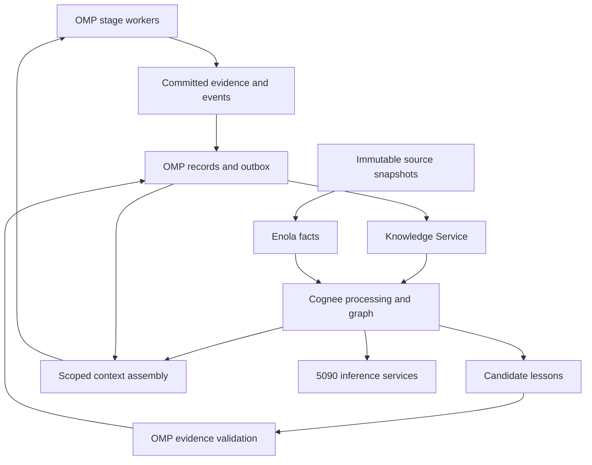

# OMP Fleet Knowledge System: Implementation Blueprint

**Architecture decision.** Use self-hosted Cognee as OMP's shared engineering knowledge engine, integrate Enola's structural code analysis into that engine, and run memory inference locally on the RTX 5090. OMP owns execution authority, evidence acceptance, knowledge applicability, and the context delivered to each worker. Cognee owns graph construction, semantic retrieval, source-linked memory processing, and candidate lesson distillation.

This supersedes the Hindsight-first deployment recommendation in the earlier architecture comparison. The objective here is the complete engineering knowledge capability, with less weight given to integration convenience or minimizing the initial number of services. Hindsight is not a required component. The recommendation is based on documented capabilities and inspected source as of September 11, 2026; comparative performance on OMP workloads has not been measured. This document specifies implementation work, not an installed or qualified deployment.

**1. Why Cognee is the preferred foundation**

The decisive requirement is connecting execution history, design rationale, code structure, and reusable procedures. Cognee provides a common graph and pipeline model for heterogeneous documents and session knowledge. Custom DataPoints allow application-defined nodes and relationships to be inserted directly, so authoritative OMP records need not be rediscovered through an LLM reading prose. The OMP integration must explicitly construct those links; a shared graph does not join unrelated data correctly by itself. [1](https://docs.cognee.ai/core-concepts/architecture) [2](https://docs.cognee.ai/guides/custom-data-models)

Cognee's improvement pipeline can retain agent traces, apply feedback to retrieved graph elements, and distill session guidance into durable lessons. Its code pipeline consumes Enola snapshots and supports deterministic structural queries. Together, these cover more of the intended system than conversational recall alone. They also reduce the amount of generic memory machinery OMP would need to build. [3](https://docs.cognee.ai/core-concepts/main-operations/improve) [4](https://github.com/topoteretes/cognee/blob/c0d18c80e24b7b78918e7642c03f6f128fdd2aee/examples/guides/code_graph_example.py)

| Alternative | Strongest reason to choose it | Why it is not the selected core |
|---|---|---|
| Hindsight | Temporal/hybrid recall, consolidated observations, living knowledge pages, and compact PostgreSQL operations. | Still credible, but this design gives greater weight to a common engineering graph and customizable trace-to-lesson pipeline. [5](https://hindsight.vectorize.io/developer/knowledge-pages) |
| OpenViking | Hierarchical context discovery across resources, memories, experiences, and skills. | A strong context-platform alternative. A source-derived code/evidence graph is the more central organizing model for this OMP design. [6](https://github.com/volcengine/OpenViking) |
| Graphiti | Temporal entities, relationships, and source episodes. | Excellent temporal foundation, but code extraction and the broader learning workflow require more assembly around it. [7](https://github.com/getzep/graphiti) |
| MemOS | Explicit traces, policies, world models, and skill evolution using feedback. | Its procedural design is useful, but adding a second autonomous memory core would duplicate ownership of lessons and retrieval. [8](https://github.com/MemTensor/MemOS/tree/main/apps/memos-local-plugin) |
| Local Memory | Compact observations, validation, promotion, questions, and contradiction lifecycle. | Useful knowledge service; the licensed binary offers less internal extensibility for this graph and evidence design. [9](https://github.com/danieleugenewilliams/local-memory-releases) |

The full memory-system landscape remains in the earlier comparison. This blueprint narrows the implementation to one knowledge engine. It does not assume Cognee has the best score on every public benchmark, or that every feature is ready for the fleet without adaptation.

**2. Complete target topology**

| Component | Responsibility | Deployment |
|---|---|---|
| OMP WorkService and controller | Work state, grants, revisions, accepted receipts, decisions, and publication events. | Existing CPU/PostgreSQL environment, extended deliberately. |
| OMP Knowledge Service | Application schemas, authorized queries, evidence checks, versioned context bundles, and learning lifecycle. | Python service using Cognee's SDK behind OMP's own API. |
| Cognee processing workers | Document ingestion, semantic graph construction, trace processing, and lesson proposals. | CPU processes calling the local inference service. |
| PostgreSQL + pgvector | Native knowledge/evidence records, job/outbox state, Cognee metadata, vectors, and persistent session cache. | Local infrastructure; separate database ownership and migrations for OMP and Cognee. |
| Neo4j Community | Shared engineering graph for the fleet's trust boundary. | One deliberately provisioned private graph service. |
| Enola | Deterministic code facts and relationships with source/snapshot provenance. | CPU workers indexing immutable source snapshots. |
| Local inference services | Extraction/synthesis, embeddings, and reranking. | RTX 5090 host, with bounded scheduling and CPU retrieval fallback where appropriate. |
| Durable artifact storage | Complete tool outputs, diffs, source snapshots, and other large evidence. | Content-addressed local storage with backup; referenced from PostgreSQL. |
| OMP WebUI | Knowledge inspection, evidence drill-down, applicability, corrections, and learning history. | Existing WebUI extended through the native API. |

Cognee explicitly supports PostgreSQL metadata and pgvector. Its free PostgreSQL graph provider is a demo; the production version is licensed. This design instead uses the supported Neo4j graph path, accepting a separate graph service as a deliberate tradeoff. It does not select the demo graph provider to make the deployment diagram smaller. [10](https://docs.cognee.ai/setup-configuration/graph-stores) [11](https://docs.cognee.ai/setup-configuration/vector-stores)

**3. Storage and isolation must be designed explicitly**

The inspected Cognee source has an important Neo4j distinction. The normal per-dataset database handler requires Neo4j Enterprise or Aura multi-database support. Its Community alternative provisions one Docker container per dataset. Treating every task, attempt, or repository snapshot as a dataset would therefore create an unsuitable proliferation of graph instances. [12](https://github.com/topoteretes/cognee/blob/c0d18c80e24b7b78918e7642c03f6f128fdd2aee/cognee/infrastructure/databases/graph/neo4j_driver/Neo4jCommunityDatasetDatabaseHandler.py) [13](https://github.com/topoteretes/cognee/blob/c0d18c80e24b7b78918e7642c03f6f128fdd2aee/cognee/infrastructure/databases/graph/neo4j_driver/Neo4jDatasetDatabaseHandler.py)

Use one private, fleet-owned graph for the current shared trust boundary. Represent repositories, tasks, runs, revisions, and policy states as explicit graph fields and relationships. The Knowledge Service is its trusted client; workers receive bounded application tools, not arbitrary database access. Repository scope and permitted cross-repository traversal are enforced before retrieval, with validation of returned sources afterward.

This is a single-tenant graph design, not a claim of database-enforced isolation between its internal projects. Cognee documents an authenticated single-user posture: shared database mode with authentication explicitly required. If independent users or organizations later require hard separation, deploy separate trust-boundary stores or select a qualified multi-tenant backend. Do not turn an OMP repository filter into an unsupported security promise. [14](https://docs.cognee.ai/setup-configuration/security)

Keep job scheduling, source registries, and accepted knowledge separate from Cognee's internal schema. An engine upgrade should not migrate the WorkService's authoritative tables. The graph and vector stores may be rebuilt from retained source records and versioned processing outputs; accepted decisions and evidence must survive that rebuild.

**4. Native knowledge and evidence model**

The following records are proposed application contracts. Their names describe OMP functionality to implement; they are not existing Cognee APIs.

| Record | Essential identity and content | Lifecycle rule |
|---|---|---|
| SourceVersion | Stable source ID, content hash, source type, repository, revision, producer, observed time. | Immutable; later content creates another version. |
| Evidence | Source versions, work/run/stage/attempt, candidate identity, exact result, artifact references. | Records what was observed; interpretation is separate. |
| Decision | Statement, scope, rationale, supporting evidence, effective interval, supersession. | Changes through explicit versioning. |
| LessonProposal | Preconditions, attempted action, result, interpretation, supporting and opposing evidence. | Advisory until accepted under a defined policy. |
| ProcedureVersion | Steps, applicability, supported uses, failure conditions, policy version, provenance. | Acceptance is limited to its declared scope. |
| CodeSnapshot | Repository, source revision/content identity, extractor version/configuration, snapshot digest, coverage limits. | Immutable once published. |
| ContextBundle | Required work revision, snapshot set, retrieved record versions, policy state, source citations, token budget. | Persisted for reproducibility; never reconstructed as if it were the original bundle. |
| IndexPublication | Input event range, processing version, completed stores, readiness state, failures. | Visible only after the declared publication is ready. |

Use explicit relationships such as `supports`, `contradicts`, `supersedes`, `applies_to`, `observed_in`, `verified_on`, and `depends_on`. Deterministic facts from structured receipts can be projected directly into these relationships. LLM-generated connections must carry their inferred status and source lineage. Confidence, source authority, and freshness remain separate properties.

Knowledge scope includes stable repository identity, relevant subsystem, runtime/environment conditions, and any candidate-specific restrictions. A useful general procedure should not expire just because an unrelated file changed. A candidate-specific verification result must not automatically transfer to a new candidate.

**5. Revision-safe code graphs are required from the outset**

The inspected Cognee code ingester updates matching nodes, removes stale nodes/edges, and stamps the repository's current snapshot. This is useful incremental indexing of a current repository view. It is not, by itself, an immutable history of every active fleet candidate. The same code also notes that some writes and cleanup can partially succeed. [15](https://github.com/topoteretes/cognee/blob/c0d18c80e24b7b78918e7642c03f6f128fdd2aee/cognee/tasks/code_graph/extract_code_graph.py)

Add a version-aware ingestion adapter around the Enola/Cognee path:

1. Index an immutable candidate snapshot and retain its Enola receipt.
2. Namespace code node and edge identities by repository and analysis snapshot, preserving the original Enola fact IDs as source attributes.
3. Insert the new snapshot as unpublished. Validate required counts, edge endpoints, source identity, and extractor configuration.
4. Publish a snapshot manifest only after its graph is ready. Workers select an explicit manifest, not an implicit latest graph.
5. Restrict cleanup to the intended snapshot namespace. Retain snapshots referenced by active runs and reproducibility records.

Stable symbol anchors can connect successive versions of a symbol, but a structural query always resolves an anchor through the worker's selected snapshot. Cross-repository queries carry a snapshot-set manifest identifying the chosen version of every participating repository. A single shared graph can then contain multiple candidates without the latest ingestion silently changing another worker's view.

This requires extending the current integration; it is not achieved by adding a `revision` string to a prompt. Keep the adapter or upstream patch small and versioned. Avoid modifying Enola's underlying facts to conceal their actual source identity.

**6. Capture and learning workflow**

WorkService publishes events transactionally with the corresponding state change: accepted plan, candidate created, check completed, audit completed, task outcome, correction, and supersession. A durable outbox feeds the Knowledge Service. Each event has an immutable ID and payload hash; repeated delivery with the same identity is harmless, while a conflicting payload is an error.

Tool capture preserves exact outputs as artifacts and creates bounded, attributed trace records. Capture failures and partial attempts as well as successful deliveries. Large raw outputs need not all undergo expensive extraction; the complete evidence remains available while selected sections and structured outcomes enter the learning pipeline.

Existing Advisor and Observer findings should become attributed lesson proposals. They can retain their useful investigative role while sharing a common downstream record and validation workflow. The Session Ledger can remain a navigational summary linked to primary records. None of these summaries should become an independent corroborating source merely because another agent repeats them.

Cognee's curator/writer workflow checks proposed lessons against session guidance and existing graph knowledge. In the inspected source, failed curator batches or writer calls can yield empty results while the wider run continues. OMP therefore needs explicit extraction status, retryability, and counts of processed, rejected, and failed units. An empty proposal list cannot automatically mean a successful learning pass. [16](https://github.com/topoteretes/cognee/blob/c0d18c80e24b7b78918e7642c03f6f128fdd2aee/cognee/modules/session_distillation/distill.py)

Likewise, Cognee's per-step feedback can summarize a method return value or fall back to a generic success/failure line. That is not an independent judgment that a code change meets its criteria. Map OMP receipts into structured outcome fields, and preserve the distinction between tool execution, test result, and accepted candidate. [17](https://github.com/topoteretes/cognee/blob/c0d18c80e24b7b78918e7642c03f6f128fdd2aee/cognee/infrastructure/session/session_agent_trace.py)

The learning loop is complete only when a later stage can retrieve and apply a procedure, record what happened, and update its support or applicability. Repeated independent successful uses can support broader promotion under policy; counterexamples can narrow or retract it. A successful run shows that a method worked under those conditions, not that every step caused the success. Avoid automatic reward attribution to every retrieved memory.

No model-weight training is required for this loop. Fine-tuning is a separate future option if accumulated cases demonstrate a stable pattern of extraction errors or procedural weaknesses.

**7. Context is a native stage input**

Provide one application API for context preparation. Proposed requests identify work item, stage, attempt, candidate, permitted repositories, snapshot set, and budget. The service first loads mandatory current records and then retrieves optional enrichment: related cases, accepted decisions, procedures, source excerpts, and structural code relationships.

Cognee supports context-only retrieval, explicit search modes, and raw result payloads. Use those capabilities to obtain evidence for the OMP worker. Avoid unnecessary memory-service answer generation followed by another answer from the coding model. Explicitly capture retrieval provenance and later feedback, because context-only retrieval does not automatically create Cognee's normal generated-answer session entry. [18](https://docs.cognee.ai/core-concepts/main-operations/recall)

Use exact queries for work IDs, receipt IDs, source revisions, and symbol identities. Use semantic retrieval for similar situations and related rationale. Use structural traversal for dependencies. Reranking selects relevant candidates but never overrides hard scope, validity, or source-withdrawal rules. Persist the final context bundle and its versions before launching the stage.

Different stages need different context profiles. Planning can receive broader alternatives and comparable cases. Implementation receives the approved plan, exact candidate state, relevant dependencies, and supported procedures. Verification receives criteria and independently inspectable evidence, without inheriting an implementer's assertion of correctness as its premise. Historical facts and accepted policy remain available when appropriate.

**8. Correction, publication, and failure semantics**

When evidence is withdrawn or a decision is superseded, the native registry updates immediately and schedules graph, vector, and cache cleanup. Cognee documents provenance-based deletion of affected session content, but that cleanup is best-effort and has exceptions, including trace entries without graph element IDs. Native validity checks must cover those gaps. [19](https://docs.cognee.ai/core-concepts/sessions-and-caching)

Do not expose a partial multi-store update as a complete publication. Publication manifests identify what is ready, and context assembly rejects missing or withdrawn required inputs. New graph snapshots can be staged while the previous published snapshot remains available. Current work records and committed evidence stay directly retrievable even if semantic indexing or GPU processing is behind.

Optional enrichment may degrade when its service is unavailable. Missing mandatory evidence or an invalid candidate identity is a correctness failure and must be reported distinctly. Avoid a vague memory-unavailable error that unnecessarily stops a task with sufficient exact inputs, or a silent fallback that proceeds without required verification evidence.

**9. The RTX 5090 deployment profile**

Use a dedicated local inference service shared across fleet memory jobs. The initial extraction candidate is **Qwen3.5-35B-A3B in a pinned 4-bit GGUF build**, served through llama.cpp's compatible server. Its sparse architecture has 35B total parameters and 3B active parameters; the inactive experts still occupy model storage. Quantized builds are available, including Q4 variants. Actual VRAM residency and schema fidelity must be qualified with the selected artifact and runtime. [20](https://huggingface.co/Qwen/Qwen3.5-35B-A3B) [21](https://huggingface.co/unsloth/Qwen3.5-35B-A3B-GGUF)

This is a better candidate to investigate for the expanded workload than freezing the previous gpt-oss-20b suggestion without comparison. It is not a measured claim that Qwen wins OMP extraction. Qwen3.5-27B and gpt-oss-20b remain comparison candidates; the architecture does not depend on one generator. Cognee's published local compatibility matrix validates older model families and does not establish Qwen3.5's extraction quality. [22](https://docs.cognee.ai/setup-configuration/llm-providers)

| Work | Selected initial profile | Important implementation detail |
|---|---|---|
| Structured extraction and routine synthesis | Qwen3.5-35B-A3B, 4-bit, local server | Enforce supported JSON schemas; verify references and semantic content beyond JSON validity. |
| Embeddings | Qwen3-Embedding-0.6B, 1024 dimensions | Apply the documented query instruction and document encoding separately; pin normalization and preprocessing. |
| Reranking | Qwen3-Reranker-0.6B | Implement its documented pair formatting and score computation; it is not a generic embedding endpoint. |
| Code parsing and structural traversal | Enola / graph service on CPU | No generative model needed for the source-derived facts. |
| Work state and evidence checks | PostgreSQL/application code on CPU | Independent of model availability. |
| Difficult coding, planning, and independent verification | Existing qualified OMP model routing | Moving memory inference locally does not automatically qualify local models for all agent roles. |

The embedding model supports up to 1024 dimensions and instruction-aware queries. The reranker uses a separate query/document scoring process. Their small size deliberately leaves GPU capacity for generation; larger retrieval models can be compared later if evidence retrieval is the bottleneck. These need explicit adapters or compatible serving surfaces, not just substitutions of model names in an unrelated client. [23](https://huggingface.co/Qwen/Qwen3-Embedding-0.6B) [24](https://huggingface.co/Qwen/Qwen3-Reranker-0.6B)

Start capacity qualification with one concurrent generative job and bounded input windows. Reserve room for KV cache, execution buffers, and retrieval models rather than assigning all 32 GB to model weights. The model card's maximum context window is not a promise that it fits on this GPU. If all models do not fit with useful headroom, keep the same embedding/reranking models on CPU or schedule their GPU residency; do not silently change embedding models between indexing and querying. [25](https://www.nvidia.com/en-us/geforce/graphics-cards/50-series/rtx-5090/)

Prioritize active-stage retrieval over bulk backfills and background synthesis. Bound queue depth, retry count, and completion length. Record model calls at the inference gateway, because a memory engine's UI may not count every auxiliary extraction or enrichment call. Queue throughput must exceed sustained ingestion demand; the acceptance target should come from observed fleet volume rather than an invented tokens-per-second estimate.

Configure every memory inference path locally: extraction, summarization, embeddings, reranking, and optional query planning. Cognee explicitly warns that configuring only one of generation and embedding can leave the other using OpenAI. Host-harness sampling would also spend the host model's allowance. An offline operation check after model provisioning belongs in deployment qualification. [26](https://docs.cognee.ai/guides/local-setup)

**10. OMP implementation work packages**

The paths below are proposed locations or extensions to existing areas, subject to the implementation checkout's package conventions. They are not files already created by this blueprint.

| Work package | Proposed location | Completion condition |
|---|---|---|
| Knowledge contracts and native records | `python/omp-work/` plus shared contract definitions | Evidence, decisions, applicability, and event IDs are persisted and queried with explicit versions. |
| Transactional outbox | WorkService mutation layer | A committed relevant event survives restart and repeated delivery without duplicate accepted knowledge. |
| Knowledge Service | New `python/omp-knowledge/` package | Native API mediates scope, retrieval, context publication, proposals, and corrections. |
| Cognee integration | Version-pinned adapter within Knowledge Service | Structured records, documents, traces, and proposals retain native source identity and processing status. |
| Versioned code graph | Enola/Cognee ingestion adapter | Simultaneous candidates can be queried independently; partial ingests remain unpublished. |
| Runtime capture and context use | Coding-agent task executor and workflow extensions | Every relevant stage emits attributed evidence and receives a versioned context bundle. |
| Local inference gateway | Deployment/inference configuration and provider adapters | All selected memory operations use the intended local models with bounded scheduling. |
| Knowledge UI | `omp-webui` API/client views | An operator can inspect support, scope, source, counterexamples, and supersession for a lesson. |
| Migration and reconciliation | Versioned import jobs | Existing evidence and legacy memory are imported with explicit provenance and trust state. |

The inspected OMP adapter's current conversational capture cannot serve as the only event source. Integrate WorkService outcomes and actual tool evidence. Its task lifecycle and durable operation machinery provide existing integration points, but implementation must first verify the current checkout rather than assuming the previously inspected revision is still deployed. [27](https://github.com/theturtlecsz/oh-my-pi/blob/0abad81141cd84190aaa012dfbcce9eb32f19240/packages/coding-agent/src/hindsight/transcript.ts) [28](https://github.com/theturtlecsz/oh-my-pi/blob/0abad81141cd84190aaa012dfbcce9eb32f19240/packages/coding-agent/src/task/executor.ts) [29](https://github.com/theturtlecsz/oh-my-pi/blob/0abad81141cd84190aaa012dfbcce9eb32f19240/session-system/extensions/workflow/pending-ops.ts)

**11. Migration and release criteria**

Import exact work records and source documents before generated memories. Bring Hindsight or other legacy knowledge across as attributed historical claims, not as automatically verified procedures. Preserve original timestamps, repository identity, and source links wherever available. Backfill through complete, resumable queries rather than a capped presentation tree.

Build the complete capture → knowledge → retrieval → feedback → correction loop as the first integrated capability. Infrastructure can be delivered incrementally, but automatic learning and invalidation are release requirements, not indefinite later phases. Continue serving existing work while the new stores are populated and reconciled; switch active context delivery only when its required contracts pass.

| Required check | What it must demonstrate |
|---|---|
| Duplicate event replay | Same event does not create repeated accepted evidence or multiply lesson support. |
| Concurrent candidates | Two workers can query distinct source snapshots without either ingestion overwriting the other's view. |
| Partial publication | A crash between relational, vector, and graph writes never exposes the result as complete. |
| Supersession and withdrawal | A stale or withdrawn fact is excluded even before every derived cache has caught up. |
| Evidence acceptance | Model confidence or a successful tool invocation cannot masquerade as independent verification. |
| Scope | Repository and snapshot filters apply to retrieval and graph traversal; broader access is explicit. |
| Learning failure | Malformed output, dropped curator batches, and failed processing remain observable and recoverable. |
| Local operation | After model provisioning, memory processing operates without paid external inference. |
| GPU outage | Exact evidence and accepted procedures remain usable; processing backlog is visible. |
| Rebuild and recovery | Source records and accepted knowledge can restore a consistent published system. |

These are implementation correctness criteria. No tests or benchmarks were executed for this blueprint. A later evaluation should compare held-out task success, repeated failures, citation accuracy, stale knowledge, latency, and total cost. Public memory benchmarks remain supplementary; they cannot establish correct behavior for candidate revisions and autonomous work ownership.

**Implementation outcome.** OMP becomes a fleet that accumulates inspectable engineering knowledge, reasons over the code and evidence behind it, and revises its procedures from outcomes. Cognee and the 5090 supply substantial reusable capability; native OMP contracts supply the meaning and reliability that generic memory APIs cannot infer on their own.

**Sources**

Sources were consulted September 11, 2026. Product documentation can change; source links use the inspected commit where a specific implementation finding matters.

1. Cognee. [Architecture](https://docs.cognee.ai/core-concepts/architecture).
2. Cognee. [Custom Data Models](https://docs.cognee.ai/guides/custom-data-models).
3. Cognee. [Improve](https://docs.cognee.ai/core-concepts/main-operations/improve).
4. Cognee. [Enola code graph example](https://github.com/topoteretes/cognee/blob/c0d18c80e24b7b78918e7642c03f6f128fdd2aee/examples/guides/code_graph_example.py).
5. Hindsight. [Knowledge Pages](https://hindsight.vectorize.io/developer/knowledge-pages).
6. OpenViking. [Source and architecture overview](https://github.com/volcengine/OpenViking).
7. Zep. [Graphiti](https://github.com/getzep/graphiti).
8. MemTensor. [MemOS local plugin](https://github.com/MemTensor/MemOS/tree/main/apps/memos-local-plugin).
9. Local Memory. [Binary distribution and documentation](https://github.com/danieleugenewilliams/local-memory-releases).
10. Cognee. [Graph Stores](https://docs.cognee.ai/setup-configuration/graph-stores).
11. Cognee. [Vector Stores](https://docs.cognee.ai/setup-configuration/vector-stores).
12. Cognee. [Neo4j Community dataset handler](https://github.com/topoteretes/cognee/blob/c0d18c80e24b7b78918e7642c03f6f128fdd2aee/cognee/infrastructure/databases/graph/neo4j_driver/Neo4jCommunityDatasetDatabaseHandler.py).
13. Cognee. [Neo4j dataset handler](https://github.com/topoteretes/cognee/blob/c0d18c80e24b7b78918e7642c03f6f128fdd2aee/cognee/infrastructure/databases/graph/neo4j_driver/Neo4jDatasetDatabaseHandler.py).
14. Cognee. [Security & Privacy](https://docs.cognee.ai/setup-configuration/security).
15. Cognee. [Incremental code graph ingestion](https://github.com/topoteretes/cognee/blob/c0d18c80e24b7b78918e7642c03f6f128fdd2aee/cognee/tasks/code_graph/extract_code_graph.py).
16. Cognee. [Session distillation implementation](https://github.com/topoteretes/cognee/blob/c0d18c80e24b7b78918e7642c03f6f128fdd2aee/cognee/modules/session_distillation/distill.py).
17. Cognee. [Agent trace feedback implementation](https://github.com/topoteretes/cognee/blob/c0d18c80e24b7b78918e7642c03f6f128fdd2aee/cognee/infrastructure/session/session_agent_trace.py).
18. Cognee. [Recall](https://docs.cognee.ai/core-concepts/main-operations/recall).
19. Cognee. [Sessions and Caching](https://docs.cognee.ai/core-concepts/sessions-and-caching).
20. Qwen. [Qwen3.5-35B-A3B model card](https://huggingface.co/Qwen/Qwen3.5-35B-A3B).
21. Unsloth. [Qwen3.5-35B-A3B GGUF builds](https://huggingface.co/unsloth/Qwen3.5-35B-A3B-GGUF).
22. Cognee. [LLM Providers](https://docs.cognee.ai/setup-configuration/llm-providers).
23. Qwen. [Qwen3-Embedding-0.6B model card](https://huggingface.co/Qwen/Qwen3-Embedding-0.6B).
24. Qwen. [Qwen3-Reranker-0.6B model card](https://huggingface.co/Qwen/Qwen3-Reranker-0.6B).
25. NVIDIA. [RTX 5090 specifications](https://www.nvidia.com/en-us/geforce/graphics-cards/50-series/rtx-5090/).
26. Cognee. [Local Setup](https://docs.cognee.ai/guides/local-setup).
27. OMP. [Conversational memory capture](https://github.com/theturtlecsz/oh-my-pi/blob/0abad81141cd84190aaa012dfbcce9eb32f19240/packages/coding-agent/src/hindsight/transcript.ts).
28. OMP. [Task executor](https://github.com/theturtlecsz/oh-my-pi/blob/0abad81141cd84190aaa012dfbcce9eb32f19240/packages/coding-agent/src/task/executor.ts).
29. OMP. [Durable pending operations](https://github.com/theturtlecsz/oh-my-pi/blob/0abad81141cd84190aaa012dfbcce9eb32f19240/session-system/extensions/workflow/pending-ops.ts).