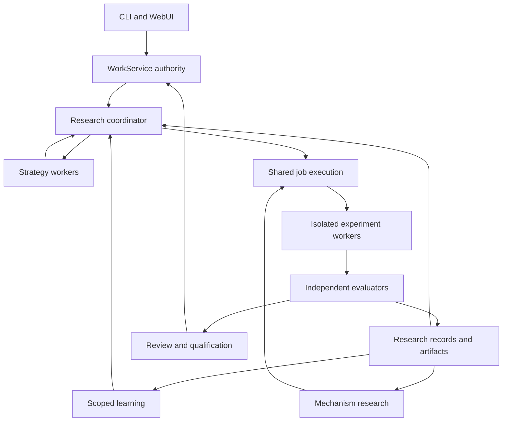

 # OMP Full Autoresearch Implementation Plan

Prepared September 15, 2026. Built for `theturtlecsz/oh-my-pi`, using the ECC-centered OMP handoff as the foundation.

**Decision:** Build a complete, persistent research system inside OMP. It will discover and investigate questions, construct and compare hypotheses, run experiments, learn across campaigns, produce reproducible findings, deliver engineering changes, and experimentally improve its own research mechanisms.

**Status:** Architecture and implementation handoff. The research components, contracts, commands, and work packages below are proposed unless explicitly marked as observed source behavior. This review installed nothing, changed no repository, created no Work Ledger items, and ran no paid experiments. “10×” is an outcome target to test, not a measured result.

Quick navigation: [architecture](#5-system-topology), [refactoring map](#19-refactoring-map-and-compatibility), [work packages](#22-implementation-work-packages), [effort estimate](#24-engineering-effort-and-staffing-estimate), [implementation instructions](#29-instructions-for-the-implementation-agent).

## 1. Product outcome and scope

Give OMP a research objective and an operating policy. It should autonomously:

1. Examine existing code, literature, datasets, previous investigations, and available instruments.
2. Define answerable questions, competing explanations, and observable success criteria.
3. Establish a reproducible baseline and identify the evidence that could disprove each hypothesis.
4. Generate materially different approaches, including challenges to weak assumptions.
5. Implement experiments in isolated environments.
6. Choose between repairing an experiment, improving a candidate, exploring another branch, gathering evidence, or replicating a result.
7. Allocate model calls, CPU/GPU work, retrieval, and review according to the campaign objective.
8. Preserve every consequential trial, including failed, interrupted, inconclusive, and negative results.
9. Independently evaluate claims and candidate artifacts.
10. Produce reports, runnable reproduction bundles, datasets or models where applicable, and reviewable code changes.
11. Carry scoped, evidence-backed lessons into future work.
12. Generate and evaluate improvements to the research process itself, then qualify and promote successful versions.

The capability scope includes long-running, multi-project, distributed research and recursive mechanism improvement. Delivery phases establish dependencies and usable milestones; they do not reduce the final scope to an optional coding assistant.

Continuous campaigns operate through renewable execution windows. Their lifetime can be open-ended, while each window has explicit resources, authorized tools, cancellation behavior, and a recoverable state. An existing authorization can permit automatic renewal within its terms. A model cannot invent additional resources or silently broaden the mission.

The initial application focus is software engineering, OMP optimization, ML experimentation, and evidence synthesis. The domain interface also supports simulation and external instruments. A physical laboratory experiment is executable only when an actual instrument or laboratory backend is connected; a generated protocol is recorded as a proposal until that backend returns evidence.

## 2. Verified baseline and inherited work

### 2.1 Source identities

| Component | Reviewed identity | Meaning |
|---|---|---|
| OMP fork | `1b78b801edebc0ce8c4fbd90c8a192e6d5b6bec1` | Rechecked against repository main during this review |
| ECC | `8321021c54d670126ce3b2969d5deb880b4b0c2a` | Pinned source from the accepted handoff; package identified there as 2.2.1 |
| Installed OMP, WorkService, models, memory, GPU workers | Unknown in this planning environment | Implementation must inventory actual loaded identities |
| Existing Work Ledger items | Historical references available in repository documents | Current descriptions, acceptance criteria, state, and authority require live readback |

Repository source and historical qualification documents do not establish what is currently installed or accepted.

### 2.2 What already exists

OMP has native autoresearch types, experiment execution and logging, local persistence, notes, and a dashboard. It is a useful execution and presentation starting point. Its current logging tool accepts an agent-supplied metric and keep/discard decision; metric discrepancies and some kept scope deviations become warnings. That path must not issue trusted research promotion evidence. [Autoresearch types](https://github.com/theturtlecsz/oh-my-pi/blob/1b78b801edebc0ce8c4fbd90c8a192e6d5b6bec1/packages/coding-agent/src/autoresearch/types.ts), [experiment logging](https://github.com/theturtlecsz/oh-my-pi/blob/1b78b801edebc0ce8c4fbd90c8a192e6d5b6bec1/packages/coding-agent/src/autoresearch/tools/log-experiment.ts)

WorkService already enforces principal scopes and separates execution, approval, and completion operations. Extend its established contracts rather than giving a research agent a separate authority database. [WorkService](https://github.com/theturtlecsz/oh-my-pi/blob/1b78b801edebc0ce8c4fbd90c8a192e6d5b6bec1/python/omp-work/src/omp_work/v1/service.py)

OMP includes scientific-source fetchers, including arXiv, Crossref, Semantic Scholar, and PubMed paths in its source tree. The inspected arXiv handler retrieves metadata and can convert a PDF. These are retrieval building blocks; corpus management, source lineage, and claim verification still need implementation. [arXiv handler](https://github.com/theturtlecsz/oh-my-pi/blob/1b78b801edebc0ce8c4fbd90c8a192e6d5b6bec1/packages/coding-agent/src/web/scrapers/arxiv.ts)

The existing intake-exploration contract assigns OMP-267–270 to contracts, durable branch execution, presentation, and qualification. It requires a shared bounded-model-job foundation rather than an exploration-only scheduler. Reconcile research against those owners before adding implementation items. That document records plans and ownership, not a qualified exploration runtime. [Exploration contract](https://github.com/theturtlecsz/oh-my-pi/blob/1b78b801edebc0ce8c4fbd90c8a192e6d5b6bec1/docs/omp-intake-exploration-implementation-plan.md)

### 2.3 Preserve and extend the ECC handoff

| Existing work | Required contribution to full research |
|---|---|
| WP1: effective inventory and complete mirror | Reproducible runtime, source, role, tool, and asset identities |
| WP2: adapter and installation | Deterministic research-pack transforms, dependency closure, ownership, release packaging |
| WP3: workflow and domain packs | Engineering methods used during research implementation and review |
| WP4: typed audit | Structured review evidence and deterministic reports for accepted artifacts |
| WP5: complete usage | Campaign, branch, trial, model, and outer-loop accounting |
| WP6: adapted advisors | Domain expertise supplied under explicit, bounded grants |
| WP7A: learning | Scoped lessons, contradictions, provenance, and promotion |
| WP7B: lifecycle | Native startup, recovery, cancellation, compaction, and observation |
| WP8: qualification and updates | Security coverage, upstream changes, release promotion, compatible rollback |

Full research adds capabilities beyond the original ECC phase. It does not silently rewrite accepted intake semantics, mandatory audit policy, command ownership, or WorkService authority.

Repository `AGENTS.md` references a host-local Antidote skill at `/home/thetu/.codex/skills/antidote/SKILL.md`. That file was unavailable in this review environment. The implementation agent must resolve the actual skill before repository work; this source-based handoff does not certify that prerequisite. Preserve its stated root-cause and reuse preference throughout implementation.

## 3. Architectural decisions

| Decision | Implementation consequence |
|---|---|
| ECC remains the default upstream for reusable methods and compatible utilities | Mirror completely, activate selected assets, record every substantive adaptation |
| WorkService owns work authority | Campaigns reference native work; generated plans and research scores cannot issue grants |
| One shared execution foundation | Research, intake exploration, and future Fleet reuse dispatch, leases, cancellation, reservations, and recovery |
| Research coordination is a durable service module | Closing a terminal or losing a model session does not lose the campaign |
| Strategies propose actions; the controller admits actions | Search code cannot directly spend, mutate authority, or accept work |
| Evaluation is independent of candidate generation | Candidate code and models cannot forge authoritative metrics or modify their current evaluator |
| Search decisions and final acceptance are separate | A promising branch can be explored without being accepted for production |
| Knowledge and records have different owners | WorkService stores authority/evidence references; artifacts store bytes; the selected memory backend stores durable lessons |
| Harness improvement runs on frozen candidate versions | A running comparison does not change its model recipe, evaluator, or harness halfway through |
| Broad self-improvement uses normal release paths | Core runtime changes are supported as development candidates, then reviewed and qualified |
| Native clients share one API contract | CLI and WebUI expose the same campaign state and operations |
| Measured effectiveness determines default policies | More agents, more skills, and more experiments are not success metrics |

The system has a small stable control surface and a broad experimental surface. Both can evolve through versioned development, but an experiment never changes the rules that determine its own success during that comparison.

## 4. Reuse map: ECC and all seven research systems

### 4.1 ECC research pack

Add a research pack through the proposed ECC adapter, alongside the existing engineering packs.

| Inspected ECC asset | Reuse | OMP adaptation |
|---|---|---|
| `research-ops` | Classify the question, use supplied evidence, distinguish facts/inferences/recommendations | Map to campaign intake and source records |
| `deep-research` | Multi-source investigation, deep reading, cited synthesis, treatment of external pages as data | Map Firecrawl/Exa-specific instructions to actually available OMP retrieval tools; retain optional connector support |
| `mle-workflow` | Data contracts, reproducibility, leakage analysis, evaluation, operational feedback | Domain adapter for ML; native artifacts and release owners |
| `scientific-thinking-scholar-evaluation` | Research-method and citation-support review rubric | Preserve directory identity; its frontmatter name is `scholar-evaluation`; map deliberately rather than assuming they match |
| `benchmark-optimization-loop` | Baselines, falsifiable changes, repeated measurements, durable winners | Native campaign/trial records and independent gates |
| `eval-harness` | Evaluation definitions and compatible inspection, journal, replay, and receipt utilities | Reuse qualified helpers; adapt storage and output contracts |
| `harness-optimizer` | A specialist starting point for evaluating harness configuration changes | Preserve its configuration scope; executable strategy synthesis is a separate role |
| Existing workflow/domain packs | Search first, contracts, verification, retrieval, language/database guidance | Retain WP1–WP8 mappings |

Sources: [research-ops](https://github.com/affaan-m/ECC/blob/8321021c54d670126ce3b2969d5deb880b4b0c2a/skills/research-ops/SKILL.md), [deep-research](https://github.com/affaan-m/ECC/blob/8321021c54d670126ce3b2969d5deb880b4b0c2a/skills/deep-research/SKILL.md), [MLE workflow](https://github.com/affaan-m/ECC/blob/8321021c54d670126ce3b2969d5deb880b4b0c2a/skills/mle-workflow/SKILL.md), [scholar evaluation](https://github.com/affaan-m/ECC/blob/8321021c54d670126ce3b2969d5deb880b4b0c2a/skills/scientific-thinking-scholar-evaluation/SKILL.md)

A concrete ECC limitation must remain visible: its inspected evaluation utilities explicitly disable candidate execution because no verified containment backend is implemented. Reuse their supported utilities; implement and qualify OMP's runner independently. Do not remove `gate.isolation_required` to make the integration appear complete. [ECC eval harness](https://github.com/affaan-m/ECC/blob/8321021c54d670126ce3b2969d5deb880b4b0c2a/skills/eval-harness/SKILL.md)

Translate host-specific commands, tools, model names, paths, and rule metadata. Preserve supporting files. Do not inherit blanket coverage thresholds, additional mandatory human review, automatic promotion, or a second observer process where they conflict with the approved native policy. Record the exact overlay and controlling requirement.

### 4.2 Research precedents

The following mapping defines design inputs, not a claim that their benchmark results will transfer to OMP.

| Reference | Capability to incorporate | Reuse approach |
|---|---|---|
| Karpathy autoresearch | Simple measurable experiment cycle | Extend native OMP autoresearch rather than import a duplicate loop |
| Bilevel Autoresearch | Generation and evaluation of new search mechanisms | Adapt the outer research method; execute generated mechanisms as isolated, versioned candidates |
| AutoResearchClaw | Hypothesis/result debate, repair versus pivot, evidence-linked reporting, cross-run lessons | Inspect reusable prompts and utilities; map stages into native jobs |
| MARS | Cost-aware branch selection and comparative lessons | Implement an OMP search policy from the published method; reuse trajectories as reference fixtures where appropriate |
| AI Scientist v1/v2 | Full experiment-to-report workflow; v2's experiment tree exploration | Adapt experiment-manager and reporting ideas; inspect code reuse at module boundaries |
| Agent Laboratory / AgentRxiv | Specialist research work, copilot interaction, cumulative investigations | Use native role grants and durable investigation records |
| Google AI Co-Scientist | Hypothesis generation, critique, ranking, evolution, deduplication, synthesis | Implement analogous policies using OMP; no proprietary engine import is assumed |

Sources: [Karpathy](https://github.com/karpathy/autoresearch), [Bilevel](https://arxiv.org/html/2603.23420v2), [ARC](https://arxiv.org/abs/2605.20025), [MARS](https://arxiv.org/abs/2602.02660), [AI Scientist v2](https://github.com/SakanaAI/AI-Scientist-v2), [Agent Laboratory](https://github.com/SamuelSchmidgall/AgentLaboratory), [Co-Scientist](https://docs.cloud.google.com/gemini/enterprise/docs/co-scientist-and-alphaevolve)

MARS's inspected repository publishes generated solutions and trajectories, not a ready-to-import orchestration engine. Budget for implementing its relevant policy inside OMP. For every actual code import from another project, pin the source, inspect its license and dependencies, retain required notices, and qualify the imported interfaces. [MARS repository contents](https://github.com/jfc43/MARS)

For numeric and categorical hyperparameter search, evaluate an Optuna adapter before writing new samplers or pruners. Optuna's search functionality can sit behind the same OMP trial controller; its study storage must not become a second permission or completion authority. Pin the version actually qualified. [Optuna](https://github.com/optuna/optuna)

## 5. System topology



The diagram shows operational relationships. WorkService continues to authorize operations performed through the coordinator and job layer. Evidence, memory, and strategy outputs are inputs to decisions, not independent sources of permission.

There are five operational components:

- **Coordinator:** campaign state, hypothesis/search state, policy selection, next-action proposals, and durable progress.
- **Shared job controller:** admission, resource reservation, dispatch, fencing, cancellation, recovery, and request accounting.
- **Execution workers:** retrieval, model calls, candidate implementation, CPU/GPU experiments, and external instrument adapters.
- **Evaluation workers:** protected checks, scoring, reproduction, and evidence issuance.
- **Artifact and knowledge services:** immutable experiment material and scoped learning through existing owners.

Implement these as modules and workers around existing OMP/WorkService facilities. Separate deployment processes where isolation or availability requires them; do not introduce independent orchestration systems for each function.

## 6. Authority, persistence, and identity

### 6.1 Ownership

| Information | Canonical owner |
|---|---|
| Goal, admitted scope, execution/effect grants, cancellation, completion | WorkService |
| Operational campaign and job state | Versioned service records under the native authority model |
| Experimental code, data snapshots, logs, plots, model artifacts, reports | Content-addressed artifact storage with access controls |
| Source text and bibliographic metadata | Research corpus records and their artifact references |
| Durable learned lessons and retrieval | The selected OMP memory backend |
| Qualified executable assets | Release manifests and existing installation process |
| Local experiment history/dashboard cache | Rebuildable local view; never sufficient for acceptance |
| Usage | Request-level records reconciled to provider/runner evidence |

Start with the existing PostgreSQL service and a configured artifact directory or object-store adapter. Reuse the configured memory backend. Add a vector index only when retrieval needs one; an index is a derived access-controlled view, not a second knowledge authority.

### 6.2 Required records

Names below are proposed contract entities, not claims about existing tables.

| Entity | Essential fields |
|---|---|
| Campaign | ID, workspace/project/work references, immutable goal revision, domain, state, approved policy, current execution window, outcome |
| Campaign revision | Original request, questions, constraints, metrics, evaluation protocol, datasets, allowed effects, stop/renewal rules |
| Hypothesis | ID, exact claim, mechanism, predicted observation, falsifier, assumptions, source references, parents, status |
| Search node | ID, parent/merge edges, candidate artifact, hypothesis IDs, policy version, proposal context digest, visits and observed outcomes |
| Trial specification | Candidate digest, experiment definition, environment/image, data version, seed, hardware class, evaluator identity, resource reservation |
| Trial attempt | Attempt ID, provider/job IDs, lease epoch, launch/heartbeat/finish timestamps, runtime status, cancellation, effect reconciliation |
| Evaluation receipt | Trusted issuer, exact trial/candidate/evaluator/input identities, observations, checks, validity, uncertainty, artifact digests |
| Comparison | Frozen alternatives, shared criteria, admissible evidence, selection outcome, reasons, uncertainty, selector version |
| Source | Canonical URL/DOI, source/version dates, retrieved timestamp, content digest, access rights, parsing status |
| Claim-evidence link | Claim ID, source location, supporting/contradicting relation, extraction provenance, review state |
| Lesson | Trigger, action, scope, evidence, supporting and contradicting outcomes, status, provenance, expiry/review policy |
| Mechanism candidate | Parent mechanism, source/config bundle, interface version, declared capabilities, tests, comparison cohort, review/promotion state |
| Usage request | Stable request ID, parent relationships, role/model/effort, measured usage, estimated prices, quota units, unknown fields |
| Release/promotion record | Qualified artifact, acceptance evidence, authorized target/window, compatibility and rollback references |

A research candidate and a native WorkService candidate are distinct identities. Preserve an explicit mapping when a research result becomes deliverable work. Never treat a Git SHA, search-node ID, or model-supplied ID as a substitute for a native candidate binding.

Artifact addressing uses a canonical manifest and cryptographic digests. Include the bytes actually executed, not only a commit label. Protect receipt issuer keys and write endpoints from experiment workers. A signed hash proves provenance/integrity only; the evaluator must still measure the correct thing.

### 6.3 State semantics

Campaign lifecycle:

`draft → admitted → running ↔ paused → evaluating → concluded`

Cancellation is a separate terminal path. A blocked campaign records a concrete dependency and resumable state; it does not fabricate a result. “Concluded” carries an outcome such as supported, refuted, inconclusive, resource-exhausted, or externally blocked.

Trial lifecycle:

`proposed → reserved → queued → leased → running → collecting → evaluating → settled`

Use distinct fields for:

- Execution result: completed, crashed, timed out, canceled, unknown.
- Measurement validity: valid, invalid, incomplete, quarantined.
- Scientific result: supports, contradicts, no detected effect, inconclusive, not applicable.
- Search disposition: continue, replicate, archive, prune, select for qualification.

A null result can complete a research objective. A crash is not a negative scientific finding. A selected search candidate is not an accepted engineering change.

## 7. Campaign lifecycle

### 7.1 Intake and preparation

Create a draft through the native intake path or a research projection of it. Reuse related work and investigations first.

Compile a campaign specification containing:

- Objective and intended output: explanation, decision, code change, model, experiment, or method improvement.
- Known facts, unknowns, assumptions, and explicit constraints.
- Research questions and the observations needed to answer them.
- Primary outcome, hard validity/correctness gates, secondary metrics, and tolerable tradeoffs.
- Domain adapter, environment requirements, datasets, baseline, and candidate scope.
- Model/tool recipe and available providers resolved from effective configuration.
- Authorized resources, allowed external effects, renewal conditions, and cancellation semantics.
- Evaluation protocol, visible development feedback, and protected confirmation data where applicable.
- Expected artifacts, evidence standards, and completion criteria.

The goal compiler proposes this structure; deterministic validators check it, and the existing owner/WorkService route supplies any required authority. Do not introduce a compulsory extra planning agent for an already precise task.

### 7.2 Research cycle

For each admitted campaign:

1. Load current authoritative state and applicable ECC guidance.
2. Retrieve relevant prior work, source evidence, and scoped lessons.
3. Identify the most consequential remaining uncertainty.
4. Propose hypotheses or refinements, with explicit predictions and falsifiers.
5. Validate schemas, references, constraints, duplicates, and tool requirements.
6. Independently compare admissible proposals where comparison is useful.
7. Ask the search policy for the next action.
8. Admit the action through the shared job controller.
9. Execute an isolated trial or evidence-gathering job.
10. Evaluate the output with the declared evaluator.
11. Update search statistics and evidence without overwriting history.
12. Choose repair, refine, explore, replicate, synthesize, pause, or conclude.
13. On a deliverable result, create its native candidate binding and run the required review/acceptance route.
14. Write the campaign report and stage appropriate lessons.

These are state transitions and job types. They are not fourteen mandatory LLM calls per experiment.

### 7.3 Human participation

Support three operating modes using the same engine:

| Mode | Behavior |
|---|---|
| Copilot | Show proposed decisions and accept targeted researcher guidance |
| Autonomous campaign | Execute the admitted research scope and resource windows without routine confirmation |
| Continuous program | Run multiple related campaigns, ingest new evidence, propose follow-up research, and renew work under standing policy |

Human decisions attach to exact campaign/plan/candidate revisions. Material goal changes create a successor revision and explicitly determine which prior evidence remains applicable.

Completion does not require the initial hypothesis to win. A supported negative conclusion, reproducible failed replication, or clear identification of missing evidence can satisfy an appropriately defined research objective.

## 8. Search engine

### 8.1 A common action vocabulary

Implement these actions first:

| Action | Use |
|---|---|
| Retrieve | Resolve a specific evidence gap |
| Draft | Create a genuinely different approach |
| Repair | Correct execution or implementation defects |
| Refine | Improve a valid candidate while retaining its central approach |
| Challenge | Test an assumption or alternative explanation |
| Combine | Construct a new candidate from compatible approaches |
| Evaluate | Obtain a declared measurement |
| Replicate | Re-run to estimate stability or reproduce elsewhere |
| Deepen | Spend further effort on a promising branch |
| Prune | Stop spending on a branch while preserving its record |
| Synthesize | Convert evidence into an answer or deliverable |
| Escalate | Request a specifically needed model, instrument, scope, or resource |
| Conclude | End with an evidence-backed outcome |

An infrastructure failure routes to recovery; it does not automatically lower a hypothesis's estimated scientific value. Failure classifications must preserve the original evidence and allow correction.

### 8.2 Policies

Use one controller with interchangeable policies:

| Policy | Appropriate domain |
|---|---|
| Fixed best-of-N | Independent implementation alternatives with a shared acceptance contract |
| Greedy improvement with restarts | Cheap, measurable local optimization |
| Beam/tree exploration | Approaches requiring several dependent improvements |
| Cost-aware MCTS-style selection | Expensive branches with uncertain downstream value |
| Bandit allocation | Choosing among known operators or experiment families |
| Bayesian/black-box optimization | Numeric or categorical parameter spaces |
| Successive halving | Trials with a validated relationship between cheap and full-fidelity measurements |
| Hypothesis tournament and evolution | Open-ended explanation, design, or research proposal populations |
| Replication-first | Findings whose uncertainty dominates the decision |

Policy selection comes from the campaign profile and observed task structure. Do not stack all policies on every task. Keep random search and simple greedy search as controls.

The policy returns proposed actions plus bounded machine-readable reasons. The controller validates feasibility, budget, scope, dependencies, and current authority. A policy can rank actions but cannot authorize them.

For MCTS-style selection, combine observed utility, uncertainty/exploration, and predicted incremental resource use. Normalize metrics within the declared task family; record weights and policy identity. Handle unvisited branches explicitly. Backpropagate actual, comparable results. Do not average incompatible tasks, fidelity levels, or evaluator versions into one reward.

### 8.3 Candidate diversity and comparison

Generate alternatives independently from the same frozen context. Preserve generation, selection, and acceptance as separate responsibilities.

Diversity operators include:

- Different implementation architectures.
- Counterexample and assumption challenge.
- Simpler baseline or fewer moving parts.
- Data/measurement correction before model complexity.
- Cross-domain analogy.
- Alternative decomposition or algorithm.
- Different model family where diversity is demonstrably useful.

Use exact duplicate detection mechanically. Semantic clustering can organize and diversify research selection, with reasons preserved. It is not proof that candidates are equivalent.

Preserve the existing intake contract's complete valid pool and neutral owner presentation. Research can use a separately versioned pruning policy for its own search graph; that policy must not silently change the accepted intake behavior.

For hypothesis tournaments, randomize presentation order, hide irrelevant model identities from evaluators, preserve ties and uncertainty, and periodically compare ranking against external evidence. Elo or judge preference is a search aid, never a scientific validity certificate.

### 8.4 Comparative learning

A comparison record should answer:

- What materially changed between the candidates?
- Were environment, inputs, evaluator, and resource conditions comparable?
- Which outcomes changed, and with what uncertainty?
- Which explanations remain plausible?
- What experiment would discriminate between them?

When several variables changed, label causal attribution as uncertain. Schedule an ablation where it would change a consequential decision. Avoid turning a persuasive retrospective into a universal rule.

## 9. Evaluation and evidence

### 9.1 Three evaluation surfaces

1. **Development feedback:** detailed diagnostics available to candidate workers.
2. **Confirmation evaluation:** protected cases used for promotion or scientific confirmation, with controlled feedback.
3. **Independent audit:** checks whether the claim and evidence justify the requested acceptance.

Public benchmarks remain useful, but repeated exposure is recorded. Maintain task-family holdouts, temporal splits, and cross-project validation for harness improvement. A repeatedly queried “private” suite becomes part of the optimization process; rotate or refresh it and record exposure.

Visible correctness specifications need not be secret. Protected tests, private labels, and evaluator credentials stay outside candidate write access and, where necessary, outside candidate read access.

### 9.2 Evaluator contract

An evaluator receives a frozen candidate artifact and a declared evaluation specification. It returns:

- Evaluator version and trusted execution identity.
- Input/data/hardware/environment references.
- Raw observations and derived metrics with names, units, direction, aggregation, and sample counts.
- Validity and guardrail results.
- Uncertainty estimates and their method, where appropriate.
- Missing, invalid, non-finite, censored, and timed-out measurements explicitly.
- Reproduction artifacts and exact command/tool execution evidence.
- Findings that require domain review.

Reject schema-valid nonsense: NaN, infinity, wrong units, wrong dataset identity, stale candidate, impossible counts, missing checks, and contradictory pass/fail fields.

For black-box model evaluation, execute prediction generation separately from protected scoring. Pass only necessary inputs; keep labels and scoring logic in the evaluator boundary. If candidate code executes inside a test harness, isolate that process from the receipt writer and audit channel. Merely mounting a score script read-only is insufficient if the candidate can control its process or outputs.

### 9.3 Measurement protocol

- Run baselines in the same relevant environment and cohort as candidates.
- Use paired tasks/seeds where they improve comparison, and randomize order where drift matters.
- Separate startup, compilation, cache warmup, model latency, queue delay, experiment execution, and total elapsed time.
- Record hardware and dependency versions; do not compare an unloaded dedicated GPU with a contended baseline as an algorithmic gain.
- Predeclare the primary metric, smallest useful improvement, guardrails, and confirmation method.
- Use repeated measurements sized from observed variance and decision risk; do not impose “three repeats” universally.
- Account for multiple comparisons and adaptive stopping through a declared statistical protocol.
- Report failed, canceled, missing, and resource-exhausted runs. Distinguish unavailable measurements from zeros.
- Confirm winners on fresh cases or a held-out cohort, with the final recipe frozen.

Simple deterministic tasks may need one reproducible proof. Stochastic training and model-driven research require uncertainty analysis. Independent review examines experimental design; an LLM confidence score is not a confidence interval.

### 9.4 Claim verification and reporting

Every material result claim must resolve to:

- A source passage, table, figure, or experiment receipt.
- The relevant scope and conditions.
- Supporting and contradicting evidence.
- A status: observed, independently reproduced, literature-supported, inferred, hypothesized, or unresolved.

Numeric report tables and plots are generated from validated records. The writing model can explain them but cannot supply replacement numbers. Source existence checks and DOI resolution verify metadata, not whether the cited source supports the claim; semantic support needs separate review.

Negative results receive the same provenance and reproduction requirements as positive ones.

## 10. Experiment execution and isolation

### 10.1 Runner interface

Every execution backend implements the same observable contract:

| Operation | Contract |
|---|---|
| Prepare | Resolve immutable inputs, environment, capability requirements, and artifact destinations |
| Launch | Admit exactly one logical launch under a current lease and reservation |
| Inspect | Report observed provider/process state without creating another launch |
| Collect | Persist bounded output and artifact digests, including partial failures |
| Cancel | Stop the workload and descendants; report whether termination is confirmed |
| Reconcile | Resolve a lost response or expired lease against the original operation |
| Cleanup | Remove only owned ephemeral resources after evidence retention requirements are met |

Separate candidate construction from experiment execution. Freeze the candidate artifact before running it. A worker cannot edit a candidate after scoring and retain the old evidence.

Run each trial in a fresh workspace or declared clean snapshot. Share dependency caches only through controlled, versioned cache mechanisms. Avoid shared mutable worktrees between candidates. Use OMP's central VCS helpers; do not implement rollback by assuming `HEAD~1` is the correct baseline.

### 10.2 Backend strategy

| Workload | Planned backend |
|---|---|
| Retrieval and schema transformations | Existing granted tools or a minimal restricted worker |
| Ordinary generated CPU code | Qualified Linux sandbox, starting with an OCI/gVisor compatibility trial |
| Generated research strategies or harness candidates | Isolated worker with narrow message protocol; microVM/VM backend where the compatibility or threat model requires it |
| GPU training and native performance experiments | Dedicated isolated machine/VM or separately qualified GPU sandbox; explicit device and driver contract |
| External simulator or laboratory | Instrument adapter with request identity, allowed operations, status reconciliation, and independent result collection |

gVisor supplies an OCI runtime and an application-kernel isolation boundary, with compatibility and performance tradeoffs. Firecracker supplies a KVM microVM approach. Qualify actual OMP, Bun, native extensions, subprocesses, and required workloads against the chosen backend; neither project's existence proves our runner is isolated. [gVisor documentation](https://gvisor.dev/docs/), [Firecracker](https://firecracker-microvm.github.io/)

CPU-heavy, syscall-heavy, GPU, and kernel-dependent experiments can require different backends. Record the environment in the measurement protocol so isolation changes do not masquerade as algorithmic improvements.

Candidate workers receive:

- An immutable input snapshot and explicitly writable scratch/output locations.
- Resource limits for memory, CPU/GPU, processes, disk, time, and output.
- A scoped tool/model broker, where their task requires model access.
- Network policy appropriate to the stage; dependency acquisition and experiment execution are separate stages where feasible.
- No control-plane database credentials, receipt signing keys, production deployment credentials, or unrestricted host mounts.

Hold privileged container/VM management outside the guest. A child process or different Git checkout alone is not the required boundary. Artifacts are treated as untrusted bytes: reject path traversal, symlink escape, archive bombs, and unsafe model serialization during collection.

### 10.3 Reproducibility and cache keys

A trial fingerprint includes:

`candidate + experiment definition + evaluator + data + seed + environment + hardware class + runtime + model recipe + relevant context/memory snapshot`

Cache only results whose contract permits reuse. A cached deterministic build is different from an independent stochastic replicate. Never count a cache hit as a new independent sample. Retain the original trial reference and any validity expiration.

Recovery can resume a training checkpoint if the adapter declares compatible state and the checkpoint is bound to the original trial. Otherwise classify the interruption and start an explicitly new attempt.

## 11. Shared jobs, distributed execution, and recovery

Use the shared bounded-job work assigned in the existing exploration roadmap. Add research job types and compute adapters to that foundation. Avoid a separate research queue implementation with its own grant or cancellation rules.

### 11.1 Durable transition protocol

For each consequential operation:

1. Store an idempotent intent bound to expected state revision, authority, candidate, and operation ID.
2. Reserve the appropriate resource vector atomically.
3. Publish dispatch through a transactional outbox or existing equivalent.
4. Lease the job with a fencing epoch and expiration.
5. Launch through a worker that validates that epoch and effective capabilities.
6. Collect and persist outcome/evidence.
7. Settle measured usage and release unused reservation.
8. Reconcile lost responses using the original operation identity.

Use at-least-once message delivery with idempotent effects and fencing. Do not promise exactly-once external execution where a provider cannot support or reveal it.

An unknown launch result remains unknown until reconciled. An LLM request with an uncertain response may already have incurred cost; do not resend silently. If an external backend cannot reconcile, record that limitation and require the campaign's declared retry policy to decide the next attempt.

### 11.2 Concurrency

- A coordinator lease serializes campaign planning decisions.
- Independent trials can run concurrently under separate resource reservations.
- State transitions use optimistic revision checks.
- A worker returning late cannot overwrite current state or revive a canceled grant.
- Parent cancellation propagates to descendants and prevents future admissions.
- Remote workers cannot self-register as trusted evaluators or obtain broader grants.
- Fair scheduling prevents one research program from starving ordinary engineering tasks.
- Priority, deadline, data locality, GPU type, and expected duration are scheduling inputs.

Capacity can grow from one local worker to a heterogeneous fleet. Implement a worker-capability handshake, version compatibility checks, heartbeat, drain mode, and recovery on worker loss.

### 11.3 Resource accounting

Reserve and report a vector, not just one dollar number:

- Model calls, input/output/cache tokens, reasoning usage where observable.
- Premium requests or subscription quota units where observable.
- Currency estimates and their price versions.
- CPU time, GPU time, device memory, storage, retrieval/API usage.
- Concurrent jobs, execution time, queue time, and human intervention.

Unknown usage or pricing remains visible. Provider-side limits and credential capabilities constrain the effective recipe. No campaign inherits unlimited spend merely because its scientific objective is open-ended.

All requests, including discarded candidates, selection, audit preflight, failed transport probes, retries, summaries, retrieval, and outer-loop research, receive stable accounting identities. Preserve the WP5 rule: preflight usage can correlate to the parent work/session before an audit launch exists.

## 12. Core interfaces and schema evolution

These interfaces describe responsibilities. Generate the actual wire schemas and language bindings from the repository's selected contract system; do not maintain divergent TypeScript, Python, and WebUI definitions.

| Interface | Input | Output | Forbidden responsibility |
|---|---|---|---|
| Campaign compiler | Goal, native scope, available capabilities | Proposed typed campaign specification | Issuing its own authority |
| Search policy | Immutable search snapshot and allowed action types | Ranked action proposals | Launching jobs or accepting work |
| Domain adapter | Experiment specification and artifact references | Reproducible execution/evaluation plan | Changing current acceptance criteria |
| Job controller | Admitted action and current authorization | Attempt IDs, durable state, resource reservation | Treating model prose as a grant |
| Trial runner | Frozen manifest and scoped lease | Runtime observations and artifacts | Declaring its own scientific success |
| Evaluator | Frozen outputs and evaluation contract | Bound evaluation receipt | Promoting a release |
| Comparison service | Frozen candidates and shared evidence | Selection/ranking/abstention with reasons | Replacing required native audit |
| Learning adapter | Reviewed outcome evidence | Scoped records in the existing memory backend | Installing standing instructions autonomously |
| Mechanism researcher | Sanitized traces, allowed surfaces, objectives | Versioned strategy/harness candidate | Changing the evaluator used to judge that candidate |
| Promotion adapter | Exact candidate and qualified evidence | Native review/release request or authorized activation result | Inventing deployment authority |

An illustrative action envelope:

```json
{
  "contractVersion": "research-action.v1",
  "campaignId": "<service-issued-id>",
  "campaignRevision": "<frozen-revision>",
  "decisionId": "<idempotent-decision-id>",
  "policyArtifact": "<content-digest>",
  "action": "replicate",
  "nodeId": "<existing-search-node>",
  "experimentSpec": "<frozen-spec-digest>",
  "evidenceRefs": ["<prior-trial-receipt>"],
  "reason": "The observed improvement is smaller than the measured run-to-run variation.",
  "requestedCapabilities": ["experiment.cpu"],
  "requestedResources": {
    "cpuSeconds": 120,
    "maxWallSeconds": 300,
    "memoryMiB": 2048
  }
}
```

This is a proposal. The controller supplies trusted principal, native work identity, reservation, lease, and effective allowed resources. Example quantities illustrate fields, not production defaults or spend authorization.

A research receipt must bind at least:

```json
{
  "contractVersion": "research-evaluation.v1",
  "trialId": "<service-issued-id>",
  "attemptId": "<service-issued-id>",
  "candidateDigest": "<sha256>",
  "inputManifestDigest": "<sha256>",
  "evaluatorDigest": "<sha256>",
  "environmentDigest": "<sha256>",
  "issuerIdentity": "<trusted-evaluator>",
  "executionStatus": "completed",
  "measurementValidity": "valid",
  "checks": [
    {
      "criterionId": "<criterion-reference>",
      "result": "pass",
      "evidenceDigest": "<sha256>"
    }
  ],
  "measurements": [
    {
      "name": "latency",
      "unit": "ms",
      "direction": "lower",
      "aggregation": "median",
      "value": 42.0,
      "sampleCount": 20,
      "rawSamplesDigest": "<sha256>"
    }
  ],
  "usageReceiptRefs": ["<request-or-runner-receipt>"],
  "artifactManifestDigest": "<sha256>"
}
```

Examples intentionally contain placeholders and are not executable service payloads. Production contracts reject unknown required values, non-finite metrics, inconsistent units, mismatched identities, and untrusted issuers.

The receipt service derives issuer identity from the authenticated execution channel, or verifies a signed envelope bound to the complete receipt and its artifacts. A caller-supplied issuer string is never proof. Candidate-authored JSON can be retained as an observation but cannot enter the trusted receipt path.

Add contract compatibility to worker, evaluator, policy, audit, and release fingerprints. Resume only across explicitly compatible versions. Use additive migrations and explicit historical readers; never reinterpret old receipts as if they were produced by a newer evaluator.

The current repository documents an unresolved general deployment-authorization interface. Include that gap in implementation reconciliation. A migration/cutover operation is not automatically a general research-release grant. Prepare the required native interface through the existing owner-approved route before autonomous deployment is enabled. [Current interface disposition](https://github.com/theturtlecsz/oh-my-pi/blob/1b78b801edebc0ce8c4fbd90c8a192e6d5b6bec1/docs/omp-intake-exploration-implementation-plan.md)

## 13. Literature, sources, data, and evidence synthesis

### 13.1 Corpus pipeline

Implement a reusable pipeline:

1. Discover through existing OMP search/fetch tools and optional configured scholarly connectors.
2. Resolve canonical source identity, version, DOI, repository commit, or dataset release.
3. Fetch permitted content and preserve its identity and retrieval date.
4. Parse into text, tables, figures, and location references.
5. Deduplicate versions and related publications without discarding provenance.
6. Extract claims, methods, assumptions, results, and limitations.
7. Link relevant claims to campaign questions.
8. Retrieve by question, uncertainty, and task context.
9. Verify the key claims before reporting.
10. Refresh or flag stale/retracted/changed material when a campaign continues.

A scraper returning an abstract does not mean full text was read. Record source coverage, OCR quality, missing figures, inaccessible supplements, and unavailable datasets. The final report distinguishes these cases.

Maintain citation-family relationships: preprint, accepted paper, correction, replication, dataset, and code can describe the same study. Five pages repeating one study are not five independent confirmations.

### 13.2 Evidence synthesis

For each question, produce an evidence matrix:

| Field | Purpose |
|---|---|
| Claim | The exact proposition being assessed |
| Evidence type | Experiment, observational result, proof, benchmark, expert account, or assertion |
| Support and contradiction | Linked sources/trials with scope |
| Method limitations | Confounding, sample size, missing control, leakage, measurement mismatch |
| Applicability | Which projects, populations, datasets, or hardware the result concerns |
| Remaining uncertainty | What a new experiment or source would resolve |
| Proposed next action | Retrieve, replicate, test, accept a bounded conclusion, or remain unresolved |

Domain-specific quality assessment matters more than citation count. The scholarly review role uses ECC's rubric as guidance and returns concrete findings. It does not turn a rubric score into proof.

### 13.3 Data governance and reproducibility

Dataset manifests include provenance, access rights, schema, versions, transformations, splits, label timing, and permitted egress. Where source data cannot be copied, preserve reproducible access instructions and metadata without pretending the bundle is self-contained.

Apply workspace/project permissions before retrieval. Private research, source code, and lessons must not leak through a shared embedding index or cross-project synthesis. Deletion and retention policies must propagate to derived indexes and caches while preserving permitted audit metadata.

For ML and time-dependent data, explicitly test point-in-time joins, future leakage, subject/entity overlap, and train/validation/test contamination.

## 14. Domain adapters

The complete platform includes these adapters. Build them in the order given by the work packages, with common contracts.

| Domain | Candidate | Experiments and evaluation | Deliverable |
|---|---|---|---|
| Engineering | Frozen repository change | Tests, builds, behavioral checks, performance and security criteria | Auditable patch/PR candidate and reproduction evidence |
| OMP harness | Skill/config/strategy/runtime bundle | Representative task suite with fixed worker recipes and independent acceptance | Qualified harness release candidate |
| Machine learning | Training/pipeline/model configuration | Data validation, training, held-out scoring, repeated seeds, serving checks | Model/pipeline artifact, model report, reproduction bundle |
| Literature and technical research | Hypotheses and evidence synthesis | Source verification, contradiction search, method review, targeted computation | Cited decision memo or research report |
| Simulation and algorithms | Solver, simulator, mathematical/computational hypothesis | Reference cases, invariants, simulation sweeps, robustness and proof checks where available | Reproducible computational result |
| External instrument | Protocol and instrument request | Backend execution records, calibration, result import, independent analysis | Instrument-backed finding or explicitly unexecuted protocol |

Each adapter provides input validation, environment setup, execution steps, evaluation schema, artifact collection, failure classification, and reproducibility rules. It can declare unsupported capabilities precisely. A disabled GPU worker should block GPU trials, not unrelated evidence research.

No adapter may weaken global identity, authorization, cancellation, or evidence integrity. Domain acceptance can be stricter than the platform minimum.

## 15. Learning across branches, campaigns, and projects

Implement three learning layers using the existing memory and observation owners.

### 15.1 Working research memory

Campaign-local facts, source maps, unresolved questions, branch summaries, and experiment comparisons. This state is recovered from service records and artifacts after compaction or restart.

Models receive a bounded, task-relevant view with links to full evidence. Compression preserves candidate IDs, metric units, uncertainty, contradictions, and outstanding operations. Narrative summaries cannot replace current authority state.

### 15.2 Durable lessons

A lesson records:

- Trigger and proposed action.
- Domain, project, tool, language, and version applicability.
- Source campaign/trial and exact evidence.
- Supporting outcomes, contradicting outcomes, and confounders.
- Whether the lesson concerns execution repair, search choice, implementation technique, or scientific knowledge.
- Review state, provenance, superseding revision, and reevaluation condition.

Use the selected memory backend, plus Task Observer and learn/manage_skill paths already chosen in WP7. Do not launch ECC's separate observer daemon as a parallel authority.

Retrieve optional lessons under both record-count and token budgets. Mandatory instructions, task criteria, and authority state remain separate. Six optional records can be a starting profile parameter from the handoff; it is not a universal optimum.

### 15.3 Promotion into reusable behavior

Promotion targets include a regression test, deterministic tool fix, scoped recipe, reusable skill, search operator, or reviewed rule.

A repeated deterministic failure should preferentially produce a code/test correction. A judgment lesson should retain scope and evidence. Contradicted lessons are revised or retired, not silently reinforced by retrieval frequency.

Automatic research can produce and stage proposed lessons. Standing instructions and default mechanisms follow the existing owner-approved promotion policy, including any already authorized scheduled review. No new per-lesson approval ritual is required where existing policy already grants the action.

Cross-project transfer is opt-in according to workspace policy and permissions. Treat successful transfer as new evidence, not as automatic generalization.

## 16. Bilevel and recursive self-improvement

The complete hierarchy uses the same job, evidence, and authority contracts at every level:

| Level | Optimization target | Trigger and permitted output |
|---|---|---|
| L1: experiment | A task candidate, configuration, explanation, or implementation | Each admitted experiment produces observations and a next-action proposal |
| L1.5: tactics | Allocation among existing branches, operators, and eligible dimensions | Outcome-driven changes within the current declared policy; temporary masks remain visible and reversible |
| L2: mechanism | Executable search logic, context policy, or harness behavior | A separately evaluated mechanism candidate and promotion request |
| L3 and beyond | The mechanism-research process itself | A recursive study with its own evaluator, ancestry, and execution window |

Tactical parameter freezing is one candidate policy, not a required default. It must demonstrate value against simpler exploration and must never mask a fixed requirement. Structural changes may invalidate prior tactical state; the policy records when it resets that state.

### 16.1 What is optimized

The outer system can research:

- Hypothesis proposal methods and diversity operators.
- Branch selection, restarts, pruning, and replication rules.
- Retrieval, context selection, and memory compression.
- Debugging versus refinement versus exploration decisions.
- Model/effort recipes and tool-use patterns within qualified capabilities.
- Experiment decomposition, caching, and infrastructure efficiency.
- Skill/advisor configuration and method prompts.
- Executable search modules.
- Broader OMP harness/runtime improvements as ordinary development candidates.

Core authority, evaluator, schema, and security changes remain possible development work. They receive an independent change process and a fresh evaluation baseline. They are not editable by the candidate being judged in the same comparison.

### 16.2 Outer-loop workflow

1. Detect a repeated failure pattern, plateau, unexplained cost, missing capability, or scheduled research question.
2. Construct a dataset of representative traces and outcomes, including counterexamples.
3. Separate instrumentation defects from limitations of the search mechanism.
4. Explore candidate mechanisms, using ECC and external algorithmic references.
5. Critique proposed mechanisms against observed failures and added complexity.
6. Specify a narrow versioned interface, state model, and expected behavior.
7. Generate code/configuration, tests, and a migration/rollback description.
8. Perform syntax/type, interface, resource, and isolation checks.
9. Evaluate on development tasks; compare against simple controls.
10. Freeze finalists and evaluate on a fresh confirmation cohort.
11. Obtain independent audit and native acceptance for the exact candidate.
12. Promote into a qualified release and observe actual use.
13. Record whether the improvement transferred, decayed, or failed.

This incorporates Bilevel Autoresearch's central program-search idea. Its reported training result is evidence for that study, not a guaranteed OMP productivity multiplier. [Bilevel paper](https://arxiv.org/html/2603.23420v2)

Do not schedule an expensive meta-agent merely because five or ten trials elapsed. Use declared triggers and measured value. A campaign profile can specify periodic review, but outer calls must appear in its accounting.

### 16.3 Mechanism protocol

Generated mechanisms execute behind a data protocol. The trusted controller sends a sanitized, immutable search snapshot and receives action proposals. The mechanism has no direct WorkService mutation interface.

Store mechanism state separately from controller authority state. Validate output size, schema, referenced nodes, allowed actions, and resource requests. An invalid or crashed mechanism produces a diagnosable failed proposal and falls back to the last qualified policy according to the declared campaign policy.

Bind every trial to the mechanism version that selected it. Policy activation occurs at a recorded boundary. In comparative cohorts, pin the policy for the entire cohort; do not silently mix pre- and post-update runs.

Code synthesis must follow OMP repository conventions: static prompt files, native type/schema patterns, central process/VCS helpers, and compiled worker entry behavior. Do not inject arbitrary generated Python or TypeScript into the live authority process.

### 16.4 Recursive improvement

The same framework may investigate the outer mechanism research workflow: proposal quality, critique utility, synthesis methods, and evaluation efficiency.

Each recursive study has its own parent, objective, version, resource window, and independent confirmation. It may optimize a lower-level researcher but cannot rewrite its current judge or enlarge its own grant. Improvements must show downstream benefit, not merely better self-assigned scores.

Recursion depth is explicit and observable. More levels are available when authorized and useful; they are not automatically spawned. Detect repeated equivalent proposals, cycles, and unbounded descendant creation.

### 16.5 Promotion stages

| Stage | Evidence | Effect |
|---|---|---|
| Inspect | Valid bundle and declared interfaces | No execution |
| Contract trial | Interface/failure/resource behavior | Disposable execution |
| Development comparison | Representative visible tasks and full usage | Candidate remains experimental |
| Confirmation | Frozen candidate, fresh tasks, comparable baseline | Eligible for independent review |
| Qualification | Native checks, audit, recovery, compatibility | Eligible for release |
| Canary | Real tasks under exact known release | Limited authorized activation |
| Default | Accepted operational evidence | Available through qualified profiles |
| Retired | Regression or loss of benefit | Revert or remove through compatible release path |

A module importing successfully is the earliest technical check, not an empirical promotion gate.

## 17. Model roles, assistance, and economics

Use capability roles resolved through effective OMP configuration. Do not hard-code historical model names or assume role labels establish price.

| Role | Typical work | Allocation rule |
|---|---|---|
| Campaign planner | Goal decomposition and experimental design | Focused high-capability reasoning where uncertainty warrants it |
| Research worker | Retrieval, extraction, routine code and experiments | Qualified economical model |
| Hypothesis generator | Diverse candidate approaches | Independent sampling; model-family diversity where useful |
| Method critic | Falsifiability, confounders, weak controls | Focused specialist review |
| Implementer | Build the selected experiment or patch | Existing worker recipe and ECC domain pack |
| Selector | Compare frozen candidates | Independent bounded task with shared criteria |
| Analyst | Interpret valid measurements and uncertainty | Appropriate domain capability; calculations executed by tools |
| Scientific reviewer | Verify claims and methods | Context independent of the generating role where needed |
| Harness researcher | Design new mechanisms | Frontier reasoning for concrete algorithmic needs |
| Native auditor | Required engineering acceptance | Preserve the mandatory effective policy |
| Synthesizer | Report from verified records | Economical where qualified; no authority to invent results |

A role is a job purpose, not a permanent agent. The same qualified model can serve several roles in separate contexts and grants. Avoid an always-running committee.

Offer three recipe objectives:

- **Efficient:** maximize useful accepted outcomes for available resource consumption.
- **Fast:** minimize time to a valid result using parallelism where it helps.
- **Deep:** invest in broader alternatives, replication, and stronger reasoning for high-value uncertainty.

All recipes expose their actual model/effort/tool identities and resource use. Automatic escalation records the unresolved need. A recipe remains fixed during a comparison; recipe optimization is a separate experiment.

For subscriptions, report marginal API spend and consumed quota separately. Allocated subscription cost can be an estimate with a stated method; unused price data must never turn into zero cost. Include local-model hardware time, queue delay, and operating cost assumptions when comparing local and hosted execution.

The outer research system is worthwhile only if its measured downstream benefit exceeds its continuing experimentation and maintenance burden over the relevant usage horizon.

## 18. CLI, WebUI, and research outputs

### 18.1 Commands

Add a namespaced research interface without displacing native `/intake`, `/plan`, `/execute`, `/summary`, or `/done`.

Proposed command surface:

| Command | Behavior |
|---|---|
| `/research new` | Create a campaign draft from the current objective and related work |
| `/research plan` | Display or refine the typed campaign and evidence requirements |
| `/research start` | Start an already admitted campaign through current authority |
| `/research status` | Show progress, best evidence, remaining uncertainty, and usage |
| `/research inspect` | Open a hypothesis, branch, trial, source, or receipt |
| `/research compare` | Compare frozen candidates and outcomes |
| `/research pause` | Stop new admissions and apply the declared in-flight policy |
| `/research resume` | Reload authoritative state and reconcile original operations |
| `/research stop` | Cancel the campaign and descendants |
| `/research report` | Render a report from current verified records |
| `/research reproduce` | Create/run an admitted reproduction job |
| `/research improve` | Draft a mechanism-improvement campaign from observed evidence |
| `/research promote` | Enter the existing native acceptance/release route |

These are proposed commands. Reuse native `/autoresearch` as the simple experiment entry point, with a compatibility adapter to the new records and runner. Preserve existing standalone behavior during migration. A standalone agent-recorded “keep” must remain distinguishable from trusted managed acceptance.

### 18.2 WebUI

Extend the existing OMP client architecture after checking its actual current structure. Required views:

1. Campaign overview: objective, evidence status, next action, blockers, time, and resources.
2. Hypothesis map: competing explanations, assumptions, source links, and falsifiers.
3. Search graph: ancestry, merges, pruned branches, trials, and policy decisions.
4. Experiment comparison: comparable metrics, raw samples, uncertainty, and environment differences.
5. Evidence browser: citations, source locations, contradictions, and reproduction status.
6. Live work: compact worker cards, activity grouping, failure diagnosis, and transcript drill-down.
7. Candidate review: file/diff views, anchored findings, criteria coverage, and exact identity.
8. Knowledge: scoped lessons, supporting/contradicting outcomes, review and retirement.
9. Harness evolution: candidate strategies, development/confirmation results, release history.
10. Operations: worker capacity, reservations, provider availability, unknown usage, and cancellation.

Use version-bound annotations and authenticated native operations. A UI click does not establish authority on its own. Reconnect must replay durable events and deduplicate them; browser state is not the campaign record.

Keep implementation bookkeeping behind expandable detail. The default view answers: what are we investigating, what have we learned, what happens next, and what needs attention?

### 18.3 Deliverables

Every concluded campaign produces a dossier:

- Objective, scope, and protocol version.
- Prior evidence and sources.
- Hypotheses and alternatives considered.
- Baseline and experiment matrix.
- Results, uncertainty, negative findings, and contradictions.
- Decision and what the evidence does not establish.
- Full usage and elapsed-time breakdown.
- Artifact/candidate identities and reproduction instructions.
- Independent review and remaining questions.
- Staged lessons and proposed next campaigns.

Support Markdown, structured JSON, data tables, standard plot artifacts, notebooks where useful, and manuscript/PDF export. Reporting should consume stable records; prose generation is not a second computation of results.

Publication, messaging, repository pushes, and live deployment use their existing effect policies. Preparing a report does not send or publish it.

## 19. Refactoring map and compatibility

This is an incremental platform expansion with several substantial new modules. It is not a small skill installation, and it does not require replacing the complete OMP runtime.

| Area | Keep | Change or add |
|---|---|---|
| Native agent/runtime | Provider integration, tool execution, cancellation primitives, sessions | Shared research job contexts and scoped worker interfaces |
| WorkService | Native work, grants, principal checks, evidence, acceptance, pending operations | Campaign records, job/resource contracts where missing, research evidence types, required promotion authority interface |
| Native autoresearch | Useful experiment preparation, VCS/artifact helpers, dashboard concepts | Extract reusable execution seams; managed mode consumes trusted receipts instead of agent-authoritative “keep” |
| Intake exploration | Accepted E1–E4 semantics and owner presentation | Reuse the generic job foundation; add distinct research policies/contracts |
| ECC adapter | Full mirror, namespacing, source identity, deterministic transforms | Research profile and dependency closure |
| Audit | Independent context, candidate binding, required model policy | Typed research-method findings and native evidence mapping |
| Memory/Observer | Selected backend and mandatory startup behavior | Research evidence schemas, comparative lessons, scoped retrieval |
| Installation | Qualified artifacts and compatibility-aware rollback | Runner/evaluator/policy identities and research migrations |
| WebUI/CLI | Authentication, existing commands and native operations | Campaign projections, graph/evidence views, research commands |
| Statistics | Existing accounting and request telemetry | Campaign/branch/outer-loop aggregation and resource reconciliation |

Suggested new locations, subject to the initial reuse inventory:

| Proposed location | Responsibility |
|---|---|
| `packages/coding-agent/src/research/contracts/` | Generated client types and research-local schemas |
| `packages/coding-agent/src/research/strategies/` | Pure strategy logic and isolated-policy protocol clients |
| `packages/coding-agent/src/research/domains/` | Engineering, harness, literature, ML, simulation adapter clients |
| `packages/coding-agent/src/research/renderers/` | CLI/TUI presentation |
| `session-system/extensions/research/` | Native workflow/WorkService integration and command registration |
| `python/omp-work/src/omp_work/research/` | Authoritative campaign service modules and persistence |
| Existing WorkService contract/migration directories | Versioned commands, schemas, grants, evidence and migrations |
| Shared bounded-job module selected under E1 | Dispatch, leases, resources, cancellation and reconciliation |
| `session-system/ecc/` | Mirror, adapted research assets, overlays and manifest |
| Existing tests plus research contract fixtures | Behavioral boundary and integration verification |
| Existing WebUI feature modules | Research views over generated contracts |

Do not add a giant research switch statement to the existing workflow host or store. Extract narrow interfaces with observable regression coverage, then add the research module behind them. Avoid unrelated cleanup while establishing those seams.

Important compatibility rules:

- Existing standalone experiments remain readable and identifiable as legacy/unmanaged records.
- Historical experiments can be imported as observations; importing them does not upgrade their trust level.
- Read old records through explicit versioned readers.
- Retain one canonical source for service/wire contracts and generate dependent bindings.
- Preserve independent generation and selection. Within existing intake, comparison stays in its existing synthesis call; a research critic is a separate, explicitly configured research job type.
- Preserve mandatory Task Observer activation and audit model obligations.
- Use static prompt files, repository-native schema/type conventions, central VCS helpers, and the documented compiled worker entry path.
- New optional research assets remain inactive until their dependencies and activation contracts are qualified.

## 20. Measuring the 10× goal

### 20.1 Define the denominator before the experiment

Use three separate outcome ratios:

| Measure | Definition |
|---|---|
| Throughput gain | Accepted, reproducible outcomes per elapsed time, under a declared resource envelope |
| Resource efficiency gain | Accepted, reproducible outcomes per fully accounted cost where costs are known and comparable |
| Human effort reduction | Human intervention minutes required for comparable accepted outcomes |

Report quality, false acceptance, false blocking, unresolved work, and maintenance overhead alongside these ratios. Do not multiply unrelated improvements together and label the product “10×.”

Task weights and success criteria are fixed before comparison. Splitting one task into ten trivial accepted items is not a throughput gain. For exploratory science, count predefined useful outcomes or decision resolution; do not reward paper length, citation count, or only positive findings.

If prices or quota conversion are unknown, report the measured resource vector and leave dollar efficiency unresolved. If human intervention is zero in a cohort, report that observation and its sample size rather than an infinite ratio.

### 20.2 Baselines and study arms

The primary baseline is the qualified ECC–OMP workflow with the same required governance and acceptance obligations.

| Arm | Purpose |
|---|---|
| B0 | Qualified OMP with ECC and existing assistance, no added adaptive research |
| B1 | Native simple experiment loop with trusted evaluation |
| B2 | Fixed economical best-of-N with independent selection |
| B3 | Adaptive search and comparative learning |
| B4 | B3 plus mechanism candidates developed on separate tasks |
| B5 | Full selected system on a fresh confirmation cohort |

Run staged contrasts rather than a giant factorial study. Compare B2 and B3 at matched resource envelopes, and separately compare time-to-result. Evaluate model/effort changes as named cohorts so a search gain is not confused with a model upgrade.

Use representative projects outside OMP as well as OMP itself. Include TypeScript, Rust where available, Python/PostgreSQL, performance work, ML pipelines, literature synthesis, debugging, and inconclusive research. Different domain outcomes may need separate reports rather than an artificial universal score.

### 20.3 Qualification design

Start with a small mechanical/content pilot consistent with WP3. Then assemble a larger task-family development corpus and a separately protected confirmation corpus. Choose repeated-run counts from observed variability and the smallest effect worth detecting. Candidate and task are different statistical units; repeated attempts on one task do not establish cross-project generalization.

Measure:

- Accepted result rate and time-to-valid-result.
- Reproduction success on fresh environments.
- Incorrect acceptance and unnecessary blocking separately.
- Human interventions and repair minutes.
- All model and compute usage, including rejected mechanisms and failed trials.
- Queue delay, recovery behavior, and stalled campaigns.
- Useful lesson transfer and contradictory transfers.
- Search diversity that changes outcomes, not merely different wording.
- Upstream adaptation and operational maintenance effort.
- Performance on new tasks after promotion.

Test known-bad candidates and misleading measurements as well as successful tasks. A system that “improves” by weakening its checks fails the study.

### 20.4 Benefit attribution and operating economics

Publish per-task and per-domain results, distributions, uncertainty, and exclusions. Include raw failure counts and complete denominators.

The final claim should have a form such as: “On this frozen task population and resource policy, accepted outcomes per dollar improved by X, with this interval, these quality results, and this setup cost.” Until that exists, label 10× as the program objective.

For mechanism research, report both gross task benefit and amortized benefit after development, experimentation, review, and maintenance. Compare deployment horizons: a strategy used twice may not repay an expensive search; one used across thousands of tasks may.

## 21. Operations, updates, and production promotion

### 21.1 Deployment shapes

Support progressively:

1. Developer mode: disposable repositories and local workers.
2. Qualified single-host service: durable campaigns, sandbox workers, independent evaluator.
3. Distributed workers: CPU/GPU pools and remote instruments with explicit capabilities.
4. Continuous research programs: multiple campaigns and scheduled evidence refresh under standing policy.

The same contracts operate at each size. Do not require a cluster to investigate a small repository. Do not couple production adoption to an unrelated UI or platform rewrite.

### 21.2 Observability

Record durable events and structured traces for admissions, model calls, tool calls, trial launches, state transitions, evaluations, comparisons, learning, and promotion. Reuse OMP accounting/logging where it fits.

Expose:

- Current campaign revision and active release identities.
- Work/attempt/trial/candidate correlation.
- Queue and worker health.
- Pending unknown effects and unreconciled usage.
- Evaluator errors versus negative findings.
- Drift in cost, accepted outcomes, cancellation latency, and manual repair.
- Model/context/skill versions actually used.

Capture tool inputs/outputs and concise decision records according to retention and privacy policy. Do not require or store private chain-of-thought.

### 21.3 Upstream and strategy updates

Keep complete ECC source and a small adaptation layer. A new source revision is mirrored and classified before activation. Review consumed asset changes, new dependencies, altered instructions, and overlay conflicts.

Build research packs into immutable qualified releases. Runtime references point to release artifacts, not moving development checkouts. Keep policy/evaluator/model/skill version combinations in the release manifest.

An upstream code update, a model recipe change, and a new search policy are distinct candidates and cohorts. Bundle only when their interaction is itself the declared change being evaluated.

### 21.4 Recovery and rollback

Retain compatible release artifacts, backups, migration state, and a tested restoration path.

On a failed optional policy/module, preserve the campaign record and return to a declared qualified policy where valid. On an authority or evidence-integrity failure, stop affected admissions and preserve evidence for diagnosis.

Rollbacks must account for persisted schemas, job protocols, in-flight workers, artifact readers, and memory compatibility. Repointing an executable directory is not a complete database rollback.

Preserve the existing stabilization route, including its current-version checks, recovery/negative acceptance cases, and 20 consecutive accepted ordinary-work trials without unplanned workflow repair. That streak establishes an operational adoption gate, not statistical proof that research is universally reliable. [Stabilization plan](https://github.com/theturtlecsz/oh-my-pi/blob/1b78b801edebc0ce8c4fbd90c8a192e6d5b6bec1/docs/omp-stabilization-plan.md)

## 22. Implementation work packages

Labels R00–R19 are planning labels. Search current WorkService descriptions, lineage, and criteria before creating or revising any item. Reuse existing ECC, stabilization, exploration, Fleet, UI, and accounting owners. Record actual owner mappings and read back successor descriptions/criteria before binding execution.

### R00 — Reconcile the baseline and native ownership

**Dependencies:** none; existing installation/authority access is required to verify live state.

**Deliver:** effective installed/development identities; current ledger mapping; ECC WP status; existing shared-job, trusted-runner, deployment-authority and UI interfaces; model/tool/memory capability inventory; source/license inventory; missing prerequisite list.

**Acceptance:** source, installed, configured, discovered, enabled, and actually invoked are distinguished. Existing delivered fixes are not reimplemented. Missing runtime access stays unknown. Resolve the required local implementation instructions and Antidote dependency before repository changes.

### R01 — Complete the ECC engineering and research packs

**Dependencies:** R00; WP1–WP3.

**Deliver:** full pinned mirror; deterministic OMP adaptation; engineering plus research pack; dependency/reference closure; source and transformed hashes; disposition/overlay records; install/update/remove behavior.

**Acceptance:** one language rule, one script-dependent research asset, and one advisor/agent adaptation work through native discovery. No command collision, unowned overwrite, accidental activation, duplicate observer, or blanket process expansion. ECC candidate-execution refusal remains intact unless an independently qualified integration supersedes that capability through a legitimate upstream/native interface.

### R02 — Define campaign, trial, evidence, and policy contracts

**Dependencies:** R00; coordinate with OMP-267/E1.

**Deliver:** canonical schemas, compatibility rules, native candidate mapping, action vocabulary, state transitions, resource vectors, role/capability contracts, and generated client bindings.

**Acceptance:** malformed or stale references fail precisely; execution status cannot become scientific success; research IDs cannot impersonate native candidates; old receipts remain readable without gaining new trust. Existing intake semantics remain intact.

### R03 — Extend the shared execution foundation

**Dependencies:** R02; existing E1/E2 admission prerequisites as applicable.

**Deliver:** common model/compute job types, reservations, leasing, fencing, idempotency, outbox/reconciliation, cancellation, capability routing, and stable usage identities.

**Acceptance:** real process tests prove recovery after committed-but-unacknowledged transitions, no duplicate external effects on reconciliation, no new admissions after cancellation, and no stale worker settlement over current state. Intake and research consume the same foundation.

### R04 — Implement reproducible artifact and source storage

**Dependencies:** R02.

**Deliver:** content-addressed manifests, controlled artifact collection, source versions/locations, dataset snapshots/references, ACL-aware retrieval, retention, and cache validity rules.

**Acceptance:** bytes and manifests verify; path/archive escapes are refused; inaccessible sources remain marked; project permissions apply before retrieval; a cached result cannot masquerade as a new independent replicate.

### R05 — Build and qualify experiment runners

**Dependencies:** R03, R04.

**Deliver:** local/sandbox and remote runner contracts; CPU backend; GPU/instrument capability interfaces; cancellation of descendants; environment manifests; worker admission and drain; model/tool broker isolation.

**Acceptance:** candidate cannot access evaluator credentials, mutate control state, escape declared writable paths, or keep running unnoticed after confirmed cancellation. Backend incompatibility is explicit. Reproduction uses actual recorded environments. Test the compiled OMP worker path as well as source execution.

### R06 — Implement protected evaluation and trusted receipts

**Dependencies:** R02, R04, R05; WP4 and relevant stabilization evidence work.

**Deliver:** evaluator workers, receipt issuance, deterministic metric validation, protected confirmation data, independent scorer channels, negative controls, reproduction protocol, native evidence translation.

**Acceptance:** forged stdout PASS, altered labels, wrong candidate, missing outputs, metric spoofing, NaN/infinity, changed evaluator, and stale receipts cannot qualify. Candidate failures and evaluator failures remain distinct. Native completion rejects insufficient or contradictory evidence.

### R07 — Bridge native autoresearch and the engineering domain

**Dependencies:** R01, R03–R06.

**Deliver:** managed experiment mode; frozen candidate workspaces; trusted result ingestion; engineering adapter; existing dashboard/history compatibility; explicit legacy/unmanaged labeling.

**Acceptance:** a complete engineering campaign establishes a baseline, runs alternatives, records a failed candidate, reproduces a winner, and produces a correctly bound native review candidate. Agent-authored keep/metric fields alone cannot enter managed promotion. Standalone history still loads.

### R08 — Build the literature and evidence-research domain

**Dependencies:** R01, R02, R04; R03 for persistent jobs.

**Deliver:** source discovery/reading, version and citation-family handling, claim-evidence matrix, contradiction search, source quality findings, literature campaign profile, and cited synthesis.

**Acceptance:** a report's material claims resolve to inspected evidence; abstract-only access is disclosed; duplicate reports of one study are not counted as independent evidence; injected source instructions cannot change scope or trigger effects; unsupported conclusions remain labeled.

### R09 — Add ML and simulation domains

**Dependencies:** R05–R06; R04; appropriate ECC domain packs.

**Deliver:** data contract/split checks, training and simulation manifests, CPU/GPU execution, checkpoints, metric adapters, repeated-run analysis, model/result artifacts, Optuna integration where it fits.

**Acceptance:** reproduce a baseline and a candidate; detect a seeded data leak and a misleading aggregate gain; resume a compatible checkpoint or explicitly classify the interruption; no candidate learns confirmation labels from the scorer. GPU absence does not break other domains.

### R10 — Add adaptive branch search

**Dependencies:** R03, R06, R07; R02 policy contracts.

**Deliver:** candidate graph, best-of-N adapter, greedy/random controls, tree/beam and cost-aware policies, typed-parameter optimization bridge, pruning/replication actions, deterministic decision replay where possible.

**Acceptance:** search never exceeds admitted resources through concurrent reservations; invalid branches do not win by missing data; infrastructure errors are not treated as scientific losses; ancestry and all alternatives remain inspectable. Demonstrate a controlled task where adaptive allocation changes useful outcomes.

### R11 — Add hypothesis evolution and comparative analysis

**Dependencies:** R08, R10.

**Deliver:** independent generation contexts, challenge/combine operators, deduplication, tournament/selection records, comparative outcome analysis, and the repair/refine/pivot decision policy.

**Acceptance:** generator cannot rank siblings through leaked context; order/model-identity effects are measured; ties and inconclusive results remain honest; a false causal lesson is challenged by an ablation or marked uncertain. Existing intake valid-pool retention and synthesis behavior are preserved.

### R12 — Integrate durable learning

**Dependencies:** R04, R07/R08, R11; WP7A and required Observer behavior.

**Deliver:** scoped research lessons, evidence revisions, contradictions, optional retrieval budgets, cross-project permissions, staging into skills/tests/recipes, and useful invocation/outcome accounting.

**Acceptance:** rejected lessons are not promoted, contradictory evidence changes applicability, mandatory instructions remain loaded, retrieval cannot cross project permissions, and narrative memory cannot authorize operations. No second learning authority or observer daemon is introduced.

### R13 — Implement the mechanism research lab

**Dependencies:** R06, R10–R12; suitable harness evaluation corpus.

**Deliver:** trace-to-hypothesis workflow, exploration/critique/specification/generation jobs, isolated strategy protocol, code/config candidates, contract tests, development comparisons, and fresh confirmation cohorts.

**Acceptance:** at least one generated executable search mechanism—not just a prompt edit—is evaluated against the prior policy. Broken code, excessive resource requests, wrong interfaces, and evaluator-tampering attempts are rejected without corrupting the stable campaign. All research and comparison costs are included.

### R14 — Add broader harness evolution and qualified promotion

**Dependencies:** R13; WP4/WP8; resolved native deployment-authority interface.

**Deliver:** OMP harness/runtime candidate packaging, independent acceptance, compatible release manifest, canary observation, rollback, and separately versioned evaluator-change workflow.

**Acceptance:** the stable installation completes work while candidate research proceeds elsewhere; exact evaluated bytes become the proposed release; code/audit/CI/native acceptance/live activation remain distinguishable; schema-aware rollback is demonstrated. Core authority changes cannot approve themselves.

### R15 — Add continuous research programs and distributed capacity

**Dependencies:** R03, R05, R10, R12; Fleet/native scheduling ownership reconciliation.

**Deliver:** program-level question queue, campaign dependencies, evidence refresh, standing-policy renewal, heterogeneous workers, fairness, data locality, and compute/instrument adapters.

**Acceptance:** coordinator failover recovers the same program; expired or canceled authority prevents further work; no duplicate campaign launches after restart; late worker output cannot revive canceled work; local engineering stays usable under research load. Physical results require actual backend receipts.

### R16 — Build CLI and WebUI research experiences

**Dependencies:** R02 and corresponding backend features; existing UI/auth prerequisites.

**Deliver:** namespaced commands, campaign/graph/evidence/usage views, compact worker activity, candidate review, version-bound annotations, keyboard/touch accessibility, and reconnect-safe projections.

**Acceptance:** CLI and UI show the same authoritative state; actions are principal- and revision-bound; reconnect does not duplicate operations; users can reach source evidence and stop a campaign. UI display state cannot create grants or acceptance.

### R17 — Produce reports and reproduction bundles

**Dependencies:** R04, R06, and the selected domain adapter. Literature reporting additionally requires R08; the initial engineering reproduction bundle can ship with R07.

**Deliver:** structured dossier, source-backed Markdown, data exports, plots/notebooks, manuscript/PDF path, result tables generated from receipts, and one-command reproduction manifests where feasible.

**Acceptance:** a second clean environment reproduces the declared computational result within its tolerance; missing private dependencies are explicit; edited prose cannot silently alter source measurements; negative and inconclusive outcomes produce valid reports.

### R18 — Qualify performance, reliability, and economics

**Dependencies:** complete features being promoted; WP5/WP8 and existing stabilization gates.

**Deliver:** preregistered comparisons, matched-resource controls, protected confirmation tasks, fault-injection and negative acceptance evidence, full cost/quota/compute accounting, intervention measures, and operating canaries.

**Acceptance:** publish denominators and failures; no unsupported 10× claim; actual release identity matches tested artifacts; required ordinary-work stabilization gates pass; research outcomes are independently reproducible. An unhelpful policy is disabled or revised without dismantling the platform.

### R19 — Research the researcher and maintain the program

**Dependencies:** R13–R15, R18.

**Deliver:** recursive mechanism experiments, cross-domain transfer studies, regression/retirement policy, upstream maintenance, long-horizon benefit accounting, and drift-triggered reevaluation.

**Acceptance:** recursive candidates remain bound to independent objectives/evaluators and their own resource windows; cycles and repeated equivalent proposals terminate or change direction; promoted improvements benefit fresh downstream tasks. Declining strategies are retired with evidence.

## 23. Dependency order and milestones

The implementation agent should plan a dependency graph, not run all packages as one giant task.

| Milestone | Required packages | User-visible outcome |
|---|---|---|
| M0: native foundation | R00–R04 plus applicable ECC/stabilization prerequisites | Reproducible source/runtime identity and durable research contracts/jobs |
| M1: real experiment system | R05–R07, initial R17 | OMP can run, evaluate, recover, and reproduce an engineering investigation |
| M2: full research workflow | R08–R12, R17; domain work can overlap | Literature, ML/simulation, adaptive search, comparative learning, useful reports |
| M3: self-improving research | R13–R14 with qualified evaluator and release interfaces | Generated search mechanisms and broader harness candidates receive empirical qualification |
| M4: continuous research service | R15–R16 and relevant R18 | Persistent distributed campaigns with CLI/WebUI control and complete accounting |
| M5: recursive improvement | R19 plus continuing R18 | Research methods themselves improve against fresh downstream evidence |

R18 begins with each milestone's applicable checks; it is not postponed to the end. R16 can deliver views incrementally as backend contracts stabilize. R09 and R08 can progress independently after shared contracts and runners exist.

The first vertical slice must include an actual experiment, an actual failure, a trusted evaluation, a restart, cancellation, and a reproduction bundle. Avoid spending the first month building only catalogs, dashboards, or agent prompts.

## 24. Engineering effort and staffing estimate

These are planning estimates derived from the proposed scope, not measured delivery forecasts. They assume access to the real installation, a working development environment, reuse of existing OMP facilities, and a small experienced team with agent assistance.

| Workstream | Estimated engineering effort |
|---|---:|
| Baseline, ECC research adaptation, contracts, and ownership reconciliation | 3–5 engineer-weeks |
| Shared jobs, resource accounting, artifacts, and recovery integration | 4–7 engineer-weeks |
| Isolated execution and trusted evaluation | 4–7 engineer-weeks |
| Domain adapters, adaptive search, and comparative learning | 5–8 engineer-weeks |
| Mechanism research, broader harness evolution, and promotion | 4–7 engineer-weeks |
| Continuous/distributed operation, UI, and reporting | 4–7 engineer-weeks |
| Cross-system qualification and operational hardening | 4–7 engineer-weeks |
| **Total implementation estimate** | **28–48 engineer-weeks** |

Allow additional contingency for uncompleted stabilization/ECC prerequisites, compatibility failures, actual deployment-authority gaps, and domain integrations. Experimental confirmation time can extend calendar duration even when implementation is complete.

A reasonable planning envelope is **four to seven months for a focused team of three to four engineers**, including integration and operating evidence. A single engineer with agents should plan for a substantially longer program, roughly **eight to fourteen months**, with useful capabilities delivered much earlier. These are capacity assumptions to revise after R00 and the first vertical slice.

Suggested responsibilities:

- Platform owner: WorkService contracts, job lifecycle, recovery, integration.
- Research/evaluation owner: search policies, experiment design, corpus, statistical validity.
- Execution owner: isolation, artifacts, CPU/GPU workers, reproducibility.
- Product/integration owner: CLI/WebUI, reports, ECC adapters, operational visibility.

One person can cover several roles; independent acceptance remains separate from candidate generation. Adding model workers does not eliminate integration and qualification work.

The refactoring is concentrated in the autoresearch bridge, shared jobs, evidence contracts, and service boundaries. The largest new implementation is the research application layer and its evaluators. There is no credible basis for promising this complete system in a few days or assigning a percentage of the existing code that must change before the integration inventory.

## 25. Verification matrix

Use existing test infrastructure. Each added test must defend a concrete observable contract.

| Boundary | Required adversarial or failure case | Expected observation |
|---|---|---|
| Authority | Strategy proposes an out-of-scope tool or effect | Admission refused; no effect |
| Candidate binding | Candidate changes after evaluation | Previous receipt cannot qualify changed bytes |
| Metrics | Candidate prints a better score than the scorer observed | Trusted score controls; discrepancy preserved |
| Evaluation | Missing check, NaN, wrong unit, or contradictory verdict | Invalid/incomplete result, never default PASS |
| Confirmation data | Candidate tries to inspect private labels | Access denied and trial classified appropriately |
| Job recovery | Commit succeeds but response is lost | Original operation reconciled without duplicate |
| External request | Provider outcome is unknown | Unknown state retained; no silent resend |
| Cancellation | Delayed queued work arrives after stop | No admission or new effect |
| Fencing | Expired worker returns a successful result | Cannot overwrite current state or settle a new attempt |
| Resource control | Concurrent branches race for remaining allowance | Atomic reservation prevents oversubscription |
| Isolation | Guest tries host paths, control credentials, or process escape | Qualified boundary refuses or contains it |
| Artifact collection | Malicious archive/path/symlink | Collection rejected without host mutation |
| Source handling | Paper/page contains agent-directed instructions | Content remains data; scope unchanged |
| Citation support | Correct DOI attached to an unsupported claim | Claim flagged despite valid metadata |
| Data leakage | Future labels or duplicate entities contaminate split | Evaluation fails the declared validity check |
| Learning | Successful-looking lesson has contradictory evidence | Contradiction retained and applicability revised |
| Privacy | Lesson/source belongs to another unauthorized project | Retrieval denied before model exposure |
| Versioning | Resume against incompatible policy/evaluator/schema | Precise compatibility refusal |
| UI | Repeated click or reconnect replays a request | One logical operation and coherent state |
| Mechanism loading | Generated policy crashes or emits invalid action | Failed proposal recorded; stable state preserved |
| Promotion | Evaluated artifact differs from proposed deployment | Promotion refused |
| Rollback | Old binary cannot read new persisted state | Incompatible rollback prevented; supported recovery used |
| Reporting | Prose claims a result absent from receipts | Publication/review check surfaces unsupported claim |
| Reproduction | Fresh environment differs materially | Difference exposed; reproduction not falsely reported |
| Statistical analysis | Repeated cache hits presented as new samples | Independent sample count remains correct |
| Ordinary workflow | Research enabled during a normal coding task | Native commands, Observer, and required audit still function |

Use real process and service integration tests for crash, lease, isolation, and cancellation behavior. Mocks alone cannot qualify these boundaries. Use deliberately bad candidates to prove acceptance remains discriminating.

Avoid tests that merely assert prompt wording, constant fields, file existence, or implementation-source text. Static lint/type checks may enforce code conventions; behavioral tests establish runtime contracts.

## 26. First 30, 60, and 90 days

This sequence is a planning target for the small-team scenario. Adjust it after current work and prerequisites are reconciled.

| Window | Concrete outcome |
|---|---|
| Days 1–30 | R00 inventory; ECC research pack; canonical campaign/trial contracts; shared-job integration; first engineering campaign with trusted receipts, cancellation, restart and reproduction |
| Days 31–60 | Literature/evidence pipeline; ML or simulation adapter; adaptive branching; comparative learning; complete usage; initial CLI/UI campaign views |
| Days 61–90 | Generated executable strategy trials; protected confirmation suite; reports; distributed worker qualification; first reviewed harness candidate; measured comparison against the fixed baseline |
| Following months | Broader runtime evolution; production canaries; full UI/domain coverage; continuous programs; recursive research and fresh-task benefit studies |

Do not call a day-90 demonstration production-qualified if native acceptance, isolation, recovery, deployment authority, or operational evidence remains incomplete. Equally, do not withhold already qualified engineering/research capabilities until every long-term domain is finished.

## 27. Initial reference campaigns

Use these to build acceptance fixtures and demonstrate the complete system. They are example campaign definitions, not permission to run them now.

### Campaign A — Improve ordinary OMP delivery

Question: Which supported recipe reduces total usage and manual repair while preserving independent acceptance on representative coding tasks?

Baseline: qualified ECC–OMP, fixed effective model/effort/tool/Advisor/Observer configuration.

Candidates: focused context changes, worker recipes, search allocation, deterministic recovery fixes, and adapted ECC guidance. Change one declared factor per study or use an explicit interaction study.

Evidence: task outcomes, known-bad candidate refusal, total measured usage, elapsed time, interventions, and fresh-task confirmation.

Output: qualified recipe or harness candidate; no change if no meaningful benefit.

### Campaign B — Optimize a real repository bottleneck

Question: Which implementation improves an observed query, parser, build, or API bottleneck without changing required behavior?

Baseline: frozen repository, representative inputs, measured variance, correctness gate.

Search: independent candidate implementations; adaptive deepening; confirm a winner across workload sizes and concurrency levels.

Output: reproducible patch, raw benchmark data, regression evidence, and native review candidate.

### Campaign C — Reproduce and extend an ML result

Question: Can the reported result be reproduced, and does a proposed modification improve it under equivalent conditions?

Inputs: paper/source versions, dataset access, code/environment manifest, splits and metric contract.

Search: reproduce baseline first; investigate discrepancies; then parameter or structural alternatives.

Output: model/pipeline artifact, reproduction report, honest negative findings, and held-out confirmation.

### Campaign D — Resolve a technical research question

Question: Which architectural approach is supported by current evidence for a stated workload?

Process: literature and repository investigation, source-family deduplication, contradiction matrix, targeted experiments to resolve decisive unknowns.

Output: cited decision report and experiment bundle, with unresolved assumptions explicit.

### Campaign E — Invent a better research strategy

Question: Can a generated branch-selection or context policy improve accepted task outcomes for an equal resource envelope?

Baseline: simple qualified search policy.

Training material: development traces and task cases only. Confirmation: fresh tasks hidden from mechanism synthesis.

Output: executable mechanism, interface tests, controlled comparison, independent review, and qualified promotion candidate.

### Campaign F — Research the outer researcher

Question: Which mechanism-generation workflow produces more useful downstream strategies after accounting for its own cost?

Compare: proposal diversity, critique placement, specification depth, model recipes, and evaluation allocation.

Output: a versioned improvement to the outer workflow supported by downstream evidence, or a conclusion that the simpler workflow remains preferable.

## 28. Definition of the complete system

The program is complete when all of the following are demonstrated through the real native acceptance route:

1. A research objective becomes a durable campaign with explicit scope and an evaluation protocol.
2. Literature, code, data, and prior lessons contribute traceable evidence.
3. Multiple hypotheses or implementation branches can be generated and compared.
4. CPU experiments, supported GPU experiments, and declared domain adapters use reproducible manifests.
5. Search changes its next action based on observed outcomes and resource use.
6. Failed, negative, canceled, unknown, and inconclusive results remain distinguishable.
7. Independent evaluators produce receipts bound to immutable candidates and inputs.
8. Campaigns survive UI closure, service/worker restart, lost responses, and cancellation.
9. Learning transfers only within its scope and is corrected by contradictory evidence.
10. Reports and reproduction bundles are generated from verified records.
11. Generated executable strategies receive development and fresh confirmation evaluation.
12. Broader OMP harness/runtime candidates follow independent native review and release qualification.
13. Continuous programs operate across workers under current authority and observable resource windows.
14. CLI and WebUI expose coherent state, evidence, comparisons, and stop controls.
15. Cost, quota, compute, latency, human effort, and maintenance are fully accounted or explicitly unknown.
16. Current ordinary-development reliability remains qualified.
17. Measured benefit determines defaults; unsupported performance claims are absent.

External instrument coverage is complete for each declared connected backend. The generic adapter contract does not establish access to laboratories or hardware that has not been connected and qualified.

## 29. Instructions for the implementation agent

Treat this document as the full target architecture and a set of proposed work packages. Execute through existing repository and WorkService instructions.

This program document is not a single executable native plan payload. Create bounded item plans with their own exact scope, current revision, acceptance criteria, and artifact references. Preserve the currently documented 32 KiB body-plus-criteria limit where it applies; do not truncate criteria or replace required plan content with a generic link merely to fit it.

1. Read current instructions and resolve the host-local Antidote prerequisite. Establish installed versus development identity.
2. Read the current native backlog and existing ECC, stabilization, exploration, accounting, Fleet, and UI work. Reuse owners and delivered capabilities.
3. Record an implementation matrix separating observed capability, delivered-but-unqualified code, accepted plans, missing interfaces, and new research scope.
4. Map R00–R19 into existing work or proposed children. Preserve historical IDs, descriptions, accepted criteria, and original-operation recovery.
5. Complete the ECC foundation and research-pack adaptation with provenance and mechanical qualification.
6. Implement one shared campaign/job/evidence contract, preserving generation/selection/acceptance separation.
7. Build the first real experiment-to-reproduction vertical slice before expanding policy count.
8. Add adaptive search, scientific domains, comparative learning, and reporting through the same interfaces.
9. Implement mechanism research against frozen evaluators and representative tasks.
10. Qualify executable strategies and broader runtime changes independently before release.
11. Add continuous/distributed operation and UI projections using native authority.
12. Run the staged study and operational qualification; report actual results rather than target multipliers.
13. Continue until the full capability definition is met, resolving gaps as explicit implementation work rather than silently omitting them.

Routine path normalization, namespacing, adapter implementation, and ordinary bounded development decisions use existing authorization. A material change to owner policy, required model obligations, evaluator authority, deployment rights, or data access must use its existing change route. Prepare the concrete change and evidence before asking for any required final decision.

At every checkpoint return: exact source/release identities; changed contracts; actual tests and outcomes; unresolved compatibility or authority gaps; measured usage; the current native receipt; and the next executable work item. Do not fabricate receipts or claim planned components are installed.

## 30. Source and decision notes

Primary evidence used for this design:

- OMP source and authoritative workflow documentation pinned in sections 2, 12, and 21.
- The user-provided September 15 ECC-centered implementation handoff, including WP1–WP8 and retained working constraints.
- Inspected ECC research and evaluation assets pinned in section 4.
- The seven research systems linked in section 4.
- Optuna, gVisor, and Firecracker documentation for candidate implementation dependencies.

The architecture, work packages, effort estimates, interfaces, deployment sequence, and 10× study design are recommendations made for OMP. They are not claims that any cited paper implemented this complete combination.

Important corrections retained from source review:

- AI Scientist v2 has experiment tree search; grouping it with v1 as purely linear is inaccurate.
- MARS's public release inspected here contains trajectories and generated solutions, so a complete orchestration-engine import is not assumed.
- ECC's evaluation utilities do not currently provide the required candidate containment backend.
- OMP's native autoresearch log is useful research history, but its agent-supplied keep/metric path is not a protected acceptance oracle.
- A source mirror, discovered skill, successful import, or passing syntax check does not prove effective activation, useful research behavior, or production qualification.
- Research benchmark gains, including Bilevel's reported training improvement, do not establish a general 10× gain for this proposed implementation.

