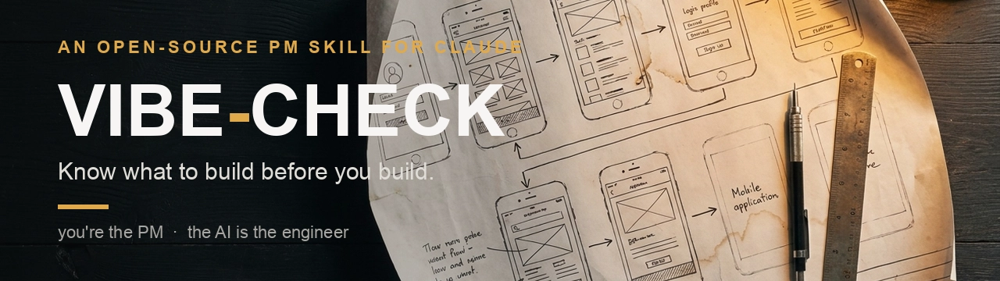

[](https://www.producthunt.com/products/vibe-check-6?launch=vibe-check-7)

<!-- To use the official animated Product Hunt badge instead, grab the embed snippet (with the numeric post_id) from the launch page's "Embed" panel and replace the line above. -->

**[vibe-check is live on Product Hunt today.](https://www.producthunt.com/products/vibe-check-6?launch=vibe-check-7)** If it helped you, an upvote or a comment there means a lot.

# vibe-check

A skill for AI coding tools that guides complete beginners from a vague app idea to a buildable blueprint.

Every coding skill out there is great... if you already know what you're building. That's the catch. Most of them start the moment you've decided what to make. The hard part, the part that sinks most projects, happens before that.

That's the part I spent 12-plus years doing as a product manager, taking things from zero to one. vibe-check is that work, turned into a skill.

You come in with a vague idea. It helps you dig out the real problem hiding underneath it, then pressure-tests whether that problem is even worth solving, against what real people actually struggle with and not just your gut. From there it maps the whole experience, the real screens and flows, and turns the lot into a plan and a buildable blueprint your AI can follow. And before you write a line of code, it works out your growth loop, so the thing has a shot at pulling in its own next users instead of you dragging in every one by hand.

---

**Every other skill helps you build it right. This one makes sure you're building the right thing.**

> ### Want it done for you?
>
> The method below is free, and it works. If you'd rather have the person who wrote it drive it, that's my day job. I validate ideas before they cost you money, audit AI-built apps that got scary to touch, and turn ideas into validated blueprints your AI agent builds from.
>
> **[Idea Validation](https://www.fiverr.com/amer_arab/validate-your-startup-or-app-idea-before-you-build-it)** · **[Vibe-Code Rescue Audit](https://www.fiverr.com/amer_arab/audit-your-lovable-cursor-or-bolt-vibe-coded-app-and-tell-you-what-to-fix)** · **[Validated MVP Blueprint](https://www.fiverr.com/amer_arab/validate-your-app-idea-and-blueprint-an-mvp-your-ai-agent-can-build)** · or just write to **arab.amer@gmail.com**
>
> See a real sample: the [AuDHD validation report](https://texasbedouin.github.io/vibe-check/examples/audhd-validation-report.html), produced on a real idea with real research.

## Start wherever you are

vibe-check has three on-ramps, so you don't repeat work you've already done:

- **The full journey**: vague idea in, validated buildable plan out. The default.
- **Validate only**: "Is this worth building?" gets a straight, evidence-backed answer and a findings summary. No blueprint for a dead idea.
- **Plan only**: already validated it? Bring your research (or your findings summary) and jump straight to planning the build.

## What it does

When someone who's never coded before says "I want to build an app that does X," this skill turns their AI tool into a patient mentor that:

1. **Discovers what they actually need**: not features, but the real problem they're solving (Reddit pain-mining, a competitor gap analysis, and ODI opportunity scoring)
2. **Maps the entire user experience**: happy flows, failure flows, and edge cases
3. **Surfaces decisions they don't know they need to make**: auth, databases, payments, hosting, legal
4. **Recommends a modern tech stack**: with plain-language explanations of what each piece does and why
5. **Produces a complete plan document**: structured as the AI coding tool's onboarding manual, plus an **interactive PRD** the human opens in their browser, the whole session in one navigable, self-contained file
6. **Includes build checkpoints**: so the beginner is never lost during construction. The AI stops after each phase to explain what was just built, why, and what's next.
7. **Teaches the build-time basics** in language for someone who has never touched code: local vs. GitHub vs. live, how to save and back up code (commit/push/deploy), and keeping secret keys safe.
8. **Finds a growth loop**: how the app recruits its next user on its own, preferably viral and organic, built into the core flow rather than bolted on, so growth compounds instead of needing a constant push.
9. **Handles marketplaces honestly**: when the idea is two-sided, it discovers *both* sides (not just the one the founder happens to be), and helps brainstorm a cold-start plan so the product doesn't launch into an empty room.
10. **Keeps the app healthy as it grows**: a **Checkup Mode** that gently looks over a messy, grown codebase and tidies it safely, so the AI keeps building cleanly instead of breaking things.

## Who it's for

- People who have an app idea but have never built software
- "Vibe coders" who can get something working on their screen but need help thinking through the full picture
- Anyone who wants to go from idea → structured plan before touching code

## How to use it

### With Claude Code

The easiest way, installs via the open [skills CLI](https://github.com/vercel-labs/skills), and works across agents:

```bash
npx skills add TexasBedouin/vibe-check
```

Or clone it straight into your project:

```bash
git clone https://github.com/TexasBedouin/vibe-check .claude/skills/vibe-check
```

Then tell Claude:

```
Use the vibe-check skill to help me plan my app.
```

Or pick your on-ramp directly:

```
Is my idea worth building? Reality-check it with vibe-check.
```

```
I already validated my idea. Use vibe-check to plan the build.
```

To update later: run `npx skills update` if you installed via the CLI, or `git pull` inside `.claude/skills/vibe-check` if you cloned.

### With other AI tools

Copy the contents of `SKILL.md` into your AI tool's system prompt or project instructions.

## What the skill produces

By the end of a vibe-check session, you'll have a plan document that includes:

- **Problem statement**: in your own words
- **The evidence boards**: an Opportunity Map of scored, evidence-tagged needs and a Competitor Matrix showing exactly where the gap is
- **The chosen experience**: Crazy 8 sketches, the converged direction, and the Experience Blueprint (the future-state board the whole session fills in)
- **Story Map**: the user journey with every capability sorted into V1 / V2 / Later lanes
- **User flows**: happy path, failure path, and edge cases, drawn in the engine's visual style (with mermaid as the fallback)
- **Feature breakdown**: V1 (build now) vs V2+ (build later)
- **System architecture**: visual diagram with beginner-friendly labels
- **Tech stack**: every tool, what it does, why it was chosen, what it costs
- **Data model**: what gets stored, in plain language
- **Cost breakdown**: monthly estimates with free tier details
- **Riskiest assumption as Build Phase 0**: the cheap test that runs before any real code
- **Distribution**: your first 10 users, where they gather, and the first concrete move
- **Pre-launch checklists**: security, legal, accessibility
- **Growth loop**: the one way the app brings in its next user on its own, plus the number that proves it's working
- **Build phases with checkpoints**: numbered phases with guided explanations at every step
- **"Words You Now Know"**: the plain-language glossary that grew through your session

This plan is designed to be handed directly to your AI coding tool to start building. It arrives twice: as the markdown instruction manual for the AI, and as an **interactive PRD**, one self-contained HTML file with every board embedded live, for you.

## Example output

Wondering what a session actually looks like? Three examples in [examples/](examples/). The two session transcripts walk the full journey (discovery, ODI opportunity scoring, the five-lens gut-check, growth loops, the lot); the third shows what the validate-only path surfaces. The ClearList example shows the full current flow, ending with the markdown plan **and** the interactive PRD. The plant example predates the PRD and ends with the older visual blueprint instead.

- **[A full ClearList session](examples/clearlist-session.md)** (+ the [interactive PRD](https://texasbedouin.github.io/vibe-check/examples/clearlist-prd.html) it produces): the complete back-and-forth from a one-line idea to the finished plan, including the wide-net reality-check. The interactive PRD is the final deliverable, tabs, live boards, the whole session in one navigable file. **ClearList is a real, live product that was built with vibe-check** ([clearlist.me](https://clearlist.me)).
- **[Idea → plan: a plant-care app](examples/plant-watering.md)** (+ [visual blueprint](https://texasbedouin.github.io/vibe-check/examples/plant-blueprint.html)): one sentence in ("an app that reminds me to water my plants"), a full buildable plan out.
- **[The AuDHD validation report](https://texasbedouin.github.io/vibe-check/examples/audhd-validation-report.html)**: what the discovery and gut-check surface on a harder idea, real research on a real brief, ending in a verdict instead of a blueprint. This is the validate-only ending in the wild.

## Version

Current version: **2.6.0** (see [VERSION](VERSION) and [CHANGELOG.md](CHANGELOG.md)).

When you use vibe-check, it does a quick best-effort check for a newer version and tells you if you're behind. To update, run `git pull` inside `.claude/skills/vibe-check`. Versioning is semantic (MAJOR.MINOR.PATCH).

## Who made this

Built by Amer Arab. I spent 12-plus years as a product manager, most of it taking products from zero to one. Discovery is the part I care about most: working out whether a problem is real before anyone writes a line of code, then shaping something people actually want instead of something that merely works. Those years were also spent shoulder to shoulder with engineers, which is where the "you're the PM, the AI is the engineer" idea at the heart of this skill comes from. vibe-check is me handing a first-timer the instincts I had to learn the hard way.

## Inspiration

- [grill-me](https://github.com/mattpocock/skills) by Matt Pocock: the relentless questioning energy
- [improve-codebase-architecture](https://github.com/mattpocock/skills/tree/main/skills/engineering/improve-codebase-architecture) by Matt Pocock: the deep-vs-shallow module wisdom and the visual HTML report, translated here into beginner metaphors (Checkup Mode + the navigability guidance)
- [andrej-karpathy-skills](https://github.com/multica-ai/andrej-karpathy-skills) by multica-ai: the four "how your AI should behave" ground rules (think before coding, keep it simple, surgical changes, goal-driven), translated here for beginners
- [autoresearch](https://github.com/uditgoenka/autoresearch) by Udit Goenka: the verify-and-iterate loop (one change, check it, keep or revert, repeat), translated here as the beginner's supervised improvement loop
- [/office-hours](https://github.com/garrytan/gstack) by Garry Tan: the problem reframing and premise challenging
- [The Design Sprint](https://designsprintkit.withgoogle.com/) by Jake Knapp / Google Ventures: the future press release (vision extraction) and Crazy 8s, adapted here with a confidence-dial sketch count (four to eight) plus sharing and voting
- [User Story Mapping](https://www.jpattonassociates.com/user-story-mapping/) by Jeff Patton: walking the chosen journey step by step to surface the features each step requires
- [Bob Moesta / The Rewired Group](https://therewiredgroup.com/) (Jobs to be Done): demand is born in the struggling moment, the demand-side lens behind the worst-moment question
- [Tony Ulwick / Strategyn](https://strategyn.com/) (Outcome-Driven Innovation): the opportunity-scoring engine, and the competitor gap matrix used here as the beginner stand-in for ODI's satisfaction survey
- [FrontierCode](https://cognition.ai/) by Cognition: quality over mere correctness, the fail-first test idea and the "working is the floor, not the bar" definition of done
- [design-shotgun](https://github.com/garrytan/gstack) by Garry Tan / gstack: the side-by-side comparison board, adapted here as plain static HTML
- [Continuous Discovery Habits](https://www.producttalk.org/) by Teresa Torres (opportunity solution trees): evidence-tagging opportunities, the framing-issues honesty pass, and the riskiest-assumption test
- [Growth Loops](https://www.reforge.com/blog/growth-loops) by Brian Balfour / Reforge (with Casey Winters and Kevin Kwok): the funnel-to-loop reframe and the loop taxonomy, translated here into three buildable shapes a beginner can act on (Phase 6.6)
- [The Last Mile Playbook](https://github.com/TexasBedouin) by Amer Arab: the PM vs Engineer mindset, payment processor gotchas, and the hard-won lessons of shipping a real product as a non-developer

## License

MIT licensed. Use it however you want.
